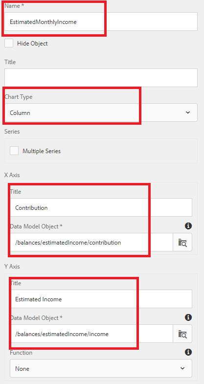

# 配置報廢Outlook面板{#configuring-retirement-outlook-panel}

* 這是建立第一個互動式通信文檔的多步教程的第10部分。 在本部分，我們將通過添加文本和圖表元件來配置Retirement Outlook面板。

* 登錄AEM Forms並導航到Adobe Experience Manager>Forms>Forms和文檔。

* 開啟401KStatement資料夾。

* 以編輯模式開啟401KStatement文檔。

**配置LeftPanel目標區域**

* 按一下右側的LeftPanel目標區域，然後按一下「+」表徵圖以開啟插入元件對話框。

* 插入文本元件。

* 輕輕點擊新添加的文本元件以開啟元件工具欄

* 選擇「鉛筆」表徵圖以編輯預設文本。

* 將預設文本替換為&quot;**你的退休收入展望」**

**配置RightPanel目標區域**

* 按一下右側的RightPanel目標區域，然後按一下「+」表徵圖以開啟插入元件對話框。

* 插入文本元件。

* 輕輕點擊新添加的文本元件以開啟元件工具欄。

* 選擇「鉛筆」表徵圖以編輯預設文本。

* 將預設文本替換為&quot;**月度退休收入」**

## 添加Retifier Income Outlook文檔片段 {#add-retirement-income-outlook-document-fragment}

* 按一下「資產」表徵圖，然後應用篩選器以顯示「文檔片段」類型的資產。 將RetirementIncomeOutlook文檔片段拖放到「左面板」目標區域。

* 您可以參考 [到此頁](https://experienceleague.adobe.com/docs/experience-manager-learn/forms/ic-web-channel-tutorial/partseven.html) 將文檔片段添加到內容區域。

## 添加估計月收入圖表 {#adding-estimated-monthly-income-chart}

* 按一下右側的RightPanel目標區域。 按一下「+」表徵圖插入圖表元件。 用柱表來顯示月收入的估算值。 輕輕點擊新插入的圖表元件。 選擇「扳手」表徵圖以開啟配置屬性工作表。使用以下螢幕快照所示的屬性配置圖表。

**AEM Forms6.4 — 配置估計每月收入清單**

**AEM Forms6.5 — 配置估計每月收入清單**

## 後續步驟

[配置餅圖](./parteleven.md)
