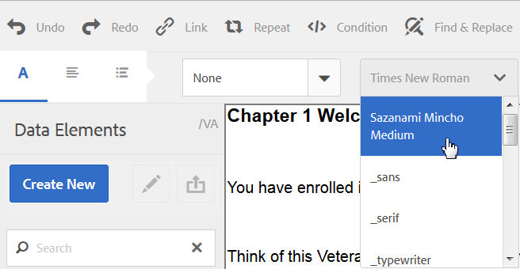

# 自訂文字編輯器{#customize-text-editor}

## 概觀 {#overview}

您可以自訂用來建立檔案片段的文字編輯器，以新增更多字型和字型大小。 這些字型包括英文和非英文（例如日文）字型。

您可以自訂來變更下列字型設定：

* 字型系列與大小
* 高度和字母間距等屬性
* 字型系列與大小、高度、字母間距及日期格式的預設值
* 專案符號縮排

若要這麼做，您需要：

1. [在CRX中編輯tbxeditor-config.xml檔案來自訂字型](#customizefonts)
1. [新增自訂字型至使用者端電腦](#addcustomfonts)

## 在CRX中編輯tbxeditor-config.xml檔案來自訂字型 {#customizefonts}

若要透過編輯tbxeditor-config.xml檔案來自訂字型，請執行下列動作：

1. 前往 `https://'[server]:[port]'/[ContextPath]/crx/de` 並以管理員身分登入。
1. 在apps資料夾中，使用類似於config資料夾（位於libs/fd/cm/config）的路徑/結構建立名為config的資料夾，包括以下步驟：

   1. 以滑鼠右鍵按一下下列路徑的專案資料夾，然後選取 **覆蓋節點**：

      `/libs/fd/cm/config`

      

   1. 請確定「覆蓋節點」對話方塊是否具備下列值：

      **路徑：** /libs/fd/cm/config

      **位置：** /apps/

      **符合節點型別：** 已選取

      

   1. 按一下 **確定**. 資料夾結構會在apps資料夾中建立。

   1. 按一下&#x200B;**「儲存全部」**。

1. 使用下列步驟，在新建立的設定資料夾中建立tbxeditor-config.xml檔案的復本：

   1. 以滑鼠右鍵按一下位於libs/fd/cm/config的tbxeditor-config.xml檔案，然後選取 **複製**.
   1. 用滑鼠右鍵按一下下列資料夾並選取 **貼上：**

      `apps/fd/cm/config`

   1. 依預設，貼上的檔案名稱為 `copy of tbxeditor-config.xml.` 將檔案重新命名為 `tbxeditor-config.xml` 並按一下 **全部儲存**.

1. 在apps/fd/cm/config開啟tbxeditor-config.xml檔案，然後進行必要的變更。

   1. 連按兩下apps/fd/cm/config的tbxeditor-config.xml檔案。 檔案隨即開啟。

      ```xml
      <editorConfig>
         <bulletIndent>0.25in</bulletIndent>
      
         <defaultDateFormat>DD-MM-YYYY</defaultDateFormat>
      
         <fonts>
            <default>Times New Roman</default>
            <font>_sans</font>
            <font>_serif</font>
            <font>_typewriter</font>
            <font>Arial</font>
            <font>Courier</font>
            <font>Courier New</font>
            <font>Geneva</font>
            <font>Georgia</font>
            <font>Helvetica</font>
            <font>Tahoma</font>
            <font>Times New Roman</font>
            <font>Times</font>
            <font>Verdana</font>
         </fonts>
      
         <fontSizes>
            <default>12</default>
            <fontSize>8</fontSize>
            <fontSize>9</fontSize>
            <fontSize>10</fontSize>
            <fontSize>11</fontSize>
            <fontSize>12</fontSize>
            <fontSize>14</fontSize>
            <fontSize>16</fontSize>
            <fontSize>18</fontSize>
            <fontSize>20</fontSize>
            <fontSize>22</fontSize>
            <fontSize>24</fontSize>
            <fontSize>26</fontSize>
            <fontSize>28</fontSize>
            <fontSize>36</fontSize>
            <fontSize>48</fontSize>
            <fontSize>72</fontSize>
         </fontSizes>
      
         <lineHeights>
            <default>2</default>     
            <lineHeight>2</lineHeight>
            <lineHeight>3</lineHeight>
            <lineHeight>4</lineHeight>
            <lineHeight>5</lineHeight>
            <lineHeight>6</lineHeight>
            <lineHeight>7</lineHeight>
            <lineHeight>8</lineHeight>
            <lineHeight>9</lineHeight>
            <lineHeight>10</lineHeight>
            <lineHeight>11</lineHeight>
            <lineHeight>12</lineHeight>
            <lineHeight>13</lineHeight>
            <lineHeight>14</lineHeight>
            <lineHeight>15</lineHeight>
            <lineHeight>16</lineHeight>
         </lineHeights>
      
         <letterSpacings>
            <default>0</default>
            <letterSpacing>0</letterSpacing>
            <letterSpacing>1</letterSpacing>
            <letterSpacing>2</letterSpacing>
            <letterSpacing>3</letterSpacing>
            <letterSpacing>4</letterSpacing>
            <letterSpacing>5</letterSpacing>
            <letterSpacing>6</letterSpacing>
            <letterSpacing>7</letterSpacing>
            <letterSpacing>8</letterSpacing>
            <letterSpacing>9</letterSpacing>
            <letterSpacing>10</letterSpacing>
            <letterSpacing>11</letterSpacing>
            <letterSpacing>12</letterSpacing>
            <letterSpacing>13</letterSpacing>
            <letterSpacing>14</letterSpacing>
            <letterSpacing>15</letterSpacing>
            <letterSpacing>16</letterSpacing>
         </letterSpacings>
      </editorConfig>
      ```

   1. 在檔案中進行必要的變更，以變更字型設定中的下列專案：

      * 新增或移除字型系列與大小
      * 高度和字母間距等屬性
      * 字型系列與大小、高度、字母間距及日期格式的預設值
      * 專案符號縮排

      例如，若要新增名為Sazanami Mincho Medium的日文字型，您需要在XML檔案中建立下列專案： `<font>Sazanami Mincho Medium</font>`. 您還需要在使用者端電腦上安裝此字型，以存取及使用字型自訂。 如需詳細資訊，請參閱 [新增自訂字型至使用者端電腦](#addcustomfonts).

      您也可以變更文字各方面的預設值，並藉由移除專案，從文字編輯器中移除字型。

   1. 按一下&#x200B;**「儲存全部」**。

## 新增自訂字型至使用者端電腦 {#addcustomfonts}

當您在互動式通訊文字編輯器中存取字型時，該字型必須出現在您用來存取互動式通訊的使用者端電腦中。 若要能夠在文字編輯器中使用自訂字型，您必須先在使用者端電腦上安裝相同的字型。

如需有關安裝字型的詳細資訊，請參閱下列內容：

* [在Windows上安裝或解除安裝字型](https://windows.microsoft.com/en-us/windows-vista/install-or-uninstall-fonts)
* [Mac基本概念：字型手冊](https://support.apple.com/en-us/HT201749)

## 存取字型自訂 {#access-font-customizations}

在CRX的tbxeditor-config.xml檔案中變更字型，並在用於存取AEM Forms的使用者端電腦上安裝所需字型後，變更會出現在文字編輯器中。

例如，Sazanami Mincho Medium字型已新增至 [在CRX中編輯tbxeditor-config.xml檔案來自訂字型](#customizefonts) 文字編輯器UI中顯示的程式如下：



>[!NOTE]
>
>若要檢視日文文字，您必須先輸入日文字元。 自訂日文字型的應用只會以特定方式設定文字的格式。 應用自訂日文字型不會將英文或其他字元變更為日文字元。
