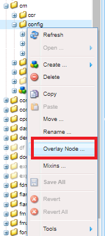
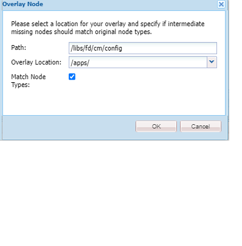

# 自定義文本編輯器{#customize-text-editor}

## 概觀 {#overview}

您可以自定義用於建立文檔片段的文本編輯器，以添加更多字型和字型大小。 這些字型包括英語和非英語，如日語字型。

可以自定義以在字型設定中更改以下內容：

* 字型系列和大小
* 高度和字母間距等屬性
* 字型系列和大小、高度、字母間距和日期格式的預設值
* 項目符號縮進

為此，您需要：

1. [通過編輯CRX中的tbxeditor-config.xml檔案來定制字型](#customizefonts)
1. [將自定義字型添加到客戶端電腦](#addcustomfonts)

## 通過編輯CRX中的tbxeditor-config.xml檔案來定制字型 {#customizefonts}

要通過編輯tbxeditor-config.xml檔案自定義字型，請執行以下操作：

1. 轉到 `https://'[server]:[port]'/[ContextPath]/crx/de` 並以管理員身份登錄。
1. 在apps資料夾中，使用與配置資料夾類似的路徑/結構建立名為config的資料夾，該資料夾位於libs/fd/cm/config，步驟如下：

   1. 按一下右鍵以下路徑上的項目資料夾並選擇 **覆蓋節點**:

      `/libs/fd/cm/config`

      

   1. 確保「覆蓋節點」對話框具有以下值：

      **路徑：** /libs/fd/cm/config

      **位置：** /apps/

      **匹配節點類型：** 已選擇

      

   1. 按一下&#x200B;**「確定」**。資料夾結構是在apps資料夾中建立的。

   1. 按一下 **全部保存**。

1. 使用以下步驟在新建立的config資料夾中建立tbxeditor-config.xml檔案的副本：

   1. 按一下右鍵libs/fd/cm/config處的tbxeditor-config.xml檔案，然後選擇 **複製**。
   1. 按一下右鍵以下資料夾並選擇 **貼上：**

      `apps/fd/cm/config`

   1. 預設情況下，貼上的檔案的名稱為 `copy of tbxeditor-config.xml.` 將檔案更名為 `tbxeditor-config.xml` 按一下 **全部保存**。

1. 在apps/fd/cm/config中開啟tbxeditor-config.xml檔案，然後進行所需的更改。

   1. 按兩下apps/fd/cm/config處的tbxeditor-config.xml檔案。 檔案開啟。

      ```xml
      <editorConfig>
         <bulletIndent>0.25in</bulletIndent>
      
         <defaultDateFormat>DD-MM-YYYY</defaultDateFormat>
      
         <fonts>
            <default>Times New Roman</default>
            <font>_sans</font>
            <font>_serif</font>
            <font>_typewriter</font>
            <font>Arial</font>
            <font>Courier</font>
            <font>Courier New</font>
            <font>Geneva</font>
            <font>Georgia</font>
            <font>Helvetica</font>
            <font>Tahoma</font>
            <font>Times New Roman</font>
            <font>Times</font>
            <font>Verdana</font>
         </fonts>
      
         <fontSizes>
            <default>12</default>
            <fontSize>8</fontSize>
            <fontSize>9</fontSize>
            <fontSize>10</fontSize>
            <fontSize>11</fontSize>
            <fontSize>12</fontSize>
            <fontSize>14</fontSize>
            <fontSize>16</fontSize>
            <fontSize>18</fontSize>
            <fontSize>20</fontSize>
            <fontSize>22</fontSize>
            <fontSize>24</fontSize>
            <fontSize>26</fontSize>
            <fontSize>28</fontSize>
            <fontSize>36</fontSize>
            <fontSize>48</fontSize>
            <fontSize>72</fontSize>
         </fontSizes>
      
         <lineHeights>
            <default>2</default>     
            <lineHeight>2</lineHeight>
            <lineHeight>3</lineHeight>
            <lineHeight>4</lineHeight>
            <lineHeight>5</lineHeight>
            <lineHeight>6</lineHeight>
            <lineHeight>7</lineHeight>
            <lineHeight>8</lineHeight>
            <lineHeight>9</lineHeight>
            <lineHeight>10</lineHeight>
            <lineHeight>11</lineHeight>
            <lineHeight>12</lineHeight>
            <lineHeight>13</lineHeight>
            <lineHeight>14</lineHeight>
            <lineHeight>15</lineHeight>
            <lineHeight>16</lineHeight>
         </lineHeights>
      
         <letterSpacings>
            <default>0</default>
            <letterSpacing>0</letterSpacing>
            <letterSpacing>1</letterSpacing>
            <letterSpacing>2</letterSpacing>
            <letterSpacing>3</letterSpacing>
            <letterSpacing>4</letterSpacing>
            <letterSpacing>5</letterSpacing>
            <letterSpacing>6</letterSpacing>
            <letterSpacing>7</letterSpacing>
            <letterSpacing>8</letterSpacing>
            <letterSpacing>9</letterSpacing>
            <letterSpacing>10</letterSpacing>
            <letterSpacing>11</letterSpacing>
            <letterSpacing>12</letterSpacing>
            <letterSpacing>13</letterSpacing>
            <letterSpacing>14</letterSpacing>
            <letterSpacing>15</letterSpacing>
            <letterSpacing>16</letterSpacing>
         </letterSpacings>
      </editorConfig>
      ```

   1. 在檔案中進行所需更改，以更改字型設定中的下列內容：

      * 添加或刪除字型系列和大小
      * 高度和字母間距等屬性
      * 字型系列和大小、高度、字母間距和日期格式的預設值
      * 項目符號縮進

      例如，要添加名為Sazanami Mincho Medium的日文字型，需要在XML檔案中建立以下條目： `<font>Sazanami Mincho Medium</font>`。 您還需要將此字型安裝在用於訪問和使用字型自定義的客戶端電腦上。 有關詳細資訊，請參見 [將自定義字型添加到客戶端電腦](#addcustomfonts)。

      還可以更改文本各個方面的預設值，並通過刪除條目從文本編輯器中刪除字型。

   1. 按一下 **全部保存**。


## 將自定義字型添加到客戶端電腦 {#addcustomfonts}

當您在互動式通信文本編輯器中訪問字型時，它需要出現在您用於訪問互動式通信的客戶端電腦中。 要能夠在文本編輯器中使用自定義字型，首先需要在客戶端電腦上安裝該字型。

有關安裝字型的詳細資訊，請參閱以下內容：

* [在Windows上安裝或卸載字型](https://windows.microsoft.com/en-us/windows-vista/install-or-uninstall-fonts)
* [Mac基礎知識：字型簿](https://support.apple.com/en-us/HT201749)

## 訪問字型自定義 {#access-font-customizations}

在CRX的tbxeditor-config.xml檔案中對字型進行了更改，並在用於訪問AEM Forms的客戶端電腦上安裝了所需的字型後，這些更改將顯示在文本編輯器中。

例如，在中添加的Sazanami Mincho中等字型 [通過編輯CRX中的tbxeditor-config.xml檔案來定制字型](#customizefonts) 過程在文本編輯器UI中顯示如下：


>[!NOTE]
>
>要查看日文文本，您首先需要輸入帶日文字元的文本。 自定義日文字型的應用程式只以某種方式格式化文本。 自定義日文字型的應用不會將英語或其他字元更改為日語字元。
