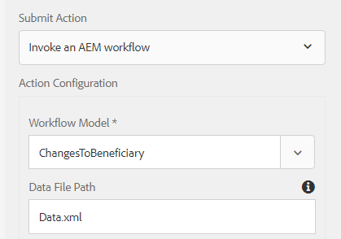

# 使用提交的資料產生Print Channel檔案

列印管道檔案通常透過表單資料模型的get服務從後端資料來源擷取資料而產生。 在某些情況下，您可能需要使用提供的資料產生列印管道檔案。 例如：客戶填寫受益人表單的變更，而您可能會想要使用提交的表單中的資料來產生列印管道檔案。 若要完成此使用案例，必須執行下列步驟

## 建立預填服務

使用服務名稱「ccm-print-test」來存取此服務。 定義此預填服務後，您就可以在servlet或工作流程處理步驟實作中存取此服務，以產生列印管道檔案。

```java
import java.io.InputStream;
import org.osgi.service.component.annotations.Component;

import com.adobe.forms.common.service.ContentType;
import com.adobe.forms.common.service.DataOptions;
import com.adobe.forms.common.service.DataProvider;
import com.adobe.forms.common.service.FormsException;
import com.adobe.forms.common.service.PrefillData;

@Component(immediate = true, service = {DataProvider.class})
public class ICPrefillService implements DataProvider {

@Override
public String getServiceDescription() {
    // TODO Auto-generated method stub
    return "Prefill Service for IC Print Channel";
}

@Override
public String getServiceName() {
    // TODO Auto-generated method stub
    return "ccm-print-test";
}

@Override
public PrefillData getPrefillData(DataOptions options) throws FormsException {
    // TODO Auto-generated method stub
        PrefillData data = null;
        if (options != null && options.getExtras() != null && options.getExtras().get("data") != null) {
            InputStream is = (InputStream) options.getExtras().get("data");
            data = new PrefillData(is, options.getContentType() != null ? options.getContentType() : ContentType.JSON);
        }
        return data;
    }
}
```

### 建立WorkflowProcess實施

workflowProcess實作程式碼片段如下所示。當AEM工作流程中的程式步驟與此實作關聯時，會執行此程式碼。 此實作需要3個處理序引數，如下所述：

* 設定最適化表單時指定的DataFile路徑名稱
* 列印管道範本的名稱
* 產生的列印管道檔案的名稱

第98行 — 由於最適化表單是以表單資料模型為基礎，因此會擷取afBoundData資料節點中的資料。
第128行 — 資料選項服務名稱已設定。 記下服務名稱。 它必須與上一個程式碼清單的第45行傳回的名稱相符。
第135行 — 使用PrintChannel物件的轉譯方法產生檔案


```java
String params = arg2.get("PROCESS_ARGS","string").toString();
    String payloadPath = workItem.getWorkflowData().getPayload().toString();
    String dataFile = params.split(",")[0];
    final String icFileName = params.split(",")[1];
    String dataFilePath = payloadPath + "/"+dataFile+"/jcr:content";
    Session session = workflowSession.adaptTo(Session.class);
    Node xmlDataNode = null;
    try {
        xmlDataNode = session.getNode(dataFilePath);
        InputStream xmlDataStream = xmlDataNode.getProperty("jcr:data").getBinary().getStream();
        JsonParser jsonParser = new JsonParser();
        BufferedReader streamReader = null;
        try {
            streamReader = new BufferedReader(new InputStreamReader(xmlDataStream, "UTF-8"));
        } catch (UnsupportedEncodingException e) {
            // TODO Auto-generated catch block
            e.printStackTrace();
        }
        StringBuilder responseStrBuilder = new StringBuilder();
        String inputStr;
        try {
            while ((inputStr = streamReader.readLine()) != null)
                responseStrBuilder.append(inputStr);
        } catch (IOException e) {
            // TODO Auto-generated catch block
            e.printStackTrace();
        }
        String submittedDataXml = responseStrBuilder.toString();
        JsonObject jsonObject = jsonParser.parse(submittedDataXml).getAsJsonObject().get("afData").getAsJsonObject()
                .get("afBoundData").getAsJsonObject().get("data").getAsJsonObject();
        logger.info("Successfully Parsed gson" + jsonObject.toString());
        InputStream targetStream = IOUtils.toInputStream(jsonObject.toString());
        //InputStream targetStream = new ByteArrayInputStream(jsonObject.toString().getBytes());
        
        // Node dataNode = session.getNode(formName);
        logger.info("Got resource using resource resolver"
                );
        resHelper.callWith(getResolver.getFormsServiceResolver(), new Callable<Void>() {
            @Override
            public Void call() throws Exception {
                System.out.println("The target stream is "+targetStream.available());
                // TODO Auto-generated method stub
                com.adobe.fd.ccm.channels.print.api.model.PrintChannel printChannel = null;
                String formName = params.split(",")[2];
                logger.info("The form name I got was "+formName);
                printChannel = printChannelService.getPrintChannel(formName);
                logger.info("Did i get print channel?");
                com.adobe.fd.ccm.channels.print.api.model.PrintChannelRenderOptions options = new com.adobe.fd.ccm.channels.print.api.model.PrintChannelRenderOptions();
                options.setMergeDataOnServer(true);
                options.setRenderInteractive(false);
                com.adobe.forms.common.service.DataOptions dataOptions = new com.adobe.forms.common.service.DataOptions();
                dataOptions.setServiceName(printChannel.getPrefillService());
                // dataOptions.setExtras(map);
                dataOptions.setContentType(ContentType.JSON);
                logger.info("####Set the content type####");
                dataOptions.setFormResource(getResolver.getFormsServiceResolver().getResource(formName));
                dataOptions.setServiceName("ccm-print-test");
                dataOptions.setExtras(new HashMap<String, Object>());
                dataOptions.getExtras().put("data", targetStream);
                options.setDataOptions(dataOptions);
                logger.info("####Set the data options");
                com.adobe.fd.ccm.channels.print.api.model.PrintDocument printDocument = printChannel
                .render(options);
                logger.info("####Generated the document");
                com.adobe.aemfd.docmanager.Document uploadedDocument = new com.adobe.aemfd.docmanager.Document(
                    printDocument.getInputStream());
                logger.info("Generated the document");
                Binary binary = session.getValueFactory().createBinary(printDocument.getInputStream());
                Session jcrSession = workflowSession.adaptTo(Session.class);
                String dataFilePath = workItem.getWorkflowData().getPayload().toString();
                
                Node dataFileNode = jcrSession.getNode(dataFilePath);
                Node icPdf = dataFileNode.addNode(icFileName, "nt:file");
                Node contentNode = icPdf.addNode("jcr:content", "nt:resource");
                contentNode.setProperty("jcr:data", binary);
                jcrSession.save();
                logger.info("Copied the generated document");
                uploadedDocument.close();
                
                return null;
            }
```

若要在您的伺服器上測試此專案，請遵循下列步驟：

* [設定Day CQ Mail Service。](https://helpx.adobe.com/experience-manager/6-5/communities/using/email.html)需要此專案，才能傳送包含產生為附件的檔案的電子郵件。
* [部署使用服務進行開發的使用者套件](/help/forms/assets/common-osgi-bundles/DevelopingWithServiceUser.jar)
* 確定您已在Apache Sling服務使用者對應程式服務設定中新增以下專案
* **DevelopingWithServiceUser.core：getformsresourceresolver=fd-service**
* [將與本文相關的資產下載並解壓縮至您的檔案系統](assets/prefillservice.zip)
* [使用AEM封裝管理員匯入下列封裝](http://localhost:4502/crx/packmgr/index.jsp)
   1. beneficiaryconfirmationic.zip
   2. changeofbeneficiaryform.zip
   3. generatebeneficiaryworkflow.zip
* [使用AEM Felix Web主控台部署下列專案](http://localhost:4502/system/console/bundles)

   * GenerateIC.GenerateIC.core-1.0-SNAPSHOT.jar。 此套件組合包含本文所述的程式碼。

* [開啟ChangeOfReviewalForm](http://localhost:4502/content/dam/formsanddocuments/changebeneficiary/jcr:content?wcmmode=disabled)
* 請確定最適化表單已設定為提交至AEM Workflow，如下所示
  
* [設定工作流程模型。](http://localhost:4502/editor.html/conf/global/settings/workflow/models/ChangesToBeneficiary.html)確定流程步驟和傳送電子郵件元件已依照您的環境設定
* [預覽ChangeOfWeiefliantForm。](http://localhost:4502/content/dam/formsanddocuments/changebeneficiary/jcr:content?wcmmode=disabled)填寫部分詳細資料並提交
* 應叫用工作流程，並將IC列印通道檔案以附件的形式傳送給在傳送電子郵件元件中指定的收件者
