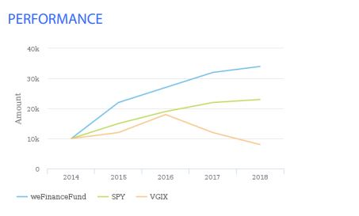
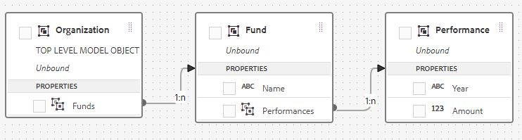

# 多系列圖表

AEM Forms 6.5匯入了建立及設定多系列圖表的功能。 多系列圖表通常與折線圖、橫條圖、直條圖型別關聯使用。 下列圖表是多系列圖表的良好範例。 圖表顯示在一段時間內在3個不同共同基金中增加$10,000美元的情況。 若要能夠在AEM Forms中建立和使用這些型別的圖表，您必須建立適當的表單資料模型。

若要在AEM Forms中建立多系列圖表，您必須建立適當的表單資料模型，其中包含必要的實體以及實體之間的關聯。 下列熒幕擷圖會反白顯示實體以及這3個實體之間的關聯。 在最上層，我們有一個稱為「組織」的實體，它與Fund實體具有一對多關聯。 Fund實體則與Performance實體具有一對多關聯。

## 建立多系列圖表的表單資料模型

>[!VIDEO](https://video.tv.adobe.com/v/26352?quality=12&learn=on)

### 設定折線圖

>[!VIDEO](https://video.tv.adobe.com/v/26353?quality=12&learn=on)

若要在您的系統上測試此專案，請遵循下列步驟

* [使用AEM封裝管理員下載並匯入MutualFundFactSheet.zip。](assets/mutualfundfactsheet.zip)
* [將SeriesChartSampleData.json下載到您的硬碟。](assets/serieschartsampledata.json)這是用來填入圖表的範例資料。
* [瀏覽至Forms和檔案。](http://localhost:4502/aem/forms.html/content/dam/formsanddocuments)
* 輕輕選取「MutualFundGrowthFactSheet」互動式通訊範本。
* 按一下預覽 | Print Channel | 上傳範例資料。
* 瀏覽至本文提供的範例資料檔案。
* 使用在上一步中下載的範例資料，預覽「MutualFundGrowthFactSheet」互動式通訊的列印管道。
