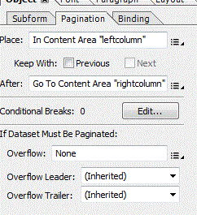
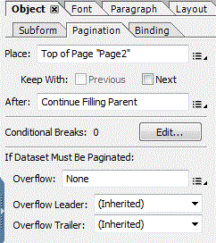

# Print Channel檔案中的兩欄版面

本簡短文章將強調在列印管道中建立2欄版面所需的步驟。 使用案例是產生2頁檔案，其中第1頁具有2欄配置，而第2頁具有標準1欄配置。

以下是使用AEM Forms Designer建立2個欄配置的相關高階步驟。

* 在頁面1主版頁面中建立2個內容區域
* 將2個內容區域命名為「leftcolumn」和「rightcolumn」
* 建立一個具有一個內容區域的第二個主版頁面（此為預設值）
* 選取「分頁」標籤（無標題子表單） （第1頁）和（無標題子表單） （第2頁），並設定屬性，如下列熒幕擷取畫面所示。

設定分頁屬性後，我們就可以在（未命名的子表單） （第1頁）底下新增子表單或目標區域。

然後，我們可以將檔案片段新增到這些子表單或目標區域。 當左欄已滿時，內容將流向右欄。

若要在本機伺服器上測試此專案，請下載與本文相關的資產。 向下捲動至此頁面底部

* [使用封裝管理程式下載並安裝範例Print Channel檔案](assets/print-channel-with-two-column-layout.zip)
* [預覽Print Channel檔案](http://localhost:4502/content/dam/formsanddocuments/2columnlayout/jcr:content?channel=print&amp;mode=preview&amp;dataRef=service%3A%2F%2FFnDTestData&amp;wcmmode=disabled)
