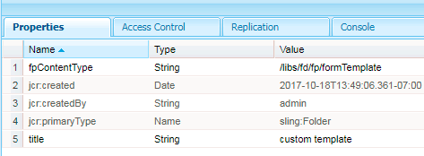

# 列出AEM Forms中的自訂資產型別 {#listing-custom-asset-types-in-aem-forms}

## 建立自訂範本 {#creating-custom-template}

出於本文的目的，我們將建立自訂範本，以便在相同頁面上顯示自訂資產型別和OOTB資產型別。 若要建立自訂範本，請遵循下列指示

1. 在/apps下建立sling：資料夾。 將其命名為「 myportalcomponent 」
1. 新增「fpContentType」屬性。 將其值設為&quot;**/libs/fd/ fp/formTemplate&quot;。**
1. 新增「title」屬性，並將其值設為「custom template」。 這是您會在「搜尋並製表器」元件的下拉式清單中看到的名稱
1. 在此資料夾下建立「template.html」。 此檔案會儲存程式碼，以設定樣式並顯示各種資產型別。



下列程式碼會列出使用搜尋和清單產生器元件的各種資產型別。 我們會為每種型別的資產建立個別的html元素，如data-type = &quot;videos&quot;標籤所示。 若為「影片」的資產型別，請使用 &lt;video> 元素來內嵌播放視訊。 對於「文字檔案」的資產型別，我們使用不同的html標籤。

```html
<div class="__FP_boxes-container __FP_single-color">
   <div  data-repeatable="true">
     <div class = "__FP_boxes-thumbnail" style="float:left;margin-right:20px;" data-type = "videos">
   <video width="400" controls>
       <source src="${path}" type="video/mp4">
    </video>
         <h3 class="__FP_single-color" title="${name}" tabindex="0">${name}</h3>
     </div>
     <div class="__FP_boxes-thumbnail" style="float:left;margin-right:20px;" data-type = "worddocuments">
       <a href="/assetdetails.html${path}" target="_blank">
           
          </a>
          <h3 class="__FP_single-color" title="${name}" tabindex="0">${name}</h3>
     </div>
  <div class="__FP_boxes-thumbnail" style="float:left;margin-right:20px;" data-type = "xfaForm">
       <a href="/assetdetails.html${path}" target="_blank">
           
          </a>
          <h3 class="__FP_single-color" title="${name}" tabindex="0">${name}</h3>
                <a href="{formUrl}"></a><p>

     </div>
  <div class="__FP_boxes-thumbnail" style="float:left;margin-right:20px;" data-type = "printForm">
       <a href="/assetdetails.html${path}" target="_blank">
           
          </a>
          <h3 class="__FP_single-color" title="${name}" tabindex="0">${name}</h3>
                <a href="{pdfUrl}"></a><p>
     </div>
   </div>
</div>
```

>[!NOTE]
>
>第11行 — 請變更影像src以指向您在DAM中選擇的影像。
>
>若要在此範本中列出Adaptive Forms，請建立新的div並將其資料型別屬性設定為「guide」。 您可以複製並貼上其data-type=&quot;printForm的div，並將新複製的div的資料型別設定為&quot;guide&quot;

## 設定搜尋和清單產生器元件 {#configure-search-and-lister-component}

定義自訂範本後，現在必須將此自訂範本與「搜尋並製表器」元件建立關聯。 指向您的瀏覽器 [至此url ](http://localhost:4502/editor.html/content/AemForms/CustomPortal.html).

切換至設計模式，並將段落系統設定為將「搜尋和清單程式」元件納入允許的元件群組中。 Search and Lister元件是Document Services群組的一部分。

切換至編輯模式，並將「搜尋並製表器」元件新增至ParSys。

開啟「搜尋並製表器」元件的設定屬性。 請確定已選取「資產資料夾」索引標籤。 選取您要在搜尋和清單產生器元件中列出資產的資料夾。 為了撰寫本文檔，我已選取

* /content/dam/VideosAndWordDocuments
* /content/dam/formsanddocuments/assettypes


按Tab鍵前往「顯示」標籤。 您將在此處選擇要在搜尋和清單產生器元件中顯示資產的範本。

從下拉式清單中選取「自訂範本」，如下所示。


設定您要在入口網站中列出的資產型別。 將資產索引標籤的型別設定為「資產清單」並設定資產型別。 在此範例中，我們已設定下列資產型別

1. MP4檔案
1. Word檔案
1. 檔案（這是OOTB資產型別）
1. 表單範本（這是OOTB資產型別）

以下熒幕擷圖顯示已針對清單設定的資產型別


現在您已設定搜尋和製表人入口網站元件，是時候檢視製表人運作情況了。 指向您的瀏覽器 [至此url ](http://localhost:4502/content/AemForms/CustomPortal.html?wcmmode=disabled). 結果應該與下圖類似。

>[!NOTE]
>
>如果您的入口網站在發佈伺服器上列出自訂資產型別，請務必將「讀取」許可權授與節點的「fd-service」使用者 **/apps/fd/fp/extensions/querybuilder**


[請使用封裝管理程式下載並安裝此封裝。](assets/customassettypekt1.zip) 這包含範例mp4和word檔案，以及用作資產型別的xdp檔案，以使用搜尋和清單產生器元件列出
