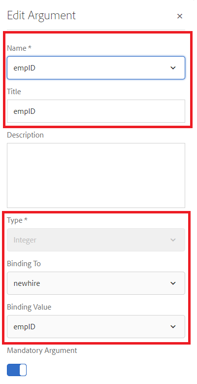

# 設定表單資料模型

## Apache Sling Connection Pooled DataSource

建立RDBMS支援表單資料模型的第一步是設定Apache Sling Connection Pooled DataSource。 若要設定資料來源，請遵循下列步驟：

* 將瀏覽器指向 [configMgr](http://localhost:4502/system/console/configMgr)
* 搜尋 **Apache Sling Connection Pooled DataSource**
* 新增專案並提供如熒幕擷圖所示的值。
* 
* 儲存您的變更

>[!NOTE]
>JDBC連線URI、使用者名稱和密碼會根據您的MySQL資料庫組態而變更。

## 建立表單資料模型

* 將瀏覽器指向 [資料整合](http://localhost:4502/aem/forms.html/content/dam/formsanddocuments-fdm)
* 按一下 _建立_->_表單資料模型_
* 為表單資料模型提供有意義的名稱和標題，例如 **員工**
* 按一下 _下一個_
* 選取在先前區段（論壇）建立的資料來源
* 按一下 _建立_->編輯以在編輯模式下開啟新建立的表單資料模型
* 展開 _論壇_ 節點，以檢視員工綱要。 展開employee節點以檢視2個表格

## 將實體新增至模型

* 請確定員工節點已展開
* 選取新受益人與受益人實體，然後按一下 _新增選取專案_

## 新增讀取服務至新實體

* 選取新實體
* 按一下 _編輯屬性_
* 從「讀取服務」下拉式清單中選取「取得」
* 按一下+圖示以新增引數至get服務
* 指定如熒幕擷圖所示的值
* 
>[!NOTE]
> Get服務需要對應至newhire實體之empID欄的值。傳遞此值的方式有多種，在本教學課程中，empID會透過稱為empID的請求引數傳遞。
* 按一下 _完成_ 儲存get服務的引數
* 按一下 _完成_ 儲存對表單資料模型的變更

## 在2個實體之間新增關聯

在表單資料模型中不會自動建立資料庫實體之間定義的關聯。 實體之間的關聯需要使用表單資料模型編輯器來定義。 每個紐黑爾實體可以有一或多個受益人，我們需要定義紐黑爾實體和受益人實體之間的一對多關聯。
下列步驟將引導您完成建立一對多關聯的過程

* 選取新實體並按一下 _新增關聯_
* 提供有意義的標題和識別碼給關聯和其他屬性，如下方熒幕擷圖所示
   

* 按一下 _編輯_ 圖示於「引數」區段下

* 指定值，如此熒幕擷取畫面所示
* 
* **我們正在使用受益人與新實體的empID欄來連結這兩個實體。**
* 按一下 _完成_ 儲存變更

## 測試您的表單資料模型

我們的表單資料模型現在有 **_get_** 接受empID並傳回newhire及其受益人詳細資訊的服務。 若要測試取得服務，請遵循下列步驟。

* 選取新實體
* 按一下 _測試模型物件_
* 提供有效的empID並按一下 _測試_
* 您應該會得到如下方熒幕擷取畫面所示的結果
* 

## 後續步驟

[從URL取得empID](./get-request-parameter.md)