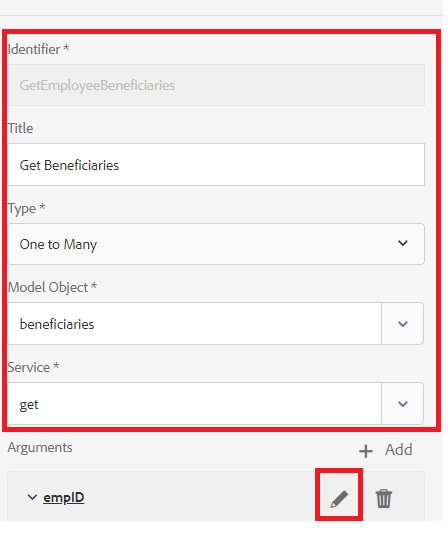

# 設定表單資料模型

## Apache Sling Connection Pooled DataSource

建立RDBMS支援表單資料模型的第一步，是設定Apache Sling Connection Pooled DataSource。 若要設定資料來源，請依照下列步驟操作：

* 將瀏覽器指向 [configMgr](http://localhost:4502/system/console/configMgr)
* 搜尋 **Apache Sling Connection Pooled DataSource**
* 新增項目並提供值，如螢幕擷取所示。
* 
* 儲存您的變更

>[!NOTE]
>JDBC連接URI、用戶名和密碼將根據您的MySQL資料庫配置而更改。

## 建立表單資料模型

* 將瀏覽器指向 [資料整合](http://localhost:4502/aem/forms.html/content/dam/formsanddocuments-fdm)
* 按一下 _建立_->_表單資料模型_
* 為表單資料模型提供有意義的名稱和標題，例如 **員工**
* 按一下 _下一個_
* 選擇在前一節（論壇）中建立的資料源
* 按一下 _建立_->編輯以在編輯模式下開啟新建立的表單資料模型
* 展開 _論壇_ 節點，查看員工架構。 展開employee節點以查看2個表

## 將圖元添加到模型

* 確保員工節點已展開
* 選擇新實體和受益實體，然後按一下 _添加選定內容_

## 向新實體添加讀取服務

* 選擇新實體
* 按一下 _編輯屬性_
* 從「讀取服務」下拉清單中選擇獲取
* 按一下+圖示，將參數新增至get服務
* 指定螢幕擷取中顯示的值
* 
>[!NOTE]
> get服務需要映射到新實體的empID列的值。有多種方法可以傳遞此值，在本教程中，empID通過名為empID的請求參數傳遞。
* 按一下 _完成_ 為get服務保存參數
* 按一下 _完成_ 保存對表單資料模型的更改

## 添加2個實體之間的關聯

在資料庫實體之間定義的關聯不會在表單資料模型中自動建立。 實體之間的關聯需使用表單資料模型編輯器來定義。 每個新實體都可以有一個或多個受益人，我們需要定義新實體和受益實體之間的一對多關聯。
下列步驟將引導您完成建立一對多關聯的程式

* 選取新實體，然後按一下 _添加關聯_
* 為關聯和其他屬性提供有意義的標題和標識符，如下面的螢幕截圖所示
   

* 按一下 _編輯_ 圖示（在「參數」部分下）

* 指定值，如此螢幕擷取畫面所示
* 
* **我們使用受益人和新實體的empID列連結兩個實體。**
* 按一下 _完成_ 儲存變更

## 測試您的表單資料模型

我們的表單資料模型 **_get_** 接受empID並返回新用戶及其受益人的詳細資訊的服務。 要測試獲取服務，請按照下列步驟操作。

* 選擇新實體
* 按一下 _測試模型對象_
* 提供有效的empID，然後按一下 _測試_
* 您應該會得到如下方螢幕擷取畫面所示的結果
* 

## 後續步驟

[從URL獲取empID](./get-request-parameter.md)