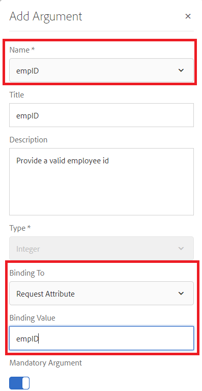

# 配置表單資料模型

## Apache Sling Connection Pooled DataSource

建立RDBMS支援的表單資料模型的第一步是設定Apache Sling Connection Pooled DataSource。 若要設定資料來源，請遵循下列步驟：

* 將瀏覽器指向[configMgr](http://localhost:4502/system/console/configMgr)
* 搜尋&#x200B;**Apache Sling Connection Pooled DataSource**
* 新增項目並提供如螢幕擷取所示的值。
* 
* 儲存變更

>[!NOTE]
>JDBC連接URI、用戶名和口令將根據MySQL資料庫配置而更改。

## 建立表單資料模型

* 將瀏覽器指向[資料整合](http://localhost:4502/aem/forms.html/content/dam/formsanddocuments-fdm)
* 按一下「建立&#x200B;__->_表單資料模型_」
* 提供有意義的名稱和標題以建立資料模型，例如&#x200B;**Employee**
* 按一下&#x200B;_Next_
* 選取在先前章節（論壇）中建立的資料來源
* 按一下&#x200B;_建立_->編輯以在編輯模式下開啟新建的表單資料模型
* 展開&#x200B;_論壇_&#x200B;節點以查看員工模式。 展開employee節點以查看2個表

## 向模型添加圖元

* 確保員工節點已展開
* 選擇新增實體和受益人實體，然後按一下&#x200B;_添加選定項_

## 將讀取服務添加到新實體

* 選擇新實體
* 按一下&#x200B;_編輯屬性_
* 從「讀取服務」下拉式清單中選取「取得」
* 按一下+圖示，將參數新增至get服務
* 指定螢幕擷取中顯示的值
* 
>[!NOTE]
> get服務需要映射到新實體的empID列的值。通過多種方法傳遞此值，在本教程中，empID將通過名為empID的請求參數傳遞。
* 按一下&#x200B;_Done_&#x200B;保存get服務的參數
* 按一下&#x200B;_Done_&#x200B;保存對表單資料模型的更改

## 在2個實體之間添加關聯

在資料庫實體之間定義的關聯不會在表單資料模型中自動建立。 實體之間的關聯需要使用表單資料模型編輯器來定義。 每個新實體都可以有一或多個受益人，我們需要定義新實體和受益人實體之間的一對多關聯。
下列步驟將引導您完成建立一對多關聯的程式

* 選擇新實體，然後按一下&#x200B;_添加關聯_
* 為關聯和其他屬性提供有意義的標題和識別碼，如下面的螢幕擷取所示
   

* 按一下「參數」部分下的&#x200B;_edit_&#x200B;表徵圖

* 指定值，如此螢幕擷取畫面中所示
* 
* **我們使用受益人和新實體的empID列來連結兩個實體。**
* 按一下&#x200B;_Done_&#x200B;保存更改

## 測試您的表單資料模型

我們的表單資料模型現在有&#x200B;**_get_**&#x200B;服務，可接受empID並傳回新手及其受益人的詳細資料。 若要測試取得服務，請遵循下列步驟。

* 選擇新實體
* 按一下&#x200B;_測試模型對象_
* 提供有效的empID並按一下&#x200B;_Test_
* 您應取得如下螢幕擷取畫面所示的結果
* 
