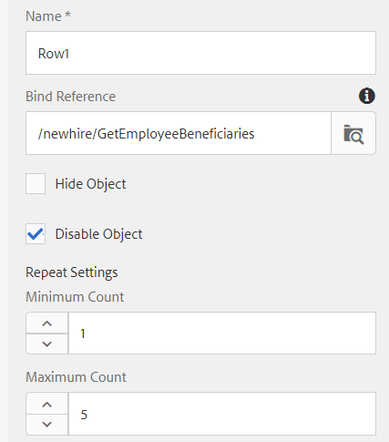

# 建立最適化表單

目前，我們已建立下列

* 具有2個表的資料庫 — `newhire`和`beneficiaries`
* 已設定Apache Sling Connection Pooled DataSource
* 基於RDBMS的表單資料模型

下一步是建立並設定最適化表單以使用表單資料模型。  若要搶先一步，您可以[下載並匯入](assets/fdm-demo-af.zip)範例表單。 示例表單中有一個部分顯示員工詳細資訊，另一個部分列出員工的受益人。

## 將表單與表單資料模型關聯

本課程提供的範例表單與任何表單資料模型都沒有關聯。 若要設定表單以使用表單資料模型，我們需要執行下列操作：

* 選擇FDMDemo表單
* 按一下&#x200B;_屬性_->_表單模型_
* 從下拉式清單中選取「表單資料模型」
* 搜尋並選取先前課程中建立的表單資料模型。
* 按一下&#x200B;_儲存並關閉_

## 配置預填服務

第一步是為表單建立預填服務的關聯。 要關聯預填服務，請遵循以下步驟

* 選擇`FDMDemo`表單
* 按一下「_編輯_」以在編輯模式中開啟表單
* 在內容階層中選取「表單容器」 ，然後按一下扳手圖示以開啟其屬性工作表
* 從「預填服務」下拉清單中選擇&#x200B;_表單資料模型預填服務_
* 按一下藍色☑以儲存變更

* 

## 配置員工詳細資訊

下一步是將適用性表單的文字欄位系結至表單資料模型元素。 您必須開啟以下欄位的屬性表，並設定其bindRef，如下所示

| 欄位名稱 | 綁定引用 |
|------------|--------------------|
| 名字 | /newhire/FirstName |
| 姓氏 | /newhire/lastName |

>[!NOTE]
>
>您可以新增其他文字欄位，並將它們系結至適當的表單資料模型元素

## 配置受益人表

下一步是以表格形式顯示員工的受益人。 提供的範例表單有一個表格，內含4欄和單列。 我們需要根據受益人的數量來配置表格以增長。

* 在編輯模式中開啟表單。
* 展開根面板 — >您的受益人 — >表格
* 選擇「行1」，然後按一下扳手錶徵圖以開啟其屬性表。
* 將「綁定引用」設定為&#x200B;**/newhere/GetEmployeeBenniters**
* 將「Repeat Settings - Minimum Count（重複設定 — 最小計數）」設定為1 ，將「Maximum Count（最大計數）」設定為5。
* 您的Row1設定應如下方螢幕擷取畫面
   
* 按一下藍色☑以儲存您的變更

## 綁定行單元格

最後，我們需要將行單元格綁定到形成資料模型元素。

* 展開根面板 — >您的受益人 — >表 — >行1
* 按照下表設定每個行單元格的綁定引用

| 列儲存格 | 繫結參考 |
|------------|----------------------------------------------|
| 名字 | /newhire/GetEmployeeBencients/firstname |
| 姓氏 | /newhire/GetEmployeeBencielts/lastname |
| 關係 | /newhire/GetEmployeeBencielts/relation |
| 百分比 | /newhire/GetEmployeeBencients/百分比 |

* 按一下藍色☑以儲存您的變更

## 測試您的表單

現在，我們需要在url中開啟具有適當empID的表單。 以下2個連結將填入來自資料庫的資訊
[具有empID=207](http://localhost:4502/content/dam/formsanddocuments/fdmdemo/jcr:content?wcmmode=disabled&amp;empID=207)的表單
[具有empID=208](http://localhost:4502/content/dam/formsanddocuments/fdmdemo/jcr:content?wcmmode=disabled&amp;empID=208)的表單

## 疑難排解

我的表單空白，沒有任何資料

* 請確定表單資料模型傳回正確的結果。
* 表單與正確的表單資料模型相關聯
* 檢查欄位綁定
* 檢查結帳日誌檔案。 您應該會看到empID寫入檔案。如果您沒有看到此值，則您的表單可能沒有使用所提供的自定義模板。

未填入表

* 檢查Row1綁定
* 請確定已正確設定Row1的重複設定（最小值=1，最大值= 5或更多）

