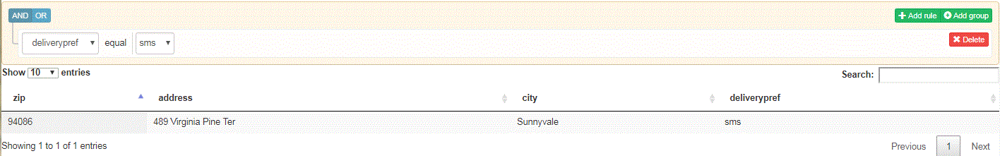

# 查詢提交的資料


下一步是查詢提交的資料，並以表格形式顯示結果。 為完成此目標，我們將使用下列軟體

[QueryBuilder](https://querybuilder.js.org/) - UI元件以建立查詢

[資料表](https://datatables.net/)-以表格方式顯示查詢結果。

已建立下列UI以啟用查詢已提交資料。 只有在JSON結構描述中標示為必要元素才可供查詢。 在下方的螢幕擷取中，我們會查詢傳送首頁為SMS的所有傳送。

查詢已提交資料的範例UI不會使用QueryBuilder中所有可用的進階功能。 我們鼓勵你自己試試。



>[!NOTE]
>
>本教學課程的目前版本不支援查詢多欄。

選擇表單以執行查詢時，會對&#x200B;**/bin/getdatakeysfromschema**&#x200B;進行GET調用。 此GET呼叫會傳回與表單結構關聯的必填欄位。 然後，必填欄位會填入QueryBuilder下拉式清單中，供您建立查詢。

以下代碼片段對JSONSchemaOperations服務的getRequiredColumnsFromSchema方法進行調用。 我們會將架構的屬性和必要元素傳遞至此方法呼叫。 此函式呼叫傳回的陣列接著會用來填入查詢產生器下拉式清單

```java
public JSONArray getData(String formName) throws SQLException, IOException {

  org.json.JSONArray arrayOfDataKeys = new org.json.JSONArray();
  JSONObject jsonSchema = jsonSchemaOperations.getJSONSchemaFromDataBase(formName);
  Map<String, String> refKeys = new HashMap<String, String>();

  try {
   JSONObject properties = jsonSchema.getJSONObject("properties");
   JSONArray requiredFields = jsonSchema.has("required") ? jsonSchema.getJSONArray("required") : null;
   jsonSchemaOperations.getRequiredColumnsFromSchema(properties, arrayOfDataKeys, "", jsonSchema, refKeys,
     requiredFields);
  } catch (JSONException e) {
   // TODO Auto-generated catch block
   e.printStackTrace();
  }
  return arrayOfDataKeys;

 }
```

按一下GetResult按鈕時，對&#x200B;**&quot;/bin/querydata&quot;**&#x200B;進行Get調用。 通過查詢參數，將QueryBuilder用戶介面所構建的查詢傳遞到servlet中。 然後，Servlet將此查詢按摩到可用於查詢資料庫的SQL查詢中。 例如，如果您正在搜尋以擷取所有名為&#39;Mouse&#39;的產品，Query Builder查詢字串將是$.productname = &#39;Mouse&#39;。 然後，此查詢將轉換為以下

從aemformswithjson選取*。  formsubmissions where JSON_EXTRACT(formsubmissions .formdata,&quot;$.productName &quot;)= &#39;Mouse&#39;

然後會傳回此查詢的結果，以填入UI中的表格。

要在本地系統上運行此示例，請執行以下步驟

1. [請確定您已遵循此處提及的所有步驟](part2.md)
1. [使用「套件管理器」匯入Dashboardv2AEM.zip。](assets/dashboardv2.zip) 此套件包含所有必要的組合、組態設定、自訂提交和範例頁面，以查詢資料。
1. 使用範例json結構描述建立最適化表單
1. 設定最適化表單以提交至「customsubmithelpx」自訂提交動作
1. 填寫表格並送出
1. 將瀏覽器指向[dashboard.html](http://localhost:4502/content/AemForms/dashboard.html)
1. 選擇表單並執行簡單查詢

