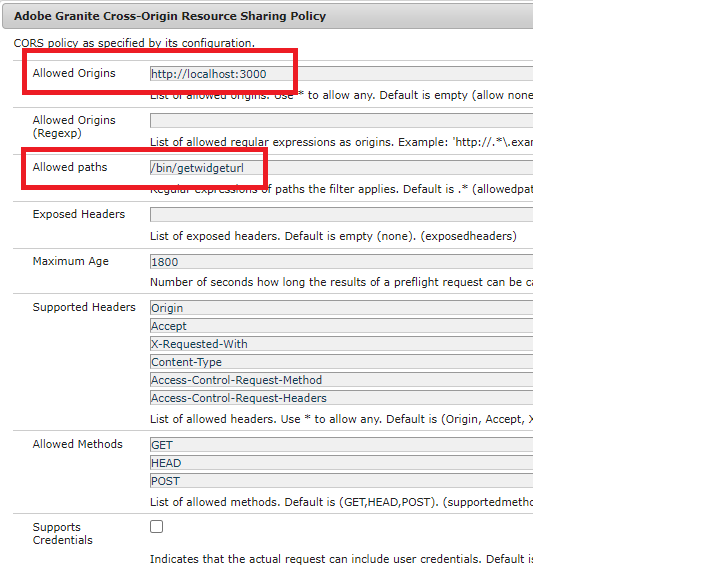

# 部署資產

下列資產/設定已部署在AEM Forms發佈伺服器上。

* [Adobe Sign包裝套件組合](assets/AcrobatSign.core-1.0.0-SNAPSHOT.jar)

* [互動式通訊範本範例](assets/waiver-interactive-communication.zip)
* [部署DevelopingWithServiceUser套件組合](https://experienceleague.adobe.com/docs/experience-manager-learn/assets/developingwithserviceuser.zip)
* 使用OSGi configMgr在Apache Sling Service使用者對應程式服務中新增下列項目
   **DevelopingWithServiceUser.core:getformsresourceresolver=fd-service**
* [您可從此處下載範例React應用程式程式碼](assets/src.zip)


範例react應用程式需部署在您的本機環境

您必須變更端點URL以符合您的環境。 開啟EmergencyContact.js檔案，並在擷取方法中變更URL

```javascript
 const getWebForm=async()=>
     {
        setSpinner(true)
        console.log("inside widgetURL function emergency contact");
        // NOTE: replace the `aemforms.azure.com:4503` with your AEM FORM server
        let res = await fetch("http://aemforms.azure.com:4503/bin/getwidgeturl",
          {
            method: "POST",
            body: JSON.stringify({"icTemplate":"/content/forms/af/waiver/waiver/channels/print","waiver":formData})
                     
         })
 
```

若要啟用從REACT應用程式對AEM端點進行POST呼叫，您必須在AdobeGranite跨原始資源共用原則設定的「允許的原始項」欄位中指定適當的實體




