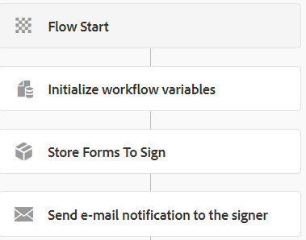

# 建立主要工作流程

使用者提交初始表單(**RefinanceForm**)時會觸發主要工作流程。 以下是工作流程的流程



**儲存Forms以簽署**&#x200B;為自訂程式步驟。

實施自訂流程步驟的動機是擴充AEM工作流程。 下列程式碼會實作自訂流程步驟。 程式碼會擷取要簽署的表單名稱，並將提交的表單資料傳遞給SignMultipleForms服務中的`insertData`方法。 `insertData`方法接著在資料來源&#x200B;**aemformstutorial**&#x200B;所識別的資料庫中插入資料列。

此自訂程式步驟中的程式碼參考`SignMultipleForms`服務。


```java
package com.aem.forms.signmultipleforms;

import java.io.ByteArrayInputStream;
import java.io.ByteArrayOutputStream;
import java.io.InputStream;
import java.io.StringWriter;
import java.nio.charset.Charset;
import java.nio.charset.StandardCharsets;

import javax.jcr.Node;
import javax.jcr.Session;
import javax.xml.parsers.DocumentBuilder;
import javax.xml.parsers.DocumentBuilderFactory;
import javax.xml.transform.TransformerFactory;
import javax.xml.transform.dom.DOMSource;
import javax.xml.transform.stream.StreamResult;
import javax.xml.xpath.XPath;

import org.apache.commons.io.IOUtils;
import org.osgi.framework.Constants;
import org.osgi.service.component.annotations.Component;
import org.osgi.service.component.annotations.Reference;
import org.slf4j.Logger;
import org.slf4j.LoggerFactory;
import org.w3c.dom.Document;

import com.adobe.granite.workflow.WorkflowException;
import com.adobe.granite.workflow.WorkflowSession;
import com.adobe.granite.workflow.exec.WorkItem;
import com.adobe.granite.workflow.exec.WorkflowProcess;
import com.adobe.granite.workflow.metadata.MetaDataMap;

@Component(property = {
  Constants.SERVICE_DESCRIPTION + "=StoreFormsToSign",
  Constants.SERVICE_VENDOR + "=Adobe Systems",
  "process.label" + "=StoreFormsToSign"
})
public class StoreFormsToSignWorkflowStep implements WorkflowProcess {
  private static final Logger log = LoggerFactory.getLogger(StoreFormsToSignWorkflowStep.class);@Reference
  SignMultipleForms signMultipleForms;

  @Override
  public void execute(WorkItem workItem, WorkflowSession workflowSession, MetaDataMap arg2) throws WorkflowException {
    String payloadPath = workItem.getWorkflowData().getPayload().toString();
    log.debug("The payload  in StoreFormsToSign " + workItem.getWorkflowData().getPayload().toString());
    String dataFilePath = payloadPath + "/Data.xml/jcr:content";
    String serverURL = arg2.get("PROCESS_ARGS", "string").toString();
    Session session = workflowSession.adaptTo(Session.class);
    DocumentBuilderFactory factory = null;
    DocumentBuilder builder = null;
    Document xmlDocument = null;
    Node xmlDataNode = null;
    try {
      xmlDataNode = session.getNode(dataFilePath);
      InputStream xmlDataStream = xmlDataNode.getProperty("jcr:data").getBinary().getStream();
      XPath xPath = javax.xml.xpath.XPathFactory.newInstance().newXPath();
      factory = DocumentBuilderFactory.newInstance();
      builder = factory.newDocumentBuilder();
      xmlDocument = builder.parse(xmlDataStream);
      org.w3c.dom.Node node = (org.w3c.dom.Node) xPath.compile("/afData/afUnboundData/data/formsToSign").evaluate(xmlDocument, javax.xml.xpath.XPathConstants.NODE);
      log.debug("The form names to sign are  t" + node.getTextContent());
      String formNamesToSign[] = node.getTextContent().split(",");
      ByteArrayOutputStream outputStream = new ByteArrayOutputStream();
      DOMSource source = new DOMSource(xmlDocument);
      StreamResult outputTarget = new StreamResult(outputStream);
      TransformerFactory.newInstance().newTransformer().transform(source, outputTarget);
      InputStream inputStream = new ByteArrayInputStream(outputStream.toByteArray());
      StringWriter writer = new StringWriter();
      IOUtils.copy(inputStream, writer, Charset.defaultCharset());
      String formData = writer.toString();
      signMultipleForms.insertData(formNamesToSign, formData, serverURL, workItem, workflowSession);

  }
    catch(Exception e) {
      log.debug(e.getMessage());
    }

  }
}
```


## Assets

本文中使用的簽署多個Forms工作流程可以從這裡[下載](assets/sign-multiple-forms-workflows.zip)

>[!NOTE]
> 請務必設定Day CQ Mail Service以傳送電子郵件通知。 上述套件中也提供電子郵件範本。

## 後續步驟

[在檔案簽署時更新簽名狀態](./update-signature-status.md)
