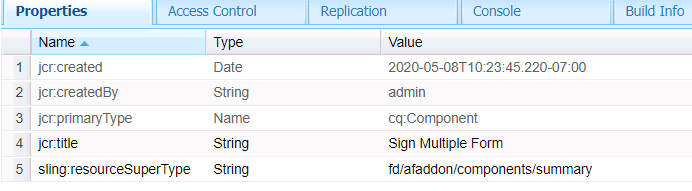
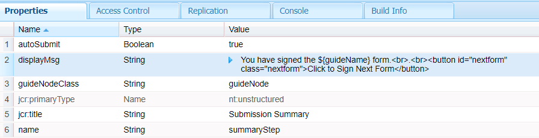

# 自訂摘要步驟

摘要步驟元件可用來顯示表單提交的摘要，以及下載已簽署表單的連結。 摘要步驟通常放置在表單的最後一個面板中。
針對此使用案例，我們已根據立即可用的摘要元件建立新元件，並擴充包含自訂clientlib的功能。

此元件以「簽署多個表單」標籤識別

以下熒幕擷取畫面顯示所建立的新元件，用於在簽署儀式完成時顯示訊息


新元件以現成可用的摘要元件為基礎。


我們已新增按鈕，可瀏覽至下一個要簽署的表單


summary.jsp包含下列程式碼。 它參考到類別ID **getnextform**&#x200B;所識別的使用者端資料庫

```java
<%--
  Guide Summary Component
--%>
<%@include file="/libs/fd/af/components/guidesglobal.jsp"%>
<%@include file="/libs/fd/afaddon/components/summary/summary.jsp"%>
<ui:includeClientLib categories="getnextform"/>
```

## Assets

自訂摘要元件可以[從這裡](assets/custom-summary-step.zip)下載

## 後續步驟

[取得下一個要簽署的表單](./create-client-lib.md)