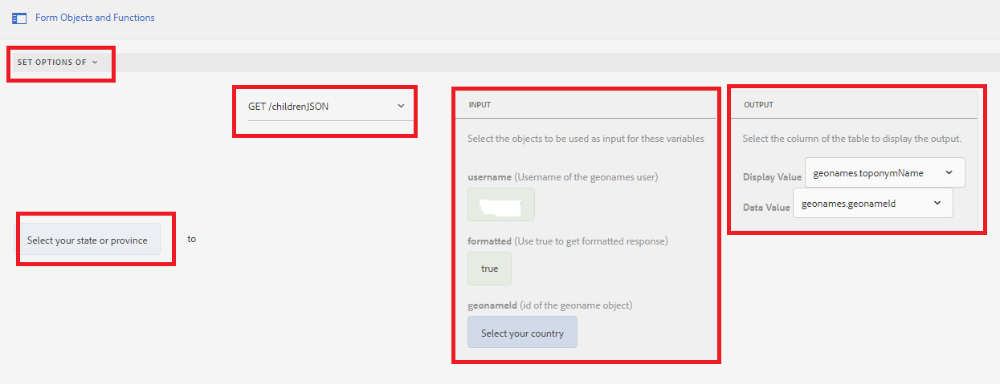

# 階層式下拉式清單

階層式下拉式清單是一系列相依的DropDownList控制項，其中一個DropDownList控制項相依於父項或前一個DropDownList控制項。 DropDownList控制項中的專案是根據使用者從其他DropDownList控制項選取的專案填入。

## 使用案例示範

>[!VIDEO](https://video.tv.adobe.com/v/340344?quality=12&learn=on)

為了進行本教學課程，我已使用 [Geonames REST API](https://www.geonames.org/export/web-services.html) 以展示此功能。
有許多組織提供這類服務，只要他們有妥善記錄的REST API，您就可以使用資料整合功能，輕鬆與AEM Forms整合

依照下列步驟，在AEM Forms中實作階層式下拉式清單

## 建立開發人員帳戶

建立開發人員帳戶，使用 [地名](https://www.geonames.org/login). 記下使用者名稱。 叫用geonames.org的REST API需要此使用者名稱。

## 建立Swagger/OpenAPI檔案

OpenAPI Specification （前身為Swagger Specification）是REST API的API說明格式。 OpenAPI檔案可讓您說明整個API，包括：

* 每個端點的可用端點(/users)和操作(GET/users、POST/users)
* 作業引數每個作業的輸入和輸出驗證方法
* 聯絡資訊、授權、使用條款及其他資訊。
* API規格可以用YAML或JSON撰寫。 該格式簡單易學，且可供人類和機器讀取。

若要建立您的第一個swagger/OpenAPI檔案，請遵循 [OpenAPI檔案](https://swagger.io/docs/specification/2-0/basic-structure/)

>[!NOTE]
> AEM Forms支援OpenAPI規格2.0版(FKA Swagger)。

使用 [swagger編輯器](https://editor.swagger.io/) 建立您的swagger檔案，描述擷取所有國家/地區以及國家/地區或州別之子元素的作業。 swagger檔案可以建立JSON或YAML格式。

## 建立資料來源

若要將AEM/AEM Forms與協力廠商應用程式整合，我們必須 [建立資料來源](https://experienceleague.adobe.com/docs/experience-manager-learn/forms/ic-web-channel-tutorial/parttwo.html) 在雲端服務設定中。 請使用 [swagger檔案](assets/geonames-swagger-files.zip) 以建立您的資料來源。
您需要建立2個資料來源（一個用於擷取所有國家/地區，另一個用於取得子元素）

## 建立表單資料模型

AEM Forms資料整合提供直覺式使用者介面，用於建立和使用 [表單資料模型](https://experienceleague.adobe.com/docs/experience-manager-65/forms/form-data-model/create-form-data-models.html). 讓表單資料模型以先前步驟建立的資料來源為基礎。 具有2個資料來源的表單資料模型

## 建立最適化表單

將表單資料模型的GET叫用與您的調適型表單整合，以填入下拉式清單。
使用2個下拉式清單建立最適化表單。 一個用於列出國家，另一個用於根據所選國家列出州/省。

### 填入國家下拉式清單

首次初始化表單時會填入國家/地區清單。 下列熒幕擷圖顯示規則編輯器，其設定為填入國家/地區下拉式清單的選項。 您必須提供使用者名稱和geonames帳戶，才能順利運作。

#### 填入州/省下拉式清單

我們需要根據所選的國家/地區填入州/省下拉式清單。 以下熒幕擷取畫面顯示規則編輯器設定

### 練習

新增2個名為縣和市的下拉式清單，根據所選國家/地區和州/省列出縣和市。

### 資產範例

您可以下載以下資產，以開始建立階層式下拉式清單範例。完整的swagger檔案可從下載 [此處](assets/geonames-swagger-files.zip)
swagger檔案說明下列REST API
* [取得所有國家/地區](https://secure.geonames.org/countryInfoJSON?username=yourusername)
* [取得Geoname物件的子系](https://secure.geonames.org/children?formatted=true&amp;geonameId=6252001&amp;username=yourusername)

已完成 [表單資料模型可從這裡下載](assets/geonames-api-form-data-model.zip)
