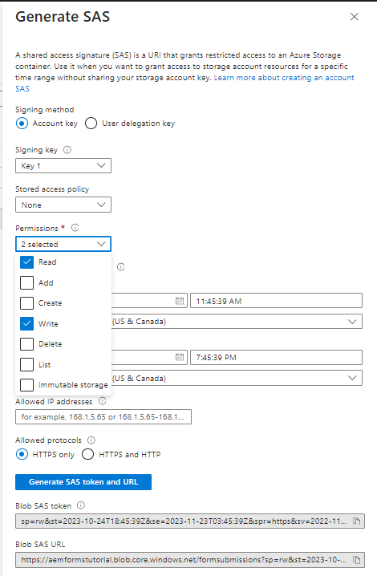
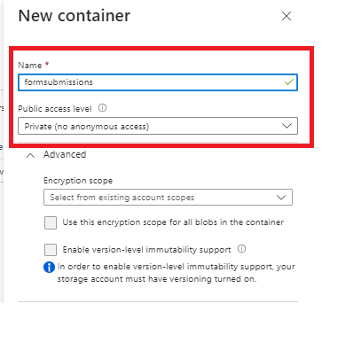
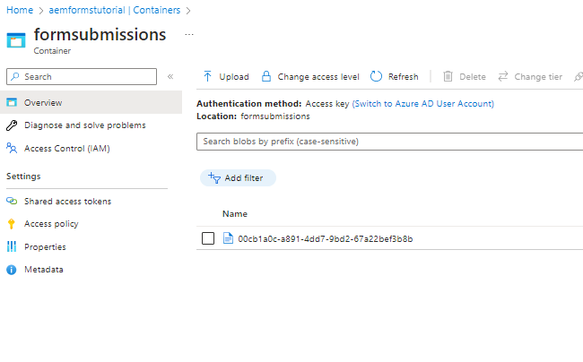

# 在Azure儲存體中儲存表單提交

本文說明如何進行REST呼叫，以將提交的AEM Forms資料儲存在Azure儲存空間。
若要將提交的表單資料儲存在Azure儲存體，必須執行下列步驟。

## 建立Azure儲存體帳戶

[登入您的Azure入口網站帳戶並建立儲存帳戶](https://learn.microsoft.com/en-us/azure/storage/common/storage-account-create?tabs=azure-portal#create-a-storage-account-1). 為儲存體帳戶提供有意義的名稱，按一下[檢閱]，然後按一下[建立]。 這會使用所有預設值建立您的儲存體帳戶。 出於本文的目的，我們已命名儲存帳戶 `aemformstutorial`.

## 建立共用存取權

我們將使用共用存取簽章或SAS授權方法來與Azure儲存容器互動。
從入口網站的儲存體帳戶頁面中，按一下左側的「共用存取簽章」功能表專案，以開啟新的共用存取簽章金鑰設定頁面。 請務必指定設定和適當的結束日期（如底下熒幕擷圖所示），然後按一下「產生SAS和連線字串」按鈕。 複製Blob服務SAS url。 我們將使用此URL進行HTTP呼叫


## 建立容器

接下來，我們需要建立一個容器，用於儲存表單提交作業中的資料。
在儲存體帳戶頁面中，按一下左側的「容器」功能表專案，並建立名為的容器 `formssubmissions`. 請確定公用存取層級已設為私人


## 建立PUT請求

下一步是建立PUT要求，以將提交的表單資料儲存在Azure儲存體。 我們必須修改Blob服務SAS URL，在URL中包含容器名稱和BLOB ID。 每個表單提交都需要以唯一的BLOB ID識別。 唯一的BLOB ID通常會在您的程式碼中建立，並插入PUT請求的URL中。
以下是PUT請求的部分URL。 此 `aemformstutorial` 是儲存帳戶的名稱，formsubmissions是將以唯一BLOB ID儲存資料的容器。 URL的其餘部分將維持不變。
https://aemformstutorial.blob.core.windows.net/formsubmissions/00cb1a0c-a891-4dd7-9bd2-67a22bef3b8b?...............

以下是使用PUT要求將提交的表單資料儲存在Azure儲存體中的函式。 請注意URL中使用容器名稱和uuid。 您可以使用下列範常式式碼建立OSGi服務或Sling servlet，並將表單提交專案儲存在Azure儲存空間。

```java
 public String saveFormDatainAzure(String formData) {
        System.out.println("in SaveFormData!!!!!"+formData);
        org.apache.http.impl.client.CloseableHttpClient httpClient = HttpClientBuilder.create().build();
        UUID uuid = UUID.randomUUID();
        
        String url = "https://aemformstutorial.blob.core.windows.net/formsubmissions/"+uuid.toString();
        url = url+"?sv=2022-11-02&ss=bf&srt=o&sp=rwdlaciytfx&se=2024-06-28T00:42:59Z&st=2023-06-27T16:42:59Z&spr=https&sig=v1MR%2FJuhEledioturDFRTd9e2fIDVSGJuAiUt6wNlkLA%3D";
        HttpPut httpPut = new HttpPut(url);
        httpPut.addHeader("x-ms-blob-type","BlockBlob");
        httpPut.addHeader("Content-Type","text/plain");
        try {
            httpPut.setEntity(new StringEntity(formData));
            CloseableHttpResponse response = httpClient.execute(httpPut);
            log.debug("Response code "+response.getStatusLine().getStatusCode());
        } catch (IOException e) {
            log.error("Error: "+e.getMessage());
            throw new RuntimeException(e);
        }
        return uuid.toString();


    }
```

## 驗證儲存在容器中的資料


