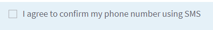

# 使用行動電話號碼驗證使用者

SMS雙因素驗證（雙因素驗證）是一種安全性驗證程式，透過使用者登入網站、軟體或應用程式來觸發。 在登入程式中，使用者會自動傳送SMS至包含唯一數字代碼的手機號碼。

有許多組織提供此服務，只要他們妥善記錄REST API，您就可以使用AEM Forms的資料整合功能，輕鬆整合AEM Forms。 為了進行本教學課程，我已使用 [Nexmo](https://developer.nexmo.com/verify/overview) 示範SMS 2FA使用案例。

依下列步驟，使用Nexmo Verify服務透過AEM Forms實作SMS 2FA。

## 建立開發人員帳戶

建立開發人員帳戶，使用 [Nexmo](https://dashboard.nexmo.com/sign-in). 記下API金鑰和API秘密金鑰。 呼叫Nexmo服務的REST API時需要這些金鑰。

## 建立Swagger/OpenAPI檔案

OpenAPI Specification （前身為Swagger Specification）是REST API的API說明格式。 OpenAPI檔案可讓您說明整個API，包括：

* 每個端點的可用端點(/users)和操作(GET/users、POST/users)
* 作業引數每個作業的輸入和輸出驗證方法
* 聯絡資訊、授權、使用條款及其他資訊。
* API規格可以用YAML或JSON撰寫。 該格式簡單易學，且可供人類和機器讀取。

若要建立您的第一個swagger/OpenAPI檔案，請遵循 [OpenAPI檔案](https://swagger.io/docs/specification/2-0/basic-structure/)

>[!NOTE]
> AEM Forms支援OpenAPI規格2.0版(fka Swagger)。

使用 [swagger編輯器](https://editor.swagger.io/) 建立您的swagger檔案，以說明傳送及驗證使用簡訊傳送之OTP代碼的作業。 swagger檔案可以建立JSON或YAML格式。 完整的swagger檔案可從以下位置下載： [此處](assets/two-factore-authentication-swagger.zip)

## 建立資料來源

若要將AEM/AEM Forms與協力廠商應用程式整合，我們必須 [建立資料來源](https://experienceleague.adobe.com/docs/experience-manager-learn/forms/ic-web-channel-tutorial/parttwo.html) 在雲端服務設定中。

## 建立表單資料模型

AEM Forms資料整合提供直覺式使用者介面，用於建立和使用 [表單資料模型](https://experienceleague.adobe.com/docs/experience-manager-65/forms/form-data-model/create-form-data-models.html). 表單資料模型仰賴資料來源交換資料。
完成的表單資料模型可以 [已從此處下載](assets/sms-2fa-fdm.zip)

## 建立最適化表單

將表單資料模型的POST叫用與您的回應式表單整合，以驗證使用者在表單中輸入的行動電話號碼。 您可以自由建立自己的最適化表單，並根據需求使用表單資料模型的POST引動來傳送和驗證OTP代碼。

如果您想要搭配API金鑰使用範例資產，請遵循下列步驟：

* [下載表單資料模型](assets/sms-2fa-fdm.zip) 並使用匯入AEM [封裝管理員](http://localhost:4502/crx/packmgr/index.jsp)
* 下載最適化表單範例可以是 [已從此處下載](assets/sms-2fa-verification-af.zip). 此範例表單使用本文中提供的表單資料模型的服務引動。
* 從將表單匯入AEM [Forms和檔案UI](http://localhost:4502/aem/forms.html/content/dam/formsanddocuments)
* 在編輯模式中開啟表單。 開啟下列欄位的規則編輯器

* 編輯與欄位關聯的規則。 提供適當的API金鑰
* 儲存表單
* [預覽表單](http://localhost:4502/content/dam/formsanddocuments/sms-2fa-verification/jcr:content?wcmmode=disabled) 並測試功能
