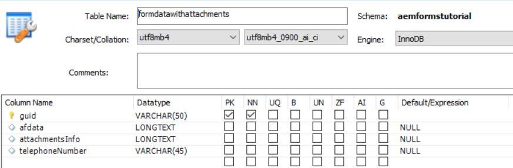

# 設定資料來源

AEM有許多方式可啟用與外部資料庫的整合。 資料庫整合最常見和標準的作法之一，就是透過使用Apache Sling Connection Pooled DataSource [configMgr](http://localhost:4502/system/console/configMgr).
第一步是下載並部署適當的 [MySQL驅動程式](https://mvnrepository.com/artifact/mysql/mysql-connector-java) 至AEM。
然後，設定資料庫專屬的Sling Connection Pooled DataSource屬性。 下列熒幕擷圖顯示用於本教學課程的設定。 資料庫結構描述會作為本教學課程資產的一部分提供給您。

>[!NOTE]
>請務必為您的資料來源命名 `StoreAndRetrieveAfData` 因為這是OSGi服務中使用的名稱。

| 屬性名稱 | 屬性值 |   |
|---------------------|------------------------------------------------------------------------------------|---|
| 資料來源名稱 | StoreAndRetrieveAfData |   |
| jdbc磁碟機類別 | jdbc:mysql://localhost：3306/aemformstutorial |   |
| JDBC連線URI | jdbc:mysql://localhost：3306/aemformstutorial？serverTimezone=UTC&amp;autoReconnect=true |   |
|                     |                                                                                    |   |

## 建立資料庫

以下資料庫用於此使用案例。 資料庫有一個資料表，名為 `formdatawithattachments` 與下方熒幕擷圖中所示的4欄搭配使用。

* 欄 **afdata** 會儲存最適化表單資料。
* 欄 **附件資訊** 會儲存表單附件的相關資訊。
* 欄 **telephoneNumber** 將保留填寫表單之個人的行動電話號碼。

請匯入 [資料庫綱要](assets/data-base-schema.sql)
使用MySQL Workbench。

## 建立表單資料模型

建立表單資料模型，並以上一步驟中建立的資料來源為基礎。
設定 **get** 此表單資料模型的服務，如下面的熒幕擷圖所示。
請確定您未在 **get** 服務。

此專案的目的 **get** 服務是擷取與應用程式id相關聯的電話號碼。

然後，此表單資料模型將用於 **我的帳戶表單** 擷取與應用程式id相關聯的電話號碼。

## 後續步驟

[撰寫程式碼以儲存表單附件](./store-form-attachments.md)
