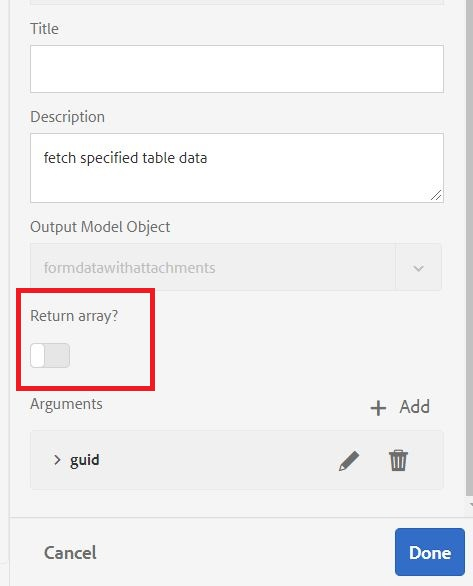

# 配置資料源

有許多方法可AEM以與外部資料庫整合。 資料庫整合最常見的標準做法之一，是透過[configMgr](http://localhost:4502/system/console/configMgr)使用Apache Sling Connection Pooled DataSource組態屬性。
第一步是下載並部署相應的[MySQL驅動程式](https://mvnrepository.com/artifact/mysql/mysql-connector-java)AEM。
然後設定您資料庫專屬的Sling Connection Pooled DataSource屬性。 以下螢幕擷取顯示本教學課程所使用的設定。 本教學課程資產會提供資料庫架構給您。

* JDBC驅動程式類：`com.mysql.cj.jdbc.Driver`
* JDBC連接URI:`jdbc:mysql://localhost:3306/aemformstutorial`

>[!NOTE]
>請確定您為資料來源`StoreAndRetrieveAfData`命名，因為這是OSGi服務中使用的名稱。

## 建立資料庫

以下資料庫用於此使用案例。 資料庫有一個名為`formdatawithattachments`的表，其中4列如下面螢幕抓圖所示。

* 欄&#x200B;**afdata**&#x200B;將保存自適應表單資料。
* 列&#x200B;**attachmentsInfo**&#x200B;將保存有關表單附件的資訊。
* 欄&#x200B;**telephoneNumber**&#x200B;將包含填寫表單之人員的行動電話號碼。

請通過導入[資料庫模式](assets/data-base-schema.sql)來建立資料庫
使用MySQL工作台。

## 建立表單資料模型

建立表單資料模型，並以上一步驟中建立的資料來源為基礎。
如以下螢幕抓圖所示，配置此表單資料模型的**get**服務。
請確定您未在**get**&#x200B;服務中返回陣列。

此&#x200B;**get**&#x200B;服務用於讀取與應用程式ID相關聯的電話號碼。

然後，此表單資料模型將用於&#x200B;**MyAccountForm**，以擷取與應用程式ID相關的電話號碼。
