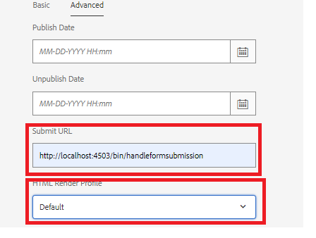

# 讓此使用案例在您的系統上運作

>[!NOTE]
>
>為了讓範例資產在您的系統上運作，假設您有權存取AEM Forms作者和AEM Forms發佈例項。

若要讓此使用案例在本機系統中正常運作，請遵循下列步驟：

## 在您的AEM Forms作者執行個體上部署下列專案

* [安裝MobileFormToWorkflow套件](assets/MobileFormToWorkflow.core-1.0.0-SNAPSHOT.jar)

* [部署使用服務進行開發的使用者套件](https://experienceleague.adobe.com/docs/experience-manager-learn/assets/developingwithserviceuser.zip?lang=en)
使用configMgr在Apache Sling服務使用者對應程式服務中新增以下專案

```
DevelopingWithServiceUser.core:getformsresourceresolver=fd-service
```

* 您可以使用[configMgr](http://localhost:4502/system/console/configMg)在AEM伺服器認證組態中指定資料夾名稱，將表單提交儲存到其他資料夾。 如果您變更資料夾，請務必在資料夾上建立啟動器，以觸發工作流程&#x200B;**ReviewSubmittedPDF**


* [使用封裝管理員](assets/xdp-form-and-workflow.zip)匯入範例xdp和工作流程封裝。


## 在發佈執行個體上部署以下資產

* [安裝MobileFormToWorkflow套件](assets/MobileFormToWorkflow.core-1.0.0-SNAPSHOT.jar)

* 指定作者執行個體的使用者名稱/密碼，並在AEM存放庫&#x200B;**中指定**&#x200B;現有位置，以使用[configMgr](http://localhost:4503/system/console/configMgr)在AEM Server認證中儲存提交的資料。 您可以在AEM Workflow Server上將端點的URL維持不變。 這是端點，會從指定節點的提交中擷取並儲存資料。
  

* [部署使用服務進行開發的使用者套件](https://experienceleague.adobe.com/docs/experience-manager-learn/assets/developingwithserviceuser.zip?lang=en)
* [開啟osgi設定](http://localhost:4503/system/console/configMgr)。
* 搜尋&#x200B;**Apache Sling反向連結篩選器**。 請確定已選取「允許空白」核取方塊。


## 測試解決方案

* 登入您的作者執行個體
* [編輯w9.xdp](http://localhost:4502/libs/fd/fm/gui/content/forms/formmetadataeditor.html/content/dam/formsanddocuments/w9.xdp)的進階屬性。 請確定已正確設定提交url和轉譯器設定檔，如下所示。
  

* 發佈w9.xdp
* 登入發佈執行個體
* [預覽w9表單](http://localhost:4503/content/dam/formsanddocuments/w9.xdp/jcr:content)
* 填寫一些表單欄位並提交表單
* 以管理員身分登入AEM作者執行個體
* [檢查AEM收件匣](http://localhost:4502/aem/inbox)
* 您應該要有工作專案才能檢閱已提交的PDF

>[!NOTE]
>
>有些客戶不是將PDF提交到發佈執行個體上執行的servlet，而是將servlet部署在Tomcat之類的servlet容器中。 這完全取決於客戶熟悉的拓撲。就本教學課程而言，我們將使用部署在發佈執行個體上的servlet來處理表單提交。
