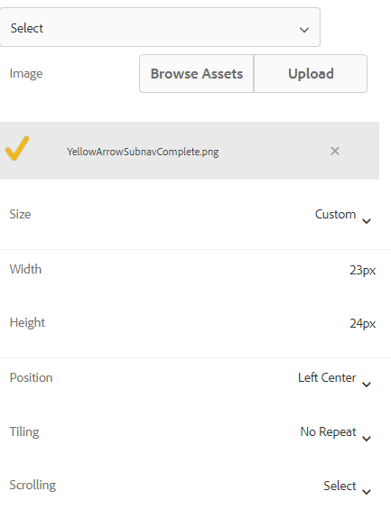

# 新增圖示以指示活動和已完成的索引標籤

當您有附有左側索引標籤導覽的最適化表單時，您可能想要顯示圖示來指示索引標籤的狀態。 例如，您想要顯示一個圖示來指示作用中的標籤，而圖示來指示完成的標籤，如下方熒幕擷取所示。

## 建立最適化表單

範例表單是使用以基本範本和畫布3.0主題為基礎的簡單調適型表單來建立。
可以從這裡下載此文章](assets/icons.zip)中使用的[圖示。

## 設定預設狀態的樣式

在編輯模式下開啟表單
確定您在樣式圖層中，並選取任何標籤(例如「一般」(General)標籤)。
開啟標籤的樣式編輯器時，您處於預設狀態，如下方熒幕擷取畫面所示

設定預設狀態的CSS屬性，如下所示
| 類別 | 屬性名稱  |  屬性值 |
|：—|：—|：—|
| Dimension和位置 | 寬度 | 50px |
| 文字 | 字型粗細| 粗體 |
| 文字 | 顏色 | #FFF |
|文字 | 行高| 3 |
|文字  | 文字對齊 | 左側 |
|背景| 顏色 | #056dae |

儲存您的變更

## 設定使用中狀態的樣式

請確定您處於作用中狀態，並設定下列CSS屬性的樣式

| 類別 | 屬性名稱 | 屬性值 |
|:---|:---|:---|
| Dimension和位置 | 寬度 | 50px |
| 文字 | 字粗 | 粗體 |
| 文字 | 颜色 | #FFF |
| 文字 | 行高 | 3 |
| 文字 | 文字對齊 | 左 |
| 背景 | 颜色 | #056dae |

設定背景影像的樣式，如下方熒幕擷取畫面所示

儲存您的變更。

## 設定造訪狀態的樣式

請確定您處於已造訪狀態，並設定下列屬性的樣式

| 類別 | 屬性名稱 | 屬性值 |
|:---|:---|:---|
| Dimension和位置 | 寬度 | 50px |
| 文字 | 字粗 | 粗體 |
| 文字 | 颜色 | #FFF |
| 文字 | 行高 | 3 |
| 文字 | 文字對齊 | 左 |
| 背景 | 颜色 | #056dae |

設定背景影像的樣式，如下方熒幕擷取畫面所示

儲存您的變更

預覽表單並測試圖示是否如預期運作。
