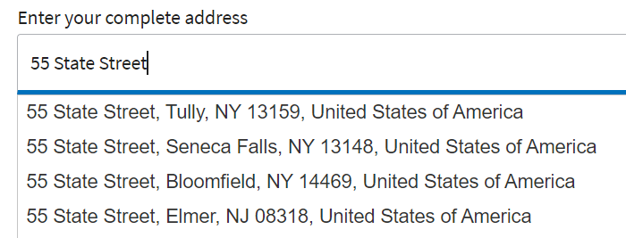

# 實作自動完成

使用jquery的自動完成功能，在AEM表單中實作自動完成功能。
本文隨附的範例會使用各種資料來源（靜態陣列、從REST API回應填入的動態陣列），在使用者開始輸入文字欄位時填入建議。

用於完成自動完成功能的程式碼與欄位的初始化事件相關聯。

## 提供地址建議




以下是用於提供街道地址建議的代碼

```javascript
$(".streetAddress input").autocomplete({
    source: function(request, response) {
        $.ajax({
            url: "https://api.geoapify.com/v1/geocode/autocomplete?text=" + request.term + "&apiKey=Your API Key", //please get your own API key with geoapify.com
            responseType: "application/json",
            success: function(data) {
                console.log(data.features.length);
                response($.map(data.features, function(item) {
                    return {
                        label: [item.properties.formatted],
                        value: [item.properties.formatted]
                    };
                }));
            },
        });
    },
    minLength: 5,
    select: function(event, ui) {
        console.log(ui.item ?
            "Selected: " + ui.item.label :
            "Nothing selected, input was " + this.value);
    }

});
```


## 對表情符號的建議


以下程式碼用於在建議清單中顯示emoji表情符號

```javascript
var values=["Wolf \u{1F98A}", "Lion \u{1F981}","Puppy \u{1F436}","Giraffe \u{1F992}","Frog \u{1F438}"];
$(".Animals input").autocomplete( {
minLength: 1, source: values, delay: 0
}

);
```

此 [可下載範例表單](assets/auto-complete-form.zip) 從這裡。 請務必使用程式碼編輯器，為程式碼提供您自己的使用者名稱/API金鑰，以成功進行REST呼叫。

>[!NOTE]
>
> 要讓自動完成工作，請確定您的表單使用下列用戶端程式庫 **cq.jquery.ui**. 此用戶端程式庫隨附AEM。
