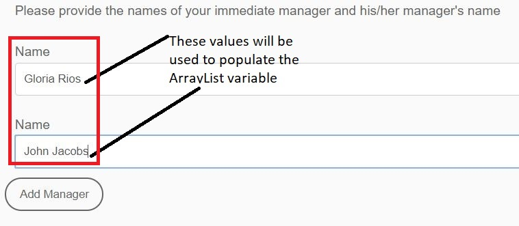

# AEM工作流程中的ArrayList變數

AEM Forms 6.5已匯入ArrayList型別的變數。使用ArrayList變數的常見使用案例是定義要在AssignTask中使用的自訂路由。

若要在AEM Workflow中使用ArrayList變數，您需要建立最適化表單，該表單會在提交的資料中產生重複元素。 常見做法是定義包含陣列元素的結構描述。 出於本文的目的，我建立了一個包含陣列元素的簡單JSON結構描述。 使用案例是員工填寫費用報表。 在費用報表中，我們會擷取提交者的經理名稱和經理名稱。 管理員的名稱儲存在稱為managerchain的陣列中。 以下熒幕擷圖顯示費用報表表單，以及最適化Forms提交中的資料。



以下是來自最適化表單提交的資料。 最適化表單是以JSON結構描述為基礎，繫結至結構描述的資料會儲存在afBoundData元素的資料元素下。 Managerchain是一個陣列，我們需要在Managerchain陣列內填入ArrayList中物件的name元素。

```json
{
    "afData": {
        "afUnboundData": {
            "data": {
                "numericbox_2762582281554154833426": 700
            }
        },
        "afBoundData": {
            "data": {
                "Employee": {
                    "Name": "Conrad Simms",
                    "Department": "IT",
                    "managerchain": [{
                        "name": "Gloria Rios"
                    }, {
                        "name": "John Jacobs"
                    }]
                },
                "expense": [{
                    "description": "Hotel",
                    "amount": 300
                }, {
                    "description": "Air Fare",
                    "amount": 400
                }]
            }
        },
        "afSubmissionInfo": {
            "computedMetaInfo": {},
            "stateOverrides": {},
            "signers": {},
            "afPath": "/content/dam/formsanddocuments/helpx/travelexpensereport",
            "afSubmissionTime": "20190402102953"
            }
        }
}
```

若要初始化子型別字串的ArrayList變數，您可以使用JSON點標籤法或XPath對應模式。 下列熒幕擷圖顯示您使用JSON點標籤法填入名為CustomRoutes的ArrayList變數。 請確定您指向陣列物件中的元素，如下方熒幕擷圖所示。 我們正在使用managerchain陣列物件的名稱填入CustomRoutes ArrayList。
然後會使用CustomRoutes ArrayList來填入AssignTask元件中的路由

使用提交資料中的值初始化CustomRoutes ArrayList變數後，就會使用CustomRoutes變數填入AssignTask元件的Routes。 下面的熒幕擷圖顯示AssignTask中的自訂路由


若要在您的系統上測試此工作流程，請遵循下列步驟

* 下載ArrayListVariable.zip檔案並儲存至您的檔案系統
* [匯入zip檔案](assets/arraylistvariable.zip) 使用AEM封裝管理員
* [開啟TravelExpenseReport表單](http://localhost:4502/content/dam/formsanddocuments/helpx/travelexpensereport/jcr:content?wcmmode=disabled)
* 輸入一些費用和2位經理的姓名
* 按一下提交按鈕
* [開啟您的收件匣](http://localhost:4502/aem/inbox)
* 您應該會看到名為「指派給費用管理員」的新任務
* 開啟與任務關聯的表單
* 您應該會看到兩個具有管理員名稱的自訂路由
   [探索ReviewExpenseReportWorkflow。](http://localhost:4502/editor.html/conf/global/settings/workflow/models/ReviewExpenseReport.html) 此工作流程使用Or-Split元件中的ArrayList變數、JSON型別變數、規則編輯器
