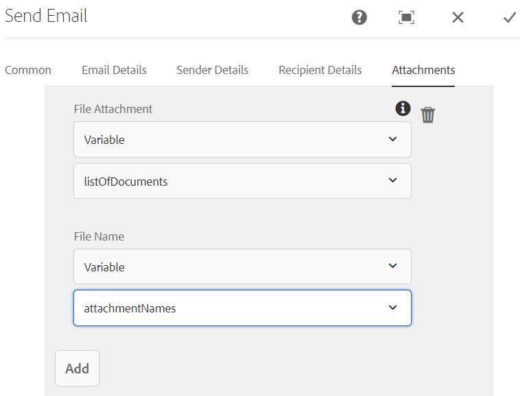

# 簡介

常見的使用案例是在AEM工作流程中使用傳送電子郵件元件來傳送最適化表單附件。
客戶通常會使用傳送電子郵件元件，將表單附件壓縮或以個別檔案形式傳送附件。

## 以zip檔案傳送表單附件

為完成使用案例，編寫了自訂工作流程處理步驟。 在此自訂程式中，會將ZIP檔案（其中已建立表單附件，並儲存在名為的檔案的裝載資料夾下） *zipped_attachments.zip*

## 個別傳送表單附件

為了完成此使用案例，編寫了自訂工作流程處理步驟。 在此自訂處理步驟中，我們會填入「檔案的ArrayList 」類型和「字串的ArrayList 」類型的工作流變數。

