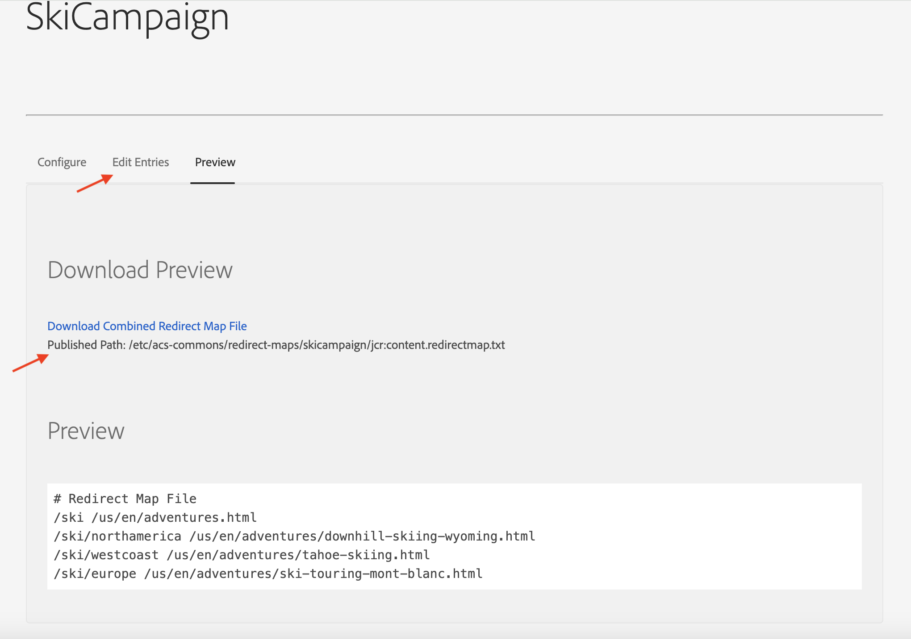
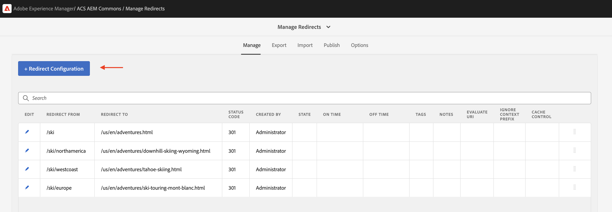

# 使用管道免費設定的URL重新導向

瞭解如何在需要新增或更新重新導向時，不需使用AEM程式碼或設定管道即可管理URL重新導向。 因此，行銷團隊無需開發人員即可管理重新導向。

在AEM中有多個管理URL重新導向的選項，如需詳細資訊，請參閱[URL重新導向](url-redirection.md)。 本教學課程著重於在類似[Apache RewriteMap](https://httpd.apache.org/docs/2.4/rewrite/rewritemap.html)的文字檔案中建立URL重新導向，作為索引鍵值配對，並使用AEM as a Cloud Service的特定設定將其載入Apache/Dispatcher模組。

## 先決條件

若要完成本教學課程，您需要：

- 版本為&#x200B;**或更高18311**&#x200B;的AEM as a Cloud Service環境。

- 必須在其上部署範例[WKND Sites](https://github.com/adobe/aem-guides-wknd)專案。

## 教學課程使用案例

為了示範，假設WKND行銷團隊正在啟動新的滑雪行銷活動。 他們想要為滑雪冒險頁面建立簡短URL，並像管理內容一樣自行管理。

根據行銷團隊的需求，以下是需要建立的URL重新導向。

| SOURCE URL | 目標 URL |
|------------|------------|
| /ski | /us/en/adventures.html |
| /ski/northamerica | /us/en/adventures/downhill-skiing-wyoming.html |
| /ski/westcoast | /us/en/adventures/tahoe-skiing.html |
| /ski/歐洲 | /us/en/adventures/ski-touring-mont-blanc.html |

現在，讓我們瞭解如何在AEM as a Cloud Service環境中管理這些URL重新導向，以及需要的一次性Dispatcher設定。

## 如何管理URL重新轉向{#manage-redirects}

若要管理URL重新導向，有多個可用選項，讓我們來探索這些選項。

### DAM中的文字檔

URL重新導向能以文字檔案中的機碼值組來管理，並上傳至AEM數位資產管理(DAM)。

例如，上述URL重新導向可儲存在名為`skicampaign.txt`的文字檔中，並上傳至DAM @ `/content/dam/wknd/redirects`資料夾。 稽核及核准後，行銷團隊可以發佈文字檔案。

```
# Ski Campaign Redirects separated by the TAB character
/ski      /us/en/adventures.html
/ski/northamerica  /us/en/adventures/downhill-skiing-wyoming.html
/ski/westcoast   /us/en/adventures/tahoe-skiing.html
/ski/europe          /us/en/adventures/ski-touring-mont-blanc.html
```

### ACS Commons — 重新導向地圖管理員

[ACS Commons — 重新導向對應管理員](https://adobe-consulting-services.github.io/acs-aem-commons/features/redirect-map-manager/index.html)提供方便好用的介面，可管理URL重新導向。

例如，行銷團隊可以建立名稱為`SkiCampaign`的新&#x200B;*重新導向對應*&#x200B;頁面，並使用&#x200B;**編輯專案**&#x200B;索引標籤新增上述URL重新導向。 URL重新導向可在`/etc/acs-commons/redirect-maps/skicampaign/jcr:content.redirectmap.txt`取得。



>[!IMPORTANT]
>
>需要ACS Commons版本&#x200B;**6.7.0或更高版本**&#x200B;才能使用重新導向對應管理員，如需詳細資訊，請參閱[ACS Commons — 重新導向管理員](https://adobe-consulting-services.github.io/acs-aem-commons/features/redirect-manager/index.html)。

### ACS Commons — 重新導向管理員

另外，[ACS Commons — 重新導向管理員](https://adobe-consulting-services.github.io/acs-aem-commons/features/redirect-manager/index.html)也提供方便好用的介面來管理URL重新導向。

例如，行銷團隊可以建立名為`/conf/wknd`的新設定，並使用&#x200B;**+重新導向設定**&#x200B;按鈕新增上述URL重新導向。 URL重新導向可在`/conf/wknd/settings/redirects.txt`取得。



>[!IMPORTANT]
>
>需要ACS Commons版本&#x200B;**6.10.0或更高版本**&#x200B;才能使用重新導向管理員，如需詳細資訊，請參閱[ACS Commons — 重新導向管理員](https://adobe-consulting-services.github.io/acs-aem-commons/features/redirect-manager/subpages/rewritemap.html)。

## 如何設定Dispatcher

若要以RewriteMap形式載入URL重新導向，並將它們套用至傳入請求，則需要下列Dispatcher設定。

### 為彈性模式啟用Dispatcher模組

首先，確認Dispatcher模組已啟用&#x200B;_彈性模式_。 `dispatcher/src/opt-in`資料夾中有`USE_SOURCES_DIRECTLY`個檔案表示Dispatcher處於彈性模式。

### 以RewriteMap載入URL重新導向

接下來，在`dispatcher/src/opt-in`資料夾中建立新的組態檔`managed-rewrite-maps.yaml`，其結構如下。

```yaml
maps:
- name: <MAPNAME>.map # e.g. skicampaign.map
    path: <ABSOLUTE_PATH_TO_URL_REDIRECTS_FILE> # e.g. /content/dam/wknd/redirects/skicampaign.txt, /etc/acs-commons/redirect-maps/skicampaign/jcr:content.redirectmap.txt, /conf/wknd/settings/redirects.txt
    wait: false # Optional, default is false, when true, the Apache waits for the map to be loaded before starting
    ttl: 300 # Optional, default is 300 seconds, the reload interval for the map
```

在部署期間，Dispatcher會在`/tmp/rewrites`資料夾中建立`<MAPNAME>.map`檔案。

>[!IMPORTANT]
>
> 檔案名稱(`managed-rewrite-maps.yaml`)和位置(`dispatcher/src/opt-in`)應該與上述完全相同，請將其視為要遵循的慣例。

### 套用URL重新導向至傳入要求

最後，建立或更新Apache重寫設定檔案以使用上述對應(`<MAPNAME>.map`)。 例如，讓我們使用`dispatcher/src/conf.d/rewrites`資料夾中的`rewrite.rules`檔案來套用URL重新導向。

```
...
# Use the RewriteMap to define the URL redirects
RewriteMap <MAPALIAS> dbm=sdbm:/tmp/rewrites/<MAPNAME>.map

RewriteCond ${<MAPALIAS>:$1} !=""
RewriteRule ^(.*)$ ${<MAPALIAS>:$1|/} [L,R=301]    
...
```

### 設定範例

讓我們檢閱[以上](#manage-redirects)提及的每個URL重新導向管理選項的Dispatcher設定。

>[!BEGINTABS]

>DAM中的[!TAB 文字檔]

當URL重新導向以文字檔案中的機碼值組形式管理，並上傳至DAM時，設定如下。

[!BADGE dispatcher/src/opt-in/managed-rewrite-maps.yaml]{type=Neutral tooltip="以下程式碼範例的檔案名稱。"}

```yaml
maps:
- name: skicampaign.map
  path: /content/dam/wknd/redirects/skicampaign.txt
```

[!BADGE dispatcher/src/conf.d/rewrites/rewrite.rules]{type=Neutral tooltip="以下程式碼範例的檔案名稱。"}

```
...

# The DAM-managed skicampaign.txt file as skicampaign.map
RewriteMap skicampaign dbm=sdbm:/tmp/rewrites/skicampaign.map

# Apply the RewriteMap for matching request URIs
RewriteCond ${skicampaign:%{$1}} !=""
RewriteRule ^(.*)$ ${skicampaign:%{$1}|/} [L,R=301]

...
```

>[!TAB ACS Commons — 重新導向地圖管理員]

使用ACS Commons — 重新導向對應管理員管理URL重新導向時，設定如下。

[!BADGE dispatcher/src/opt-in/managed-rewrite-maps.yaml]{type=Neutral tooltip="以下程式碼範例的檔案名稱。"}

```yaml
maps:
- name: skicampaign.map
  path: /etc/acs-commons/redirect-maps/skicampaign/jcr:content.redirectmap.txt
```

[!BADGE dispatcher/src/conf.d/rewrites/rewrite.rules]{type=Neutral tooltip="以下程式碼範例的檔案名稱。"}

```
...

# The Redirect Map Manager-managed skicampaign.map
RewriteMap skicampaign dbm=sdbm:/tmp/rewrites/skicampaign.map

# Apply the RewriteMap for matching request URIs
RewriteCond ${skicampaign:%{$1}} !=""
RewriteRule ^(.*)$ ${skicampaign:%{$1}|/} [L,R=301]

...
```

>[!TAB ACS Commons — 重新導向管理員]

使用ACS Commons — 重新導向管理員管理URL重新導向時，設定如下。

[!BADGE dispatcher/src/opt-in/managed-rewrite-maps.yaml]{type=Neutral tooltip="以下程式碼範例的檔案名稱。"}

```yaml
maps:
- name: skicampaign.map
  path: /conf/wknd/settings/redirects.txt
```

[!BADGE dispatcher/src/conf.d/rewrites/rewrite.rules]{type=Neutral tooltip="以下程式碼範例的檔案名稱。"}

```
...

# The Redirect Manager-managed skicampaign.map
RewriteMap skicampaign dbm=sdbm:/tmp/rewrites/skicampaign.map

# Apply the RewriteMap for matching request URIs
RewriteCond ${skicampaign:%{$1}} !=""
RewriteRule ^(.*)$ ${skicampaign:%{$1}|/} [L,R=301]

...
```

>[!ENDTABS]

## 如何部署設定

>[!IMPORTANT]
>
>*管道自由*&#x200B;用語是用來強調組態僅&#x200B;*部署一次*，而行銷團隊可以透過更新文字檔來管理URL重新導向。

若要部署設定，請使用[Cloud Manager](https://my.cloudmanager.adobe.com/)中的[完整棧疊](https://experienceleague.adobe.com/en/docs/experience-manager-cloud-service/content/implementing/using-cloud-manager/cicd-pipelines/introduction-ci-cd-pipelines#full-stack-pipeline)或[Web層設定](https://experienceleague.adobe.com/en/docs/experience-manager-cloud-service/content/implementing/using-cloud-manager/cicd-pipelines/introduction-ci-cd-pipelines#web-tier-config-pipelines)管道。


部署成功後，URL重新導向就會啟用，行銷團隊無需開發人員即可管理。

## 如何測試URL重新轉向

讓我們使用瀏覽器或`curl`命令來測試URL重新導向。 存取`/ski/westcoast` URL並確認它重新導向至`/us/en/adventures/tahoe-skiing.html`。

## 摘要

在本教學課程中，您已瞭解如何使用AEM as a Cloud Service環境中的管道免費設定來管理URL重新導向。

行銷團隊可以管理URL重新導向，將其視為文字檔案中的索引鍵/值組，並將其上傳至DAM或使用ACS Commons — 重新導向對應管理員或重新導向管理員。 Dispatcher設定已更新，可將URL重新導向載入為RewriteMap，並將其套用至傳入請求。

## 其他資源

- [管道可用URL重新導向](https://experienceleague.adobe.com/en/docs/experience-manager-cloud-service/content/implementing/content-delivery/pipeline-free-url-redirects)
- [URL重新導向](url-redirection.md)
