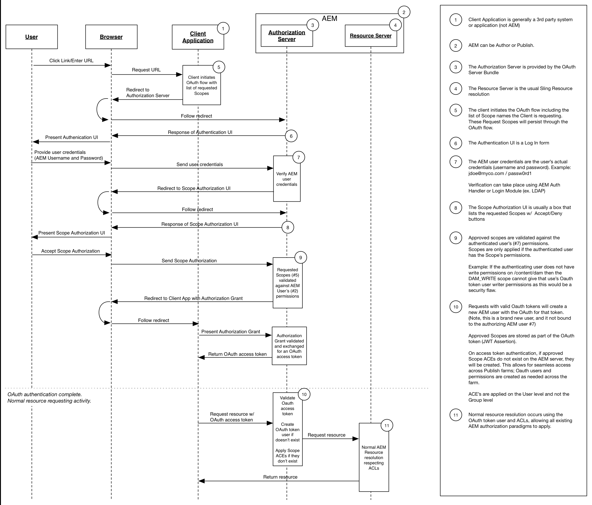

# 開發OAuth示波器

Adobe Experience Manager的可擴充OAuth範圍可讓使用者從用戶端應用程式存取資源。 下圖說明在的上下文中的請求流AEM。

AEM提供3種範圍：

* 設定檔
* 離線存取
* 複寫

可AEM擴充的OAuth範圍可讓您定義其他自訂範圍。 例如，您可以開發自訂範圍並將其部署AEM至，讓透過OAuth授權的行動應用程式只能閱讀，而不能寫入資產。

OAuth是授權用戶端應用程式的偏好方法，因為它使用存取Token，而AEM非要求提供使用者認證給該應用程式。

* [檢視程式碼](https://github.com/Adobe-Consulting-Services/acs-aem-samples/blob/legacy/bundle/src/main/java/com/adobe/acs/samples/authentication/oauth/impl/SampleScopeWithPrivileges.java)
