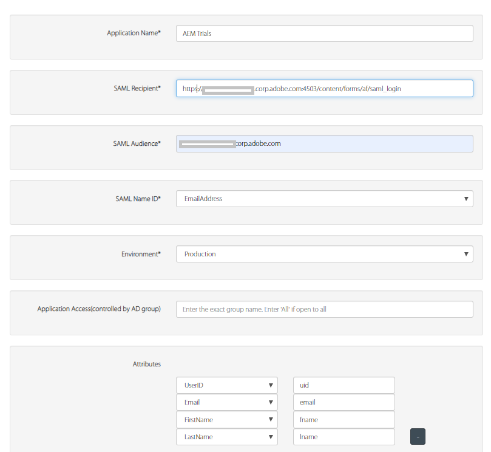

# 使用OKTA驗證AEM作者

> 另請參閱 [SAML 2.0驗證](https://experienceleague.adobe.com/docs/experience-manager-learn/cloud-service/authentication/saml-2-0.html) 以取得如何使用AEMas a Cloud Service設定OKTA的說明。

第一步是在OKTA入口網站上設定您的應用程式。 您的應用程式獲得OKTA管理員核准後，您就可以存取IdP憑證和單一登入URL。 以下是在註冊新應用程式時通常使用的設定。

* **應用程式名稱：** 這是您的應用程式名稱。 請務必為應用程式指定唯一的名稱。
* **SAML收件者：** 在從OKTA驗證之後，這是會在您的AEM執行個體上使用SAML回應點選的URL。 SAML驗證處理常式通常會使用/saml_login攔截所有URL，但最好將它附加在應用程式根之後。
* **SAML對象**：這是您應用程式的網域URL。 請勿在網域URL中使用通訊協定（http或https）。
* **SAML名稱ID：** 從下拉式清單中選取電子郵件。
* **環境**：選擇適當的環境。
* **屬性**：這些是您在SAML回應中取得關於使用者的屬性。 視需要指定。

## 將OKTA (IdP)憑證新增至AEM信任存放區

由於SAML宣告已加密，因此我們需要將IdP (OKTA)憑證新增到AEM信任存放區，以允許OKTA和AEM之間的安全通訊。
[初始化信任存放區](http://localhost:4502/libs/granite/security/content/truststore.html)，若尚未初始化。
記住信任存放區密碼。 我們稍後將需要使用此密碼。

* 導覽至 [全域信任存放區](http://localhost:4502/libs/granite/security/content/truststore.html).
* 按一下「從CER檔案新增憑證」。 新增OKTA提供的IdP憑證，然後按一下「提交」。

   >[!NOTE]
   >
   >請勿將憑證對應至任何使用者

將憑證新增至信任存放區時，您應該取得憑證別名，如下方熒幕擷圖所示。 在您的案例中，別名可能不同。

**記下憑證別名。 您需要在後續步驟中執行此操作。**

### 設定SAML驗證處理常式

導覽至 [configMgr](http://localhost:4502/system/console/configMgr).
搜尋並開啟「AdobeGranite SAML 2.0驗證處理常式」。
提供下列屬性，如下所示。以下是需要指定的主要屬性：

* **路徑**  — 這是觸發驗證處理常式的路徑
* **IdP Url**：這是您的IdP url，由OKTA提供
* **IDP憑證別名**：這是您將IdP憑證新增至AEM Trust Store時獲得的別名
* **服務提供者實體ID**：這是您的AEM伺服器的名稱
* **金鑰庫的密碼**：這是您使用的信任存放區密碼
* **預設重新導向**：這是成功驗證時重新導向到的URL
* **UserID屬性**：uid
* **使用加密**：false
* **自動建立CRX使用者**：true
* **新增至群組**：true
* **預設群組**：oktausers(這是新增使用者的群組。 您可以在AEM中提供任何現有群組)
* **NamedIDPolicy**：指定用來表示請求之主旨之名稱識別碼的限制。 複製並貼上下列醒目提示的字串 **urn:oasis:名稱:tc:SAML：2.0:nameidformat:電子郵件地址**
* **已同步屬性**  — 這些是從AEM設定檔中的SAML判斷提示儲存的屬性

### 設定Apache Sling查閱者篩選器

導覽至 [configMgr](http://localhost:4502/system/console/configMgr).
搜尋並開啟「Apache Sling反向連結篩選器」。依照下列指定內容設定下列屬性：

* **允許空白**： false
* **允許主機**： IdP的主機名稱（您的案例中會有所不同）
* **允許Regexp主機**： IdP的主機名稱（在您的情況下會不同） Sling反向連結篩選反向連結屬性熒幕擷圖

#### 設定OKTA整合的DEBUG記錄

在AEM上設定OKTA整合時，檢閱AEM SAML驗證處理常式的DEBUG記錄會很有幫助。 若要將記錄層級設定為DEBUG，請透過AEM OSGi Web Console建立新的Sling Logger設定。

請記得在測試和生產環境中移除或停用此記錄器以減少記錄雜訊。

在AEM上設定OKTA整合時，檢閱AEM SAML驗證處理常式的DEBUG記錄會很有幫助。 若要將記錄層級設定為DEBUG，請透過AEM OSGi Web Console建立新的Sling Logger設定。
**請記得在測試和生產環境中移除或停用此記錄器以減少記錄雜訊。**
* 導覽至 [configMgr](http://localhost:4502/system/console/configMgr)

* 搜尋並開啟「Apache Sling記錄器設定」
* 使用下列設定來建立記錄器：
   * **記錄層級**：偵錯
   * **記錄檔**： logs/saml.log
   * **Logger**： com.adobe.granite.auth.saml
* 按一下儲存以儲存您的設定

#### 測試您的OKTA設定

登出AEM執行個體。 請嘗試存取連結。 您應該會看到OKTA SSO的實際運作。
