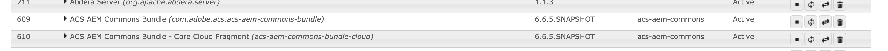

# 安裝協力廠商成品 — 無法在公共Maven存放庫中取得

瞭解如何在建置和部署AEM專案時安裝公開Maven存放庫&#x200B;*中不可用的*&#x200B;協力廠商成品。

**協力廠商成品**&#x200B;可以是：

- [OSGi套件](https://www.osgi.org/resources/architecture/)： OSGi套件是Java™封存檔案，其中包含Java類別、資源，以及說明套件及其相依性的資訊清單。
- [Java jar](https://docs.oracle.com/javase/tutorial/deployment/jar/basicsindex.html)：包含Java類別和資源的Java™封存檔案。
- [封裝](https://experienceleague.adobe.com/zh-hant/docs/experience-manager-65/content/sites/administering/contentmanagement/package-manager#what-are-packages)：封裝是包含檔案系統序列化表單之儲存庫內容的zip檔案。

## 標準案例

通常您要安裝協力廠商套件組合，*的套件可在公用Maven存放庫中*，作為您AEM專案`pom.xml`檔案中的相依性。

例如：

- [AEM WCM核心元件](https://github.com/adobe/aem-core-wcm-components) **套件**&#x200B;已新增為[WKND專案的](https://github.com/adobe/aem-guides-wknd/blob/main/pom.xml#L747-L753) `pom.xml`檔案中的相依性。 此處將`provided`範圍用作AEM執行階段所提供的AEM WCM核心元件組合。 如果AEM執行階段未提供該套件，您將會使用`compile`範圍，而且它是預設範圍。

- [共用的WKND](https://github.com/adobe/aem-guides-wknd-shared) **套件**&#x200B;已新增為[WKND專案的](https://github.com/adobe/aem-guides-wknd/blob/main/pom.xml#L767-L773) `pom.xml`檔案中的相依性。


## 罕見情況

有時在建置和部署AEM專案時，您可能需要安裝協力廠商套件組合或jar，或在&#x200B;**Maven中央存放庫**&#x200B;或[Adobe公用存放庫](https://mvnrepository.com/)中無法使用的套件[。](https://repo.adobe.com/index.html)

原因可能是：

- 套件組合或封裝是由內部團隊或第三方廠商所提供，且&#x200B;_在公用Maven存放庫_&#x200B;中無法使用。

- Java™ jar檔案&#x200B;_不是OSGi套件_，並且在公用Maven存放庫中可能會提供也可能不提供。

- 您需要的功能尚未在公共Maven存放庫中最新版本的協力廠商套件中發行。 您決定安裝本機建置的RELEASE或SNAPSHOT版本。

## 先決條件

若要按照本教學課程進行學習，您需要：

- [本機AEM開發環境](https://experienceleague.adobe.com/zh-hant/docs/experience-manager-learn/cloud-service/local-development-environment-set-up/overview)或[快速開發環境(RDE)](https://experienceleague.adobe.com/zh-hant/docs/experience-manager-learn/cloud-service/developing/rde/overview)設定。

- [AEM WKND專案](https://github.com/adobe/aem-guides-wknd) _新增協力廠商套件組合或jar或封裝_&#x200B;並驗證變更。

## 設定

- 設定AEM 6.X或AEM as a Cloud Service (AEMCS)本機開發環境或RDE環境。

- 複製並部署AEM WKND專案。

  ```
  $ git clone git@github.com:adobe/aem-guides-wknd.git
  $ cd aem-guides-wknd
  $ mvn clean install -PautoInstallPackage 
  ```

  驗證WKND網站頁面是否正確轉譯。

## 在AEM專案中安裝協力廠商套件組合{#install-third-party-bundle}

讓我們安裝並使用公開Maven存放庫[中不適用於AEM WKND專案的示範OSGi &#x200B;](./assets/install-third-party-articafcts/my-example-bundle.zip)my-example-bundle _。_

**my-example-bundle**&#x200B;匯出`HelloWorldService`個OSGi服務，其`sayHello()`方法傳回`Hello Earth!`則訊息。

如需詳細資訊，請參閱[my-example-bundle.zip](./assets/install-third-party-articafcts/my-example-bundle.zip)檔案中的README.md檔案。

### 將套件組合新增至`all`模組

第一步是將`my-example-bundle`新增到AEM WKND專案的`all`模組。

- 下載並解壓縮[my-example-bundle.zip](./assets/install-third-party-articafcts/my-example-bundle.zip)檔案。

- 在AEM WKND專案的`all`模組中，建立`all/src/main/content/jcr_root/apps/wknd-vendor-packages/container/install`目錄結構。 `/all/src/main/content`目錄已存在，您只需要建立`jcr_root/apps/wknd-vendor-packages/container/install`目錄。

- 將`my-example-bundle-1.0-SNAPSHOT.jar`檔案從擷取的`target`目錄複製到上述`all/src/main/content/jcr_root/apps/wknd-vendor-packages/container/install`目錄。

  所有模組第三方套件

### 使用套件組合中的服務

在AEM WKND專案中使用來自`HelloWorldService`的`my-example-bundle` OSGi服務。

- 在AEM WKND專案的`core`模組中，建立`SayHello.java` Sling servlet @ `core/src/main/java/com/adobe/aem/guides/wknd/core/servlet`。

  ```java
  package com.adobe.aem.guides.wknd.core.servlet;
  
  import java.io.IOException;
  
  import javax.servlet.Servlet;
  import javax.servlet.ServletException;
  
  import org.apache.sling.api.SlingHttpServletRequest;
  import org.apache.sling.api.SlingHttpServletResponse;
  import org.apache.sling.api.servlets.HttpConstants;
  import org.apache.sling.api.servlets.ServletResolverConstants;
  import org.apache.sling.api.servlets.SlingSafeMethodsServlet;
  import org.osgi.service.component.annotations.Component;
  import org.osgi.service.component.annotations.Reference;
  import com.example.services.HelloWorldService;
  
  @Component(service = Servlet.class, property = {
      ServletResolverConstants.SLING_SERVLET_PATHS + "=/bin/sayhello",
      ServletResolverConstants.SLING_SERVLET_METHODS + "=" + HttpConstants.METHOD_GET
  })
  public class SayHello extends SlingSafeMethodsServlet {
  
          private static final long serialVersionUID = 1L;
  
          // Injecting the HelloWorldService from the `my-example-bundle` bundle
          @Reference
          private HelloWorldService helloWorldService;
  
          @Override
          protected void doGet(SlingHttpServletRequest request, SlingHttpServletResponse response) throws ServletException, IOException {
              // Invoking the HelloWorldService's `sayHello` method
              response.getWriter().write("My-Example-Bundle service says: " + helloWorldService.sayHello());
          }
  }
  ```

- 在AEM WKND專案的根`pom.xml`檔案中，將`my-example-bundle`新增為相依性。

  ```xml
  ...
  <!-- My Example Bundle -->
  <dependency>
      <groupId>com.example</groupId>
      <artifactId>my-example-bundle</artifactId>
      <version>1.0-SNAPSHOT</version>
      <scope>system</scope>
      <systemPath>${maven.multiModuleProjectDirectory}/all/src/main/content/jcr_root/apps/wknd-vendor-packages/container/install/my-example-bundle-1.0-SNAPSHOT.jar</systemPath>
  </dependency>
  ...
  ```

  此處：
   - `system`範圍表示不應在公用Maven存放庫中查閱相依性。
   - `systemPath`是AEM WKND專案的`my-example-bundle`模組中的`all`檔案路徑。
   - `${maven.multiModuleProjectDirectory}`是指向多模組專案根目錄的Maven屬性。

- 在AEM WKND專案的`core`模組的`core/pom.xml`檔案中，將`my-example-bundle`新增為相依性。

  ```xml
  ...
  <!-- My Example Bundle -->
  <dependency>
      <groupId>com.example</groupId>
      <artifactId>my-example-bundle</artifactId>
  </dependency>
  ...
  ```

- 使用以下命令建置和部署AEM WKND專案：

  ```
  $ mvn clean install -PautoInstallPackage
  ```

- 存取瀏覽器中的URL `SayHello`，以驗證`http://localhost:4502/bin/sayhello` Servlet是否如預期般運作。

- 將上述變更提交至AEM WKND專案的存放庫。 然後執行Cloud Manager管道，驗證RDE或AEM環境中的變更。

  

AEM WKND專案的[tutorial/install-3rd-party-bundle](https://github.com/adobe/aem-guides-wknd/compare/main...tutorial/install-3rd-party-bundle)分支有上述變更供您參考。

### 重要學習{#key-learnings-bundle}

公共Maven存放庫中未提供的OSGi套件組合可按照以下步驟安裝在AEM專案中：

- 將OSGi套件組合複製到`all`模組的`jcr_root/apps/<PROJECT-NAME>-vendor-packages/container/install`目錄。 封裝套件並將套件部署至AEM執行個體時，必須執行此步驟。

- 更新根與核心模組的`pom.xml`檔案，將OSGi套件組合新增為相依性，且範圍和`system`指向套件組合檔案。 `systemPath`此步驟是編譯專案的必要步驟。

## 在AEM專案中安裝協力廠商jar

在此範例中，`my-example-jar`不是OSGi套件組合，而是Java jar檔案。

讓我們安裝並使用示範[my-example-jar](./assets/install-third-party-articafcts/my-example-jar.zip)，該示範&#x200B;_在公開Maven存放庫_&#x200B;中不適用於AEM WKND專案。

**my-example-jar**&#x200B;是Java jar檔案，其中包含具有`MyHelloWorldService`方法的`sayHello()`類別，可傳回`Hello World!`訊息。

如需詳細資訊，請參閱[my-example-jar.zip](./assets/install-third-party-articafcts/my-example-jar.zip)檔案中的README.md檔案。

### 將jar新增到`all`模組

第一步是將`my-example-jar`新增到AEM WKND專案的`all`模組。

- 下載並解壓縮[my-example-jar.zip](./assets/install-third-party-articafcts/my-example-jar.zip)檔案。

- 在AEM WKND專案的`all`模組中，建立`all/resource/jar`目錄結構。

- 將`my-example-jar-1.0-SNAPSHOT.jar`檔案從擷取的`target`目錄複製到上述`all/resource/jar`目錄。

  所有模組第三方jar

### 使用jar中的服務

讓我們在AEM WKND專案中使用`MyHelloWorldService`中的`my-example-jar`。

- 在AEM WKND專案的`core`模組中，建立`SayHello.java` Sling servlet @ `core/src/main/java/com/adobe/aem/guides/wknd/core/servlet`。

  ```java
  package com.adobe.aem.guides.wknd.core.servlet;
  
  import java.io.IOException;
  
  import javax.servlet.Servlet;
  import javax.servlet.ServletException;
  
  import org.apache.sling.api.SlingHttpServletRequest;
  import org.apache.sling.api.SlingHttpServletResponse;
  import org.apache.sling.api.servlets.HttpConstants;
  import org.apache.sling.api.servlets.ServletResolverConstants;
  import org.apache.sling.api.servlets.SlingSafeMethodsServlet;
  import org.osgi.service.component.annotations.Component;
  
  import com.my.example.MyHelloWorldService;
  
  @Component(service = Servlet.class, property = {
          ServletResolverConstants.SLING_SERVLET_PATHS + "=/bin/sayhello",
          ServletResolverConstants.SLING_SERVLET_METHODS + "=" + HttpConstants.METHOD_GET
  })
  public class SayHello extends SlingSafeMethodsServlet {
  
      private static final long serialVersionUID = 1L;
  
      @Override
      protected void doGet(SlingHttpServletRequest request, SlingHttpServletResponse response)
              throws ServletException, IOException {
  
          // Creating an instance of MyHelloWorldService
          MyHelloWorldService myHelloWorldService = new MyHelloWorldService();
  
          // Invoking the MyHelloWorldService's `sayHello` method
          response.getWriter().write("My-Example-JAR service says: " + myHelloWorldService.sayHello());
      }
  }    
  ```

- 在AEM WKND專案的根`pom.xml`檔案中，將`my-example-jar`新增為相依性。

  ```xml
  ...
  <!-- My Example JAR -->
  <dependency>
      <groupId>com.my.example</groupId>
      <artifactId>my-example-jar</artifactId>
      <version>1.0-SNAPSHOT</version>
      <scope>system</scope>
      <systemPath>${maven.multiModuleProjectDirectory}/all/resource/jar/my-example-jar-1.0-SNAPSHOT.jar</systemPath>
  </dependency>            
  ...
  ```

  此處：
   - `system`範圍表示不應在公用Maven存放庫中查閱相依性。
   - `systemPath`是AEM WKND專案的`my-example-jar`模組中的`all`檔案路徑。
   - `${maven.multiModuleProjectDirectory}`是指向多模組專案根目錄的Maven屬性。

- 在AEM WKND專案的`core`模組的`core/pom.xml`檔案中，進行兩項變更：

   - 將`my-example-jar`新增為相依性。

     ```xml
     ...
     <!-- My Example JAR -->
     <dependency>
         <groupId>com.my.example</groupId>
         <artifactId>my-example-jar</artifactId>
     </dependency>
     ...
     ```

   - 更新`bnd-maven-plugin`設定以將`my-example-jar`包含在正在建置的OSGi套件組合(aem-guides-wknd.core)中。

     ```xml
     ...
     <plugin>
         <groupId>biz.aQute.bnd</groupId>
         <artifactId>bnd-maven-plugin</artifactId>
         <executions>
             <execution>
                 <id>bnd-process</id>
                 <goals>
                     <goal>bnd-process</goal>
                 </goals>
                 <configuration>
                     <bnd><![CDATA[
                 Import-Package: javax.annotation;version=0.0.0,*
                 <!-- Include the 3rd party jar as inline resource-->
                 -includeresource: \
                 lib/my-example-jar.jar=my-example-jar-1.0-SNAPSHOT.jar;lib:=true
                         ]]></bnd>
                 </configuration>
             </execution>
         </executions>
     </plugin>        
     ...
     ```

- 使用以下命令建置和部署AEM WKND專案：

  ```
  $ mvn clean install -PautoInstallPackage
  ```

- 存取瀏覽器中的URL `SayHello`，以驗證`http://localhost:4502/bin/sayhello` Servlet是否如預期般運作。

- 將上述變更提交至AEM WKND專案的存放庫。 然後執行Cloud Manager管道，驗證RDE或AEM環境中的變更。

  

AEM WKND專案的[tutorial/install-3rd-party-jar](https://github.com/adobe/aem-guides-wknd/compare/main...tutorial/install-3rd-party-jar)分支有上述變更可供您參考。

如果Java jar檔案&#x200B;_可在公用Maven存放庫中取得但並非OSGi套件_，您可以遵循上述步驟，但`<dependency>`的`system`範圍和`systemPath`元素不是必要專案除外。

### 重要學習{#key-learnings-jar}

非OSGi套件組合且可能在公用Maven存放庫中提供的Java Jar，可以按照以下步驟安裝在AEM專案中：

- 更新核心模組`bnd-maven-plugin`檔案中的`pom.xml`設定，將Java jar加入為正在建置的OSGi套件組合中的內嵌資源。

只有在公共Maven存放庫中沒有Java jar時，才需要執行以下步驟：

- 將Java jar複製到`all`模組的`resource/jar`目錄。

- 更新根與核心模組的`pom.xml`檔案，以將Java jar新增為相依性，具有`system`範圍和`systemPath`指向jar檔案。

## 在AEM專案中安裝協力廠商套件

讓我們安裝從主要分支本機建置的[ACS AEM Commons](https://adobe-consulting-services.github.io/acs-aem-commons/) _SNAPSHOT_&#x200B;版本。

它完全只是為了示範安裝公共Maven存放庫中沒有的AEM套件的步驟。

ACS AEM Commons套件可在公共Maven存放庫中取得。 請參閱[將ACS AEM Commons新增至您的AEM Maven專案](https://adobe-consulting-services.github.io/acs-aem-commons/pages/maven.html)，將其新增至您的AEM專案。

### 將套件新增至`all`模組

第一步是將套件新增到AEM WKND專案的`all`模組。

- 從POM檔案註解或移除ACS AEM Commons版本相依性。 請參閱[將ACS AEM Commons新增至您的AEM Maven專案](https://adobe-consulting-services.github.io/acs-aem-commons/pages/maven.html)以識別相依性。

- 將`master`ACS AEM Commons存放庫[的](https://github.com/Adobe-Consulting-Services/acs-aem-commons)分支複製到您的本機電腦。

- 使用以下命令建置ACS AEM Commons SNAPSHOT版本：

  ```
  $mvn clean install
  ```

- 本機建置的封裝位於@ `all/target`，有兩個.zip檔案，其中一個結尾是`-cloud`，適用於AEM as a Cloud Service，另一個則適用於AEM 6.X。

- 在AEM WKND專案的`all`模組中，建立`all/src/main/content/jcr_root/apps/wknd-vendor-packages/container/install`目錄結構。 `/all/src/main/content`目錄已存在，您只需要建立`jcr_root/apps/wknd-vendor-packages/container/install`目錄。

- 將本機建置的套件(.zip)檔案複製到`/all/src/main/content/jcr_root/apps/mysite-vendor-packages/container/install`目錄。

- 使用以下命令建置和部署AEM WKND專案：

  ```
  $ mvn clean install -PautoInstallPackage
  ```

- 驗證已安裝的ACS AEM Commons套件：

   - CRX封裝管理員@ `http://localhost:4502/crx/packmgr/index.jsp`

     

   - OSGi主控台@ `http://localhost:4502/system/console/bundles`

     

- 將上述變更提交至AEM WKND專案的存放庫。 然後執行Cloud Manager管道，驗證RDE或AEM環境中的變更。

### 重要學習{#key-learnings-package}

公共Maven存放庫中沒有的AEM套件可以按照以下步驟安裝在AEM專案中：

- 將封裝複製到`all`模組的`jcr_root/apps/<PROJECT-NAME>-vendor-packages/container/install`目錄。 若要封裝套件並將其部署到AEM執行個體，此步驟是必要的。


## 摘要

在本教學課程中，您已瞭解如何在建置和部署AEM專案時，安裝公開Maven存放庫中不可用的協力廠商成品（套件組合、Java jar和套件）。
