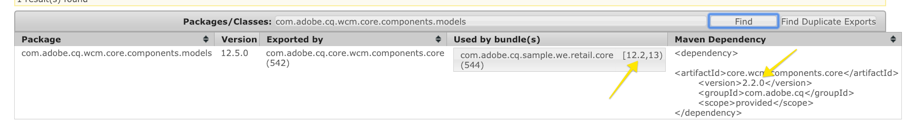

# 設定本機AEM開發環境

設定Adobe Experience Manager、AEM本機開發的指南。 涵蓋本機安裝、Apache Maven、整合開發環境和除錯/疑難排解等重要主題。 開發方式 **[!DNL Eclipse IDE], [!DNL CRXDE Lite], [!DNL Visual Studio Code] 和[!DNL IntelliJ]** 中的所有參數。

## 總覽

設定本機開發環境是為Adobe Experience Manager或AEM開發時的第一步。 請花時間設定品質開發環境，以提高生產力並更快撰寫更好的程式碼。 我們可將AEM的當地開發環境分為4個方面：

* 本機AEM例項
* [!DNL Apache Maven] 專案
* 整合開發環境(IDE)
* 疑難排解

## 安裝本機AEM例項

當我們參考本機AEM執行個體時，就是指開發人員個人電腦上執行的Adobe Experience Manager副本。 ***全部*** AEM開發應從針對本機AEM例項撰寫和執行程式碼開始。

若您是初次使用AEM，則可安裝兩種基本執行模式： ***作者*** 和 ***發佈***. 此 ***作者*** [runmode](https://helpx.adobe.com/experience-manager/6-5/sites/deploying/using/configure-runmodes.html)  是數位行銷人員用來建立和管理內容的環境。 開發時 **most** 將程式碼部署至Author例項的次數。 這可讓您建立新頁面，以及新增和設定元件。 AEM Sites是WYSIWYG製作CMS，因此大部分的CSS和JavaScript都可針對製作例項進行測試。

也是 *關鍵* 針對本機測試程式碼 ***發佈*** 例項。 此 ***發佈*** 例項是訪客將與您網站互動的AEM環境。 若 ***發佈*** 執行個體與 ***作者*** 例項中，設定和權限有一些重大差異。 程式碼應 *always* 針對本地 ***發佈*** 例項。

### 步驟

1. 確保 [Java](https://downloads.experiencecloud.adobe.com/content/software-distribution/en/general.html) 已安裝。
   * 偏好 [Java JDK 11](https://experience.adobe.com/#/downloads/content/software-distribution/en/general.html?1_group.propertyvalues.property=.%2Fjcr%3Acontent%2Fmetadata%2Fdc%3AsoftwareType&amp;1_group.propertyvalues.operation=equals&amp;1_group.propertyvalues.0_values=software-type%3Atoling&amp;orderby=%40jcr%3Acontent%2Fjcr%3AlastModified&amp;orderby.sort=desc&amp;layout=list&amp;p.offset=0&amp;p.limit=14) 適用於AEM 6.5+
   * [Java JDK 8](https://www.oracle.com/technetwork/java/javase/downloads/index.html#JDK8) 適用於AEM 6.5之前的版本
2. 取得 [AEM QuickStart Jar和 [!DNL license.properties]](https://helpx.adobe.com/experience-manager/6-5/sites/deploying/using/deploy.html#GettingtheSoftware).
3. 在電腦上建立資料夾結構，如下所示：

   ```plain
   ~/aem-sdk
       /author
       /publish
   ```

4. 重新命名 [!DNL QuickStart] JAR到 ***aem-author-p4502.jar*** 把它放在下面 `/author` 目錄。 新增 ***[!DNL license.properties]*** 檔案 `/author` 目錄。
5. 製作 [!DNL QuickStart] JAR，請將其重新命名為 ***aem-publish-p4503.jar*** 把它放在下面 `/publish` 目錄。 新增 ***[!DNL license.properties]*** 檔案 `/publish` 目錄。

   ```plain
   ~/aem-sdk
       /author
           + aem-author-p4502.jar
           + license.properties
       /publish
           + aem-publish-p4503.jar
           + license.properties
   ```

6. 按兩下 ***aem-author-p4502.jar*** 安裝檔案 **作者** 例項。 這會啟動製作執行個體，在連接埠上執行 **4502** 在本地電腦上。

   按兩下 ***aem-publish-p4503.jar*** 安裝檔案 **發佈** 例項。 這會啟動在連接埠上執行的發佈執行個體 **4503** 在本地電腦上。

   >[!NOTE]
   >
   >視您的開發機器硬體而定，要同時使用 **製作和發佈** 執行個體同時執行。 您很少需要在本機設定上同時執行兩者。

   如需詳細資訊，請參閱 [部署和維護AEM例項](https://helpx.adobe.com/experience-manager/6-5/sites/deploying/using/deploy.html).

## 安裝Apache Maven

***[!DNL Apache Maven]*** 是管理Java專案建置和部署程式的工具。 AEM是以Java為基礎的平台，且 [!DNL Maven] 是管理AEM專案程式碼的標準方式。 我們說 ***AEM Maven專案*** 或 ***AEM專案***，我們指的是包含所有 *自訂* 網站的程式碼。

所有AEM專案應以 **[!DNL AEM Project Archetype]**: [https://github.com/adobe/aem-project-archetype](https://github.com/adobe/aem-project-archetype). 此 [!DNL AEM Project Archetype] 會建立AEM專案的引導程式，其中包含一些范常式式碼和內容。 此 [!DNL AEM Project Archetype] 也包括 **[!DNL AEM WCM Core Components]** 已設定為在您的專案上使用。

>[!CAUTION]
>
>開始新專案時，最好使用最新版本的原型。 請記得原型有多個版本，並非所有版本都與舊版AEM相容。

### 步驟

1. 下載 [阿帕奇·馬文](https://maven.apache.org/download.cgi)
2. 安裝 [阿帕奇·馬文](https://maven.apache.org/install.html) 並確保已將安裝添加到命令行中 `PATH`.
   * [!DNL macOS] 使用者可使用 [荷姆布魯](https://brew.sh/)
3. 確認 **[!DNL Maven]** 通過開啟新命令行終端並執行以下操作來安裝：

   ```shell
   $ mvn --version
   Apache Maven 3.3.9
   Maven home: /Library/apache-maven-3.3.9
   Java version: 1.8.0_111, vendor: Oracle Corporation
   Java home: /Library/Java/JavaVirtualMachines/jdk1.8.0_111.jdk/Contents/Home/jre
   Default locale: en_US, platform encoding: UTF-8
   ```

   >[!NOTE]
   >
   > 在過去， `adobe-public` 需要Maven配置檔案來指出 `nexus.adobe.com` 下載AEM成品。 所有AEM成品現在可透過Maven Central和 `adobe-public` 不需要設定檔。

## 設定整合的開發環境

整合開發環境或IDE是一個應用程式，它結合了文本編輯器、語法支援和生成工具。 根據您正在執行的開發類型，一個IDE可能比另一個IDE更好。 無論IDE是什麼，定期 ***推送*** 程式碼至本機AEM例項以進行測試。 偶爾也很重要 ***提取*** 的本機AEM例項設定，以便持續存留至Git等原始碼控制系統。

以下是一些與AEM開發搭配使用的較受歡迎IDE，以及顯示與本機AEM例項整合的對應影片。

>[!NOTE]
>
> WKND專案已更新為預設，可在AEMas a Cloud Service上運作。 已更新為 [回溯相容於6.5/6.4](https://github.com/adobe/aem-guides-wknd#building-for-aem-6xx). 如果使用AEM 6.5或6.4，請附加 `classic` 配置檔案。

```shell
$ mvn clean install -PautoInstallSinglePackage -Pclassic
```

使用IDE時，請務必檢查 `classic` 在「Maven設定檔」標籤中。


*IntelliJ Maven配置檔案*

### [!DNL Eclipse] IDE

此 **[[!DNL Eclipse] IDE](https://www.eclipse.org/ide/)** 是Java開發中較常用的IDE之一，主要是因為它是開放原始碼， ***免費***! Adobe提供外掛程式， **[[!DNL AEM Developer Tools]](https://experienceleague.adobe.com/docs/experience-manager-64/developing/devtools/aem-eclipse.html)**, [!DNL Eclipse] 使用好的GUI更輕鬆地開發，以便將代碼與本地AEM實例同步。 此 [!DNL Eclipse] 對於剛接觸AEM的開發人員，建議使用IDE，這在很大程度上是因為 [!DNL AEM Developer Tools].

#### 安裝與設定

1. 下載並安裝 [!DNL Eclipse] IDE [!DNL Java EE Developers]: [https://www.eclipse.org](https://www.eclipse.org/)
1. 依照指示安裝 [!DNL AEM Developer Tools] 外掛程式： [https://experienceleague.adobe.com/docs/experience-manager-65/developing/devtools/aem-eclipse.html](https://experienceleague.adobe.com/docs/experience-manager-65/developing/devtools/aem-eclipse.html)

>[!VIDEO](https://video.tv.adobe.com/v/25906?quality=12&learn=on)

* 00:30 — 導入Maven項目
* 01:24 — 使用Maven建立和部署原始碼
* 04:33 — 使用AEM開發人員工具推送程式碼變更
* 10:55 — 使用AEM開發人員工具提取程式碼變更
* 13:12 — 使用Eclipse的整合偵錯工具

### IntelliJ IDEA

此 **[IntelliJ IDEA](https://www.jetbrains.com/idea/)** 是功能強大的IDE，用於專業Java開發。 [!DNL IntelliJ IDEA] 有兩種口味，a ***免費*** [!DNL Community] 版本和商業版（付費） [!DNL Ultimate] 版本。 免費 [!DNL Community] 版本 [!DNL IntellIJ IDEA] 足以進行更多AEM開發，但 [!DNL Ultimate] [擴展其能力集](https://www.jetbrains.com/idea/download).

#### [!DNL Installation and Setup]

1. 下載並安裝 [!DNL IntelliJ IDEA]: [https://www.jetbrains.com/idea/download](https://www.jetbrains.com/idea/download)
1. 安裝 [!DNL Repo] （命令行工具）: [https://github.com/Adobe-Marketing-Cloud/tools/tree/master/repo](https://github.com/Adobe-Marketing-Cloud/tools/tree/master/repo#installation)

>[!VIDEO](https://video.tv.adobe.com/v/26089/?quality=12&learn=on)

* 00:00 — 導入Maven項目
* 05:47 — 使用Maven建立和部署原始碼
* 08:17 — 使用存放庫推送變更
* 14:39 — 透過存放庫提取變更
* 17:25 — 使用IntelliJ IDEA的整合除錯工具

### [!DNL Visual Studio Code]

**[Visual Studio代碼](https://code.visualstudio.com/)** 已迅速成為 ***前端開發人員*** 提供增強的JavaScript支援， [!DNL Intellisense]和瀏覽器除錯支援。 **[!DNL Visual Studio Code]** 是開放原始碼、免費、有許多強大擴充功能。 [!DNL Visual Studio Code] 可進行設定，以便透過Adobe工具與AEM整合， **[repo](https://github.com/Adobe-Marketing-Cloud/tools/tree/master/repo#integration-into-visual-studio-code).** 此外，還可安裝數個社群支援的擴充功能，以與AEM整合。

[!DNL Visual Studio Code] 前端開發人員最適合用來撰寫CSS/LESS和JavaScript程式碼來建立AEM用戶端程式庫。 新的AEM開發人員可能不是最佳選擇，因為節點定義（對話方塊、元件）都需要以原始XML編輯。 有數個Java擴充功能可供 [!DNL Visual Studio Code]，但若主要執行Java開發 [!DNL Eclipse IDE] 或 [!DNL IntelliJ] 可能是首選。

#### 重要連結

* [**下載**](https://code.visualstudio.com/Download) **Visual Studio代碼**
* **[repo](https://github.com/Adobe-Marketing-Cloud/tools/tree/master/repo#integration-into-visual-studio-code)**  — 適用於JCR內容的類似FTP工具
* **[aemfed](https://aemfed.io/)**  — 加速AEM前端工作流程
* **[AEM同步](https://marketplace.visualstudio.com/items?itemName=Yinkai15.aemsync)**  — 支援社群&#42; Visual Studio Code的擴充功能

>[!VIDEO](https://video.tv.adobe.com/v/25907?quality=12&learn=on)

* 00:30 — 導入Maven項目
* 00:53 — 使用Maven建立和部署原始碼
* 04:03 — 使用Repo命令列工具推送程式碼變更
* 08:29 — 使用Repo命令列工具提取程式碼變更
* 10:40 — 使用修正工具推送程式碼變更
* 14:24 — 疑難排解，重建用戶端程式庫

### [!DNL CRXDE Lite]

[CRXDE Lite](https://helpx.adobe.com/experience-manager/6-4/sites/developing/using/developing-with-crxde-lite.html) 是AEM存放庫的瀏覽器檢視。 [!DNL CRXDE Lite] 內嵌於AEM中，可讓開發人員執行標準開發工作，例如編輯檔案、定義元件、對話方塊和範本。 [!DNL CRXDE Lite] is ***not*** 本意是提供完整的開發環境，但作為偵錯工具非常有效。 [!DNL CRXDE Lite] 在擴充或只是了解程式碼基底以外的產品程式碼時，此功能相當實用。 [!DNL CRXDE Lite] 提供存放庫的強大檢視，以及有效測試及管理權限的方法。

[!DNL CRXDE Lite] 應始終與其他IDE一起使用，以測試和調試代碼，但絕不作為主要開發工具。 它的語法支援有限，沒有自動完成功能，與原始碼控制管理系統的整合有限。

>[!VIDEO](https://video.tv.adobe.com/v/25917?quality=12&learn=on)

## 疑難排解

***說明!*** 我的程式碼沒用！ 和所有開發一樣，有時候（可能有許多次）您的程式碼無法如預期運作。 AEM是一個強大的平台，但擁有強大的功能……複雜性極強。 以下是疑難排解和追蹤問題的幾個高階起點（但遠非可能出錯的完整清單）:

### 驗證代碼部署

遇到問題時，最好的第一步是確認程式碼已部署並成功安裝至AEM。

1. **檢查 [!UICONTROL 封裝管理員]** 若要確保已上傳並安裝程式碼套件： [http://localhost:4502/crx/packmgr/index.jsp](http://localhost:4502/crx/packmgr/index.jsp). 檢查時間戳以驗證最近安裝了該包。
1. 如果使用 [!DNL Repo] 或 [!DNL AEM Developer Tools], **check[!DNL CRXDE Lite]** 檔案已推送至本機AEM執行個體，且檔案內容已更新： [http://localhost:4502/crx/de/index.jsp](http://localhost:4502/crx/de/index.jsp)
1. **檢查是否已上傳套件組合** 在OSGi套件中看到與Java程式碼相關的問題時。 開啟 [!UICONTROL Adobe Experience Manager Web Console]: [http://localhost:4502/system/console/bundles](http://localhost:4502/system/console/bundles) 並搜尋您的套件。 確認套件組合具有 **[!UICONTROL 作用中]** 狀態。 如需疑難排解 **[!UICONTROL 已安裝]** 狀態。

#### 檢查日誌

AEM是一個動態平台，會在 **error.log**. 此 **error.log** 可在已安裝AEM的位置找到：&lt; `aem-installation-folder>/crx-quickstart/logs/error.log`.

追蹤問題的實用技巧是在Java程式碼中新增log陳述式：

```java
import org.slf4j.Logger;
import org.slf4j.LoggerFactory;
...

public class MyClass {
    private final Logger log = LoggerFactory.getLogger(getClass());

    ...

    String myVariable = "My Variable";

    log.debug("Debug statement of myVariable {}", myVariable);

    log.info("Info statement of myVariable {}", myVariable);
}
```

依預設， **error.log** 配置為日誌 *[!DNL INFO]* 報表。 如果您想要變更記錄層級，請前往 [!UICONTROL 記錄支援]: [http://localhost:4502/system/console/slinglog](http://localhost:4502/system/console/slinglog). 您也會發現 **error.log** 太閒了。 您可以使用 [!UICONTROL 記錄支援] 為指定的Java包配置日誌語句。 這是專案的最佳作法，可輕鬆將自訂程式碼問題與OOTB AEM平台問題區隔開來。


#### 套件組合處於「已安裝」狀態 {#bundle-active}

所有套件組合（排除片段）應位於 **[!UICONTROL 作用中]** 狀態。 若您在 [!UICONTROL 已安裝] 然後，就有需要解決的問題。 多數情況下，這是相依性問題：


在上方的螢幕擷取中， [!DNL WKND Core bundle] 是 [!UICONTROL 已安裝] 狀態。 這是因為套件組合預期的是不同版本的 `com.adobe.cq.wcm.core.components.models` 的值。 AEM例項上提供。

可使用的實用工具為 [!UICONTROL 相依性尋找器]: [http://localhost:4502/system/console/depfinder](http://localhost:4502/system/console/depfinder). 新增Java套件名稱以檢查AEM例項上可用的版本：



在上述範例中，我們可以看到安裝在AEM例項上的版本為 **12.2** vs **12.6** 那個捆綁包的期望。 從這裡，您可以回溯工作，查看 [!DNL Maven] AEM上的相依性符合 [!DNL Maven] AEM專案中的相依性。 在上述範例中 [!DNL Core Components] **v2.2.0** 安裝在AEM例項上，但程式碼套件組合是以 **v2.2.2**，因此是相依性問題的原因。

#### 驗證Sling模型註冊 {#osgi-component-sling-models}

AEM元件應一律以 [!DNL Sling Model] 封裝任何商業邏輯，並確保HTL轉譯指令碼保持乾淨。 如果遇到無法找到Sling模型的問題，檢查 [!DNL Sling Models] 從主控台： [http://localhost:4502/system/console/status-slingmodels](http://localhost:4502/system/console/status-slingmodels). 這會告訴您是否已註冊Sling模型，以及系結的資源類型（元件路徑）。


顯示 [!DNL Sling Model], `BylineImpl` 連結至元件資源類型 `wknd/components/content/byline`.

#### CSS或JavaScript問題

對於大部分的CSS和JavaScript問題，使用瀏覽器的開發工具是疑難排解的最有效方式。 若要針對AEM製作例項進行開發時縮小問題，檢視頁面「已發佈」會很有幫助。


開啟 [!UICONTROL 頁面屬性] 按一下 [!UICONTROL 檢視為已發佈]. 這會在未使用AEM編輯器且將查詢參數設為的情況下開啟頁面 **wcmmode=disabled**. 這可有效停用AEM編寫UI，並讓疑難排解/偵錯前端問題更輕鬆。

開發前端程式碼時，另一個常見的問題是CSS/JS正在載入，這是舊有或過時的問題。 首先，請確定瀏覽器歷史記錄已清除，並視需要啟動無痕瀏覽器或全新工作階段。

#### 調試客戶端庫

使用不同的類別和內嵌方法來包含多個用戶端程式庫，疑難排解可能會很麻煩。 AEM會公開數種工具，以提供相關協助。 最重要的工具之一是 [!UICONTROL 重建客戶端庫] 這將強制AEM重新編譯任何LESS檔案並生成CSS。

* [轉儲庫](http://localhost:4502/libs/granite/ui/content/dumplibs.html)  — 列出在AEM例項中註冊的所有用戶端程式庫。 &lt;host>/libs/granite/ui/content/dumplibs.html
* [測試輸出](http://localhost:4502/libs/granite/ui/content/dumplibs.test.html)  — 允許用戶根據類別查看clientlib的預期HTML輸出。 &lt;host>/libs/granite/ui/content/dumplibs.test
* [庫依賴項驗證](http://localhost:4502/libs/granite/ui/content/dumplibs.validate.html)  — 突出顯示找不到的任何依賴項或嵌入類別。 &lt;host>/libs/granite/ui/content/dumplibs.validate
* [重建客戶端庫](http://localhost:4502/libs/granite/ui/content/dumplibs.rebuild.html)  — 可讓使用者強制AEM重建所有用戶端程式庫，或使用戶端程式庫的快取無效。 此工具在使用LESS進行開發時特別有效，因為這可能會強迫AEM重新編譯產生的CSS。 一般而言，使快取無效，然後執行頁面重新整理或重建所有程式庫會更有效。 &lt;host>/libs/granite/ui/content/dumplibs.rebuild


>[!NOTE]
>
>如果您持續必須使用 [!UICONTROL 重建客戶端庫] 工具可能值得執行一次重建所有用戶端程式庫。 這可能需要約15分鐘，但通常可避免日後的快取問題。
