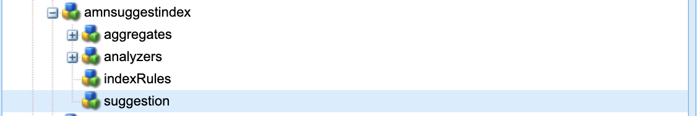

# 在AEM中編制索引最佳實務

瞭解如何在Adobe Experience Manager (AEM)中編制索引最佳實務。 Apache [Jackrabbit Oak](https://jackrabbit.apache.org/oak/docs/query/query.html)為AEM中的內容搜尋提供支援，以下是關鍵點：

- AEM提供各種開箱即用的索引，以支援搜尋和查詢功能，例如`damAssetLucene`、`cqPageLucene`等。
- 所有索引定義都儲存在`/oak:index`節點下的儲存庫中。
- AEM as a Cloud Service僅支援Oak Lucene索引。
- 索引設定應在AEM專案程式碼庫中管理，並使用Cloud Manager CI/CD管道進行部署。
- 如果特定查詢有多個索引可供使用，則會使用預估成本最低的&#x200B;**索引**。
- 如果指定的查詢沒有可用的索引，則會周遊內容樹以尋找相符的內容。 不過，透過`org.apache.jackrabbit.oak.query.QueryEngineSettingsService`的預設限制是僅遍歷100,000個節點。
- 查詢的結果最後&#x200B;**篩選為**&#x200B;以確保目前的使用者具有讀取存取權。 這表示查詢結果可能小於索引節點的數目。
- 在索引定義變更之後重新索引存放庫，需要時間，而且取決於存放庫的大小。

若要使用有效率且正確的搜尋功能而不會影響AEM執行個體的效能，請務必瞭解建立索引的最佳實務。

## 自訂與OOTB索引

有時候，您必須建立自訂索引以支援您的搜尋需求。 但在建立自訂索引之前，請遵循以下准則：

- 瞭解搜尋需求，並檢查OOTB索引是否可支援搜尋需求。 透過Developer Console或&#x200B;**使用**&#x200B;查詢效能工具[&#x200B; (位於](http://localhost:4502/libs/granite/operations/content/diagnosistools/queryPerformance.html)本機SDK`https://author-pXXXX-eYYYY.adobeaemcloud.com/ui#/aem/libs/granite/operations/content/diagnosistools/queryPerformance.html?appId=aemshell`和AEMCS)。

- 定義最佳查詢，使用[最佳化查詢](https://experienceleague.adobe.com/en/docs/experience-manager-cloud-service/content/operations/query-and-indexing-best-practices)流程圖和[JCR查詢速查表](https://experienceleague.adobe.com/docs/experience-manager-65/assets/JCR_query_cheatsheet-v1.1.pdf)以作參考。

- 如果OOTB索引不支援搜尋需求，您有兩個選擇。 但是，檢閱建立有效索引的[提示](https://experienceleague.adobe.com/zh-hant/docs/experience-manager-65/content/implementing/deploying/practices/best-practices-for-queries-and-indexing)
   - 自訂OOTB索引：方便維護和升級的偏好選項。
   - 完全自訂索引：前提是上述選項無法運作。

### 自訂OOTB索引

- 在&#x200B;**AEMCS**&#x200B;中，自訂OOTB索引時，使用&#x200B;**\&lt;OOTBIndexName>-\&lt;productVersion>-custom-\&lt;customVersion>**&#x200B;命名慣例。 例如，`cqPageLucene-custom-1`或`damAssetLucene-8-custom-1`。 這有助於在OOTB索引更新時合併自訂索引定義。 如需詳細資訊，請參閱[對現成可用索引的變更](https://experienceleague.adobe.com/zh-hant/docs/experience-manager-cloud-service/content/operations/indexing)。

- 在&#x200B;**AEM 6.X**&#x200B;中，上述命名&#x200B;_無法運作_，不過只需在`indexRules`節點中以&#39;b6&#39;7d要屬性更新OOTB索引即可。

- 一律使用CRX DE封裝管理員(/crx/packmgr/)從AEM執行個體複製最新的OOTB索引定義，重新命名並在XML檔案中新增自訂。

- 將索引定義儲存在`ui.apps/src/main/content/jcr_root/_oak_index`的AEM專案中，並使用Cloud Manager CI/CD管道進行部署。 如需詳細資訊，請參閱[部署自訂索引定義](https://experienceleague.adobe.com/zh-hant/docs/experience-manager-cloud-service/content/operations/indexing)。

### 完全自訂索引

建立完全自訂索引必須是您的最後一個選項，而且前提是上述選項無法運作。

- 建立完全自訂的索引時，請使用&#x200B;**\&lt;prefix>。\&lt;customIndexName>-\&lt;version>-custom-\&lt;customVersion>**&#x200B;命名慣例。 例如 `wknd.adventures-1-custom-1`。這有助於避免命名衝突。 在這裡，`wknd`是前置詞，`adventures`是自訂索引名稱。 此慣例適用於AEM 6.X和AEMCS，並有助於為未來移轉至AEMCS做好準備。

- AEMCS僅支援Lucene索引，因此為了準備未來移轉至AEMCS，請一律使用Lucene索引。 如需詳細資訊，請參閱[Lucene索引與屬性索引](https://experienceleague.adobe.com/zh-hant/docs/experience-manager-65/content/implementing/deploying/practices/best-practices-for-queries-and-indexing)。

- 避免在與OOTB索引相同的節點型別上建立自訂索引。 請改為使用`indexRules`節點中的必要屬性自訂OOTB索引。 例如，請勿在`dam:Asset`節點型別上建立自訂索引，而是自訂OOTB `damAssetLucene`索引。 _這是效能和功能問題的常見根本原因_。

- 同時，請避免在索引規則(`cq:Page`)節點下新增多個節點型別，例如`cq:Tag`和`indexRules`。 請改為為每個節點型別建立個別的索引。

- 如上節所述，將索引定義儲存在`ui.apps/src/main/content/jcr_root/_oak_index`的AEM專案中，並使用Cloud Manager CI/CD管道進行部署。 如需詳細資訊，請參閱[部署自訂索引定義](https://experienceleague.adobe.com/zh-hant/docs/experience-manager-cloud-service/content/operations/indexing)。

- 索引定義准則為：
   - 節點型別(`jcr:primaryType`)應為`oak:QueryIndexDefinition`
   - 索引型別(`type`)應為`lucene`
   - 非同步屬性(`async`)應為`async,nrt`
   - 使用`includedPaths`並避免`excludedPaths`屬性。 一律將`queryPaths`值設定為與`includedPaths`值相同的值。
   - 若要強制執行路徑限制，請使用`evaluatePathRestrictions`屬性並將其設定為`true`。
   - 使用`tags`屬性標籤索引，並在查詢時指定此標籤值以使用索引。 一般查詢語法為`<query> option(index tag <tagName>)`。

  ```xml
  /oak:index/wknd.adventures-1-custom-1
      - jcr:primaryType = "oak:QueryIndexDefinition"
      - type = "lucene"
      - compatVersion = 2
      - async = ["async", "nrt"]
      - includedPaths = ["/content/wknd"]
      - queryPaths = ["/content/wknd"]
      - evaluatePathRestrictions = true
      - tags = ["customAdvSearch"]
  ...
  ```

### 範例

為了瞭解最佳實務，讓我們檢閱幾個範例。

#### 不當使用標籤屬性

下圖顯示自訂和OOTB索引定義，反白顯示`tags`屬性，兩個索引都使用相同的`visualSimilaritySearch`值。


##### 分析

這是不正確使用自訂索引上的`tags`屬性。 Oak查詢引擎會在OOTB索引原因上挑選自訂索引，造成最低的估計成本。

正確的方法是自訂OOTB索引並在`indexRules`節點中新增必要的屬性。 如需詳細資訊，請參閱[自訂OOTB索引](#customize-the-ootb-index)。

#### `dam:Asset`節點型別上的索引

下圖顯示`dam:Asset`節點型別的自訂索引，其中`includedPaths`屬性設定為特定路徑。

dam索引

##### 分析

如果您在Assets上執行Omnisearch，則會傳回錯誤結果，因為自訂索引的估計成本較低。

請勿在`dam:Asset`節點型別上建立自訂索引，但請使用`damAssetLucene`節點中的必要屬性自訂OOTB `indexRules`索引。

#### 索引規則下的多個節點型別

下圖顯示`indexRules`節點下具有多個節點型別的自訂索引。


##### 分析

不建議在單一索引中新增多個節點型別，但是，如果節點型別緊密相關，例如`cq:Page`和`cq:PageContent`，則可以在相同索引中索引節點型別。

有效的解決方案是自訂OOTB `cqPageLucene`和`damAssetLucene`索引，在現有`indexRules`節點下新增必要的屬性。

#### 缺少`queryPaths`屬性

下圖顯示沒有`queryPaths`屬性的自訂索引（也不遵循命名慣例）。


##### 分析

一律將`queryPaths`值設定為與`includedPaths`值相同的值。 此外，若要強制執行路徑限制，請將`evaluatePathRestrictions`屬性設定為`true`。

#### 使用索引標籤進行查詢

下圖顯示具有`tags`屬性的自訂索引，以及查詢時如何使用它。


```
/jcr:root/content/dam//element(*,dam:Asset)[(jcr:content/@contentFragment = 'true' and jcr:contains(., '/content/sitebuilder/test/mysite/live/ja-jp/mypage'))]order by @jcr:created descending option (index tag assetPrefixNodeNameSearch)
```

##### 分析

示範如何在索引上設定非衝突並修正`tags`屬性值，並在查詢時使用它。 一般查詢語法為`<query> option(index tag <tagName>)`。 另請參閱[查詢選項索引標籤](https://jackrabbit.apache.org/oak/docs/query/query-engine.html#query-option-index-tag)

#### 自訂索引

下圖顯示具有`suggestion`個節點的自訂索引，用以實現進階搜尋功能。



##### 分析

為[進階搜尋](https://jackrabbit.apache.org/oak/docs/query/lucene.html#advanced-search-features)功能建立自訂索引是有效的使用案例。 但是，索引名稱應接在&#x200B;**\&lt;prefix>之後。\&lt;customIndexName>-\&lt;version>-custom-\&lt;customVersion>**&#x200B;命名慣例。

## 停用Apache Tika以最佳化索引

AEM使用[Apache Tika](https://tika.apache.org/)從檔案&#x200B;_型別(如PDF、Word、Excel等)擷取中繼資料和文字內容_。 擷取的內容會儲存在存放庫中，並由Oak Lucene索引編制索引。

有時使用者不需要在檔案/資產的內容中搜尋的能力，在這種情況下，您可以透過停用Apache Tika來改善索引效能。 優點包括：

- 更快的索引
- 索引大小縮減
- 減少硬體使用量

>[!CAUTION]
>
>在停用Apache Tika之前，請確定搜尋需求不需要在資產內容中搜尋的能力。


### 依MIME型別停用

若要依mime型別停用Apache Tika，請執行以下步驟：

- 在自訂或OOBT索引定義下新增`tika`型別的`nt:unstructured`節點。 在下列範例中，已針對OOTB `damAssetLucene`索引停用PDF MIME型別。

```xml
/oak:index/damAssetLucene
    - jcr:primaryType = "oak:QueryIndexDefinition"
    - type = "lucene"
    ...
    <tika jcr:primaryType="nt:unstructured">
        <config.xml/>
    </tika>
```

- 在`config.xml`節點下新增包含以下詳細資料的`tika`。

```xml
<properties>
  <parsers>
    <parser class="org.apache.tika.parser.EmptyParser">
      <mime>application/pdf</mime>
      <!-- Add more mime types to disable -->
  </parsers>
</properties>
```

- 若要重新整理已儲存的索引，請在索引定義節點下將`refresh`屬性設定為`true`，如需詳細資訊，請參閱[索引定義屬性](https://jackrabbit.apache.org/oak/docs/query/lucene.html#index-definition:~:text=Defaults%20to%2010000-,refresh,-Optional%20boolean%20property)。

下圖顯示具有`damAssetLucene`節點和`tika`檔案的OOTB `config.xml`索引，該索引會停用PDF和其他mime型別。

具有tika節點的

### 完全停用

若要完全停用Apache Tika，請遵循以下步驟：

- 在`includePropertyTypes`新增`/oak:index/<INDEX-NAME>/indexRules/<NODE-TYPE>`屬性並將值設定為`String`。 例如，在下圖中，已為OOBT `includePropertyTypes`索引的`dam:Asset`節點型別新增`damAssetLucene`屬性。


- 在`data`節點底下新增具有下列屬性的`properties`，確定它是屬性定義上方的第一個節點。 例如，請參閱以下影像：

```xml
/oak:index/<INDEX-NAME>/indexRules/<NODE-TYPE>/properties/data
    - jcr:primaryType = "nt:unstructured"
    - type = "String"
    - name = "jcr:data"
    - nodeScopeIndex = false
    - propertyIndex = false
    - analyze = false
```


- 透過在索引定義節點底下將`reindex`屬性設定為`true`，重新索引更新的索引定義。

## 實用工具

讓我們來看看有助於您定義、分析和最佳化索引的幾項工具。

### 索引建立工具和Oak工具

[Oak Index Definition Generator](https://thomasmueller.github.io/oakTools/indexDefGenerator.html)工具可協助&#x200B;**根據輸入查詢產生索引定義**。 這是建立自訂索引的良好起點。

[Oak工具](https://thomasmueller.github.io/oakTools/index.html)也包含其他
和索引和查詢相關的公用程式，例如在JSON和XML格式之間轉換索引，
將XPath查詢轉換為SQL-2並比較索引。

### 查詢效能工具

可透過Developer Console或&#x200B;_在_&#x200B;本機SDK[和AEMCS取得的OOTB &#x200B;](http://localhost:4502/libs/granite/operations/content/diagnosistools/queryPerformance.html)查詢效能工具`https://author-pXXXX-eYYYY.adobeaemcloud.com/ui#/aem/libs/granite/operations/content/diagnosistools/queryPerformance.html?appId=aemshell`可協助&#x200B;**分析查詢效能**&#x200B;和[JCR查詢速查表](https://experienceleague.adobe.com/docs/experience-manager-65/assets/JCR_query_cheatsheet-v1.1.pdf?lang=en)以定義最佳查詢。

### 疑難排解工具和提示

以下大部分適用於AEM 6.X和本機疑難排解。

- 索引管理員可在`http://host:port/libs/granite/operations/content/diagnosistools/indexManager.html`取得，以取得型別、上次更新時間、大小等索引資訊。

- 透過`org.apache.jackrabbit.oak.plugins.index`詳細記錄Oak查詢和索引相關的Java™套件（例如`org.apache.jackrabbit.oak.query`、`com.day.cq.search`和`http://host:port/system/console/slinglog`）以進行疑難排解。

- _IndexStats_&#x200B;型別的JMX MBean可在`http://host:port/system/console/jmx`取得，以取得與非同步索引相關的索引資訊，例如狀態、進度或統計資料。 它還提供&#x200B;_FailingIndexStats_，如果此處沒有結果，則表示沒有索引損毀。 AsyncIndexerService會將任何在30分鐘內無法更新的索引（可設定）標籤為已損毀，並停止對其進行索引。 如果查詢沒有提供預期的結果，開發人員在繼續重新索引之前檢視此內容會很有幫助，因為重新索引的計算成本高昂且耗時。

- _LuceneIndex_&#x200B;型別的JMX MBean可在`http://host:port/system/console/jmx`用於Lucene索引統計資料，例如大小、每個索引定義的檔案數。

- 在&#x200B;_可用於Oak查詢統計資料的_ QueryStat`http://host:port/system/console/jmx`型別的JMX MBean，包含具有查詢、執行時間等詳細資訊的緩慢和常見查詢。

## 其他資源

如需詳細資訊，請參閱下列檔案：

- [Oak查詢和索引](https://experienceleague.adobe.com/zh-hant/docs/experience-manager-65/content/implementing/deploying/deploying/queries-and-indexing)
- [查詢和建立索引最佳做法](https://experienceleague.adobe.com/en/docs/experience-manager-cloud-service/content/operations/query-and-indexing-best-practices)
- [查詢和建立索引的最佳實務](https://experienceleague.adobe.com/zh-hant/docs/experience-manager-65/content/implementing/deploying/practices/best-practices-for-queries-and-indexing)

