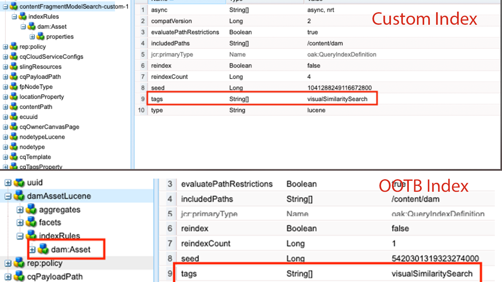

# 在AEM中編制索引最佳實務

瞭解如何在Adobe Experience Manager (AEM)中編制索引最佳實務。 Apache [Jackrabbit Oak](https://jackrabbit.apache.org/oak/docs/query/query.html) 為AEM中的內容搜尋提供支援，以下是關鍵點：

- AEM提供各種立即可用的索引，以支援搜尋和查詢功能，例如 `damAssetLucene`， `cqPageLucene` 及更多內容。
- 所有索引定義都儲存在下的儲存庫中 `/oak:index` 節點。
- AEMas a Cloud Service僅支援Oak Lucene索引。
- 索引設定應在AEM專案程式碼庫中管理，並使用Cloud Manager CI/CD管道進行部署。
- 如果給定查詢有多個索引可用，則 **使用預估成本最低的索引**.
- 如果指定的查詢沒有可用的索引，則會周遊內容樹以尋找相符的內容。 然而，預設限制透過 `org.apache.jackrabbit.oak.query.QueryEngineSettingsService` 是僅遍歷10,0000個節點。
- 查詢的結果為 **最後已篩選** 以確保目前的使用者具有讀取存取權。 這表示查詢結果可能小於索引節點的數目。
- 在索引定義變更之後重新索引存放庫，需要時間，而且取決於存放庫的大小。

若要擁有有效率且正確的搜尋功能以不會影響AEM執行個體的效能，瞭解索引最佳實務很重要。

## 自訂與OOTB索引

有時候，您必須建立自訂索引以支援您的搜尋需求。 但在建立自訂索引之前，請遵循以下准則：

- 瞭解搜尋需求，並檢查OOTB索引是否可支援搜尋需求。 使用 **查詢效能工具**，位於 [本機SDK](http://localhost:4502/libs/granite/operations/content/diagnosistools/queryPerformance.html) 和AEM CS透過開發者控制檯或 `https://author-pXXXX-eYYYY.adobeaemcloud.com/ui#/aem/libs/granite/operations/content/diagnosistools/queryPerformance.html?appId=aemshell`.

- 定義最佳查詢，使用 [正在最佳化查詢](https://experienceleague.adobe.com/docs/experience-manager-cloud-service/content/operations/query-and-indexing-best-practices.html?#optimizing-queries) 流程圖和 [JCR查詢速查表](https://experienceleague.adobe.com/docs/experience-manager-65/assets/JCR_query_cheatsheet-v1.1.pdf?lang=en) 以供參考。

- 如果OOTB索引不支援搜尋需求，您有兩個選擇。 然而，請檢閱 [建立有效索引的秘訣](https://experienceleague.adobe.com/docs/experience-manager-65/content/implementing/deploying/practices/best-practices-for-queries-and-indexing.html?#should-i-create-an-index)
   - 自訂OOTB索引：方便維護和升級的偏好選項。
   - 完全自訂索引：前提是上述選項無法運作。

### 自訂OOTB索引

- 在 **AEMCS**，自訂OOTB索引時，請使用 **\&lt;ootbindexname>-\&lt;productversion>-custom-\&lt;customversion>** 命名慣例。 例如， `cqPageLucene-custom-1` 或 `damAssetLucene-8-custom-1`. 這有助於在OOTB索引更新時合併自訂索引定義。 另請參閱 [現成可用索引的變更](https://experienceleague.adobe.com/docs/experience-manager-cloud-service/content/operations/indexing.html?#changes-to-out-of-the-box-indexes) 以取得更多詳細資料。

- 在 **AEM 6.X**，上述命名 _無法運作_，但只要使用 `indexRules` 節點。

- 一律使用CRX DE封裝管理員(/crx/packmgr/)從AEM執行個體複製最新的OOTB索引定義，重新命名並在XML檔案中新增自訂。

- 將索引定義儲存在AEM專案中的 `ui.apps/src/main/content/jcr_root/_oak_index` 並使用Cloud Manager CI/CD管道將其部署。 另請參閱 [部署自訂索引定義](https://experienceleague.adobe.com/docs/experience-manager-cloud-service/content/operations/indexing.html?#deploying-custom-index-definitions) 以取得更多詳細資料。

### 完全自訂索引

建立完全自訂索引必須是您的最後一個選項，而且前提是上述選項無法運作。

- 建立完全自訂的索引時，請使用 **\&lt;prefix>.\&lt;customindexname>-\&lt;version>-custom-\&lt;customversion>** 命名慣例。 例如 `wknd.adventures-1-custom-1`。這有助於避免命名衝突。 此處， `wknd` 是前置詞和 `adventures` 是自訂索引名稱。 此慣例適用於AEM 6.X和AEMCS，並有助於為未來移轉至AEMCS做好準備。

- AEMCS僅支援Lucene索引，因此為了準備未來移轉至AEMCS，請一律使用Lucene索引。 另請參閱 [Lucene索引與屬性索引](https://experienceleague.adobe.com/docs/experience-manager-65/content/implementing/deploying/practices/best-practices-for-queries-and-indexing.html?#lucene-or-property-indexes) 以取得更多詳細資料。

- 避免在與OOTB索引相同的節點型別上建立自訂索引。 請改為使用中的其他屬性來自訂OOTB索引。 `indexRules` 節點。 例如，請勿在 `dam:Asset` 節點型別但自訂OOTB `damAssetLucene` 索引。 _這是效能和功能問題的常見根本原因_.

- 此外，請避免新增多個節點型別 `cq:Page` 和 `cq:Tag` 在索引規則底下(`indexRules`)節點。 請改為為每個節點型別建立個別的索引。

- 如上一節所述，將索引定義儲存在AEM專案中的 `ui.apps/src/main/content/jcr_root/_oak_index` 並使用Cloud Manager CI/CD管道將其部署。 另請參閱 [部署自訂索引定義](https://experienceleague.adobe.com/docs/experience-manager-cloud-service/content/operations/indexing.html?#deploying-custom-index-definitions) 以取得更多詳細資料。

- 索引定義准則為：
   - 節點型別(`jcr:primaryType`)應為 `oak:QueryIndexDefinition`
   - 索引型別(`type`)應為 `lucene`
   - 非同步屬性(`async`)應為 `async,nrt`
   - 使用 `includedPaths` 並避免 `excludedPaths` 屬性。 一律設定 `queryPaths` 值與的相同值 `includedPaths` 值。
   - 若要強制執行路徑限制，請使用 `evaluatePathRestrictions` 屬性並將其設為 `true`.
   - 使用 `tags` 屬性以標籤索引，而在查詢時指定此標籤值以使用索引。 一般查詢語法為 `<query> option(index tag <tagName>)`.

  ```xml
  /oak:index/wknd.adventures-1-custom-1
      - jcr:primaryType = "oak:QueryIndexDefinition"
      - type = "lucene"
      - compatVersion = 2
      - async = ["async", "nrt"]
      - includedPaths = ["/content/wknd"]
      - queryPaths = ["/content/wknd"]
      - evaluatePathRestrictions = true
      - tags = ["customAdvSearch"]
  ...
  ```

### 範例

為了瞭解最佳實務，讓我們檢閱幾個範例。

#### 不當使用標籤屬性

下圖顯示自訂和OOTB索引定義，並醒目提示 `tags` 屬性，兩個索引使用相同 `visualSimilaritySearch` 值。



##### 分析

這是不當使用 `tags` 自訂索引上的屬性。 Oak查詢引擎會在OOTB索引上挑選自訂索引，因為預估成本最低。

正確的方式是自訂OOTB索引，並在 `indexRules` 節點。 另請參閱 [自訂OOTB索引](#customize-the-ootb-index) 以取得更多詳細資料。

#### 索引於 `dam:Asset` 節點型別

下圖顯示「 」的自訂索引 `dam:Asset` 具有的節點型別 `includedPaths` 屬性設定為特定路徑。


##### 分析

如果您在「資產」上執行Omnisearch，則會傳回錯誤結果，導致自訂索引的估計成本較低。

請勿在上建立自訂索引 `dam:Asset` 節點型別但自訂OOTB `damAssetLucene` 索引中還有其他屬性 `indexRules` 節點。

#### 索引規則下的多個節點型別

下圖顯示「 」下有多重節點型別的自訂索引 `indexRules` 節點。


##### 分析

不建議在單一索引中新增多個節點型別，但是，如果節點型別密切相關(例如 `cq:Page` 和 `cq:PageContent`.

有效的解決方案是自訂OOTB `cqPageLucene` 和 `damAssetLucene` 索引，在現有屬性下新增其他屬性 `indexRules` 節點。

#### 不存在 `queryPaths` 屬性

下圖顯示自訂索引（也不遵循命名慣例），但不包含 `queryPaths` 屬性。


##### 分析

一律設定 `queryPaths` 值與的相同值 `includedPaths` 值。 此外，若要強制實施路徑限制，請設定 `evaluatePathRestrictions` 屬性至 `true`.

#### 使用索引標籤進行查詢

下圖顯示自訂索引： `tags` 屬性，以及如何在查詢時使用它。


```
/jcr:root/content/dam//element(*,dam:Asset)[(jcr:content/@contentFragment = 'true' and jcr:contains(., '/content/sitebuilder/test/mysite/live/ja-jp/mypage'))]order by @jcr:created descending option (index tag assetPrefixNodeNameSearch)
```

##### 分析

示範如何設定無衝突且正確 `tags` 索引上的屬性值，並在查詢時使用它。 一般查詢語法為 `<query> option(index tag <tagName>)`. 另請參閱 [查詢選項索引標籤](https://jackrabbit.apache.org/oak/docs/query/query-engine.html#query-option-index-tag)

#### 自訂索引

下圖顯示自訂索引： `suggestion` 取得進階搜尋功能的節點。


##### 分析

為建立自訂索引是有效的使用案例 [進階搜尋](https://jackrabbit.apache.org/oak/docs/query/lucene.html#advanced-search-features) 功能。 不過，索引名稱應跟隨在 **\&lt;prefix>.\&lt;customindexname>-\&lt;version>-custom-\&lt;customversion>** 命名慣例。


## 實用工具

讓我們來看看有助於您定義、分析和最佳化索引的幾項工具。

### 索引建立工具

此 [Oak索引定義產生器](https://oakutils.appspot.com/generate/index) 工具協助 **產生索引定義** 根據輸入查詢而定。 這是建立自訂索引的良好起點。

### 分析索引工具

此 [索引定義分析器](https://oakutils.appspot.com/analyze/index) 工具協助 **分析索引定義** 並提供改善索引定義的建議。

### 查詢效能工具

OOTB _查詢效能工具_ 可用位置 [本機SDK](http://localhost:4502/libs/granite/operations/content/diagnosistools/queryPerformance.html) 和AEM CS透過開發者控制檯或 `https://author-pXXXX-eYYYY.adobeaemcloud.com/ui#/aem/libs/granite/operations/content/diagnosistools/queryPerformance.html?appId=aemshell` 協助 **分析查詢效能** 和 [JCR查詢速查表](https://experienceleague.adobe.com/docs/experience-manager-65/assets/JCR_query_cheatsheet-v1.1.pdf?lang=en) 以定義最佳查詢。

### 疑難排解工具和提示

以下大多數適用於AEM 6.X和本機疑難排解。

- 索引管理員位於 `http://host:port/libs/granite/operations/content/diagnosistools/indexManager.html` 用於取得索引資訊，例如型別、上次更新、大小。

- 詳細記錄Oak查詢和索引相關的Java™套件，例如 `org.apache.jackrabbit.oak.plugins.index`， `org.apache.jackrabbit.oak.query`、和 `com.day.cq.search` via `http://host:port/system/console/slinglog` 以進行疑難排解。

- 的JMX MBean _索引統計資料_ 型別位於 `http://host:port/system/console/jmx` 用於取得與非同步索引相關的索引資訊，例如狀態、進度或統計資料。 它也提供 _FailingIndexStats_，如果沒有結果，表示沒有索引損毀。 AsyncIndexerService會將任何在30分鐘內無法更新的索引（可設定）標籤為已損毀，並停止對其進行索引。 如果查詢沒有提供預期的結果，開發人員在繼續重新索引之前檢視此內容會很有幫助，因為重新索引的計算成本高昂且耗時。

- 的JMX MBean _LuceneIndex_ 型別位於 `http://host:port/system/console/jmx` 用於Lucene索引統計資料，例如大小、每個索引定義的檔案數。

- 的JMX MBean _QueryStat_ 型別位於 `http://host:port/system/console/jmx` 用於Oak查詢統計資料，包括緩慢和熱門的查詢，其詳細資訊如查詢、執行時間。

## 其他資源

如需詳細資訊，請參閱下列檔案：

- [Oak查詢和索引](https://experienceleague.adobe.com/docs/experience-manager-65/content/implementing/deploying/deploying/queries-and-indexing.html)
- [查詢和建立索引最佳做法](https://experienceleague.adobe.com/docs/experience-manager-cloud-service/content/operations/query-and-indexing-best-practices.html)
- [查詢和建立索引的最佳實務](https://experienceleague.adobe.com/docs/experience-manager-65/content/implementing/deploying/practices/best-practices-for-queries-and-indexing.html)
