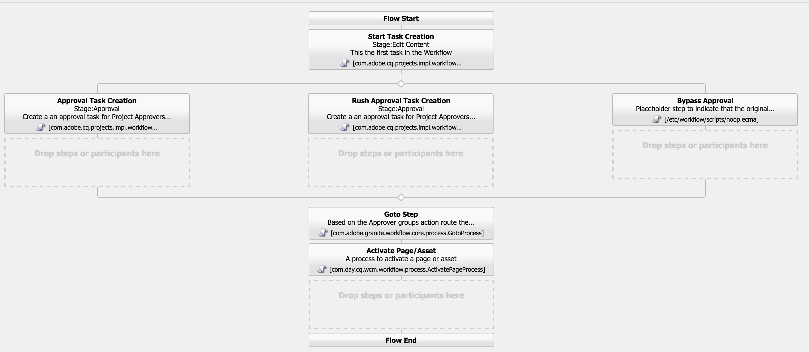

# 開發項AEM目

本開發教程介紹如何開發 [!DNL AEM Projects]。  在本教程中，我們將建立一個自定義項目模板，可用於在中建立新項目，以AEM管理內容創作工作流和任務。

>[!VIDEO](https://video.tv.adobe.com/v/16904?quality=12&learn=on)

*此視頻簡要演示了在以下教程中建立的已完成工作流。*

## 簡介 {#introduction}

[[!DNL AEM Projects]](https://helpx.adobe.com/experience-manager/6-5/sites/authoring/using/projects.html) 是一項功能，旨AEM在使管理和分組與內容建立相關的所有工作流和任務變得更容易，並將其作為AEM Sites或資產實施的一部分。

項AEM目附帶 [OOTB項目模板](https://helpx.adobe.com/experience-manager/6-5/sites/authoring/using/projects.html#ProjectTemplates)。 建立新項目時，作者可以從這些可用模板中進行選擇。 具有獨AEM特業務需求的大型實施將希望建立定制項目模板，以滿足其需求。 通過建立自定義項目模板，開發人員可以配置項目儀表板、掛接到自定義工作流，以及為項目建立其他業務角色。 我們將查看項目模板的結構並建立示例模板。


## 設定

本教程將逐步介紹建立自定義項目模板所需的代碼。 您可以下載並安裝 [附件](./assets/develop-aem-projects/projects-tasks-guide.ui.apps-0.0.1-SNAPSHOT.zip) 到本地環境，以隨附本教程。 您還可以訪問托管於的完整Maven項目 [GitHub](https://github.com/Adobe-Marketing-Cloud/aem-guides/tree/feature/projects-tasks-guide)。

* [已完成的教程包](./assets/develop-aem-projects/projects-tasks-guide.ui.apps-0.0.1-SNAPSHOT.zip)
* [GitHub上的完整代碼儲存庫](https://github.com/Adobe-Marketing-Cloud/aem-guides/tree/feature/projects-tasks-guide)

本教程假定您對 [AEM開發實踐](https://helpx.adobe.com/tw/experience-manager/6-5/sites/developing/using/the-basics.html) 和一些熟悉 [AEMMaven項目設定](https://helpx.adobe.com/tw/experience-manager/6-5/sites/developing/using/ht-projects-maven.html)。 所提到的所有代碼都用作引用，並且只應部署到 [地方開發實AEM例](https://helpx.adobe.com/experience-manager/6-5/sites/deploying/using/deploy.html#GettingStarted)。

## 項目模板的結構

項目模板應置於原始碼管理之下，並應位於/apps下的應用程式資料夾下。 理想情況下，應將它們放置在具有命名約定的子資料夾中 **&#42;/projects/templates/**&lt;my-template>。 通過按照此命名約定放置任何新的自定義模板，在建立項目時，這些模板將自動可供作者使用。 可用項目模板的配置設定為： **/content/projects/jcr：內容** 節點 **cq:allowed模板** 屬性。 預設情況下，這是規則運算式： **/(apps|libs)/。&#42;/projects/templates/。&#42;**

項目模板的根節點將具有 **jcr:primaryType** 共 **cq：模板**。 根節點下面有3個節點： **小玩意兒**。 **角色**, **工作流**。 這些節點都是 **nt：非結構化**。 根節點下還可以是thumbnail.png檔案，在「建立項目」嚮導中選擇模板時，該檔案將顯示。

完整節點結構：

```shell
/apps/<my-app>
    + projects (nt:folder)
         + templates (nt:folder)
              + <project-template-root> (cq:Template)
                   + gadgets (nt:unstructured)
                   + roles (nt:unstructured)
                   + workflows (nt:unstructured)
```

### 項目模板根

項目模板的根節點的類型 **cq：模板**。 在此節點上，您可以配置屬性 **jcr：標題** 和 **jcr：說明** 在建立項目嚮導中顯示。 還有個屬性叫 **嚮導** 指向將填充項目屬性的窗體。 預設值： **/libs/cq/core/content/projects/wizard/steps/defaultproject.html** 對於大多數情況，應該可以正常工作，因為它允許用戶填充基本的項目屬性並添加組成員。

*&#42;請注意，「建立項目嚮導」不使用SlingPOSTservlet。 而是將值發佈到自定義Servlet:**com.adobe.cq.projects.impl.servlet.ProjectServlet**。 添加自定義欄位時應考慮這一點。*

可以找到翻譯項目模板的自定義嚮導示例： **/libs/cq/core/content/projects/wizard/translationproject/defaultproject**。

### 小工具 {#gadgets}

此節點上沒有其他屬性，但小工具節點的子項控制在建立新項目時，項目磁貼填充到項目的儀表板中。 [項目磁貼](https://helpx.adobe.com/experience-manager/6-5/sites/authoring/using/projects.html#ProjectTiles) （也稱為小工具或莢）是填充項目工作區的簡單卡。 ootb磁貼的完整清單可在以下位置找到：**/libs/cq/gui/components/projects/admin/pod。 **項目所有者在建立項目後始終可以添加/刪除磁貼。

### 角色 {#roles}

有3個 [預設角色](https://helpx.adobe.com/experience-manager/6-5/sites/authoring/using/projects.html#UserRolesinaProject) 針對每個項目： **觀察員**。 **編輯**, **所有者**。 通過在角色節點下添加子節點，您可以為模板添加其他特定於業務的項目角色。 然後，可以將這些角色與與項目關聯的特定工作流關聯。

### 工作流程 {#workflows}

建立自定義項目模板的最誘人原因之一是，它使您能夠配置可用的工作流以供項目使用。 這些可以是OOTB工作流或自定義工作流。 在 **工作流** 那裡需要一個 **模型** 節點 `nt:unstructured`)和子節點下指定可用的工作流模型。 屬性**modelId **指向/etc/workflow下的工作流模型和屬性 **嚮導** 指向啟動工作流時使用的對話框。 「項目」的一大優勢是能夠添加一個自定義對話框（嚮導），以在工作流開始時捕獲特定於業務的元資料，這些元資料可以驅動工作流中的進一步操作。

```shell
<projects-template-root> (cq:Template)
    + workflows (nt:unstructured)
         + models (nt:unstructured)
              + <workflow-model> (nt:unstructured)
                   - modelId = points to the workflow model
                   - wizard = dialog used to start the workflow
```

## 建立項目模板 {#creating-project-template}

由於我們主要是複製/配置節點，因此我們將使用CRXDE Lite。 在您的本AEM地實例中開啟 [CRXDE Lite](http://localhost:4502/crx/de/index.jsp)。

1. 首先在下面建立新資料夾 `/apps/&lt;your-app-folder&gt;` 命名 `projects`。 在名為的資料夾下建立另一個資料夾 `templates`。

   ```shell
   /apps/aem-guides/projects-tasks/
                       + projects (nt:folder)
                                + templates (nt:folder)
   ```

1. 為了簡化操作，我們將從現有的「簡單項目」模板啟動自定義模板。

   1. 複製並貼上節點 **/libs/cq/core/content/projects/templates/default** 在下面 *模板* 資料夾。

   ```shell
   /apps/aem-guides/projects-tasks/
                + templates (nt:folder)
                     + default (cq:Template)
   ```

1. 你現在應該有一條 **/apps/aem指南/項目 — 任務/項目/模板/創作 — 項目**。

   1. 編輯 **jcr：標題** 和 **jcr：說明** author-project節點到自定義標題和說明值的屬性。

      1. 離開 **嚮導** 指向預設項目屬性的屬性。

   ```shell
   /apps/aem-guides/projects-tasks/projects/
            + templates (nt:folder)
                 + authoring-project (cq:Template)
                      - jcr:title = "Authoring Project"
                      - jcr:description = "A project to manage approval and publish process for AEM Sites or Assets"
                      - wizard = "/libs/cq/core/content/projects/wizard/steps/defaultproject.html"
   ```

1. 對於此項目模板，我們要使用「任務」。
   1. 添加新 **nt：非結構化** 創作項目/小工具下的節點 **任務**。
   1. 將字串屬性添加到任務節點 **卡重量** = &quot;100&quot;, **jcr：標題**=「任務」，和 **sling:resourceType**=&quot;cq/gui/元件/項目/admin/pod/taskpod&quot;。

   現在 [任務平鋪](https://experienceleague.adobe.com/docs/#Tasks) 將在建立新項目時預設顯示。

   ```shell
   ../projects/templates/authoring-project
       + gadgets (nt:unstructured)
            + team (nt:unstructured)
            + asset (nt:unstructured)
            + work (nt:unstructured)
            + experiences (nt:unstructured)
            + projectinfo (nt:unstructured)
            ..
            + tasks (nt:unstructured)
                 - cardWeight = "100"
                 - jcr:title = "Tasks"
                 - sling:resourceType = "cq/gui/components/projects/admin/pod/taskpod"
   ```

1. 我們將向項目模板添加一個自定義審批者角色。

   1. 在項目模板（創作 — 項目）節點下添加新 **nt：非結構化** 節點 **角色**。
   1. 添加其他 **nt：非結構化** 節點將批准者標籤為角色節點的子節點。
   1. 添加字串屬性 **jcr：標題** = &quot;**批准者**&quot; **卷類** =&quot;**所有者**&quot; **羅勒**=&quot;**批准者**。
      1. 批准者節點的名稱以及jcr:title和roleid可以是任何字串值（只要roleid是唯一的）。
      1. **卷類** 根據 [3個OOTB角色](https://docs.adobe.com/docs/en/aem/6-3/author/projects.html#User%20Roles%20in%20a%20Project): **所有者**。 **編輯器**, **觀察**。
      1. 通常，如果自定義角色更像管理角色，則角色類可以 **所有者；** 如果它是比較具體的創作角色，如攝影師或設計師，則 **編輯器** roleclass應該足夠。 兩者之間的巨大差異 **所有者** 和 **編輯器** 項目所有者可以更新項目屬性並向項目添加新用戶。

   ```shell
   ../projects/templates/authoring-project
       + gadgets (nt:unstructured)
       + roles (nt:unstructured)
           + approvers (nt:unstructured)
                - jcr:title = "Approvers"
                - roleclass = "owner"
                - roleid = "approver"
   ```

1. 通過複製「簡單項目」模板，您將配置4個OOTB工作流。 工作流/模型下的每個節點都指向特定工作流和該工作流的啟動對話框嚮導。 在本教程的後面，我們將為此項目建立一個自定義工作流。 現在，刪除工作流/模型下的節點：

   ```shell
   ../projects/templates/authoring-project
       + gadgets (nt:unstructured)
       + roles (nt:unstructured)
       + workflows (nt:unstructured)
            + models (nt:unstructured)
               - (remove ootb models)
   ```

1. 為了使內容作者更容易識別項目模板，您可以添加自定義縮略圖。 建議大小為319x319像素。
   1. 在CRXDE Lite中，將新檔案建立為名為的小工具、角色和工作流節點的同級 **縮略圖.png**。
   1. 保存，然後導航到 `jcr:content` 並按兩下 `jcr:data` 屬性（避免按一下「view」）。
      1. 這將提示您進行編輯 `jcr:data` 檔案對話框，您可以上載自定義縮略圖。

   ```shell
   ../projects/templates/authoring-project
       + gadgets (nt:unstructured)
       + roles (nt:unstructured)
       + workflows (nt:unstructured)
       + thumbnail.png (nt:file)
   ```

已完成項目模板的XML表示：

```xml
<?xml version="1.0" encoding="UTF-8"?>
<jcr:root xmlns:sling="http://sling.apache.org/jcr/sling/1.0" xmlns:cq="http://www.day.com/jcr/cq/1.0" xmlns:jcr="http://www.jcp.org/jcr/1.0" xmlns:nt="http://www.jcp.org/jcr/nt/1.0"
    jcr:description="A project to manage approval and publish process for AEM Sites or Assets"
    jcr:primaryType="cq:Template"
    jcr:title="Authoring Project"
    ranking="{Long}1"
    wizard="/libs/cq/core/content/projects/wizard/steps/defaultproject.html">
    <jcr:content
        jcr:primaryType="nt:unstructured"
        detailsHref="/projects/details.html"/>
    <gadgets jcr:primaryType="nt:unstructured">
        <team
            jcr:primaryType="nt:unstructured"
            jcr:title="Team"
            sling:resourceType="cq/gui/components/projects/admin/pod/teampod"
            cardWeight="60"/>
        <tasks
            jcr:primaryType="nt:unstructured"
            jcr:title="Tasks"
            sling:resourceType="cq/gui/components/projects/admin/pod/taskpod"
            cardWeight="100"/>
        <work
            jcr:primaryType="nt:unstructured"
            jcr:title="Workflows"
            sling:resourceType="cq/gui/components/projects/admin/pod/workpod"
            cardWeight="80"/>
        <experiences
            jcr:primaryType="nt:unstructured"
            jcr:title="Experiences"
            sling:resourceType="cq/gui/components/projects/admin/pod/channelpod"
            cardWeight="90"/>
        <projectinfo
            jcr:primaryType="nt:unstructured"
            jcr:title="Project Info"
            sling:resourceType="cq/gui/components/projects/admin/pod/projectinfopod"
            cardWeight="100"/>
    </gadgets>
    <roles jcr:primaryType="nt:unstructured">
        <approvers
            jcr:primaryType="nt:unstructured"
            jcr:title="Approvers"
            roleclass="owner"
            roleid="approvers"/>
    </roles>
    <workflows
        jcr:primaryType="nt:unstructured"
        tags="[]">
        <models jcr:primaryType="nt:unstructured">
        </models>
    </workflows>
</jcr:root>
```

## 測試自定義項目模板

現在，我們可以通過建立新項目來test項目模板。

1. 您應將自定義模板視為項目建立選項之一。

   

1. 選擇自定義模板後，按一下「下一步」，並注意在填充項目成員時，可以將其添加為批准者角色。

   

1. 按一下「建立」以基於自定義模板完成項目建立。 在「項目儀表板」上，您會發現「任務平鋪」和在小工具下配置的其他平鋪會自動顯示。

   


## 為什麼選擇工作流？

通常AEM以批准流程為中心的工作流都使用「參與者」工作流步驟。 收件AEM箱包括有關任務和工作流的詳細資訊，以及與項目的增強AEM整合。 這些功能使使用「項目建立任務」流程步驟更具吸引力。

### 為什麼選擇任務？

將任務建立步驟與傳統的參與者步驟相比，具有以下幾個優點：

* **開始和到期日**  — 使作者能夠輕鬆管理其時間，新的日曆功能可利用這些日期。
* **優先順序**  — 內置「低」、「正常」和「高」的優先順序，使作者能夠排定工作的優先順序
* **串接注釋**  — 作者在完成一項任務時，他們有能力留下評論，從而增加協作
* **可見性**  — 任務磁貼和「項目」視圖允許經理查看時間的花費
* **項目整合**  — 任務已與項目角色和儀表板整合

與「參與者」(Participant)步驟一樣，可以動態分配和路由任務。 任務元資料（如標題、優先順序）也可以根據前面的操作動態設定，正如我們在以下教程中看到的那樣。

雖然任務比參與者步驟有一些優勢，但它們確實會帶來額外的開銷，並且在項目之外沒有這麼有用。 此外，必須使用ecma指令碼對Task的所有動態行為進行編碼，這些指令碼具有自己的限制。

## 用例要求示例 {#goals-tutorial}


上圖概述了我們的示例審批工作流的高級要求。

第一步是建立一個任務以完成對內容的編輯。 我們將允許工作流啟動器選擇第一個任務的受分配者。

完成第一項任務後，受分配人將有三個選擇來路由工作流：

**常規* — 常規路由建立分配給項目審批人組的任務，以進行審核和審批。 任務的優先順序為「正常」，到期日期為建立後的5天。

**拉什**  — 緊急傳送還會建立分配給項目審批人組的任務。 任務的優先順序為「高」，到期日僅為1天。

**旁路**  — 在此示例工作流中，初始參與者具有繞過審批組的選項。 （是的，這可能會破壞「批准」工作流的目的，但它允許我們說明其他路由功能）

批准者組可以批准內容或將內容發回初始受分配者以重新處理。 如果被發回以進行重新工作，則會建立新任務並相應地標籤為「返回以進行重新工作」。

工作流的最後一步利用otb 「激活頁面/資產」流程步驟並複製負載。

## 建立工作流模型

1. 從「開始」AEM菜單導航至「工具」 — >「工作流」 — >「模型」。 按一下右上角的「建立」(Create)以建立新的工作流模型。

   給新模型一個標題：「內容審批工作流」和URL名稱：「內容批准 — 工作流」。

   

   有關詳細資訊，請參閱 [在此處建立工作流](https://helpx.adobe.com/experience-manager/6-5/sites/developing/using/workflows-models.html)。

1. 作為最佳做法，應將自定義工作流分組到/etc/workflow/models下的自己資料夾中。 在CRXDE Lite中建立新 **「nt:folder」** 在/etc/workflow/models下 **&quot;AEM嚮導&quot;**。 添加子資料夾可確保在升級或Service Pack安裝期間不會意外覆蓋自定義工作流。

   &#42;請注意，不要將資料夾或自定義工作流放在otb子資料夾下，因為整個子資料夾也可能被升級或服務包覆蓋。

   

   6.3中工作流模型的位置

   >[!NOTE]
   >
   >如果使AEM用6.4+，則工作流的位置已更改。 請參閱 [以獲取詳細資訊。](https://helpx.adobe.com/experience-manager/6-5/sites/developing/using/workflows-best-practices.html#LocationsWorkflowModels)

   如果使AEM用6.4+，將在 `/conf/global/settings/workflow/models`。 使用/conf目錄重複上述步驟，並添加名為 `aem-guides` 然後移動 `content-approval-workflow` 在它下面。

   
6.4+中工作流模型的位置

1. 6.3中介AEM紹的功能是將工作流階段添加到給定工作流。 這些階段將從「工作流資訊」(Workflow Info)頁籤的「收件箱」(Inbox)中顯示給用戶。 它將向用戶顯示工作流中的當前階段以及前後階段。

   要配置階段，請從SideKick開啟「頁面屬性」對話框。 第四個頁籤標為「階段」。 添加以下值以配置此工作流的三個階段：

   1. 編輯內容
   1. 批准
   1. 發佈

   

   從「頁面屬性」對話框配置工作流階段。

   

   從「收件箱」(Inbox)中看到的工作流進AEM度欄。

   （可選）您可以上載 **影像** 到「頁面屬性」(Page Properties)，當用戶選擇該屬性時，該屬性用作工作流縮略圖。 影像尺寸應為319x319像素。 添加 **說明** 當用戶選擇工作流時，「頁面屬性」也會顯示。

1. 「建立項目任務」工作流流程旨在將「任務」作為工作流中的一個步驟進行建立。 只有完成任務後，工作流才會向前移動。 「建立項目任務」步驟的一個功能強大的方面是，它可以讀取工作流元資料值並使用這些值動態建立任務。

   首先刪除預設建立的「參與者步驟」。 從「元件」菜單中的「側腳」展開 **&quot;項目&quot;** 子標題並拖放 **&quot;建立項目任務&quot;** 到模型上。

   按兩下「建立項目任務」步驟以開啟工作流對話框。 配置以下屬性：

   此頁籤對所有工作流進程步驟都是常用的，我們將設定「標題」(Title)和「說明」(Description)（這些對最終用戶不可見）。 我們要設定的重要屬性是工作流階段 **&quot;編輯內容&quot;** 的下界。

   ```shell
   Common Tab
   -----------------
       Title = "Start Task Creation"
       Description = "This the first task in the Workflow"
       Workflow Stage = "Edit Content"
   ```

   「建立項目任務」工作流流程旨在將「任務」作為工作流中的一個步驟進行建立。 「任務」(Task)頁籤允許我們設定任務的所有值。 在我們的情況下，我們希望受分配方是動態的，因此我們將其留空。 其餘的屬性值：

   ```shell
   Task Tab
   -----------------
       Name* = "Edit Content"
       Task Priority = "Medium"
       Description = "Edit the content and finalize for approval. Once finished submit for approval."
       Due In - Days = "2"
   ```

   路由頁籤是一個可選對話框，可指定完成任務的用戶的可用操作。 這些操作只是字串值，將保存到工作流的元資料中。 這些值可以在工作流中稍後通過指令碼和/或進程步驟來讀取，以動態地「路由」工作流。 基於 [工作流目標](#goals-tutorial) 我們將在此頁籤中添加三個操作：

   ```shell
   Routing Tab
   -----------------
       Actions =
           "Normal Approval"
           "Rush Approval"
           "Bypass Approval"
   ```

   此頁籤允許我們配置預建立任務指令碼，在建立任務之前，我們可以通過寫程式方式決定任務的各種值。 我們可以選擇將指令碼指向外部檔案或直接在對話框中嵌入短指令碼。 在本例中，我們將將「預建立任務指令碼」指向外部檔案。 在步驟5中，我們將建立該指令碼。

   ```shell
   Advanced Settings Tab
   -----------------
      Pre-Create Task Script = "/apps/aem-guides/projects/scripts/start-task-config.ecma"
   ```

1. 在上一步中，我們引用了「預建立任務指令碼」。 我們將立即建立該指令碼，在該指令碼中，我們將根據工作流元資料值&#39;&#39;的值設定任務的受分配者。**受託人**。 的 **&quot;受讓人&quot;** 值在啟動工作流時設定。 我們還將讀取工作流元資料，通過讀取「 」**taskPriority&quot;** 工作流元資料的值以及**&quot;taskDueDate&quot; **以在第一個任務到期時動態設定。

   出於組織目的，我們在應用資料夾下建立了一個資料夾，以保存所有與項目相關的指令碼： **/apps/aem指南/項目 — 任務/項目/指令碼**。 在名為的此資料夾下建立新檔案 **&quot;start-task-config.ecma&quot;**。 &#42;注意，確保start-task-config.ecma檔案的路徑與步驟4中「高級設定」頁籤中設定的路徑匹配。

   將下列內容添加為檔案內容：

   ```
   // start-task-config.ecma
   // Populate the task using values stored as workflow metadata originally posted by the start workflow wizard
   
   // set the assignee based on start workflow wizard
   var assignee = workflowData.getMetaDataMap().get("assignee", Packages.java.lang.String);
   task.setCurrentAssignee(assignee);
   
   //Set the due date for the initial task based on start workflow wizard
   var dueDate = workflowData.getMetaDataMap().get("taskDueDate", Packages.java.util.Date);
   if (dueDate != null) {
       task.setProperty("taskDueDate", dueDate);
   }
   
   //Set the priority based on start workflow wizard
   var taskPriority = workflowData.getMetaDataMap().get("taskPriority", "Medium");
   task.setProperty("taskPriority", taskPriority);
   ```

1. 定位至「內容審批工作流」。 拖放 **或拆分** 元件（在「工作流」類別下的Sidek中） **開始任務** 步驟。 在「常用」對話框上，為「3個分支」選擇單選按鈕。 OR拆分將讀取工作流元資料值 **&quot;lastTaskAction&quot;** 確定工作流的路由。 的 **&quot;lastTaskAction&quot;** 屬性設定為步驟4中配置的「路由選擇」頁籤中的一個值。 對於每個分支頁籤， **指令碼** 文本區域，其值如下：

   ```
   function check() {
   var lastAction = workflowData.getMetaDataMap().get("lastTaskAction","");
   
   if(lastAction == "Normal Approval") {
       return true;
   }
   
   return false;
   }
   ```

   ```
   function check() {
   var lastAction = workflowData.getMetaDataMap().get("lastTaskAction","");
   
   if(lastAction == "Rush Approval") {
       return true;
   }
   
   return false;
   }
   ```

   ```
   function check() {
   var lastAction = workflowData.getMetaDataMap().get("lastTaskAction","");
   
   if(lastAction == "Bypass Approval") {
       return true;
   }
   
   return false;
   }
   ```

   &#42;請注意，我們正在執行直接字串匹配以確定路由，因此在Branch指令碼中設定的值必須與步驟4中設定的路由值匹配非常重要。

1. 拖放另一個&quot;**建立項目任務**&quot;步到OR拆分下最左側的模型（分支1）。 使用以下屬性填充對話框：

   ```
   Common Tab
   -----------------
       Title = "Approval Task Creation"
       Description = "Create a an approval task for Project Approvers. Priority is Medium."
       Workflow Stage = "Approval"
   
   Task Tab
   ------------
       Name* = "Approve Content for Publish"
       Task Priority = "Medium"
       Description = "Approve this content for publication."
       Days = "5"
   
   Routing Tab - Actions
   ----------------------------
       "Approve and Publish"
       "Send Back for Revision"
   ```

   由於這是「正常批准」路由，因此任務的優先順序設定為「中」。 此外，我們為批准者組提供5天時間來完成任務。 Assignee在Task Tab上留空，因為我們將在Advanced Settings Tab中動態分配此值。 完成此任務時，我們會為批准者組提供兩條可能的路由： **&quot;批准和發佈&quot;** 如果他們批准了內容，則可以發佈和 **&quot;發送回修訂版&quot;** 如果有問題需要原始編輯更正。 審批人可以留下注釋，原始編輯將查看工作流是否返回給他/她。

在本教程的前面，我們建立了一個包含批准者角色的項目模板。 每次從此模板建立新項目時，都會為批准者角色建立特定於項目的組。 就像「參與者步驟」一樣，任務只能分配給用戶或組。 我們要將此任務分配給與批准者組對應的項目組。 從項目中啟動的所有工作流都將具有元資料，該元資料會將項目角色映射到項目特定組。

複製+在 **指令碼** **「高級設定」**頁籤的文本區域。 此代碼將讀取工作流元資料並將任務分配給項目的批准者組。 如果找不到批准者組值，則返回給管理員組分配任務。

```
var projectApproverGrp = workflowData.getMetaDataMap().get("project.group.approvers","administrators");

task.setCurrentAssignee(projectApproverGrp);
```

1. 拖放另一個&quot;**建立項目任務**&quot;步到模型到OR拆分下的中間分支（分支2）。 使用以下屬性填充對話框：

   ```
   Common Tab
   -----------------
       Title = "Rush Approval Task Creation"
       Description = "Create a an approval task for Project Approvers. Priority is High."
       Workflow Stage = "Approval"
   
   Task Tab
   ------------
       Name* = "Rush Approve Content for Publish"
       Task Priority = "High"
       Description = "Rush approve this content for publication."
       Days = "1"
   
   Routing Tab - Actions
   ----------------------------
       "Approve and Publish"
       "Send Back for Revision"
   ```

   由於這是「快速批准」路由，因此任務的優先順序設定為「高」。 此外，我們僅為批准者組提供一天時間來完成任務。 Assignee在Task Tab上留空，因為我們將在Advanced Settings Tab中動態分配此值。

   我們可以重新使用與步驟7中相同的指令碼代碼段來填充 **指令碼** **「高級設定」**頁籤上的文本區域。 複製並貼上以下代碼：

   ```
   var projectApproverGrp = workflowData.getMetaDataMap().get("project.group.approvers","administrators");
   
   task.setCurrentAssignee(projectApproverGrp);
   ```

1. 將Drag+Drop a** No Operation**元件拖放到最右的分支（分支3）。 「無操作」元件不執行任何操作，它將立即進行，表示原始編輯希望繞過批准步驟。 從技術上講，我們可以離開此分支機構，而不需要任何工作流步驟，但作為最佳做法，我們將添加一個「不操作」步驟。 這就向其他開發者表明了Branch 3的目的。

   按兩下工作流步驟並配置「標題」和「說明」：

   ```
   Common Tab
   -----------------
       Title = "Bypass Approval"
       Description = "Placeholder step to indicate that the original editor decided to bypass the approver group."
   ```

   

   在配置了OR拆分中的所有三個分支後，「工作流模型」應該如下所示。

1. 由於「批准者」組可以將工作流發回原始編輯器，以便進行進一步修訂，因此我們將依靠 **轉到** 步驟：讀取所執行的上一個操作，並將工作流路由到開頭或繼續。

   拖放「轉到步驟」元件(在「工作流」(Workflow)下的「側腳」(Sidekick)中找到)，位於「或」分割（重新連接時）下。 按兩下並在對話框中配置以下屬性：

   ```
   Common Tab
   ----------------
       Title = "Goto Step"
       Description = "Based on the Approver groups action route the workflow to the beginning or continue and publish the payload."
   
   Process Tab
   ---------------
       The step to go to. = "Start Task Creation"
   ```

   我們將配置的最後一段內容是「指令碼」(Script)，作為「轉到」(Goto)進程步驟的一部分。 可以通過對話框嵌入指令碼值，或將其配置為指向外部檔案。 轉到指令碼必須包含 **函式check()** 如果工作流應轉到指定步驟，則返回true。 工作流向前移動時返回的錯誤結果。

   如果批准者組選擇 **&quot;發送回修訂版&quot;** 操作（在步驟7和步驟8中配置），然後我們要將工作流返回 **&quot;開始建立任務&quot;** 的子菜單。

   在「進程」頁籤上，將以下代碼段添加到「指令碼」文本區域：

   ```
   function check() {
   var lastAction = workflowData.getMetaDataMap().get("lastTaskAction","");
   
   if(lastAction == "Send Back for Revision") {
       return true;
   }
   
   return false;
   }
   ```

1. 要發佈負載，我們將使用otb **激活頁面/資產** 處理步驟。 此過程步驟需要的配置很少，並將工作流的負載添加到複製隊列以進行激活。 我們將在「轉到」步驟下添加步驟，這樣，只有在批准者組批准了要發佈的內容或原始編輯選擇了繞過批准路由時，才能到達該步驟。

   拖放 **激活頁面/資產** 進程步驟(在「WCM工作流」(WCM Workflow)下的「側腳」(Sidekick)中)位於模型中的「轉到步驟」(Goto Step)下。

   

   添加「轉到」步驟和「激活頁面/資產」步驟後，工作流模型應該是什麼樣。

1. 如果批准者組將內容發回以進行修訂，我們將通知原始編輯器。 我們可以通過動態更改任務建立屬性來完成此操作。 我們將鍵入的lastActionTaked屬性值 **&quot;發送回修訂版&quot;**。 如果存在該值，我們將修改標題和說明，以指示此任務是將內容發回以進行修訂的結果。 我們還將更新優先順序 **&quot;高&quot;** 這是編輯器工作的第一項。 最後，我們將將任務截止日期設定為工作流被送回進行修訂的一天。

   替換開始 `start-task-config.ecma` 指令碼（在步驟5中建立），具有以下內容：

   ```
   // start-task-config.ecma
   // Populate the task using values stored as workflow metadata originally posted by the start workflow wizard
   
   // set the assignee based on start workflow wizard
   var assignee = workflowData.getMetaDataMap().get("assignee", Packages.java.lang.String);
   task.setCurrentAssignee(assignee);
   
   //Set the due date for the initial task based on start workflow wizard
   var dueDate = workflowData.getMetaDataMap().get("taskDueDate", Packages.java.util.Date);
   if (dueDate != null) {
       task.setProperty("taskDueDate", dueDate);
   }
   
   //Set the priority based on start workflow wizard
   var taskPriority = workflowData.getMetaDataMap().get("taskPriority", "Medium");
   task.setProperty("taskPriority", taskPriority);
   
   var lastAction = workflowData.getMetaDataMap().get("lastTaskAction","");
   
   //change the title and priority if the approver group sent back the content
   if(lastAction == "Send Back for Revision") {
     var taskName = "Review and Revise Content";
   
     //since the content was rejected we will set the priority to High for the revison task
     task.setProperty("taskPriority", "High"); 
   
     //set the Task name (displayed as the task title in the Inbox) 
     task.setProperty("name", taskName);
     task.setProperty("nameHierarchy", taskName);
   
     //set the due date of this task 1 day from current date
     var calDueDate = Packages.java.util.Calendar.getInstance();
     calDueDate.add(Packages.java.util.Calendar.DATE, 1);
     task.setProperty("taskDueDate", calDueDate.getTime());
   
   }
   ```

## 建立「啟動工作流」嚮導 {#start-workflow-wizard}

從項目內啟動工作流時，必須指定嚮導以啟動工作流。 預設嚮導： `/libs/cq/core/content/projects/workflowwizards/default_workflow` 允許用戶輸入工作流標題、開始注釋和要運行的工作流的有效負載路徑。 下面還列出幾個其他示例： `/libs/cq/core/content/projects/workflowwizards`。

建立自定義嚮導功能非常強大，因為您可以在工作流啟動之前收集關鍵資訊。 資料儲存為工作流元資料的一部分，工作流進程可以讀取該資料並根據輸入的值動態更改行為。 我們將建立一個自定義嚮導，根據啟動嚮導值動態分配工作流中的第一個任務。

1. 在CRXDE-Lite中，我們將在下面建立一個子資料夾 `/apps/aem-guides/projects-tasks/projects` 名為「嚮導」的資料夾。 從以下位置複製預設嚮導： `/libs/cq/core/content/projects/workflowwizards/default_workflow` 在新建立的嚮導資料夾下，將其更名為 **內容批准啟動**。 完整路徑現在應為： `/apps/aem-guides/projects-tasks/projects/wizards/content-approval-start`。

   預設嚮導是雙列嚮導，其中第一列顯示選定的工作流模型的標題、說明和縮略圖。 第二列包括「工作流標題」、「開始注釋」和「有效負載路徑」的欄位。 該嚮導是標準的Touch UI表單，並使用標準 [花崗岩UI窗體元件](https://experienceleague.adobe.com/docs/) 來修改標籤元素的屬性。

   

1. 我們將向嚮導中添加一個附加欄位，用於設定工作流中第一個任務的任務負責人(請參見 [建立工作流模型](#create-workflow-model):步驟5)。

   在下面 `../content-approval-start/jcr:content/items/column2/items` 建立新類型的節點 `nt:unstructured` 命名 **&quot;分配&quot;**。 我們將使用「項目用戶選取器」(Projects User Picker)元件(它基於 [花崗岩用戶選取器元件](https://experienceleague.adobe.com/docs/))。 此表單域使用戶和組選擇僅限於屬於當前項目的用戶和組選擇變得容易。

   以下是XML表示 **分配** 節點：

   ```xml
   <assign
       granite:class="js-cq-project-user-picker"
       jcr:primaryType="nt:unstructured"
       sling:resourceType="cq/gui/components/projects/admin/userpicker"
       fieldLabel="Assign To"
       hideServiceUsers="{Boolean}true"
       impersonatesOnly="{Boolean}true"
       showOnlyProjectMembers="{Boolean}true"
       name="assignee"
       projectPath="${param.project}"
       required="{Boolean}true"/>
   ```

1. 我們還將添加一個優先順序選擇欄位，該欄位將確定工作流中第一個任務的優先順序(請參閱 [建立工作流模型](#create-workflow-model):步驟5)。

   在下面 `/content-approval-start/jcr:content/items/column2/items` 建立新類型的節點 `nt:unstructured` 命名 **優先順序**。 我們將使用 [花崗岩UI選擇元件](https://experienceleague.adobe.com/docs/experience-manager-release-information/aem-release-updates/previous-updates/aem-previous-versions.html) 的子菜單。

   在 **優先順序** 節點 **項目** 節點 **nt：非結構化**。 在 **項目** 節點添加3個節點以填充「高」、「中」和「低」的選擇選項。 每個節點的類型 **nt：非結構化** 應該有 **文本** 和 **值** 屬性。 文本和值應相同：

   1. 高
   1. 中
   1. 低

   對於「介質」節點，添加一個名為「」的附加布爾屬性&#x200B;**已選擇** 值設定為 **真**。 這將確保「介質」是選擇欄位中的預設值。

   以下是節點結構和屬性的XML表示形式：

   ```xml
   <priority
       jcr:primaryType="nt:unstructured"
       sling:resourceType="granite/ui/components/coral/foundation/form/select"
       fieldLabel="Task Priority"
       name="taskPriority">
           <items jcr:primaryType="nt:unstructured">
               <high
                   jcr:primaryType="nt:unstructured"
                   text="High"
                   value="High"/>
               <medium
                   jcr:primaryType="nt:unstructured"
                   selected="{Boolean}true"
                   text="Medium"
                   value="Medium"/>
               <low
                   jcr:primaryType="nt:unstructured"
                   text="Low"
                   value="Low"/>
               </items>
   </priority>
   ```

1. 我們將允許工作流啟動器設定初始任務的到期日期。 我們將使用 [花崗岩UI DatePicker](https://experienceleague.adobe.com/docs/) 的子菜單。 我們還將添加一個隱藏欄位 [類型提示](https://sling.apache.org/documentation/bundles/manipulating-content-the-slingpostservlet-servlets-post.html#typehint) 以確保輸入儲存為JCR中的「日期類型」屬性。

   添加兩個 **nt：非結構化** 以下屬性在XML中表示的節點：

   ```xml
   <duedate
       granite:rel="project-duedate"
       jcr:primaryType="nt:unstructured"
       sling:resourceType="granite/ui/components/coral/foundation/form/datepicker"
       displayedFormat="YYYY-MM-DD HH:mm"
       fieldLabel="Due Date"
       minDate="today"
       name="taskDueDate"
       type="datetime"/>
   <duedatetypehint
       jcr:primaryType="nt:unstructured"
       sling:resourceType="granite/ui/components/coral/foundation/form/hidden"
       name="taskDueDate@TypeHint"
       type="datetime"
       value="Calendar"/>
   ```

1. 您可以查看啟動嚮導對話框的完整代碼 [這裡](https://github.com/Adobe-Marketing-Cloud/aem-guides/blob/master/projects-tasks-guide/ui.apps/src/main/content/jcr_root/apps/aem-guides/projects-tasks/projects/wizards/content-approval-start/.content.xml)。

## 連接工作流和項目模板 {#connecting-workflow-project}

我們最不需要做的就是確保工作流模型可從其中一個項目中啟動。 為此，我們需要重新訪問在此系列第1部分中建立的項目模板。

「工作流」配置是「項目模板」的一個區域，它指定要與該項目一起使用的可用工作流。 配置還負責在啟動工作流時指定啟動工作流嚮導(我們在 [上一步)](#start-workflow-wizard)。 項目模板的工作流配置為「即時」，這意味著更新工作流配置將影響新建立的項目以及使用該模板的現有項目。

1. 在CRXDE-Lite中，導航到在之前建立的創作項目模板 `/apps/aem-guides/projects-tasks/projects/templates/authoring-project/workflows/models`。

   在模型節點下面添加一個名為 **內容批准** 節點類型為 **nt：非結構化**。 將以下屬性添加到節點：

   ```xml
   <contentapproval
       jcr:primaryType="nt:unstructured"
       modelId="/etc/workflow/models/aem-guides/content-approval-workflow/jcr:content/model"
       wizard="/apps/aem-guides/projects-tasks/projects/wizards/content-approval-start.html"
   />
   ```

   >[!NOTE]
   >
   >如果使用AEM6.4，則工作流的位置已更改。 指向 `modelId` 屬性到運行時工作流模型的位置 `/var/workflow/models/aem-guides/content-approval-workflow`
   >
   >
   >請參閱 [以獲取有關工作流位置更改的詳細資訊。](https://helpx.adobe.com/experience-manager/6-5/sites/developing/using/workflows-best-practices.html#LocationsWorkflowModels)

   ```xml
   <contentapproval
       jcr:primaryType="nt:unstructured"
       modelId="/var/workflow/models/aem-guides/content-approval-workflow"
       wizard="/apps/aem-guides/projects-tasks/projects/wizards/content-approval-start.html"
   />
   ```

1. 將「內容審批」工作流添加到「項目模板」後，應可從項目的「工作流平鋪」中啟動。 繼續啟動並播放我們建立的各種工藝路線。

## 支撐材料

* [下載已完成的教程包](./assets/develop-aem-projects/projects-tasks-guide.ui.apps-0.0.1-SNAPSHOT.zip)
* [GitHub上的完整代碼儲存庫](https://github.com/Adobe-Marketing-Cloud/aem-guides/tree/feature/projects-tasks-guide)
* [項AEM目文檔](https://helpx.adobe.com/experience-manager/6-5/sites/authoring/using/projects.html)
