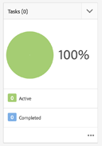

# 在AEM中開發專案

此開發教學課程說明如何開發 [!DNL AEM Projects]. 在本教學課程中，我們將建立一個自訂的專案範本，可用來在AEM中建立專案，以管理內容製作工作流程和任務。

>[!VIDEO](https://video.tv.adobe.com/v/16904?quality=12&learn=on)

*此影片會簡短示範下列教學課程中建立的已完成工作流程。*

## 簡介 {#introduction}

[[!DNL AEM Projects]](https://experienceleague.adobe.com/en/docs/experience-manager-65/content/sites/authoring/projects/projects) 是AEM的一項功能，設計旨在讓您可以更輕鬆地管理與內容建立相關的所有工作流程和任務，將其歸類為AEM Sites或Assets實作的一部分。

AEM專案隨附幾個 [OOTB專案範本](https://experienceleague.adobe.com/en/docs/experience-manager-65/content/sites/authoring/projects/projects). 建立專案時，作者可以從這些可用的範本中進行選擇。 具有獨特業務需求的大型AEM實作將想要建立自訂專案範本，以符合其需求。 透過建立自訂專案範本，開發人員可以設定專案控制面板、連結至自訂工作流程，並為專案建立其他業務角色。 我們將檢視專案範本的結構，並建立範例範本。


## 設定

本教學課程將逐步說明建立自訂專案範本所需的程式碼。 您可以下載並安裝 [附加封裝](./assets/develop-aem-projects/projects-tasks-guide.ui.apps-0.0.1-SNAPSHOT.zip) ，連同教學課程一起前往本機環境。 您也可以存取上託管的完整Maven專案 [GitHub](https://github.com/Adobe-Marketing-Cloud/aem-guides/tree/feature/projects-tasks-guide).

* [完成的教學課程套件](./assets/develop-aem-projects/projects-tasks-guide.ui.apps-0.0.1-SNAPSHOT.zip)
* [GitHub上的完整程式碼存放庫](https://github.com/Adobe-Marketing-Cloud/aem-guides/tree/feature/projects-tasks-guide)

本教學課程假設您具備以下基本知識 [AEM開發實務](https://experienceleague.adobe.com/en/docs/experience-manager-65/content/implementing/developing/introduction/the-basics) 並且熟悉 [AEM Maven專案設定](https://experienceleague.adobe.com/docs/experience-manager-65/developing/devtools/ht-projects-maven.html?lang=en). 所有提及的程式碼都是為了當作參考使用，且僅應部署至 [本機開發AEM執行個體](https://experienceleague.adobe.com/en/docs/experience-manager-65/content/implementing/deploying/deploying/deploy).

## 專案範本的結構

專案範本應該放在原始檔控制之下，而且應該放在應用程式資料夾的/apps之下。 理想情況下，這類檔案應放置在子資料夾中，其命名慣例為 **&#42;/projects/templates/**&lt;my-template>. 依照此命名慣例，任何新的自訂範本在建立專案時便能自動供作者使用。 可用的專案範本組態設定在： **/content/projects/jcr：content** 節點依據 **cq：allowedTemplates** 屬性。 依預設，這是規則運算式： **/(apps|libs)/.&#42;/projects/templates/.&#42;**

專案範本的根節點將具有 **jcr：primaryType** 之 **cq：Template**. 在的根節點底下有三個節點： **小工具**， **角色**、和 **工作流程**. 這些節點全部 **nt：unstructured**. 根節點下方也可以是thumbnail.png檔案，此檔案會在「建立專案」精靈中選取範本時顯示。

完整的節點結構：

```shell
/apps/<my-app>
    + projects (nt:folder)
         + templates (nt:folder)
              + <project-template-root> (cq:Template)
                   + gadgets (nt:unstructured)
                   + roles (nt:unstructured)
                   + workflows (nt:unstructured)
```

### 專案範本根目錄

專案範本的根節點為型別 **cq：Template**. 您可以在此節點上設定屬性 **jcr：title** 和 **jcr：description** 「建立專案精靈」中顯示的資訊。 還有一個屬性稱為 **精靈** 會指向將填入專案屬性的表單。 預設值為： **/libs/cq/core/content/projects/wizard/steps/defaultproject.html** 大多數情況下應該都能正常運作，因為它允許使用者填入基本專案屬性並新增群組成員。

*&#42;請注意，「建立專案精靈」不使用SlingPOSTservlet。 而是將值發佈到自訂servlet：**com.adobe.cq.projects.impl.servlet.ProjectServlet**. 新增自訂欄位時，應將此列入考量。*

您可為翻譯專案範本找到自訂精靈的範例： **/libs/cq/core/content/projects/wizard/translationproject/defaultproject**.

### 小工具 {#gadgets}

此節點上沒有其他屬性，但小工具節點的子項可控制建立新專案時用於填入專案控制面板的專案拼貼。 [專案拼貼](https://experienceleague.adobe.com/en/docs/experience-manager-65/content/sites/authoring/projects/projects) （也稱為小工具或pod）是填入專案工作地點的簡單卡片。 您可在下列位置找到ootb圖磚的完整清單： **/libs/cq/gui/components/projects/admin/pod。 **專案擁有者在建立專案後，一律可以新增/移除圖磚。

### 角色 {#roles}

共有三種 [預設角色](https://experienceleague.adobe.com/en/docs/experience-manager-65/content/sites/authoring/projects/projects) 每個專案： **觀察者**， **編輯**、和 **擁有者**. 藉由在角色節點底下新增子節點，您可以為範本新增其他特定於業務的專案角色。 然後，您可以將這些角色連結至與專案關聯的特定工作流程。

### 工作流程 {#workflows}

建立自訂專案範本最吸引人的原因之一，是它可讓您設定可用工作流程以用於專案。 這些功能包括OOTB工作流程或自訂工作流程。 在 **工作流程** 節點必須有 **模型** 節點(也 `nt:unstructured`)和底下的子節點指定可用的工作流程模型。 屬性**modelId **指向/etc/workflow下的工作流程模型和屬性 **精靈** 指向啟動工作流程時使用的對話方塊。 Projects的顯著優點是能夠新增自訂對話方塊（精靈），以在工作流程開始時擷取業務特定的中繼資料，並可推動工作流程中的進一步動作。

```shell
<projects-template-root> (cq:Template)
    + workflows (nt:unstructured)
         + models (nt:unstructured)
              + <workflow-model> (nt:unstructured)
                   - modelId = points to the workflow model
                   - wizard = dialog used to start the workflow
```

## 建立專案範本 {#creating-project-template}

由於我們主要是複製/設定節點，因此將使用CRXDE Lite。 在本機AEM執行個體中，開啟 [CRXDE Lite](http://localhost:4502/crx/de/index.jsp).

1. 首先，在下方建立資料夾 `/apps/&lt;your-app-folder&gt;` 已命名 `projects`. 在該名稱下方建立另一個資料夾 `templates`.

   ```shell
   /apps/aem-guides/projects-tasks/
                       + projects (nt:folder)
                                + templates (nt:folder)
   ```

1. 為了更輕鬆辦事，我們將從現有的Simple Project範本開始自訂範本。

   1. 複製並貼上節點 **/libs/cq/core/content/projects/templates/default** 在 *範本* 在步驟1建立的資料夾。

   ```shell
   /apps/aem-guides/projects-tasks/
                + templates (nt:folder)
                     + default (cq:Template)
   ```

1. 您現在應該有如下的路徑 **/apps/aem-guides/projects-tasks/projects/templates/authoring-project**.

   1. 編輯 **jcr：title** 和 **jcr：description** 自訂標題和說明值的author-project節點屬性。

      1. 離開 **精靈** 指向預設Project屬性的屬性。

   ```shell
   /apps/aem-guides/projects-tasks/projects/
            + templates (nt:folder)
                 + authoring-project (cq:Template)
                      - jcr:title = "Authoring Project"
                      - jcr:description = "A project to manage approval and publish process for AEM Sites or Assets"
                      - wizard = "/libs/cq/core/content/projects/wizard/steps/defaultproject.html"
   ```

1. 我們想要針對此專案範本使用任務。
   1. 新增 **nt：unstructured** 已呼叫authoring-project/gadgets下的節點 **任務**.
   1. 將String屬性新增到tasks節點 **cardWeight** = &quot;100&quot;， **jcr：title**=「任務」，和 **sling：resourceType**=&quot;cq/gui/components/projects/admin/pod/taskpod&quot;。

   現在 [「任務」圖磚](https://experienceleague.adobe.com/en/docs) 建立新專案時預設會顯示。

   ```shell
   ../projects/templates/authoring-project
       + gadgets (nt:unstructured)
            + team (nt:unstructured)
            + asset (nt:unstructured)
            + work (nt:unstructured)
            + experiences (nt:unstructured)
            + projectinfo (nt:unstructured)
            ..
            + tasks (nt:unstructured)
                 - cardWeight = "100"
                 - jcr:title = "Tasks"
                 - sling:resourceType = "cq/gui/components/projects/admin/pod/taskpod"
   ```

1. 我們將新增自訂核准者角色到我們的專案範本。

   1. 在專案範本(authoring-project)節點下新增一個 **nt：unstructured** 節點標籤 **角色**.
   1. 新增另一個 **nt：unstructured** 將核准者標示為「角色」節點的子節點的節點。
   1. 新增字串屬性 **jcr：title** = &quot;**核准者**「， **roleclass** =&quot;**所有者**「， **roleid**=&quot;**核准者**「。
      1. 核准者節點的名稱以及jcr：title和roleid可以是任何字串值（只要roleid是唯一的）。
      1. **roleclass** 會根據 [三個OOTB角色](https://experienceleague.adobe.com/en/docs/experience-manager-65/content/sites/authoring/projects/projects)： **所有者**， **編輯者**、和 **觀察者**.
      1. 一般而言，如果自訂角色主要是管理角色，則角色可以 **所有者；** 如果它是更具體的創作角色，例如攝影師或設計師，則 **編輯者** 羅勒克勞斯應該就足夠了。 兩者之間的巨大差異 **所有者** 和 **編輯者** 是專案所有者可以更新專案屬性並將新使用者新增到專案。

   ```shell
   ../projects/templates/authoring-project
       + gadgets (nt:unstructured)
       + roles (nt:unstructured)
           + approvers (nt:unstructured)
                - jcr:title = "Approvers"
                - roleclass = "owner"
                - roleid = "approver"
   ```

1. 透過複製簡單專案範本，您將獲得四個OOTB工作流程已設定。 工作流程/模型下方的每個節點都指向該工作流程的特定工作流程以及開始對話方塊精靈。 在本教學課程的稍後部分，我們將建立此專案的自訂工作流程。 目前，請刪除工作流程/模型下的節點：

   ```shell
   ../projects/templates/authoring-project
       + gadgets (nt:unstructured)
       + roles (nt:unstructured)
       + workflows (nt:unstructured)
            + models (nt:unstructured)
               - (remove ootb models)
   ```

1. 若要讓內容作者輕鬆識別專案範本，您可以新增自訂縮圖。 建議的大小為319x319畫素。
   1. 在CRXDE Lite中，將檔案建立為小工具、角色和工作流程節點的同層級，並命名為 **thumbnail.png**.
   1. 儲存，然後導覽至 `jcr:content` 節點，然後按兩下 `jcr:data` 屬性（請避免按一下「檢視」）。
      1. 這會提示您進行編輯 `jcr:data` 檔案對話方塊，您可以上傳自訂縮圖。

   ```shell
   ../projects/templates/authoring-project
       + gadgets (nt:unstructured)
       + roles (nt:unstructured)
       + workflows (nt:unstructured)
       + thumbnail.png (nt:file)
   ```

已完成專案範本的XML表示：

```xml
<?xml version="1.0" encoding="UTF-8"?>
<jcr:root xmlns:sling="http://sling.apache.org/jcr/sling/1.0" xmlns:cq="http://www.day.com/jcr/cq/1.0" xmlns:jcr="http://www.jcp.org/jcr/1.0" xmlns:nt="http://www.jcp.org/jcr/nt/1.0"
    jcr:description="A project to manage approval and publish process for AEM Sites or Assets"
    jcr:primaryType="cq:Template"
    jcr:title="Authoring Project"
    ranking="{Long}1"
    wizard="/libs/cq/core/content/projects/wizard/steps/defaultproject.html">
    <jcr:content
        jcr:primaryType="nt:unstructured"
        detailsHref="/projects/details.html"/>
    <gadgets jcr:primaryType="nt:unstructured">
        <team
            jcr:primaryType="nt:unstructured"
            jcr:title="Team"
            sling:resourceType="cq/gui/components/projects/admin/pod/teampod"
            cardWeight="60"/>
        <tasks
            jcr:primaryType="nt:unstructured"
            jcr:title="Tasks"
            sling:resourceType="cq/gui/components/projects/admin/pod/taskpod"
            cardWeight="100"/>
        <work
            jcr:primaryType="nt:unstructured"
            jcr:title="Workflows"
            sling:resourceType="cq/gui/components/projects/admin/pod/workpod"
            cardWeight="80"/>
        <experiences
            jcr:primaryType="nt:unstructured"
            jcr:title="Experiences"
            sling:resourceType="cq/gui/components/projects/admin/pod/channelpod"
            cardWeight="90"/>
        <projectinfo
            jcr:primaryType="nt:unstructured"
            jcr:title="Project Info"
            sling:resourceType="cq/gui/components/projects/admin/pod/projectinfopod"
            cardWeight="100"/>
    </gadgets>
    <roles jcr:primaryType="nt:unstructured">
        <approvers
            jcr:primaryType="nt:unstructured"
            jcr:title="Approvers"
            roleclass="owner"
            roleid="approvers"/>
    </roles>
    <workflows
        jcr:primaryType="nt:unstructured"
        tags="[]">
        <models jcr:primaryType="nt:unstructured">
        </models>
    </workflows>
</jcr:root>
```

## 測試自訂專案範本

現在，我們可以透過建立專案來測試專案範本。

1. 您應該看到自訂範本作為建立專案的選項之一。

   

1. 選取自訂範本後，按一下「下一步」，並注意當填入專案成員時，您可以將他們新增為核准者角色。

   

1. 按一下「建立」以根據自訂範本完成建立專案。 您會在「專案控制面板」上注意到「任務拼貼」和在「小工具」下設定的其他拼貼會自動顯示。

   


## 為什麼是工作流程？

傳統上，以核准流程為中心的AEM工作流程會使用參與者工作流程步驟。 AEM收件匣包含有關工作和工作流程的詳細資訊，以及與AEM專案的增強整合。 這些功能讓使用「專案建立作業」處理步驟成為更具吸引力的選項。

### 為何要執行工作？

比起傳統的參與者步驟，使用「任務建立步驟」可提供幾項優點：

* **開始和到期日期**  — 讓作者更容易管理時間，新的「行事曆」功能會利用這些日期。
* **優先順序**  — 內建「低」、「一般」和「高」優先順序，讓作者能夠排定工作的優先順序
* **執行緒註解**  — 當作者處理任務時，他們能夠留下註解以增加共同作業
* **可見度**  — 具有專案的任務圖磚和檢視可讓經理檢視時間的花費方式
* **專案整合**  — 任務已與專案角色和儀表板整合

與參與者步驟類似，任務也可以動態指派和路由。 如下列教學課程所示，工作中繼資料（如標題、優先順序）也可根據先前的動作動態設定。

雖然任務與參與者步驟相比有一些優點，但它們的確會產生額外的負荷，並且在專案之外不那麼有用。 此外，任務的所有動態行為都必須使用有自身限制的ecma指令碼來編碼。

## 範例使用案例需求 {#goals-tutorial}


上圖概述範例核准工作流程的高層級需求。

第一個步驟是建立一個Task以完成編輯內容片段。 我們將允許工作流程發起人選擇此第一項任務的受指派人。

完成第一個任務後，受指派人將有三個選項可路由工作流程：

**一般** — 一般路由會建立指派給專案核准者群組的任務，以進行檢閱和核准。 任務的優先順序為「一般」，到期日為建立日期起的5天。

**Rush**  — 快速路由也會建立指派給專案核准者群組的任務。 任務的優先順序為「高」，到期日只有一天。

**略過**  — 在此範例工作流程中，初始參與者可以選擇略過核准群組。 （是的，這可能會失去「核准」工作流程的目的，但可讓我們說明其他路由功能）

核准者群組可以核准內容或將其傳回給初始受指派人進行重工。 如果傳回給，重工則會建立新任務並適當地標示為「傳回重工」。

工作流程的最後一個步驟會使用ootb啟動頁面/資產程式步驟，並複製裝載。

## 建立工作流程模型

1. 從AEM「開始」功能表，導覽至「工具」 — >「工作流程」 — >「模型」。 按一下右上角的「建立」以建立工作流程模型。

   為新模型指定標題「內容核准工作流程」和URL名稱「content-approval-workflow」。

   

   [如需與建立工作流程相關的詳細資訊，請閱讀此處](https://experienceleague.adobe.com/en/docs/experience-manager-65/content/implementing/developing/extending-aem/extending-workflows/workflows-models).

1. 根據最佳實務，自訂工作流程應該分組到他們自己的資料夾中/etc/workflow/models下方。 在CRXDE Lite中，建立 **&#39;nt：folder&#39;** /etc/workflow/models下名為 **&quot;aem-guides&quot;**. 新增子資料夾可確保自訂工作流程在升級或Service Pack安裝期間不會意外覆寫。

   &#42;請注意，請勿將資料夾或自訂工作流程放在ootb子資料夾（例如/etc/workflow/models/dam或/etc/workflow/models/projects）下，因為升級或Service Pack可能會覆寫整個子資料夾。

   

   工作流程模型在6.3中的位置

   >[!NOTE]
   >
   >如果使用AEM 6.4+，工作流程的位置已變更。 另請參閱 [此處取得更多詳細資料。](https://experienceleague.adobe.com/en/docs/experience-manager-65/content/implementing/developing/extending-aem/extending-workflows/workflows-best-practices)

   如果使用AEM 6.4+，則會在 `/conf/global/settings/workflow/models`. 對/conf目錄重複上述步驟，並新增名為的子資料夾 `aem-guides` 並移動 `content-approval-workflow` 在下方。

   
工作流程模型在6.4+中的位置

1. AEM 6.3中引進的功能是將「工作流程階段」新增至指定工作流程。 這些階段會從「工作流程資訊」標籤上的「收件匣」顯示給使用者。 它會向使用者顯示工作流程中的目前階段，以及工作流程之前和之後的階段。

   若要設定階段，請從Sidekick開啟「頁面屬性」對話方塊。 第四個索引標籤標示為「階段」。 新增下列值以設定此工作流程的三個階段：

   1. 編輯內容
   1. 核准
   1. 發佈

   

   從「頁面屬性」對話方塊設定「工作流程階段」 。

   

   從AEM收件匣中看到的工作流程進度列。

   您可以選擇上傳 **影像** 至當使用者選取時當作工作流程縮圖的「頁面屬性」 。 影像尺寸應為319x319畫素。 新增 **說明** 前往頁面屬性也會在使用者前往選取工作流程時顯示。

1. 「建立專案任務」工作流程處理的設計目的，是建立「任務」作為工作流程中的步驟。 只有在完成任務後，工作流程才會前進。 「建立專案任務」步驟的強大方面是它可以讀取工作流程中繼資料值，並使用這些值來動態建立任務。

   首先刪除預設建立的參與者步驟。 從元件選單中的Sidekick，展開 **&quot;專案&quot;** 副標題並拖放 **建立專案任務** 放到模型上。

   連按兩下「建立專案任務」步驟以開啟工作流程對話方塊。 設定下列屬性：

   此標籤在所有工作流程程式步驟中都是通用的，我們將設定標題和說明（一般使用者看不到這些內容）。 我們將設定的重要屬性是「工作流程階段」 **編輯內容** （從下拉式功能表）。

   ```shell
   Common Tab
   -----------------
       Title = "Start Task Creation"
       Description = "This the first task in the Workflow"
       Workflow Stage = "Edit Content"
   ```

   「建立專案任務」工作流程處理的設計目的，是建立「任務」作為工作流程中的步驟。 「工作」標籤可讓我們設定工作的所有值。 在我們的案例中，我們希望受指派人是動態的，因此我們會將其保留空白。 其餘的屬性值：

   ```shell
   Task Tab
   -----------------
       Name* = "Edit Content"
       Task Priority = "Medium"
       Description = "Edit the content and finalize for approval. Once finished submit for approval."
       Due In - Days = "2"
   ```

   路由標籤是一個可選的對話方塊，可指定使用者完成工作的可用動作。 這些動作只是字串值，會儲存至工作流程的中繼資料。 指令碼可讀取這些值，和/或稍後在工作流程中處理步驟，以動態「路由」工作流程。 根據我們將要執行的工作流程目標，新增三個動作至此索引標籤：

   ```shell
   Routing Tab
   -----------------
       Actions =
           "Normal Approval"
           "Rush Approval"
           "Bypass Approval"
   ```

   此索引標籤可讓我們設定「建立任務前的指令碼」，我們可在此以程式設計方式決定建立任務前的各種值。 我們可選擇將指令碼指向外部檔案，或直接在對話方塊中內嵌簡短指令碼。 在我們的案例中，我們會將「建立任務前的指令碼」指向外部檔案。 在步驟5中，我們將建立該指令碼。

   ```shell
   Advanced Settings Tab
   -----------------
      Pre-Create Task Script = "/apps/aem-guides/projects/scripts/start-task-config.ecma"
   ```

1. 在上一個步驟中，我們參考了建立任務前的指令碼。 我們現在將建立該指令碼，其中我們將根據工作流程中繼資料值&quot;**被指定者**「。 此 **「受託人」** 值會在工作流程啟動時設定。 我們也會閱讀工作流程中繼資料，透過閱讀&quot;**taskPriority&quot;** 工作流程中繼資料及**「taskDueDate」**的值，以在第一項任務到期時動態設定。

   為了方便組織，我們在應用程式資料夾底下建立了一個資料夾，用來儲存所有與專案相關的指令碼： **/apps/aem-guides/projects-tasks/projects/scripts**. 在此資料夾下建立名為的檔案 **&quot;start-task-config.ecma&quot;**. &#42;注意：請確定start-task-config.ecma檔案的路徑與步驟4的「進階設定」標籤中所設定的路徑相符。

   新增下列內容作為檔案的內容：

   ```
   // start-task-config.ecma
   // Populate the task using values stored as workflow metadata originally posted by the start workflow wizard
   
   // set the assignee based on start workflow wizard
   var assignee = workflowData.getMetaDataMap().get("assignee", Packages.java.lang.String);
   task.setCurrentAssignee(assignee);
   
   //Set the due date for the initial task based on start workflow wizard
   var dueDate = workflowData.getMetaDataMap().get("taskDueDate", Packages.java.util.Date);
   if (dueDate != null) {
       task.setProperty("taskDueDate", dueDate);
   }
   
   //Set the priority based on start workflow wizard
   var taskPriority = workflowData.getMetaDataMap().get("taskPriority", "Medium");
   task.setProperty("taskPriority", taskPriority);
   ```

1. 導覽回「內容核准工作流程」。 拖放 **OR拆分** 元件(可在「工作流程」類別下方的Sidekick中找到)，位於 **開始任務** 步驟。 在「一般」對話方塊中，選取「3個分支」的選項按鈕。 OR拆分會讀取工作流程中繼資料值 **&quot;lastTaskAction&quot;** 以決定工作流程的路徑。 此 **&quot;lastTaskAction&quot;** 屬性會設定為步驟4中設定之「路由」標籤的其中一個值。 針對每個「分支」標籤，填寫 **指令碼** 文字區域包含下列值：

   ```
   function check() {
   var lastAction = workflowData.getMetaDataMap().get("lastTaskAction","");
   
   if(lastAction == "Normal Approval") {
       return true;
   }
   
   return false;
   }
   ```

   ```
   function check() {
   var lastAction = workflowData.getMetaDataMap().get("lastTaskAction","");
   
   if(lastAction == "Rush Approval") {
       return true;
   }
   
   return false;
   }
   ```

   ```
   function check() {
   var lastAction = workflowData.getMetaDataMap().get("lastTaskAction","");
   
   if(lastAction == "Bypass Approval") {
       return true;
   }
   
   return false;
   }
   ```

   &#42;請注意，我們正在執行直接字串比對來決定路由，因此在Branch指令碼中設定的值務必與步驟4中設定的Route值相符。

1. 拖放另一個»**建立專案任務**「在OR分割下向模型的最左側（分支1）前進。 使用下列屬性填寫對話方塊：

   ```
   Common Tab
   -----------------
       Title = "Approval Task Creation"
       Description = "Create a an approval task for Project Approvers. Priority is Medium."
       Workflow Stage = "Approval"
   
   Task Tab
   ------------
       Name* = "Approve Content for Publish"
       Task Priority = "Medium"
       Description = "Approve this content for publication."
       Days = "5"
   
   Routing Tab - Actions
   ----------------------------
       "Approve and Publish"
       "Send Back for Revision"
   ```

   由於這是「一般核准」路由，因此任務的優先順序會設為「中」。 此外，我們給核准者群組5天的時間來完成任務。 「工作」標籤上的被指定者會保留空白，因為我們會在「進階設定」標籤中動態地指定此被指定者。 完成此任務時，我們會為「核准者」群組提供兩種可能的路徑： **&quot;核准並發佈&quot;** 如果他們核准內容且內容可以發佈和 **&quot;傳回以進行修訂&quot;** 如果發生原始編輯器需要更正的問題。 核准者可留下附註，讓原始編輯者看到工作流程是否傳回給他/她。

在本教學課程的前面，我們建立了包含核准者角色的專案範本。 每次從此範本建立新專案時，專案特定的群組都會為核准者角色建立。 就像參與者步驟一樣，一個任務只能指派給使用者或群組。 我們想要將此任務指派給對應至「核准者群組」的專案群組。 所有從專案內啟動的工作流程都會有中繼資料，會將專案角色對應至專案特定群組。

將下列程式碼複製並貼到 **指令碼** **進階設定**標籤的文字區域。 此程式碼將讀取工作流程中繼資料，並將任務指派給專案的核准者群組。 如果找不到核准者群組值，則會退回將任務指派給管理員群組。

```
var projectApproverGrp = workflowData.getMetaDataMap().get("project.group.approvers","administrators");

task.setCurrentAssignee(projectApproverGrp);
```

1. 拖放另一個»**建立專案任務**「在OR分割的下方，向模型邁進到中間分支（分支2）。 使用下列屬性填寫對話方塊：

   ```
   Common Tab
   -----------------
       Title = "Rush Approval Task Creation"
       Description = "Create a an approval task for Project Approvers. Priority is High."
       Workflow Stage = "Approval"
   
   Task Tab
   ------------
       Name* = "Rush Approve Content for Publish"
       Task Priority = "High"
       Description = "Rush approve this content for publication."
       Days = "1"
   
   Routing Tab - Actions
   ----------------------------
       "Approve and Publish"
       "Send Back for Revision"
   ```

   由於這是「匆忙核准」路由，因此任務的優先順序會設為「高」。 此外，我們只給核准者群組一天時間來完成任務。 「工作」標籤上的被指定者會保留空白，因為我們會在「進階設定」標籤中動態地指定此被指定者。

   我們可以重複使用與步驟7相同的指令碼片段，以填入 **指令碼** 「進階設定」**簽上的文字區**。 複製+貼上下列程式碼：

   ```
   var projectApproverGrp = workflowData.getMetaDataMap().get("project.group.approvers","administrators");
   
   task.setCurrentAssignee(projectApproverGrp);
   ```

1. 拖放a**無操作**元件至最右邊的分支（分支3）。 「無操作」元件不會執行任何動作，而且會立即進階，代表原始編輯者要略過核准步驟。 技術上，我們可以離開此分支而不執行任何工作流程步驟，但作為最佳實務，我們將新增「無操作」步驟。 如此便能向其他開發人員清楚說明分支3的用途。

   按兩下工作流程步驟並設定標題和說明：

   ```
   Common Tab
   -----------------
       Title = "Bypass Approval"
       Description = "Placeholder step to indicate that the original editor decided to bypass the approver group."
   ```

   

   設定OR分割中的所有三個分支後，工作流程模型應該如下所示。

1. 由於「核准者」群組可選擇將工作流程傳送回原始編輯器以進行進一步修訂，因此我們將依賴 **轉至** 步驟以瞭解上次採取的動作，並將工作流程路由至開始處或讓工作流程繼續。

   將「跳到步驟」元件(可在「工作流程」下的Sidekick中找到)拖放到OR分割下，放置該元件重新結合的位置。 連按兩下並在對話方塊中設定下列屬性：

   ```
   Common Tab
   ----------------
       Title = "Goto Step"
       Description = "Based on the Approver groups action route the workflow to the beginning or continue and publish the payload."
   
   Process Tab
   ---------------
       The step to go to. = "Start Task Creation"
   ```

   最後一項我們要設定的是作為「跳至處理」步驟一部分的指令碼。 Script值可透過對話方塊內嵌，或設定為指向外部檔案。 Goto指令碼必須包含 **函式check()** 如果工作流程應移至指定步驟，則傳回true。 傳回false會導致工作流程繼續進行。

   如果核准者群組選擇 **&quot;傳回以進行修訂&quot;** 動作（在步驟7和8中設定），然後我們想要將工作流程傳回 **開始建立任務** 步驟。

   在「流&#39;b5&#39;7b」標籤上，將下列程式碼片段新增至「指令碼」文字區域：

   ```
   function check() {
   var lastAction = workflowData.getMetaDataMap().get("lastTaskAction","");
   
   if(lastAction == "Send Back for Revision") {
       return true;
   }
   
   return false;
   }
   ```

1. 若要發佈裝載，我們將使用ootb **啟動頁面/資產** 程式步驟。 此程式步驟幾乎不需要任何設定，而且會將工作流程的裝載新增至復寫佇列以進行啟用。 我們將在「跳至」步驟下方新增步驟，如此一來，只有核准者群組已核准要發佈的內容，或原始編輯者選擇「略過核准」路徑時，才能到達該步驟。

   拖放 **啟動頁面/資產** 在模型中「跳至步驟」下的「處理步驟」 (Process step) (可在「WCM工作流程」下的Sidekick中找到)。

   

   新增「跳至」步驟和「啟動頁面/資產」步驟後，工作流程模型看起來會是什麼樣子。

1. 如果「核准者」群組傳回內容以供修訂，我們想讓原始編輯器知道。 我們可以動態變更「工作」建立屬性來達到此目的。 我們將關閉的lastActionTooled屬性值 **&quot;傳回以進行修訂&quot;**. 如果該值存在，我們將修改標題和說明，以指出此工作是傳回內容以供修訂的結果。 我們也會將優先順序更新為 **&quot;高&quot;** 所以這是編輯器處理的第一個專案。 最後，我們將任務到期日設定為自工作流程傳回修訂之日算起的一天。

   取代開頭 `start-task-config.ecma` 具有下列內容的指令碼（在步驟5中建立）：

   ```
   // start-task-config.ecma
   // Populate the task using values stored as workflow metadata originally posted by the start workflow wizard
   
   // set the assignee based on start workflow wizard
   var assignee = workflowData.getMetaDataMap().get("assignee", Packages.java.lang.String);
   task.setCurrentAssignee(assignee);
   
   //Set the due date for the initial task based on start workflow wizard
   var dueDate = workflowData.getMetaDataMap().get("taskDueDate", Packages.java.util.Date);
   if (dueDate != null) {
       task.setProperty("taskDueDate", dueDate);
   }
   
   //Set the priority based on start workflow wizard
   var taskPriority = workflowData.getMetaDataMap().get("taskPriority", "Medium");
   task.setProperty("taskPriority", taskPriority);
   
   var lastAction = workflowData.getMetaDataMap().get("lastTaskAction","");
   
   //change the title and priority if the approver group sent back the content
   if(lastAction == "Send Back for Revision") {
     var taskName = "Review and Revise Content";
   
     //since the content was rejected we will set the priority to High for the revison task
     task.setProperty("taskPriority", "High"); 
   
     //set the Task name (displayed as the task title in the Inbox) 
     task.setProperty("name", taskName);
     task.setProperty("nameHierarchy", taskName);
   
     //set the due date of this task 1 day from current date
     var calDueDate = Packages.java.util.Calendar.getInstance();
     calDueDate.add(Packages.java.util.Calendar.DATE, 1);
     task.setProperty("taskDueDate", calDueDate.getTime());
   
   }
   ```

## 建立「啟動工作流程」精靈 {#start-workflow-wizard}

從專案中啟動工作流程時，您必須指定精靈來啟動工作流程。 預設精靈： `/libs/cq/core/content/projects/workflowwizards/default_workflow` 可讓使用者輸入工作流程標題、開始註解及工作流程執行的裝載路徑。 底下也有其他幾個範例： `/libs/cq/core/content/projects/workflowwizards`.

建立自訂精靈的功能非常強大，因為您可以在工作流程開始之前收集關鍵資訊。 資料會儲存為工作流程的中繼資料的一部分，而工作流程程式可以讀取此資料，並根據輸入的值動態變更行為。 我們將建立自訂精靈，以根據啟動精靈值動態指派工作流程中的第一個任務。

1. 在CRXDE-Lite中，我們將在下建立子資料夾 `/apps/aem-guides/projects-tasks/projects` 名為「精靈」的資料夾。 從下列位置複製預設精靈： `/libs/cq/core/content/projects/workflowwizards/default_workflow` 在新建立的精靈資料夾下方，並將其重新命名為 **content-approval-start**. 完整路徑現在應該是： `/apps/aem-guides/projects-tasks/projects/wizards/content-approval-start`.

   預設精靈為兩欄式精靈，第一欄顯示所選工作流程模型的標題、說明和縮圖。 第二欄包含工作流程標題、開始評論和裝載路徑的欄位。 精靈是標準的觸控式UI表單，會使用標準功能 [Granite UI表單元件](https://experienceleague.adobe.com/en/docs) 以填入欄位。

   

1. 我們將在精靈中新增一個額外欄位，用於設定工作流程中第一個任務的受指派人(請參閱 [建立工作流程模型](#create-workflow-model)：步驟5)。

   下 `../content-approval-start/jcr:content/items/column2/items` 建立型別為的新節點 `nt:unstructured` 已命名 **&quot;assign&quot;**. 我們將使用「專案使用者選擇器」元件(根據 [Granite使用者選取器元件](https://experienceleague.adobe.com/en/docs))。 此表單欄位可讓您輕鬆地將使用者和群組選取限製為僅屬於目前專案的那些專案。

   以下是XML表示法 **指派** 節點：

   ```xml
   <assign
       granite:class="js-cq-project-user-picker"
       jcr:primaryType="nt:unstructured"
       sling:resourceType="cq/gui/components/projects/admin/userpicker"
       fieldLabel="Assign To"
       hideServiceUsers="{Boolean}true"
       impersonatesOnly="{Boolean}true"
       showOnlyProjectMembers="{Boolean}true"
       name="assignee"
       projectPath="${param.project}"
       required="{Boolean}true"/>
   ```

1. 我們也會新增優先順序選擇欄位，以決定工作流程中第一個任務的優先順序(請參閱 [建立工作流程模型](#create-workflow-model)：步驟5)。

   下 `/content-approval-start/jcr:content/items/column2/items` 建立型別為的新節點 `nt:unstructured` 已命名 **優先順序**. 我們將使用 [Granite UI選取元件](https://experienceleague.adobe.com/en/docs/experience-manager-release-information/aem-release-updates/previous-updates/aem-previous-versions) 以填入表單欄位。

   在 **優先順序** 節點，我們將新增 **個專案** 節點 **nt：unstructured**. 在 **個專案** 節點再新增3個節點，以填入「高」、「中」和「低」的選取選項。 每個節點的型別為 **nt：unstructured** 且應該有 **文字** 和 **值** 屬性。 文字和值應該是相同的值：

   1. 高
   1. 中等
   1. 低

   對於媒體節點，請新增一個名為的額外布林屬性&#x200B;**已選取」** ，且值設定為 **true**. 這將確保「中」是選取欄位中的預設值。

   以下是節點結構和屬性的XML表示法：

   ```xml
   <priority
       jcr:primaryType="nt:unstructured"
       sling:resourceType="granite/ui/components/coral/foundation/form/select"
       fieldLabel="Task Priority"
       name="taskPriority">
           <items jcr:primaryType="nt:unstructured">
               <high
                   jcr:primaryType="nt:unstructured"
                   text="High"
                   value="High"/>
               <medium
                   jcr:primaryType="nt:unstructured"
                   selected="{Boolean}true"
                   text="Medium"
                   value="Medium"/>
               <low
                   jcr:primaryType="nt:unstructured"
                   text="Low"
                   value="Low"/>
               </items>
   </priority>
   ```

1. 我們將允許工作流程發起者設定初始任務的到期日。 我們將使用 [Granite UI DatePicker](https://experienceleague.adobe.com/en/docs) 表單欄位以擷取此輸入。 我們也會新增包含下列專案的隱藏欄位： [TypeHint](https://sling.apache.org/documentation/bundles/manipulating-content-the-slingpostservlet-servlets-post.html#typehint) 以確保在JCR中將輸入儲存為日期型別屬性。

   新增兩個 **nt：unstructured** 具有下列屬性的節點以XML表示：

   ```xml
   <duedate
       granite:rel="project-duedate"
       jcr:primaryType="nt:unstructured"
       sling:resourceType="granite/ui/components/coral/foundation/form/datepicker"
       displayedFormat="YYYY-MM-DD HH:mm"
       fieldLabel="Due Date"
       minDate="today"
       name="taskDueDate"
       type="datetime"/>
   <duedatetypehint
       jcr:primaryType="nt:unstructured"
       sling:resourceType="granite/ui/components/coral/foundation/form/hidden"
       name="taskDueDate@TypeHint"
       type="datetime"
       value="Calendar"/>
   ```

1. 您可以檢視啟動精靈對話方塊的完整程式碼 [此處](https://github.com/Adobe-Marketing-Cloud/aem-guides/blob/master/projects-tasks-guide/ui.apps/src/main/content/jcr_root/apps/aem-guides/projects-tasks/projects/wizards/content-approval-start/.content.xml).

## 連線工作流程和專案範本 {#connecting-workflow-project}

最後我們要做的就是確保可以從其中一個專案啟動工作流程模型。 為此，我們需要重新造訪在此系列第1部分建立的專案範本。

「工作流程組態」是「專案範本」的區域，可指定要用於該專案的可用工作流程。 此設定還負責在啟動工作流程時(我們在 [先前的步驟)](#start-workflow-wizard). 專案範本的工作流程設定是「即時」的，這表示更新工作流程設定將會影響建立的新專案以及使用該範本的現有專案。

1. 在CRXDE-Lite中導覽至先前建立的編寫專案範本，位於 `/apps/aem-guides/projects-tasks/projects/templates/authoring-project/workflows/models`.

   在模型節點下方，新增名為的節點 **contentapproval** 具有節點型別 **nt：unstructured**. 將下列屬性新增至節點：

   ```xml
   <contentapproval
       jcr:primaryType="nt:unstructured"
       modelId="/etc/workflow/models/aem-guides/content-approval-workflow/jcr:content/model"
       wizard="/apps/aem-guides/projects-tasks/projects/wizards/content-approval-start.html"
   />
   ```

   >[!NOTE]
   >
   >如果使用AEM 6.4，Workflow的位置已變更。 指向 `modelId` 屬性至下執行階段工作流程模型的位置 `/var/workflow/models/aem-guides/content-approval-workflow`
   >
   >
   >另請參閱 [此處以取得工作流程位置變更的詳細資訊。](https://experienceleague.adobe.com/en/docs/experience-manager-65/content/implementing/developing/extending-aem/extending-workflows/workflows-best-practices)

   ```xml
   <contentapproval
       jcr:primaryType="nt:unstructured"
       modelId="/var/workflow/models/aem-guides/content-approval-workflow"
       wizard="/apps/aem-guides/projects-tasks/projects/wizards/content-approval-start.html"
   />
   ```

1. 將「內容核准」工作流程新增到「專案範本」後，就應該可以從「工作流程表徵圖」專案啟動它。 開始並嘗試使用我們建立的各種製程。

## 支援材料

* [下載完成的教學課程套件](./assets/develop-aem-projects/projects-tasks-guide.ui.apps-0.0.1-SNAPSHOT.zip)
* [GitHub上的完整程式碼存放庫](https://github.com/Adobe-Marketing-Cloud/aem-guides/tree/feature/projects-tasks-guide)
* [AEM專案檔案](https://experienceleague.adobe.com/en/docs/experience-manager-65/content/sites/authoring/projects/projects)
