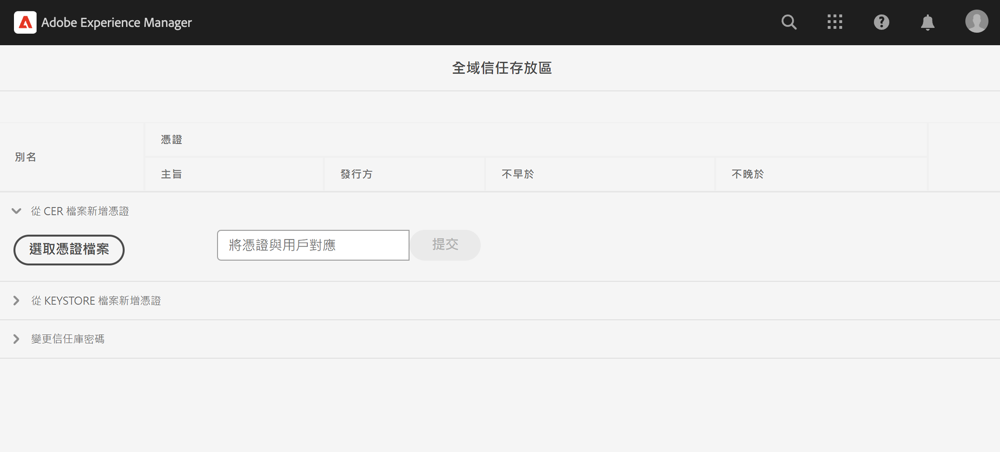

# 呼叫具有私人憑證的內部 API

了解如何使用私人或自我簽署憑證，從 AEM 進行對 Web API 的 HTTPS 呼叫。

>[!VIDEO](https://video.tv.adobe.com/v/3424853?quality=12&learn=on)

預設情況下，嘗試與使用自我簽署憑證的 Web API 建立 HTTPS 連線時，連線會失敗並出現下列錯誤：

```
PKIX path building failed: sun.security.provider.certpath.SunCertPathBuilderException: unable to find valid certification path to requested target
```

當 **API 的 SSL 憑證不是由經認可的憑證授權單位 (CA) 所發行**，而且 Java™ 應用程式無法驗證 SSL/TLS 憑證時，通常會發生這個問題。

了解如何使用 [Apache HttpClient](https://hc.apache.org/httpcomponents-client-4.5.x/index.html) 和 **AEM 的全域 TrustStore** 成功呼叫具有私人或自我簽署憑證的 API。


## 使用 HttpClient 之原型 API 叫用程式碼

以下程式碼會與 Web API 建立 HTTPS 連線：

```java
...
String API_ENDPOINT = "https://example.com";

// Create HttpClientBuilder
HttpClientBuilder httpClientBuilder = HttpClientBuilder.create();

// Create HttpClient
CloseableHttpClient httpClient = httpClientBuilder.build();

// Invoke API
CloseableHttpResponse closeableHttpResponse = httpClient.execute(new HttpGet(API_ENDPOINT));

// Code that reads response code and body from the 'closeableHttpResponse' object
...
```

程式碼使用 [Apache HttpComponent](https://hc.apache.org/) 的 [HttpClient](https://hc.apache.org/httpcomponents-client-4.5.x/index.html) 程式庫類別及其方法。


## HttpClient 及載入 AEM TrustStore 素材

若要呼叫具有&#x200B;_私人或自我簽署憑證_&#x200B;的 API 端點，[HttpClient](https://hc.apache.org/httpcomponents-client-4.5.x/index.html) 的 `SSLContextBuilder` 必須載入 AEM 的 TrustStore，並藉以使連線更方便。

請依照下列步驟進行：

1. 以&#x200B;**管理員**&#x200B;身分登入 **AEM Author**。
1. 導覽至&#x200B;**「AEM Author」>「工具」>「安全性」>「Trust Store」**，然後開啟「**Global Trust Store**」。若為首次存取，請設定 Global Trust Store 的密碼。

   

1. 若要匯入私人憑證，請按一下「**選取憑證檔案**」按鈕，然後選取副檔名為 `.cer` 的所需憑證檔案。按一下「**提交**」按鈕來匯入憑證檔案。

1. 如下方所示，更新 Java™ 程式碼。請注意，若要使用 `@Reference` 取得 AEM 的 `KeyStoreService`，呼叫程式碼必須為 OSGi 元件/服務，或者 Sling 模型 (且有使用 `@OsgiService`)。

   ```java
   ...
   
   // Get AEM's KeyStoreService reference
   @Reference
   private com.adobe.granite.keystore.KeyStoreService keyStoreService;
   
   ...
   
   // Get AEM TrustStore using KeyStoreService
   KeyStore aemTrustStore = getAEMTrustStore(keyStoreService, resourceResolver);
   
   if (aemTrustStore != null) {
   
       // Create SSL Context
       SSLContextBuilder sslbuilder = new SSLContextBuilder();
   
       // Load AEM TrustStore material into above SSL Context
       sslbuilder.loadTrustMaterial(aemTrustStore, null);
   
       // Create SSL Connection Socket using above SSL Context
       SSLConnectionSocketFactory sslsf = new SSLConnectionSocketFactory(
               sslbuilder.build(), NoopHostnameVerifier.INSTANCE);
   
       // Create HttpClientBuilder
       HttpClientBuilder httpClientBuilder = HttpClientBuilder.create();
       httpClientBuilder.setSSLSocketFactory(sslsf);
   
       // Create HttpClient
       CloseableHttpClient httpClient = httpClientBuilder.build();
   
       // Invoke API
       closeableHttpResponse = httpClient.execute(new HttpGet(API_ENDPOINT));
   
       // Code that reads response code and body from the 'closeableHttpResponse' object
       ...
   } 
   
   /**
    * 
    * Returns the global AEM TrustStore
    * 
    * @param keyStoreService OOTB OSGi service that makes AEM based KeyStore
    *                         operations easy.
    * @param resourceResolver
    * @return
    */
   private KeyStore getAEMTrustStore(KeyStoreService keyStoreService, ResourceResolver resourceResolver) {
   
       // get AEM TrustStore from the KeyStoreService and ResourceResolver
       KeyStore aemTrustStore = keyStoreService.getTrustStore(resourceResolver);
   
       return aemTrustStore;
   }
   
   ...
   ```

   * 將 OOTB `com.adobe.granite.keystore.KeyStoreService` OSGi 服務注入到您的 OSGi 元件中。
   * 使用 `KeyStoreService` 和 `ResourceResolver` 取得全域 AEM TrustStore，`getAEMTrustStore(...)` 方法可以完成這項作業。
   * 建立一個 `SSLContextBuilder` 物件，請參閱 Java™ [API 詳細資訊](https://javadoc.io/static/org.apache.httpcomponents/httpcore/4.4.8/index.html?org/apache/http/ssl/SSLContextBuilder.html)。
   * 使用 `loadTrustMaterial(KeyStore truststore,TrustStrategy trustStrategy)` 方法將全域 AEM TrustStore 載入到 `SSLContextBuilder` 中。
   * 在上述方法中，對 `TrustStrategy` 傳遞 `null`，確保在 API 執行期間只有 AEM 信任的憑證會成功。


>[!CAUTION]
>
>採取前述方式執行時，使用 CA 發行之有效憑證的 API 呼叫會失敗。依照此方法進行時，唯有使用 AEM 信任之憑證的 API 呼叫才會成功。
>
>使用[標準方法](#prototypical-api-invocation-code-using-httpclient)執行 CA 發行之有效憑證的 API 呼叫，表示只有與私人憑證相關聯的 API 才應使用前述方法執行。

## 避免 JVM Keystore 變更

使用私人憑證有效地叫用內部 API 的傳統方法，必須修改 JVM Keystore。使用 Java™ [keytool](https://docs.oracle.com/en/java/javase/11/tools/keytool.html#GUID-5990A2E4-78E3-47B7-AE75-6D1826259549) 指令匯入私人憑證即可做到。

然而，此方法不符合安全性最佳實務，而 AEM 提供極佳的選項，即使用 **Global Trust Store** 和 [KeyStoreService](https://javadoc.io/doc/com.adobe.aem/aem-sdk-api/latest/com/adobe/granite/keystore/KeyStoreService.html)。


## 解決方案套件

影片中示範的範例 Node.js 專案可於[此處](assets/internal-api-call/REST-APIs.zip)下載。

AEM servlet 程式碼可於 WKND 網站專案的 `tutorial/web-api-invocation` 分支中找到，[請參閱此處](https://github.com/adobe/aem-guides-wknd/tree/tutorial/web-api-invocation/core/src/main/java/com/adobe/aem/guides/wknd/core/servlets)。
