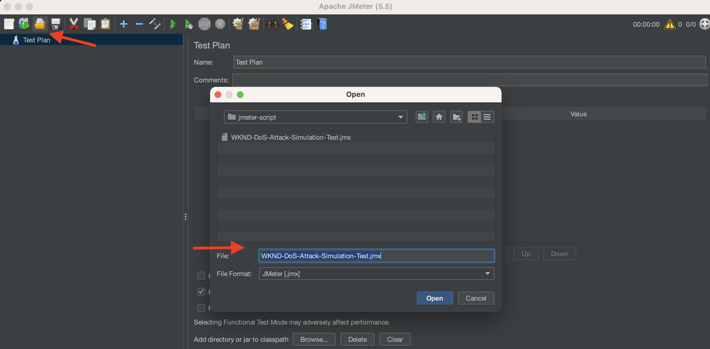

# 使用ModSecurity保護您的AEM網站免受DoS攻擊

瞭解如何使用Adobe Experience Manager (AEM) Publish Dispatcher上的&#x200B;**OWASP ModSecurity核心規則集(CRS)**，啟用ModSecurity以保護您的網站免受拒絕服務(DoS)攻擊。


>[!VIDEO](https://video.tv.adobe.com/v/3422976?quality=12&learn=on)

## 概觀

[Open Web Application Security Project® (OWASP)](https://owasp.org/)基礎提供&#x200B;[**OWASP前10名**](https://owasp.org/www-project-top-ten/)，概述Web應用程式十大最關鍵的安全性考量。

ModSecurity是開放原始碼的跨平台解決方案，可針對針對Web應用程式的一系列攻擊提供保護。 它也允許進行HTTP流量監視、記錄和即時分析。

OWSAP®也提供[OWASP® ModSecurity核心規則集(CRS)](https://github.com/coreruleset/coreruleset)。 CRS是一組用於ModSecurity的通用&#x200B;**攻擊偵測**&#x200B;規則。 因此，CRS的目標是保護網頁應用程式免受各種攻擊，包括OWASP前十大攻擊，並將錯誤警報降至最低。

本教學課程示範如何啟用及設定&#x200B;**DOS-PROTECTION** CRS規則，以保護您的網站免受潛在的DoS攻擊。

>[!TIP]
>
>請務必注意，AEM as a Cloud Service的[Managed CDN](https://experienceleague.adobe.com/docs/experience-manager-cloud-service/content/implementing/content-delivery/cdn.html?lang=zh-Hant)可滿足大部分客戶的效能和安全需求。 不過，ModSecurity可提供額外的安全層，並允許客戶特定的規則和設定。

## 將CRS新增至Dispatcher專案模組

1. 下載並解壓縮[最新的OWASP ModSecurity核心規則集](https://github.com/coreruleset/coreruleset/releases)。

   ```shell
   # Replace the X.Y.Z with relevent version numbers.
   $ wget https://github.com/coreruleset/coreruleset/archive/refs/tags/vX.Y.Z.tar.gz
   
   # For version v3.3.5 when this tutorial is published
   $ wget https://github.com/coreruleset/coreruleset/archive/refs/tags/v3.3.5.tar.gz
   
   # Extract the downloaded file
   $ tar -xvzf coreruleset-3.3.5.tar.gz
   ```

1. 在您的AEM專案程式碼的`dispatcher/src/conf.d/`中建立`modsec/crs`資料夾。 例如，在[AEM WKND Sites專案](https://github.com/adobe/aem-guides-wknd)的本機復本中。

   AEM專案程式碼中的{width="200" zoomable="yes"}

1. 將下載的CRS發行套件中的`coreruleset-X.Y.Z/rules`資料夾複製到`dispatcher/src/conf.d/modsec/crs`資料夾中。
1. 將下載的CRS發行套件中的`coreruleset-X.Y.Z/crs-setup.conf.example`檔案複製到`dispatcher/src/conf.d/modsec/crs`資料夾中，並將其重新命名為`crs-setup.conf`。
1. 將所有`dispatcher/src/conf.d/modsec/crs/rules`複製的CRS規則重新命名為`XXXX-XXX-XXX.conf.disabled`，以停用這些規則。 您可以使用下列指令一次重新命名所有檔案。

   ```shell
   # Go inside the newly created rules directory within the dispathcher module
   $ cd dispatcher/src/conf.d/modsec/crs/rules
   
   # Rename all '.conf' extension files to '.conf.disabled'
   $ for i in *.conf; do mv -- "$i" "$i.disabled"; done
   ```

   請參閱WKND專案程式碼中重新命名的CRS規則和設定檔案。

   {width="200" zoomable="yes"}

## 啟用並設定拒絕服務(DoS)保護規則

若要啟用並設定拒絕服務(DoS)保護規則，請遵循下列步驟：

1. 將`dispatcher/src/conf.d/modsec/crs/rules`資料夾中的`REQUEST-912-DOS-PROTECTION.conf.disabled`重新命名為`REQUEST-912-DOS-PROTECTION.conf` （或從rulename延伸模組中移除`.disabled`）以啟用DoS保護規則。
1. 定義&#x200B;**DOS_COUNTER_THRESHOLD、DOS_BURST_TIME_SLICE、DOS_BLOCK_TIMEOUT**&#x200B;變數來設定規則。
   1. 在`dispatcher/src/conf.d/modsec/crs`資料夾中建立`crs-setup.custom.conf`檔案。
   1. 將下列規則片段新增至新建立的檔案。

   ```
   # The Denial of Service (DoS) protection against clients making requests too quickly.
   # When a client is making more than 25 requests (excluding static files) within
   # 60 seconds, this is considered a 'burst'. After two bursts, the client is
   # blocked for 600 seconds.
   SecAction \
       "id:900700,\
       phase:1,\
       nolog,\
       pass,\
       t:none,\
       setvar:'tx.dos_burst_time_slice=60',\
       setvar:'tx.dos_counter_threshold=25',\
       setvar:'tx.dos_block_timeout=600'"    
   ```

在此範例規則設定中，**DOS_COUNTER_THRESHOLD**&#x200B;為25，**DOS_BURST_TIME_SLICE**&#x200B;為60秒，**DOS_BLOCK_TIMEOUT**&#x200B;逾時為600秒。 此設定會在60秒內識別超過2次出現的25個請求（不包括靜態檔案）符合DoS攻擊的資格，導致請求使用者端被封鎖600秒（或10分鐘）。

>[!WARNING]
>
>若要根據您的需求定義適當的值，請與您的Web安全性團隊共同作業。

## 初始化CRS

若要初始化CRS，請移除常見的誤判，並為您的網站新增本機例外，請遵循下列步驟：

1. 若要初始化CRS，請從&#x200B;**REQUEST-901-INITIALIZATION**&#x200B;檔案中移除`.disabled`。 換言之，將`REQUEST-901-INITIALIZATION.conf.disabled`檔案重新命名為`REQUEST-901-INITIALIZATION.conf`。
1. 若要移除常見的誤判，例如本機IP (127.0.0.1) Ping，請從&#x200B;**REQUEST-905-COMMON-EXCEPTIONS**&#x200B;檔案中移除`.disabled`。
1. 若要新增本機例外狀況，例如AEM平台或您的網站特定路徑，請將`REQUEST-900-EXCLUSION-RULES-BEFORE-CRS.conf.example`重新命名為`REQUEST-900-EXCLUSION-RULES-BEFORE-CRS.conf`
   1. 將AEM平台專屬的路徑例外新增至新重新命名的檔案。

   ```
   ########################################################
   # AEM as a Cloud Service exclusions                    #
   ########################################################
   # Ignoring AEM-CS Specific internal and reserved paths
   
   SecRule REQUEST_URI "@beginsWith /systemready" \
       "id:1010,\
       phase:1,\
       pass,\
       nolog,\
       ctl:ruleEngine=Off"    
   
   SecRule REQUEST_URI "@beginsWith /system/probes" \
       "id:1011,\
       phase:1,\
       pass,\
       nolog,\
       ctl:ruleEngine=Off"
   
   SecRule REQUEST_URI "@beginsWith /gitinit-status" \
       "id:1012,\
       phase:1,\
       pass,\
       nolog,\
       ctl:ruleEngine=Off"
   
   ########################################################
   # ADD YOUR SITE related exclusions                     #
   ########################################################
   ...
   ```

1. 另外，請將`.disabled`從&#x200B;**REQUEST-910-IP-REPOSITANCE.conf.disabled**&#x200B;移除，以進行IP信譽區塊檢查和`REQUEST-949-BLOCKING-EVALUATION.conf.disabled`異常分數檢查。

>[!TIP]
>
>在AEM 6.5上設定時，請務必使用可驗證AEM健全狀態的個別AMS或內部部署路徑（亦即心率路徑）取代上述路徑。

## 新增ModSecurity Apache設定

若要啟用ModSecurity （亦即`mod_security` Apache模組），請遵循下列步驟：

1. 使用以下主要設定在`dispatcher/src/conf.d/modsec/modsecurity.conf`建立`modsecurity.conf`。

   ```
   # Include the baseline crs setup
   Include conf.d/modsec/crs/crs-setup.conf
   
   # Include your customizations to crs setup if exist
   IncludeOptional conf.d/modsec/crs/crs-setup.custom.conf
   
   # Select all available CRS rules:
   #Include conf.d/modsec/crs/rules/*.conf
   
   # Or alternatively list only specific ones you want to enable e.g.
   Include conf.d/modsec/crs/rules/REQUEST-900-EXCLUSION-RULES-BEFORE-CRS.conf
   Include conf.d/modsec/crs/rules/REQUEST-901-INITIALIZATION.conf
   Include conf.d/modsec/crs/rules/REQUEST-905-COMMON-EXCEPTIONS.conf
   Include conf.d/modsec/crs/rules/REQUEST-910-IP-REPUTATION.conf
   Include conf.d/modsec/crs/rules/REQUEST-912-DOS-PROTECTION.conf
   Include conf.d/modsec/crs/rules/REQUEST-949-BLOCKING-EVALUATION.conf
   
   # Start initially with engine off, then switch to detection and observe, and when sure enable engine actions
   #SecRuleEngine Off
   #SecRuleEngine DetectionOnly
   SecRuleEngine On
   
   # Remember to use relative path for logs:
   SecDebugLog logs/httpd_mod_security_debug.log
   
   # Start with low debug level
   SecDebugLogLevel 0
   #SecDebugLogLevel 1
   
   # Start without auditing
   SecAuditEngine Off
   #SecAuditEngine RelevantOnly
   #SecAuditEngine On
   
   # Tune audit accordingly:
   SecAuditLogRelevantStatus "^(?:5|4(?!04))"
   SecAuditLogParts ABIJDEFHZ
   SecAuditLogType Serial
   
   # Remember to use relative path for logs:
   SecAuditLog logs/httpd_mod_security_audit.log
   
   # You might still use /tmp for temporary/work files:
   SecTmpDir /tmp
   SecDataDir /tmp
   ```

1. 從您的AEM專案的Dispatcher模組`dispatcher/src/conf.d/available_vhosts`中選取所需的`.vhost`，例如`wknd.vhost`，在`<VirtualHost>`區塊外新增以下專案。

   ```
   # Enable the ModSecurity and OWASP CRS
   <IfModule mod_security2.c>
       Include conf.d/modsec/modsecurity.conf
   </IfModule>
   
   ...
   
   <VirtualHost *:80>
       ServerName    "publish"
       ...
   </VirtualHost>
   ```

上述&#x200B;_ModSecurity CRS_&#x200B;和&#x200B;_DOS-PROTECTION_&#x200B;設定均可在AEM WKND Sites專案的[tutorial/enable-modsecurity-crs-dos-protection](https://github.com/adobe/aem-guides-wknd/tree/tutorial/enable-modsecurity-crs-dos-protection)分支上取得，以供您檢閱。

### 驗證Dispatcher設定

使用AEM as a Cloud Service時，在部署&#x200B;_Dispatcher設定_&#x200B;變更之前，建議使用[AEM SDK的Dispatcher工具](https://experienceleague.adobe.com/docs/experience-manager-learn/cloud-service/local-development-environment-set-up/dispatcher-tools.html?lang=zh-Hant)的`validate`指令碼在本機驗證變更。

```
# Go inside Dispatcher SDK 'bin' directory
$ cd <YOUR-AEM-SDK-DIR>/<DISPATCHER-SDK-DIR>/bin

# Validate the updated Dispatcher configurations
$ ./validate.sh <YOUR-AEM-PROJECT-CODE-DIR>/dispatcher/src
```

## 部署

使用Cloud Manager [網頁層](https://experienceleague.adobe.com/docs/experience-manager-cloud-service/content/implementing/using-cloud-manager/cicd-pipelines/configuring-production-pipelines.html?lang=zh-Hant&#web-tier-config)或[完整棧疊](https://experienceleague.adobe.com/docs/experience-manager-cloud-service/content/implementing/using-cloud-manager/cicd-pipelines/configuring-production-pipelines.html?lang=zh-Hant&#full-stack-code)管道部署本機驗證的Dispatcher設定。 您也可以使用[快速開發環境](https://experienceleague.adobe.com/docs/experience-manager-learn/cloud-service/developing/rde/overview.html?lang=zh-Hant)來加快週轉時間。

## 驗證

為了驗證DoS保護，在此範例中，讓我們在60秒的範圍內傳送超過50個請求（25個請求臨界值乘以兩次發生次數）。 不過，這些要求應透過AEM as a Cloud Service [內建](https://experienceleague.adobe.com/docs/experience-manager-cloud-service/content/implementing/content-delivery/cdn.html?lang=zh-Hant)或位於您網站前面的任何[其他CDN](https://experienceleague.adobe.com/docs/experience-manager-cloud-service/content/implementing/content-delivery/cdn.html?lang=zh-Hant&#point-to-point-CDN)。

實現CDN傳遞的技術之一，是在每個網站頁面要求&#x200B;**上新增具有**&#x200B;新隨機值的查詢引數。

若要在短時間（如60秒）內觸發較多的要求（50或更多），可以使用Apache [JMeter](https://jmeter.apache.org/)或[效能指標或ab工具](https://httpd.apache.org/docs/2.4/programs/ab.html)。

### 使用JMeter指令碼模擬DoS攻擊

若要使用JMeter模擬DoS攻擊，請遵循下列步驟：

1. [下載Apache JMeter](https://jmeter.apache.org/download_jmeter.cgi)並[在本機安裝](https://jmeter.apache.org/usermanual/get-started.html#install)
1. [使用`<JMETER-INSTALL-DIR>/bin`目錄中的`jmeter`指令碼在本機執行](https://jmeter.apache.org/usermanual/get-started.html#running)。
1. 使用&#x200B;**開啟**&#x200B;工具功能表，在JMeter中開啟範例[WKND-DoS-Attack-Simulation-Test](assets/modsecurity-crs/WKND-DoS-Attack-Simulation-Test.jmx) JMX指令碼。

   

1. 更新&#x200B;_首頁_&#x200B;和&#x200B;_冒險頁面_ HTTP要求取樣器中符合測試AEM環境URL的&#x200B;**伺服器名稱或IP**&#x200B;欄位值。 檢閱範例JMeter指令碼的其他詳細資料。

   

1. 按工具功能表中的&#x200B;**開始**&#x200B;按鈕來執行指令碼。 指令碼會針對WKND網站的&#x200B;_首頁_&#x200B;和&#x200B;_冒險頁面_&#x200B;傳送50個HTTP要求（5個使用者和10個回圈計數）。 因此，總計有100個對非靜態檔案的請求，這符合每個&#x200B;**DOS-PROTECTION** CRS規則自訂設定的DoS攻擊。

   

1. 資料表&#x200B;**JMeter接聽程式中的**&#x200B;檢視結果顯示要求數目~ 53及更高的&#x200B;**失敗**&#x200B;回應狀態。

   在資料表JMeter - ModSecurity的檢視結果中失敗的回應

1. 已針對失敗的要求傳回&#x200B;**503 HTTP回應代碼**，您可以使用&#x200B;**檢視結果樹狀結構** JMeter接聽程式來檢視詳細資料。

   

### 檢閱記錄

ModSecurity記錄器設定會記錄DoS攻擊事件的詳細資訊。 若要檢視詳細資訊，請遵循下列步驟：

1. 下載並開啟&#x200B;**發佈Dispatcher**&#x200B;的`httpderror`記錄檔。
1. 搜尋記錄檔中的單字`burst`，以檢視&#x200B;**錯誤**&#x200B;行

   ```
   Tue Aug 15 15:19:40.229262 2023 [security2:error] [pid 308:tid 140200050567992] [cm-p46652-e1167810-aem-publish-85df5d9954-bzvbs] [client 192.150.10.209] ModSecurity: Warning. Operator GE matched 2 at IP:dos_burst_counter. [file "/etc/httpd/conf.d/modsec/crs/rules/REQUEST-912-DOS-PROTECTION.conf"] [line "265"] [id "912170"] [msg "Potential Denial of Service (DoS) Attack from 192.150.10.209 - # of Request Bursts: 2"] [ver "OWASP_CRS/3.3.5"] [tag "application-multi"] [tag "language-multi"] [tag "platform-multi"] [tag "paranoia-level/1"] [tag "attack-dos"] [tag "OWASP_CRS"] [tag "capec/1000/210/227/469"] [hostname "publish-p46652-e1167810.adobeaemcloud.com"] [uri "/content/wknd/us/en/adventures.html"] [unique_id "ZNuXi9ft_9sa85dovgTN5gAAANI"]
   
   ...
   
   Tue Aug 15 15:19:40.515237 2023 [security2:error] [pid 309:tid 140200051428152] [cm-p46652-e1167810-aem-publish-85df5d9954-bzvbs] [client 192.150.10.209] ModSecurity: Access denied with connection close (phase 1). Operator EQ matched 0 at IP. [file "/etc/httpd/conf.d/modsec/crs/rules/REQUEST-912-DOS-PROTECTION.conf"] [line "120"] [id "912120"] [msg "Denial of Service (DoS) attack identified from 192.150.10.209 (1 hits since last alert)"] [ver "OWASP_CRS/3.3.5"] [tag "application-multi"] [tag "language-multi"] [tag "platform-multi"] [tag "paranoia-level/1"] [tag "attack-dos"] [tag "OWASP_CRS"] [tag "capec/1000/210/227/469"] [hostname "publish-p46652-e1167810.adobeaemcloud.com"] [uri "/us/en.html"] [unique_id "ZNuXjAN7ZtmIYHGpDEkmmwAAAQw"]
   ```

1. 檢閱詳細資訊，例如&#x200B;_使用者端IP位址_、動作、錯誤訊息和要求詳細資料。

## ModSecurity對效能的影響

啟用ModSecurity和相關規則會對效能造成影響，因此請留意哪些規則是必要、冗餘和略過的。 與您的網頁安全專家合作，共同啟用及自訂CRS規則。

### 其他規則

此教學課程僅會啟用及自訂&#x200B;**DOS-PROTECTION** CRS規則以供示範之用。 建議您與網頁安全性專家合作，以瞭解、檢閱及設定適當的規則。
