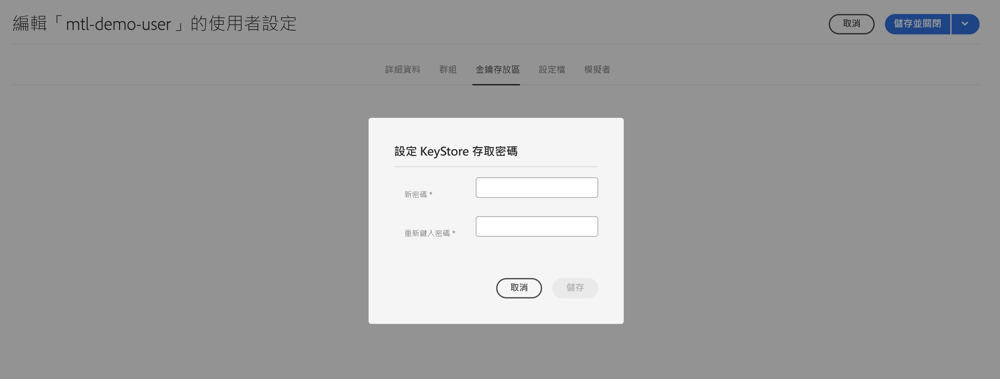
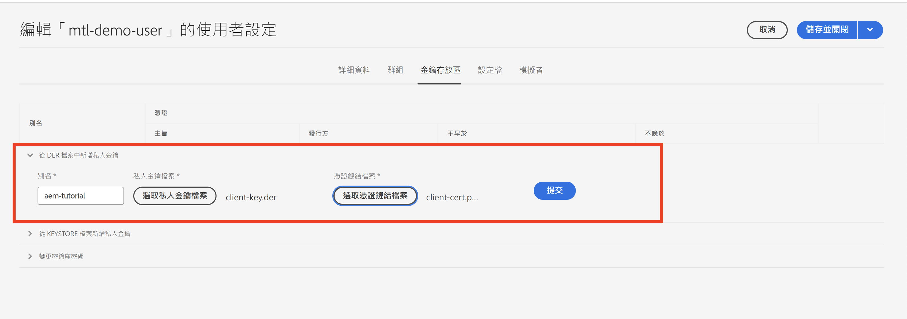
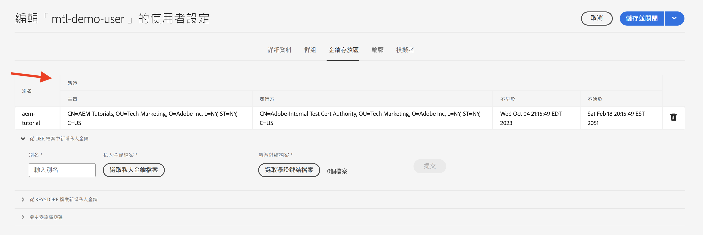

# 來自 AEM 的雙向傳輸層安全性 (mTLS) 驗證

了解如何從 AEM 對需要雙向傳輸層安全性 (mTLS) 驗證的 Web API 進行 HTTPS 呼叫。

>[!VIDEO](https://video.tv.adobe.com/v/3424855?quality=12&learn=on)

mTLS 或雙向 TLS 驗證會要求&#x200B;**用戶端和伺服器兩者進行雙向驗證**，藉以增強 TLS 通訊協定的安全性。這項驗證使用數位憑證來執行驗證。在強大安全性和身分驗證極為重要的情境中經常使用這項驗證。

預設情況下，嘗試與需要進行 mTLS 驗證的 Web API 建立 HTTPS 連線時，連線會失敗並出現以下錯誤：

```
javax.net.ssl.SSLHandshakeException: Received fatal alert: certificate_required
```

當用戶端未提供憑證來驗證自身的身分時，就會出現此問題。

來了解如何使用 [Apache HttpClient](https://hc.apache.org/httpcomponents-client-4.5.x/index.html) 和 **AEM 的 KeyStore 與 TrustStore** 成功呼叫需要 mTLS 驗證的 API。


## HttpClient 與載入 AEM KeyStore 素材

概略來說，從 AEM 呼叫受 mTLS 保護的 API 需要進行以下步驟。

### AEM 憑證產生

與您組織的安全性團隊合作申請 AEM 憑證。安全性團隊提供或詢問與憑證相關的詳細資訊，例如金鑰、憑證申請檔 (CSR)，並使用 CSR 來發行憑證。

為進行示範，產生與憑證相關的詳細資訊，例如金鑰、憑證申請檔 (CSR)。在下方範例中，使用自我簽署 CA 來發行憑證。

- 首先，產生內部憑證授權單位 (CA) 憑證。

  ```shell
  # Create an internal Certification Authority (CA) certificate
  openssl req -new -x509 -days 9999 -keyout internal-ca-key.pem -out internal-ca-cert.pem
  ```

- 產生 AEM 憑證。

  ```shell
  # Generate Key
  openssl genrsa -out client-key.pem
  
  # Generate CSR
  openssl req -new -key client-key.pem -out client-csr.pem
  
  # Generate certificate and sign with internal Certification Authority (CA)
  openssl x509 -req -days 9999 -in client-csr.pem -CA internal-ca-cert.pem -CAkey internal-ca-key.pem -CAcreateserial -out client-cert.pem
  
  # Verify certificate
  openssl verify -CAfile internal-ca-cert.pem client-cert.pem
  ```

- 將 AEM 私密金鑰轉換為 DER 格式，AEM 的 KeyStore 需要 DER 格式的私密金鑰。

  ```shell
  openssl pkcs8 -topk8 -inform PEM -outform DER -in client-key.pem -out client-key.der -nocrypt
  ```

>[!TIP]
>
>自我簽署的 CA 憑證僅供開發使用。若要進行生產，請使用受信任的憑證授權單位 (CA) 發行憑證。


### 憑證交換

若使用自我簽署 CA 作為 AEM 憑證 (如上所述)，請將憑證或內部憑證授權單位 (CA) 憑證傳送給 API 提供者。

此外，如果 API 提供者使用自我簽署的 CA 憑證，請接收 API 提供者所提供的憑證或內部憑證授權單位 (CA) 憑證。

### 憑證匯入

若要匯入 AEM 的憑證，請依照下列步驟進行：

1. 以&#x200B;**管理員**&#x200B;身分登入 **AEM Author**。

1. 導覽至&#x200B;**「AEM Author」>「工具」>「安全性」>「使用者」>「建立或選取現有使用者」**。

   

   為進行示範，已建立一個新的使用者，名稱為 `mtl-demo-user`。

1. 按一下使用者名稱，開啟「**使用者屬性**」。

1. 按一下「**Keystore**」索引標籤，然後按一下「**建立 Keystore**」按鈕。接著在「**設定 Keystore 存取密碼**」對話框中，設定此使用者的 Keystore 密碼，然後按一下「儲存」。

   

1. 在新畫面中，在&#x200B;**從 DER 檔案新增私密金鑰**&#x200B;區段之下，請依照下列步驟進行：

   1. 輸入別名

   1. 匯入在上述步驟產生的 DER 格式 AEM 私密金鑰。

   1. 匯入在上述步驟產生的憑證鏈檔案。

   1. 按一下「提交」

      

1. 檢查並確認憑證是否已成功匯入。

   

若 API 提供者使用自我簽署的 CA 憑證，請將接收到的憑證匯入 AEM 的 TrustStore，並依照[此處](https://experienceleague.adobe.com/docs/experience-manager-learn/foundation/security/call-internal-apis-having-private-certificate.html#httpclient-and-load-aem-truststore-material)的步驟進行。

同樣地，若 AEM 使用自我簽署的 CA 憑證，需要求 API 提供者匯入憑證。

### 使用 HttpClient 之原型 mTLS API 叫用程式碼

如下方所示更新 Java™ 程式碼。若要使用 `@Reference` 註解來取得 AEM 的 `KeyStoreService` 服務，呼叫程式碼必須為 OSGi 元件/服務，或者 Sling 模型 (且有使用 `@OsgiService`)。


```java
...

// Get AEM's KeyStoreService reference
@Reference
private com.adobe.granite.keystore.KeyStoreService keyStoreService;

...

// Get AEM KeyStore using KeyStoreService
KeyStore aemKeyStore = getAEMKeyStore(keyStoreService, resourceResolver);

if (aemKeyStore != null) {

    // Create SSL Context
    SSLContextBuilder sslbuilder = new SSLContextBuilder();

    // Load AEM KeyStore material into above SSL Context with keystore password
    // Ideally password should be encrypted and stored in OSGi config
    sslbuilder.loadKeyMaterial(aemKeyStore, "admin".toCharArray());

    // If API provider cert is self-signed, load AEM TrustStore material into above SSL Context
    // Get AEM TrustStore
    KeyStore aemTrustStore = getAEMTrustStore(keyStoreService, resourceResolver);
    sslbuilder.loadTrustMaterial(aemTrustStore, null);

    // Create SSL Connection Socket using above SSL Context
    SSLConnectionSocketFactory sslsf = new SSLConnectionSocketFactory(
            sslbuilder.build(), NoopHostnameVerifier.INSTANCE);

    // Create HttpClientBuilder
    HttpClientBuilder httpClientBuilder = HttpClientBuilder.create();
    httpClientBuilder.setSSLSocketFactory(sslsf);

    // Create HttpClient
    CloseableHttpClient httpClient = httpClientBuilder.build();

    // Invoke API
    closeableHttpResponse = httpClient.execute(new HttpGet(MTLS_API_ENDPOINT));

    // Code that reads response code and body from the 'closeableHttpResponse' object
    ...
} 

/**
 * Returns the AEM KeyStore of a user. In this example we are using the
 * 'mtl-demo-user' user.
 * 
 * @param keyStoreService
 * @param resourceResolver
 * @return AEM KeyStore
 */
private KeyStore getAEMKeyStore(KeyStoreService keyStoreService, ResourceResolver resourceResolver) {

    // get AEM KeyStore of 'mtl-demo-user' user, you can create a user or use an existing one. 
    // Then create keystore and upload key, certificate files.
    KeyStore aemKeyStore = keyStoreService.getKeyStore(resourceResolver, "mtl-demo-user");

    return aemKeyStore;
}

/**
 * 
 * Returns the global AEM TrustStore
 * 
 * @param keyStoreService OOTB OSGi service that makes AEM based KeyStore
 *                         operations easy.
 * @param resourceResolver
 * @return
 */
private KeyStore getAEMTrustStore(KeyStoreService keyStoreService, ResourceResolver resourceResolver) {

    // get AEM TrustStore from the KeyStoreService and ResourceResolver
    KeyStore aemTrustStore = keyStoreService.getTrustStore(resourceResolver);

    return aemTrustStore;
}

...
```

- 將 OOTB `com.adobe.granite.keystore.KeyStoreService` OSGi 服務注入到您的 OSGi 元件中。
- 使用 `KeyStoreService` 和 `ResourceResolver` 取得使用者的 AEM KeyStore，使用 `getAEMKeyStore(...)` 方法可完成此作業。
- 若 API 提供者使用自我簽署的 CA 憑證，請取得全域 AEM TrustStore，使用 `getAEMTrustStore(...)` 方法可完成此作業。
- 建立一個 `SSLContextBuilder` 物件，請參閱 Java™ [API 詳細資訊](https://javadoc.io/static/org.apache.httpcomponents/httpcore/4.4.8/index.html?org/apache/http/ssl/SSLContextBuilder.html)。
- 使用 `loadKeyMaterial(final KeyStore keystore,final char[] keyPassword)` 方法將使用者的 AEM KeyStore 載入到 `SSLContextBuilder` 中。
- Keystore 密碼是建立 Keystore 時所設定的密碼，其應該會儲存在 OSGi 設定中，請參閱[機密設定值](https://experienceleague.adobe.com/docs/experience-manager-cloud-service/content/implementing/deploying/configuring-osgi.html#secret-configuration-values)。

## 避免 JVM Keystore 變更

使用私人憑證有效叫用 mTLS API 的傳統方法必須修改 JVM Keystore。使用 Java™ [keytool](https://docs.oracle.com/en/java/javase/11/tools/keytool.html#GUID-5990A2E4-78E3-47B7-AE75-6D1826259549) 命令匯入私人憑證即可做到。

然而，此方法不符合安全性最佳實務，而 AEM 提供極佳的選項，即使用&#x200B;**使用者特定的 KeyStore 和 Global TrustStore** 以及 [KeyStoreService](https://javadoc.io/doc/com.adobe.aem/aem-sdk-api/latest/com/adobe/granite/keystore/KeyStoreService.html)。

## 解決方案套件

影片中示範的範例 Node.js 專案可於[此處](assets/internal-api-call/REST-APIs.zip)下載。

AEM servlet 程式碼可於 WKND 網站專案的 `tutorial/web-api-invocation` 分支中找到，[請參閱此處](https://github.com/adobe/aem-guides-wknd/tree/tutorial/web-api-invocation/core/src/main/java/com/adobe/aem/guides/wknd/core/servlets)。
