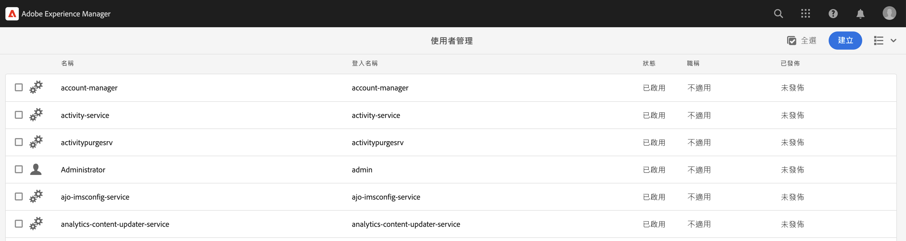

# 來自AEM的相互傳輸層安全性(mTLS)驗證

瞭解如何從AEM對需要相互傳輸層安全性(mTLS)驗證的網頁API進行HTTPS呼叫。

>[!VIDEO](https://video.tv.adobe.com/v/3424855?quality=12&learn=on)

mTLS或雙向TLS驗證會要求&#x200B;**使用者端和伺服器都相互驗證**，藉以增強TLS通訊協定的安全性。 此驗證透過使用數位憑證完成。 它通常用於高度安全性和身分驗證至關重要的情況。

根據預設，嘗試與需要mTLS驗證的網頁API建立HTTPS連線時，連線會失敗並出現錯誤：

```
javax.net.ssl.SSLHandshakeException: Received fatal alert: certificate_required
```

當使用者端沒有提供憑證來驗證自己時，就會發生此問題。

讓我們瞭解如何使用[Apache HttpClient](https://hc.apache.org/httpcomponents-client-4.5.x/index.html)和&#x200B;**AEM的KeyStore和TrustStore**，成功呼叫需要mTLS驗證的API。


## HttpClient和載入AEM KeyStore資料

從高層面來看，從AEM呼叫受mTLS保護的API需要以下步驟。

### AEM憑證產生

與貴組織的安全團隊合作，請求AEM憑證。 安全性團隊會提供或要求與憑證相關的詳細資訊，例如金鑰、憑證申請檔(CSR)，並使用CSR簽發憑證。

為了示範用途，請產生憑證相關的詳細資訊，例如金鑰、憑證申請檔(CSR)。 在以下範例中，使用自我簽署CA來發行憑證。

- 首先，產生內部憑證授權單位(CA)憑證。

  ```shell
  # Create an internal Certification Authority (CA) certificate
  openssl req -new -x509 -days 9999 -keyout internal-ca-key.pem -out internal-ca-cert.pem
  ```

- 產生AEM憑證。

  ```shell
  # Generate Key
  openssl genrsa -out client-key.pem
  
  # Generate CSR
  openssl req -new -key client-key.pem -out client-csr.pem
  
  # Generate certificate and sign with internal Certification Authority (CA)
  openssl x509 -req -days 9999 -in client-csr.pem -CA internal-ca-cert.pem -CAkey internal-ca-key.pem -CAcreateserial -out client-cert.pem
  
  # Verify certificate
  openssl verify -CAfile internal-ca-cert.pem client-cert.pem
  ```

- 將AEM私密金鑰轉換為DER格式，AEM KeyStore需要DER格式的私密金鑰。

  ```shell
  openssl pkcs8 -topk8 -inform PEM -outform DER -in client-key.pem -out client-key.der -nocrypt
  ```

>[!TIP]
>
>自我簽署CA憑證僅用於開發目的。 在生產環境中，請使用受信任的憑證授權單位(CA)來核發憑證。


### 憑證交換

如果對AEM憑證使用自我簽署CA （如上所述），請將憑證或內部憑證授權單位(CA)憑證傳送給API提供者。

此外，如果API提供者使用自我簽署的CA憑證，請從API提供者接收憑證或內部憑證授權單位(CA)憑證。

### 憑證匯入

若要匯入AEM憑證，請遵循下列步驟：

1. 以&#x200B;**管理員**&#x200B;身分登入&#x200B;**AEM作者**。

1. 瀏覽至&#x200B;**AEM作者>工具>安全性>使用者>建立或選取現有使用者**。

   

   為了示範目的，已建立名為`mtl-demo-user`的新使用者。

1. 若要開啟&#x200B;**使用者屬性**，請按一下使用者名稱。

1. 按一下&#x200B;**金鑰存放區**&#x200B;索引標籤，然後按一下&#x200B;**建立金鑰存放區**&#x200B;按鈕。 然後在&#x200B;**設定KeyStore存取密碼**&#x200B;對話方塊中，設定此使用者的金鑰存放區密碼，然後按一下[儲存]。

   

1. 在新畫面的&#x200B;**「從DER檔案新增私密金鑰」**&#x200B;區段下，請遵循下列步驟：

   1. 輸入別名

   1. 匯入上述產生的DER格式的AEM私密金鑰。

   1. 匯入上述產生的憑證鏈結檔案。

   1. 按一下提交

      

1. 確認憑證已成功匯入。

   

如果API提供者使用自我簽署CA憑證，請將收到的憑證匯入AEM的TrustStore，請依照[這裡](https://experienceleague.adobe.com/docs/experience-manager-learn/foundation/security/call-internal-apis-having-private-certificate.html#httpclient-and-load-aem-truststore-material)的步驟執行。

同樣地，如果AEM使用自我簽署CA憑證，請要求API提供者匯入該憑證。

### 使用HttpClient的典型mTLS API叫用代碼

更新如下所示的Java™程式碼。 若要使用`@Reference`註解來取得AEM `KeyStoreService`服務，呼叫程式碼必須是OSGi元件/服務或Sling模型（其中使用`@OsgiService`）。


```java
...

// Get AEM's KeyStoreService reference
@Reference
private com.adobe.granite.keystore.KeyStoreService keyStoreService;

...

// Get AEM KeyStore using KeyStoreService
KeyStore aemKeyStore = getAEMKeyStore(keyStoreService, resourceResolver);

if (aemKeyStore != null) {

    // Create SSL Context
    SSLContextBuilder sslbuilder = new SSLContextBuilder();

    // Load AEM KeyStore material into above SSL Context with keystore password
    // Ideally password should be encrypted and stored in OSGi config
    sslbuilder.loadKeyMaterial(aemKeyStore, "admin".toCharArray());

    // If API provider cert is self-signed, load AEM TrustStore material into above SSL Context
    // Get AEM TrustStore
    KeyStore aemTrustStore = getAEMTrustStore(keyStoreService, resourceResolver);
    sslbuilder.loadTrustMaterial(aemTrustStore, null);

    // Create SSL Connection Socket using above SSL Context
    SSLConnectionSocketFactory sslsf = new SSLConnectionSocketFactory(
            sslbuilder.build(), NoopHostnameVerifier.INSTANCE);

    // Create HttpClientBuilder
    HttpClientBuilder httpClientBuilder = HttpClientBuilder.create();
    httpClientBuilder.setSSLSocketFactory(sslsf);

    // Create HttpClient
    CloseableHttpClient httpClient = httpClientBuilder.build();

    // Invoke API
    closeableHttpResponse = httpClient.execute(new HttpGet(MTLS_API_ENDPOINT));

    // Code that reads response code and body from the 'closeableHttpResponse' object
    ...
} 

/**
 * Returns the AEM KeyStore of a user. In this example we are using the
 * 'mtl-demo-user' user.
 * 
 * @param keyStoreService
 * @param resourceResolver
 * @return AEM KeyStore
 */
private KeyStore getAEMKeyStore(KeyStoreService keyStoreService, ResourceResolver resourceResolver) {

    // get AEM KeyStore of 'mtl-demo-user' user, you can create a user or use an existing one. 
    // Then create keystore and upload key, certificate files.
    KeyStore aemKeyStore = keyStoreService.getKeyStore(resourceResolver, "mtl-demo-user");

    return aemKeyStore;
}

/**
 * 
 * Returns the global AEM TrustStore
 * 
 * @param keyStoreService OOTB OSGi service that makes AEM based KeyStore
 *                         operations easy.
 * @param resourceResolver
 * @return
 */
private KeyStore getAEMTrustStore(KeyStoreService keyStoreService, ResourceResolver resourceResolver) {

    // get AEM TrustStore from the KeyStoreService and ResourceResolver
    KeyStore aemTrustStore = keyStoreService.getTrustStore(resourceResolver);

    return aemTrustStore;
}

...
```

- 將OOTB `com.adobe.granite.keystore.KeyStoreService` OSGi服務插入您的OSGi元件。
- 使用`KeyStoreService`和`ResourceResolver`取得使用者的AEM KeyStore，`getAEMKeyStore(...)`方法會執行此動作。
- 如果API提供者使用自我簽署CA憑證，請取得全域AEM TrustStore，`getAEMTrustStore(...)`方法就會執行此動作。
- 建立`SSLContextBuilder`的物件，請參閱Java™ [API詳細資料](https://javadoc.io/static/org.apache.httpcomponents/httpcore/4.4.8/index.html?org/apache/http/ssl/SSLContextBuilder.html)。
- 使用`loadKeyMaterial(final KeyStore keystore,final char[] keyPassword)`方法將使用者的AEM KeyStore載入`SSLContextBuilder`。
- 金鑰存放區密碼是建立金鑰存放區時設定的密碼，應儲存在OSGi設定中，請參閱[密碼設定值](https://experienceleague.adobe.com/docs/experience-manager-cloud-service/content/implementing/deploying/configuring-osgi.html#secret-configuration-values)。

## 避免JVM金鑰存放區變更

使用私密憑證有效叫用mTLS API的傳統方法涉及修改JVM金鑰存放區。 這是透過使用Java™ [keytool](https://docs.oracle.com/en/java/javase/11/tools/keytool.html#GUID-5990A2E4-78E3-47B7-AE75-6D1826259549)命令匯入私人憑證來達成。

但是，此方法不符合安全性最佳實務，AEM透過使用&#x200B;**使用者特定的KeyStore以及全域TrustStore**&#x200B;和[KeyStoreService](https://javadoc.io/doc/com.adobe.aem/aem-sdk-api/latest/com/adobe/granite/keystore/KeyStoreService.html)，提供優異的選項。

## 解決方案套件

可從[這裡](assets/internal-api-call/REST-APIs.zip)下載影片中降級的範例Node.js專案。

AEM servlet程式碼可在WKND Sites專案的`tutorial/web-api-invocation`分支[參閱](https://github.com/adobe/aem-guides-wknd/tree/tutorial/web-api-invocation/core/src/main/java/com/adobe/aem/guides/wknd/core/servlets)中使用。
