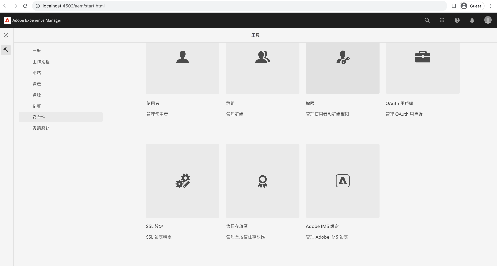
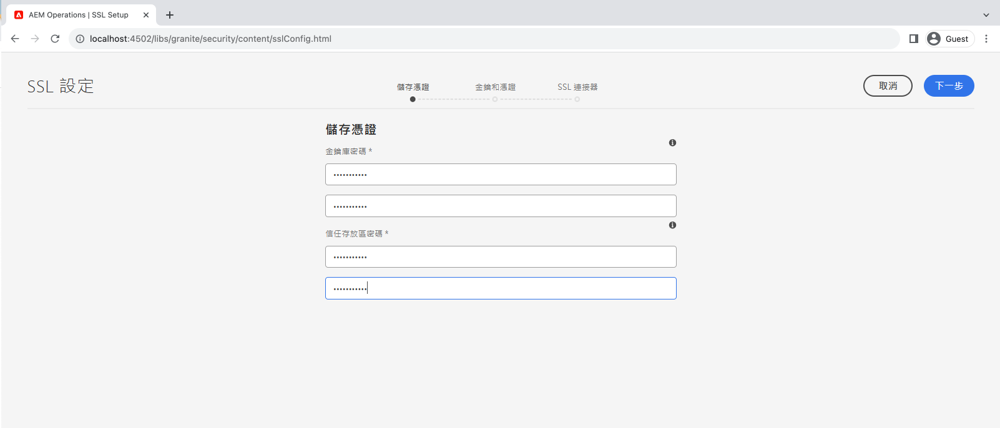
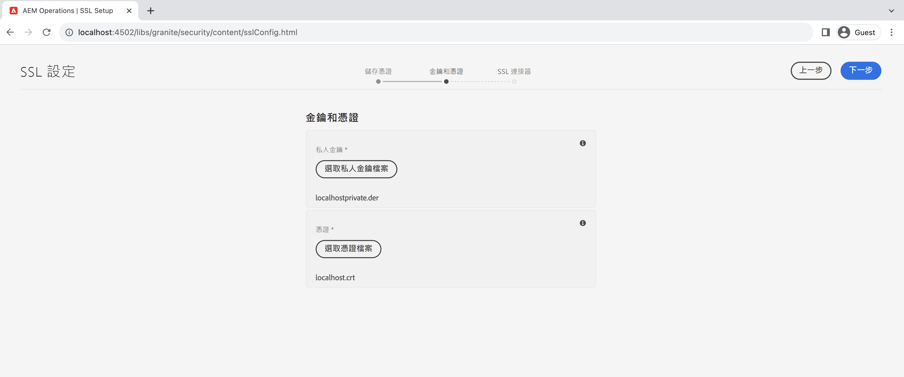
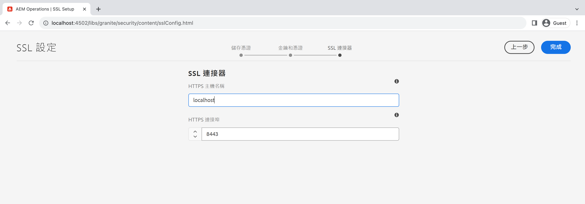
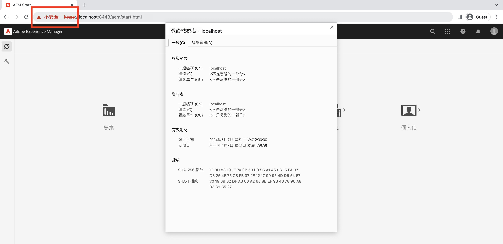

# 在AEM中使用SSL精靈

瞭解如何在Adobe Experience Manager中設定SSL，使用內建SSL精靈讓SSL透過HTTPS執行。

>[!VIDEO](https://video.tv.adobe.com/v/17993?quality=12&learn=on)


>[!NOTE]
>
>對於受管理的環境，最好由IT部門提供CA信任的憑證和金鑰。
>
>自我簽署憑證僅用於開發目的。

## 使用SSL設定精靈

瀏覽至 __AEM作者>工具>安全性> SSL設定__，然後開啟 __SSL設定精靈__.



### 建立存放區認證

若要建立 _金鑰存放區_ 與 `ssl-service` 系統使用者和全域 _信任存放區_，使用 __儲存認證__ 精靈步驟。

1. 輸入密碼並確認密碼 __金鑰存放區__ 與 `ssl-service` 系統使用者。
1. 輸入全域密碼和確認密碼 __信任存放區__. 請注意，這是系統範圍的信任存放區，如果已建立，則會忽略輸入的密碼。

   

### 上傳私密金鑰和憑證

若要上傳 _私密金鑰_ 和 _SSL憑證_，使用 __金鑰與憑證__ 精靈步驟。

通常您的IT部門會提供CA信任的憑證和金鑰，但自我簽署憑證可用於 __開發__ 和 __測試__ 目的。

若要建立或下載自我簽署憑證，請參閱 [自我簽署私密金鑰和憑證](#self-signed-private-key-and-certificate).

1. 上傳 __私密金鑰__ DER （辨別編碼規則）格式。 不同於PEM，DER編碼的檔案不包含純文字陳述式，例如 `-----BEGIN CERTIFICATE-----`
1. 上傳相關聯的 __SSL憑證__ 在 `.crt` 格式。

   

### 更新SSL聯結器詳細資料

若要更新 _主機名稱_ 和 _連線埠_ 使用 __SSL聯結器__ 精靈步驟。

1. 更新或驗證 __HTTPS主機名稱__ 值，它應符合 `Common Name (CN)` 從憑證。
1. 更新或驗證 __HTTPS連線埠__ 值。

   

### 驗證SSL設定

1. 若要驗證SSL，請按一下 __前往HTTPS URL__ 按鈕。
1. 如果使用自我簽署憑證，您會看到 `Your connection is not private` 錯誤。

   

## 自我簽署私密金鑰和憑證

以下zip包含 [!DNL DER] 和 [!DNL CRT] 在本機設定AEM SSL所需的檔案，且僅供本機開發使用。

此 [!DNL DER] 和 [!DNL CERT] 提供檔案是為了方便起見，並使用以下產生私密金鑰和自簽憑證一節中概述的步驟產生。

如有需要，憑證密語為 **管理員**.

此localhost — 私密金鑰和自簽的certificate.zip （2028年7月到期）

[下載憑證檔案](assets/use-the-ssl-wizard/certificate.zip)

### 私密金鑰和自簽憑證產生

上述影片說明在AEM製作執行個體使用自我簽署憑證時，SSL的設定和設定。 以下命令使用 [[!DNL OpenSSL]](https://www.openssl.org/) 可以產生私密金鑰和憑證，以用於精靈的步驟2。

```shell
### Create Private Key
$ openssl genrsa -aes256 -out localhostprivate.key 4096

### Generate Certificate Signing Request using private key
$ openssl req -sha256 -new -key localhostprivate.key -out localhost.csr -subj '/CN=localhost'

### Generate the SSL certificate and sign with the private key, will expire one year from now
$ openssl x509 -req -extfile <(printf "subjectAltName=DNS:localhost") -days 365 -in localhost.csr -signkey localhostprivate.key -out localhost.crt

### Convert Private Key to DER format - SSL wizard requires key to be in DER format
$ openssl pkcs8 -topk8 -inform PEM -outform DER -in localhostprivate.key -out localhostprivate.der -nocrypt
```
