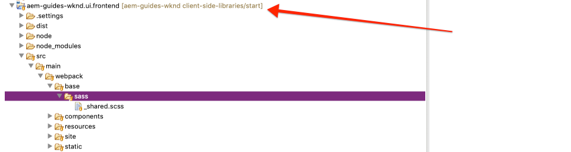

# 用戶端程式庫和前端工作流程{#client-side-libraries}

瞭解如何使用用戶端資料庫或用戶端資料庫來部署及管理Adobe Experience Manager(AEM)Sites實作的CSS和Javascript。 本教學課程還將介紹如何將[ui.frontend](https://docs.adobe.com/content/help/en/experience-manager-core-components/using/developing/archetype/uifrontend.html)模組（解耦[webpack](https://webpack.js.org/)項目）整合到端到端構建過程中。

## 必備條件 {#prerequisites}

檢閱設定[本機開發環境](overview.md#local-dev-environment)所需的工具和指示。

此外，建議您檢閱[元件基本功能](component-basics.md#client-side-libraries)教學課程，以瞭解用戶端程式庫和AEM的基礎。

### Starter Project

查看教學課程所建立的基線程式碼：

1. 克隆[github.com/adobe/aem-guides-wknd](https://github.com/adobe/aem-guides-wknd)儲存庫。
1. 查看`client-side-libraries/start`分支

   ```shell
   $ git clone git@github.com:adobe/aem-guides-wknd.git ~/code/aem-guides-wknd
   $ cd ~/code/aem-guides-wknd
   $ git checkout client-side-libraries/start
   ```

1. 使用您的Maven技巧，將程式碼庫部署至本機AEM實例：

   ```shell
   $ cd ~/code/aem-guides-wknd
   $ mvn clean install -PautoInstallSinglePackage
   ```

您隨時都可以在[GitHub](https://github.com/adobe/aem-guides-wknd/tree/client-side-libraries/solution)上檢視完成的程式碼，或切換至分支`client-side-libraries/solution`，在本機檢出程式碼。

## 目標

1. 瞭解如何透過可編輯的範本將用戶端程式庫包含在頁面上。
1. 瞭解如何使用UI.Frontend Module和網頁套件開發伺服器進行專屬的前端開發。
1. 瞭解將編譯的CSS和JavaScript傳送至網站實作的端對端工作流程。

## 您將建立的{#what-you-will-build}

在本章中，您將新增WKND網站和「文章頁面範本」的一些基準樣式，以便讓實作更接近[UI設計模型](assets/pages-templates/wknd-article-design.xd)。 您將使用進階的前端工作流程，將Webpack專案整合至AEM用戶端程式庫。

>[!VIDEO](https://video.tv.adobe.com/v/30359/?quality=12&learn=on)

## 背景 {#background}

用戶端程式庫提供組織和管理AEM網站實作所需CSS和JavaScript檔案的機制。 用戶端程式庫或用戶端程式庫的基本目標為：

1. 將CSS/JS儲存在小型的獨立檔案中，以方便開發和維護
1. 以有組織的方式管理對第三方架構的依賴
1. 將CSS/JS串連至一或兩個請求，將用戶端請求數減至最少。

有關使用[用戶端程式庫的詳細資訊，請參閱這裡。](https://docs.adobe.com/content/help/en/experience-manager-65/developing/introduction/clientlibs.html)

用戶端程式庫確實有一些限制。 最值得注意的是，對常用前端語言（例如Sass、LESS和TypeScript）的支援有限。 在教學課程中，我們將瞭解&#x200B;**ui.frontend**&#x200B;模組如何協助解決此問題。

將起始程式碼庫部署至本機AEM例項，並導覽至[http://localhost:4502/editor.html/content/wknd/us/en/magazine/guide-la-skateparks.html](http://localhost:4502/editor.html/content/wknd/us/en/magazine/guide-la-skateparks.html)。 此頁面目前未設定樣式。 我們接下來將實作WKND品牌的用戶端程式庫，以新增CSS和Javascript至頁面。

## 客戶端庫組織{#organization}

接下來，我們將探討由[AEM Project Archetype](https://docs.adobe.com/content/help/en/experience-manager-core-components/using/developing/archetype/overview.html)產生的clientlibs的組織。


*高階圖用戶端程式庫組織與頁面包含*

>[!NOTE]
>
> 下列用戶端程式庫組織由AEM Project Archetype產生，但僅代表一個起點。 專案如何最終管理CSS和Javascript並將它傳送至Sites實作，會因資源、技能和需求而大幅不同。

1. 使用Eclipse或其他IDE可開啟&#x200B;**ui.apps**&#x200B;模組。
1. 展開路徑`/apps/wknd/clientlibs`以查看原型生成的clientlibs。

   

   我們將在下面詳細檢查這些clientlib。

1. 檢查`clientlibs/clientlib-base`的屬性。

   **clientlib-** base代表WKND網站運作所需的CSS和JavaScript基本層級。請注意設為`wknd.base`的屬性`categories`。 `categories` 是clientlibs的標籤機制，也是它們的引用方式。

   請注意`embed`屬性和`String[]`值。 `embed`屬性會根據其類別內嵌其他clientlib。 **clientlib-** base將包含所有需要的AEM Core Component clientlibrary。這包括要運作的Carousel、Quick search元件等物件。 **clientlib-** base將不包含其本身的任何CSS和Javascript，但只會內嵌其他用戶端程式庫。**clientlib-** base嵌入clientlib- **gridclientlib** 的類別中 `wknd.grid`。

   請注意，`allowProxy`屬性設為`true`。 始終在clientlibs上設定`allowProxy=true`是最佳做法。 `allowProxy`屬性可讓我們將clientlibs與我們的應用程式碼一起儲存在`/apps` **，但**&#x200B;下，然後將clientlibs傳遞到前置有`/etc.clientlibs`的路徑，以避免將任何應用程式碼暴露給使用者。 有關[allowProxy屬性的更多資訊，請參閱這裡。](https://docs.adobe.com/content/help/en/experience-manager-65/developing/introduction/clientlibs.html#locating-a-client-library-folder-and-using-the-proxy-client-libraries-servlet)。

1. 檢查`clientlibs/clientlib-grid`的屬性。

   **clientlib-** gridis負責納入／產生「版面配置」模 [式](https://docs.adobe.com/content/help/en/experience-manager-65/authoring/siteandpage/responsive-layout.html) 與AEM Sites編輯器搭配運作所需的CSS。**clientlib-** gridhad類別集設為， `wknd.grid` 並透過 **clientlib-base內嵌**。

   您可自訂格線，以使用不同數量的欄和中斷點。 接下來，我們將更新生成的預設斷點。

1. 更新檔案`/apps/wknd/clientlibs/clientlib-grid/less/grid.less`:

   ```css
   @import (once) "/libs/wcm/foundation/clientlibs/grid/grid_base.less";
   
   /* maximum amount of grid cells to be provided */
   @max_col: 12;
   @screen-small: 767px;
   @screen-medium: 1024px;
   @screen-large: 1200px;
   @gutter-padding: 14px;
   
   /* default breakpoint */
   .aem-Grid {
       .generate-grid(default, @max_col);
   }
   
   /* phone breakpoint */
   @media (max-width: @screen-small) {
       .aem-Grid {
           .generate-grid(phone, @max_col);
       }
   }
   /* tablet breakpoint */
   @media (min-width: (@screen-small + 1)) and (max-width: @screen-medium) {
       .aem-Grid {
           .generate-grid(tablet, @max_col);
       }
   }
   
   .aem-GridColumn {
       padding: 0 @gutter-padding;
   }
   
   .responsivegrid.aem-GridColumn {
       padding-left: 0;
       padding-right: 0;
   }
   ```

   這會變更中斷點，以對應我們在`/ui.content/src/main/content/jcr_root/conf/wknd/settings/wcm/templates/article-page-template/structure/.content.xml`中設定的範本中斷點。

   請注意，此檔案實際上會參照`/libs`下方的`grid_base.less`檔案，其中包含自訂混音以產生格線。

1. 檢查`clientlibs/clientlib-site`的屬性。

   **clientlib-** site將包含WKND品牌的所有網站特定樣式。請注意`wknd.site`的類別。 產生此clientlib的CSS和Javascript實際上會維護在`ui.frontend`模組中。 我們接下來將探討此項整合。

1. 檢查`clientlibs/clientlib-dependencies`的屬性。

   **clientlib-** dependenciesis旨在嵌入任何第三方相依性。它是個別的clientlib，因此可視需要將它載入HTML頁面的頂端。 請注意`wknd.dependencies`的類別。 產生此clientlib的CSS和Javascript實際上會維護在`ui.frontend`模組中。 我們將在教學課程的稍後部份探索此項整合。

## 使用ui.frontend模組{#ui-frontend}

接下來，我們將探討&#x200B;**[ui.frontend](https://docs.adobe.com/content/help/en/experience-manager-core-components/using/developing/archetype/uifrontend.html)**&#x200B;模組的使用。

### 動機

在支援[Sass](https://sass-lang.com/)或[TypeScript](https://www.typescriptlang.org/)等語言時，用戶端程式庫有一些限制。 此外，開放原始碼工具如[NPM](https://www.npmjs.com/)和[webpack](https://webpack.js.org/)也大量湧現，可加速並最佳化前端開發。

**ui.frontend**&#x200B;模組的基本理念是能夠使用像NPM和Webpack這樣的絕佳工具來管理大多數前端開發。 內建在&#x200B;**ui.frontend**&#x200B;模組中的關鍵整合項目[aem-clientlib-generator](https://github.com/wcm-io-frontend/aem-clientlib-generator)會從webpack/npm專案擷取已編譯的CSS和JS對象，並將它們轉換為AEM用戶端程式庫。 這可讓前端開發人員更自由地選擇不同的工具和技術。


### 使用

現在，我們將透過&#x200B;**ui.frontend**&#x200B;模組新增部分Sass檔案（`.scss`擴充功能），為WKND品牌新增一些基本樣式。

1. 開啟&#x200B;**ui.frontend**&#x200B;模組並導航至`src/main/webpack/base/sass`。

   

1. 在資料夾`src/main/webpack/base/sass`下建立名為`_variables.scss`的新檔案。
1. 將`_variables.scss`填入以下內容：

   ```scss
   //== Colors
   //
   //## Gray and brand colors for use across theme.
   
   $black:                  #202020;
   $gray:                   #696969;
   $gray-light:             #EBEBEB;
   $gray-lighter:           #F7F7F7;
   $white:                  #ffffff;
   $yellow:                 #FFE900;
   $blue:                   #0045FF;
   $pink:                   #FF0058;
   
   $brand-primary:           $yellow;
   
   //== Layout
   $gutter-padding: 14px;
   $max-width: 1164px;
   $max-body-width: 1680px;
   $screen-xsmall: 475px;
   $screen-small: 767px;
   $screen-medium: 1024px;
   $screen-large: 1200px;
   
   //== Scaffolding
   //
   //## Settings for some of the most global styles.
   $body-bg:                   $white;
   $text-color:                $black;
   $text-color-inverse:        $gray-light;
   
   $brand-secondary:           $black;
   
   $brand-third:               $gray-light;
   $link-color:                $blue;
   $link-hover-color:          $link-color;
   $link-hover-decoration:     underline;
   $nav-link:                  $black;
   $nav-link-inverse:          $gray-light;
   
   //== Typography
   //
   //## Font, line-height, and color for body text, headings, and more.
   
   $font-family-sans-serif:  "Source Sans Pro", "Helvetica Neue", Helvetica, Arial, sans-serif;
   $font-family-serif:       "Asar",Georgia, "Times New Roman", Times, serif;
   $font-family-base:        $font-family-sans-serif;
   
   $font-size-base:          18px;
   $font-size-large:         24px;
   $font-size-xlarge:        48px;
   $font-size-medium:        18px;
   $font-size-small:         14px;
   $font-size-xsmall:        12px;
   
   $font-size-h1:            40px;
   $font-size-h2:            36px;
   $font-size-h3:            24px;
   $font-size-h4:            16px;
   $font-size-h5:            14px;
   $font-size-h6:            10px;
   
   $line-height-base:        1.5;
   $line-height-computed:    floor(($font-size-base * $line-height-base)); // ~20px
   
   $font-weight-light:      300;
   $font-weight-normal:     normal;
   $font-weight-semi-bold:  400;
   $font-weight-bold:       600;
   ```

   Sass可讓我們建立變數，然後可在不同檔案中使用這些變數，以確保一致性。 請注意字型系列。 在教學課程的稍後部份，我們將瞭解如何加入對Google網頁字型的呼叫，以便使用這些字型。

1. 在`src/main/webpack/base/sass`下方建立另一個名為`_elements.scss`的檔案，並填入下列內容：

   ```scss
   body {
       background-color: $body-bg;
       font-family: $font-family-base;
       margin: 0;
       padding: 0;
       font-size: $font-size-base;
       text-align: left;
       color: $text-color;
       line-height: $line-height-base;
   
       .root {
           max-width: $max-width;
           margin: 0 auto;
       }
   }
   
   // Headings
   // -------------------------
   
   h1, h2, h3, h4, h5, h6,
   .h1, .h2, .h3, .h4, .h5, .h6 {
       line-height: $line-height-base;
       color: $text-color;
   }
   
   h1, .h1,
   h2, .h2,
   h3, .h3 {
       font-family: $font-family-serif;
       font-weight: $font-weight-normal;
       margin-top: $line-height-computed;
       margin-bottom: ($line-height-computed / 2);
   }
   
   h4, .h4,
   h5, .h5,
   h6, .h6 {
       font-family: $font-family-sans-serif;
       text-transform: uppercase;
       font-weight: $font-weight-bold;
   }
   
   h1, .h1 { font-size: $font-size-h1; }
   h2, .h2 { font-size: $font-size-h2; }
   h3, .h3 { font-size: $font-size-h3; }
   h4, .h4 { font-size: $font-size-h4; }
   h5, .h5 { font-size: $font-size-h5; }
   h6, .h6 { font-size: $font-size-h6; }
   
   a {
       color: $link-color;
       text-decoration: none;
   }
   
   h1 a, h2 a, h3 a {
       color: $pink; /* for wednesdays :-) */
   }
   
   // Body text
   // -------------------------
   
   p {
       margin: 0 0 ($line-height-computed / 2);
       font-size: $font-size-base;
       line-height: $line-height-base + 1;
       text-align: justify;
   }
   ```

   請注意，`_elements.scss`檔案會使用`_variables.scss`中的變數。

1. 更新`src/main/webpack/base/sass`下方的`_shared.scss`以包含`_elements.scss`和`_variables.scss`檔案。

   ```css
   @import './variables';
   @import './elements';
   ```

1. 開啟命令行終端並使用`npm install`命令安裝&#x200B;**ui.frontend**&#x200B;模組：

   ```shell
   $ cd ~/code/aem-guides-wknd/ui.frontend
   $ npm install
   ```

   >[!NOTE]
   >
   >`npm install` 只需在新克隆或生成項目後運行一次。

1. 在同一終端中，使用`npm run dev`命令建立並部署&#x200B;**ui.frontend**&#x200B;模組：

   ```shell
   $ npm run dev
   ...
   Entrypoint site = clientlib-site/css/site.css clientlib-site/js/site.js
   Entrypoint dependencies = clientlib-dependencies/js/dependencies.js
   start aem-clientlib-generator
   ...
   copy: dist/clientlib-site/css/site.css ../ui.apps/src/main/content/jcr_root/apps/wknd/clientlibs/clientlib-site/css/site.css
   ```

   命令`npm run dev`應建立並編譯Webpack項目的原始碼，並最終在&#x200B;**ui.apps**&#x200B;模組中填入&#x200B;**clientlib-site**&#x200B;和&#x200B;**clientlib-dependences**。

   >[!NOTE]
   >
   >此外，還有`npm run prod`描述檔，可將JS和CSS精簡化。 每當透過Maven觸發Webpack組建時，這都是標準編譯。 有關[ui.frontend模組的詳細資訊，請參閱](https://docs.adobe.com/content/help/en/experience-manager-core-components/using/developing/archetype/uifrontend.html)。

1. 檢查`ui.frontend/dist/clientlib-site/css/site.css`下方的檔案`site.css`。 請注意，CSS大部分是由先前建立之`_elements.scss`檔案的內容所組成，但變數已取代為實際值。

   

1. 檢查檔案`ui.frontend/clientlib.config.js`。 這是npm外掛程式[aem-clientlib-generator](https://github.com/wcm-io-frontend/aem-clientlib-generator)的設定檔。 **aem-clientlib-** generator是負責轉換已編譯的CSS/JavaScript並將它複製至ui. **appsmodule的** 工具。

1. 在&#x200B;**ui.apps**&#x200B;模組的`ui.apps/src/main/content/jcr_root/apps/wknd/clientlibs/clientlib-site/css/site.css`檢查檔案`site.css`。 這應該是&#x200B;**ui.frontend**&#x200B;模組中`site.css`檔案的相同副本。 現在它位於&#x200B;**ui.apps**&#x200B;模組中，可將它部署至AEM。

   

   >[!NOTE]
   >
   > 由於&#x200B;**clientlib-site**&#x200B;實際是在建立時期使用&#x200B;**npm**&#x200B;或&#x200B;**maven**&#x200B;編譯，因此實際上可從&#x200B;**ui.apps**&#x200B;模組的來源控制項忽略它。 檢查&#x200B;**ui.apps**&#x200B;下方的`.gitignore`檔案。

>[!CAUTION]
>
> 所有專案可能不需要使用&#x200B;**ui.frontend**&#x200B;模組。 **ui.frontend**&#x200B;模組會增加額外的複雜性，如果不需要／希望使用這些進階前端工具(Sass、webpack、npm...)，則可能會超負荷使用。 因此，它被視為AEM Project Archetype的選用部分，而且仍完全支援使用標準用戶端程式庫和Vanilla CSS和JavaScript。

## 頁面和範本包含{#page-inclusion}

接下來，我們將檢視專案的設定方式，以將clientlibs包含在AEM範本／頁面中。 在網頁開發中，最常見的最佳實務是在關閉`</body>`標籤之前，將CSS加入HTML標題`<head>`和JavaScript中。

1. 在&#x200B;**ui.apps**&#x200B;模組中，導覽至`ui.apps/src/main/content/jcr_root/apps/wknd/components/structure/page`。

   

   這是`page`元件，用於呈現WKND實作中的所有頁面。

1. 開啟檔案`customheaderlibs.html`。 請注意`${clientlib.css @ categories='wknd.base'}`行。 這表示包含`wknd.base`類別的clientlib的CSS將透過此檔案包含，有效地將&#x200B;**clientlib-base**&#x200B;包含在我們所有頁面的標題中。

1. 更新`customheaderlibs.html`以包含我們先前在&#x200B;**ui.frontend**&#x200B;模組中指定之Google字型樣式的參考。 我們目前也將注釋掉ContextHub...

   ```html
   <link href="//fonts.googleapis.com/css?family=Source+Sans+Pro:400,600|Asar&display=swap" rel="stylesheet">
   <sly data-sly-use.clientLib="/libs/granite/sightly/templates/clientlib.html"
    data-sly-call="${clientlib.css @ categories='wknd.base'}"/>
   
   <!--/* Include Context Hub
   <sly data-sly-resource="${'contexthub' @ resourceType='granite/contexthub/components/contexthub'}"/>
   */-->
   ```

1. 檢查檔案`customfooterlibs.html`。 此檔案（如`customheaderlibs.html`）是建置專案時要覆寫的。 此處，行`${clientlib.js @ categories='wknd.base'}`表示來自&#x200B;**clientlib-base**&#x200B;的JavaScript將包含在我們所有頁面的底部。

1. 使用Maven，建立專案並部署至本機AEM例項：

   ```shell
   $ cd ~/code/aem-guides-wknd
   $ mvn clean install -PautoInstallSinglePackage
   ```

1. 瀏覽至[http://localhost:4502/libs/wcm/core/content/sites/templates.html/conf/wknd](http://localhost:4502/libs/wcm/core/content/sites/templates.html/conf/wknd)的WKND範本。

1. 在範本編輯器中選取並開啟&#x200B;**文章頁面範本**。

   

1. 按一下&#x200B;**頁資訊**&#x200B;表徵圖，在菜單中選擇&#x200B;**頁策略**&#x200B;開啟&#x200B;**頁策略**&#x200B;對話框。

   

   *頁面資訊>頁面政策*

1. 請注意，`wknd.dependencies`和`wknd.site`的類別列在此處。 依預設，會分割透過「頁面原則」設定的clientlibs，以在頁面標題中包含CSS，並在內文結尾處包含JavaScript。 如有需要，您可明確列出要將clientlib JavaScript載入頁面標題中。 `wknd.dependencies`的情況如下。

   

   >[!NOTE]
   >
   > 您也可以使用`customheaderlibs.html`或`customfooterlibs.html`指令碼，直接從頁面元件參考`wknd.site`或`wknd.dependencies`，如我們之前在`wknd.base` clientlib中所見。 使用範本可提供一些彈性，讓您可以挑選並選擇每個範本使用的客戶端。 例如，如果您有非常繁重的JavaScript程式庫，而且只會用於選取的範本。

1. 導覽至使用&#x200B;**文章頁面範本**&#x200B;建立的&#x200B;**LA Skateparks**&#x200B;頁面：[http://localhost:4502/editor.html/content/wknd/us/en/magazine/guide-la-skateparks.html](http://localhost:4502/editor.html/content/wknd/us/en/magazine/guide-la-skateparks.html)。 您應該會看到字型和套用的一些基本樣式有所差異，以指出在&#x200B;**ui.frontend**&#x200B;模組中建立的CSS正在運作。

1. 按一下「**頁面資訊**」圖示，然後在功能表中選取「檢視為已發佈」**，以在AEM編輯器外開啟文章頁面。**

   

1. 查看[http://localhost:4502/content/wknd/us/en/magazine/guide-la-skateparks.html?wcmmode=disabled](http://localhost:4502/content/wknd/us/en/magazine/guide-la-skateparks.html?wcmmode=disabled)的頁面源，您應該可以在`<head>`中看到以下clientlib引用：

   ```html
   <head>
   ...
   <link rel="stylesheet" href="/etc.clientlibs/wknd/clientlibs/clientlib-base.css" type="text/css">
   <script type="text/javascript" src="/etc.clientlibs/wknd/clientlibs/clientlib-dependencies.js"></script>
   <link rel="stylesheet" href="/etc.clientlibs/wknd/clientlibs/clientlib-dependencies.css" type="text/css">
   <link rel="stylesheet" href="/etc.clientlibs/wknd/clientlibs/clientlib-site.css" type="text/css">
   ...
   </head>
   ```

   請注意，clientlibs使用proxy `/etc.clientlibs`端點。 您也應該會在頁面底部看到下列clientlib:

   ```html
   ...
   <script type="text/javascript" src="/etc.clientlibs/wknd/clientlibs/clientlib-site.js"></script>
   <script type="text/javascript" src="/etc.clientlibs/wknd/clientlibs/clientlib-base.js"></script>
   ...
   </body>
   ```

   >[!WARNING]
   >
   >在發佈端，用戶端程式庫是&#x200B;**not**，由於應使用[ Dispatcher section](https://docs.adobe.com/content/help/en/experience-manager-dispatcher/using/configuring/dispatcher-configuration.html#example-filter-section)來限制此路徑，因此應使用&lt;a4/> Dispatcher section&lt;a5/>來提供。 ****&#x200B;用戶端程式庫的[allowProxy屬性](https://docs.adobe.com/content/help/en/experience-manager-65/developing/introduction/clientlibs.html#locating-a-client-library-folder-and-using-the-proxy-client-libraries-servlet)可確保從&#x200B;**/etc.clientlibs**&#x200B;提供CSS和JS。

## Webpack DevServer {#webpack-dev-server}

在前幾項練習中，我們可以在&#x200B;**ui.frontend**&#x200B;模組中更新數個Sass檔案，並透過建立程式，最終在AEM中看到這些變更。 接下來，我們將利用[webpack-dev-server](https://webpack.js.org/configuration/dev-server/)快速開發我們的前端樣式。

>[!VIDEO](https://video.tv.adobe.com/v/30352/?quality=12&learn=on)

以下是影片中顯示的高階步驟：

1. 從&#x200B;**ui.frontend**&#x200B;模組中運行以下命令，以啟動webpack dev伺服器：

   ```shell
   $ cd ~/code/aem-guides-wknd/ui.frontend/
   $ npm start
   
   > aem-maven-archetype@1.0.0 start code/aem-guides-wknd/ui.frontend
   > webpack-dev-server --open --config ./webpack.dev.js
   ```

1. 這應該會在[http://localhost:8080/](http://localhost:8080/)開啟一個新的瀏覽器視窗，並加上靜態標籤。
1. 複製LA skatepark文章頁面的頁面來源，網址為[http://localhost:4502/content/wknd/us/en/magazine/guide-la-skateparks.html?wcmmode=disabled](http://localhost:4502/content/wknd/us/en/magazine/guide-la-skateparks.html?wcmmode=disabled)。
1. 將複製的標籤從AEM貼入&#x200B;**ui.frontend**&#x200B;模組（位於`src/main/webpack/static`下方）的`index.html`。
1. 編輯複製的標籤並刪除對&#x200B;**clientlib-site**&#x200B;和&#x200B;**clientlib-dependences**&#x200B;的任何引用：

   ```html
   <!-- remove -->
   <script type="text/javascript" src="/etc.clientlibs/wknd/clientlibs/clientlib-dependencies.js"></script>
   <link rel="stylesheet" href="/etc.clientlibs/wknd/clientlibs/clientlib-dependencies.css" type="text/css">
   <link rel="stylesheet" href="/etc.clientlibs/wknd/clientlibs/clientlib-site.css" type="text/css">
   ...
   <script type="text/javascript" src="/etc.clientlibs/wknd/clientlibs/clientlib-site.js"></script>
   ```

   我們可以刪除這些引用，因為webpack dev伺服器將自動生成這些對象。

1. 編輯`.scss`檔案，並查看自動反映在瀏覽器中的變更。
1. 查看`/aem-guides-wknd.ui.frontend/webpack.dev.js`檔案。 這包含用於啟動webpack-dev-server的webpack配置。 請注意，它會從本機執行的AEM例項中代理路徑`/content`和`/etc.clientlibs`。 這是影像和其他clientlibs（非由&#x200B;**ui.frontend**&#x200B;程式碼管理）的可用方式。

   >[!CAUTION]
   >
   > 靜態標籤的影像src會指向本機AEM例項上的即時影像元件。 如果影像路徑變更、AEM未啟動，或瀏覽器使用者未登入本機AEM例項，影像將會顯示中斷。
1. 通過鍵入`CTRL+C`，可以從命令行中&#x200B;**stop** webpack伺服器。

## 將它放在一起{#putting-it-together}

本教學課程的重點在於用戶端程式庫和可與AEM整合的潛在前端工作流程。 有鑑於此，我們將透過安裝[client-side-libraries-final-styles.zip](assets/client-side-libraries/client-side-libraries-final-styles.zip)來加速實作，此程式會針對文章頁面範本上使用的核心元件提供一些預設樣式：

* [階層連結](https://docs.adobe.com/content/help/en/experience-manager-core-components/using/components/breadcrumb.html)
* [下載](https://docs.adobe.com/content/help/en/experience-manager-core-components/using/components/download.html)
* [影像](https://docs.adobe.com/content/help/en/experience-manager-core-components/using/components/image.html)
* [清單](https://docs.adobe.com/content/help/en/experience-manager-core-components/using/components/list.html)
* [導覽](https://docs.adobe.com/content/help/en/experience-manager-core-components/using/components/navigation.html)
* [快速搜尋](https://docs.adobe.com/content/help/en/experience-manager-core-components/using/components/quick-search.html)
* [分隔符號](https://docs.adobe.com/content/help/en/experience-manager-core-components/using/components/separator.html)

>[!VIDEO](https://video.tv.adobe.com/v/30351/?quality=12&learn=on)

以下是影片中顯示的高階步驟：

1. 下載[client-side-libraries-final-styles.zip](assets/client-side-libraries/client-side-libraries-final-styles.zip)並解壓縮`ui.frontend/src/main/webpack`下方的內容。 郵遞區號的內容應覆寫下列資料夾：

   ```plain
   /src/main/webpack
            /base
            /components
            /resources
   ```

1. 使用webpack dev伺服器預覽新樣式：

   ```shell
    $ cd ~/code/aem-guides-wknd/ui.frontend/
    $ npm start
   
    > aem-maven-archetype@1.0.0 start code/aem-guides-wknd/ui.frontend
    > webpack-dev-server --open --config ./webpack.dev.js
   ```

1. 將程式碼庫部署至本機AEM實例，以檢視套用至LA滑板公園文章的新樣式：

   ```shell
    $ cd ~/code/aem-guides-wknd
    $ mvn -PautoInstallSinglePackage clean install
   ```

## 恭喜！{#congratulations}

恭喜的是，「文章頁面」現在有一些與WKND品牌相符的一致樣式，而且您已熟悉&#x200B;**ui.frontend**&#x200B;模組！

### 後續步驟{#next-steps}

瞭解如何使用Experience Manager的Style System建置個別樣式並重複使用核心元件。 [使用樣式系統開](style-system.md) 發內容時，可使用樣式系統，以特定品牌的CSS和範本編輯器的進階原則組態來擴充核心元件。

在[GitHub](https://github.com/adobe/aem-guides-wknd)上檢視完成的程式碼，或在`client-side-libraries/solution`的Git位置上檢視並部署程式碼。

1. 克隆[github.com/adobe/aem-wknd-guides](https://github.com/adobe/aem-guides-wknd)儲存庫。
1. 查看`client-side-libraries/solution`分支。

## 其他工具和資源{#additional-resources}

### aemfed {#develop-aemfed}

[**Aemfedis**](https://aemfed.io/) 是開放原始碼、命令列工具，可用來加速前端開發。它由[aemsync](https://www.npmjs.com/package/aemsync)、[Browsersync](https://www.npmjs.com/package/browser-sync)和[Sling Log Tracer](https://sling.apache.org/documentation/bundles/log-tracers.html)提供支援。

在高階&#x200B;**aemfed**&#x200B;設計為監聽&#x200B;**ui.apps**&#x200B;模組中的檔案變更，並直接自動同步至執行中的AEM例項。 本端瀏覽器會根據變更自動重新整理，進而加速前端開發。 此外，它還可與Sling Log Tracer搭配使用，以直接在終端中自動顯示任何伺服器端錯誤。

如果您在&#x200B;**ui.apps**&#x200B;模組中進行許多工作、修改HTL指令碼並建立自訂元件，**aemfed**&#x200B;可成為非常強大的使用工具。 [您可在這裡找到完整的檔案。](https://github.com/abmaonline/aemfed).

### 調試客戶端庫{#debugging-clientlibs}

使用&#x200B;**類別**&#x200B;和&#x200B;**的不同方法嵌入**&#x200B;的多個客戶端庫時，疑難排解會很麻煩。 AEM提供數種工具來協助處理此問題。 最重要的工具之一是&#x200B;**重建用戶端程式庫**，這會強制AEM重新編譯任何LESS檔案並產生CSS。

* [**轉儲庫**](http://localhost:4502/libs/granite/ui/content/dumplibs.html) -列出在AEM實例中註冊的所有客戶端庫。  `<host>/libs/granite/ui/content/dumplibs.html`

* [**Test Output**](http://localhost:4502/libs/granite/ui/content/dumplibs.test.html)  —— 允許使用者根據類別查看clientlib的預期HTML輸出。  `<host>/libs/granite/ui/content/dumplibs.test.html`

* [**庫相關性驗證**](http://localhost:4502/libs/granite/ui/content/dumplibs.validate.html) -突出顯示所有找不到的相關性或嵌入類別。  `<host>/libs/granite/ui/content/dumplibs.validate.html`

* [**Rebuild Client Libraries**](http://localhost:4502/libs/granite/ui/content/dumplibs.rebuild.html)  —— 允許使用者強制AEM重建所有用戶端程式庫，或使用戶端程式庫的快取失效。此工具在使用LESS進行開發時特別有效，因為這會迫使AEM重新編譯產生的CSS。 一般而言，使快取無效，然後執行頁面重新整理與重建所有程式庫比較有效。`<host>/libs/granite/ui/content/dumplibs.rebuild.html`


