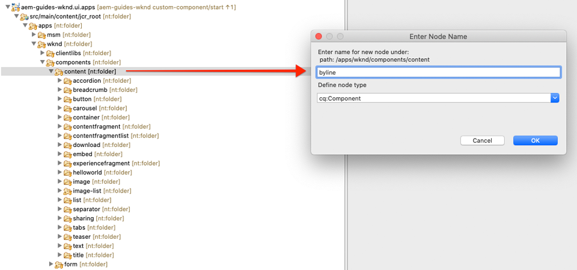
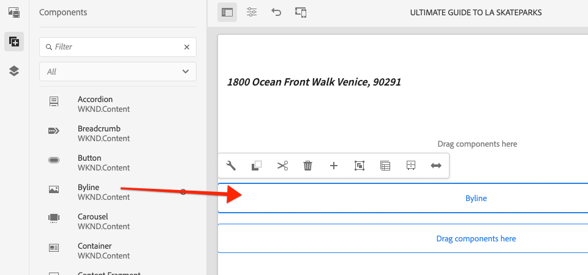

# 自訂元件{#custom-component}

本教學課程涵蓋自訂AEM Byline元件的端對端建立，以顯示在Dialog中編寫的內容，並探討開發Sling模型以封裝商業邏輯，以填入元件的HTL。

## 必備條件 {#prerequisites}

檢閱設定[本機開發環境](overview.md#local-dev-environment)所需的工具和指示。

### Starter Project

>[!NOTE]
>
> 如果您成功完成上一章，可以重新使用項目，並跳過簽出起始項目的步驟。

查看教學課程所建立的基線程式碼：

1. 查看[GitHub](https://github.com/adobe/aem-guides-wknd)的`tutorial/custom-component-start`分支

   ```shell
   $ cd aem-guides-wknd
   $ git checkout tutorial/custom-component-start
   ```

1. 使用您的Maven技巧，將程式碼庫部署至本機AEM實例：

   ```shell
   $ mvn clean install -PautoInstallSinglePackage
   ```

   >[!NOTE]
   >
   > 如果使用AEM 6.5或6.4，請將`classic`描述檔附加至任何Maven命令。

   ```shell
   $ mvn clean install -PautoInstallSinglePackage -Pclassic
   ```

您隨時都可以在[GitHub](https://github.com/adobe/aem-guides-wknd/tree/tutorial/custom-component-solution)上檢視完成的程式碼，或切換至分支`tutorial/custom-component-solution`，在本機檢出程式碼。

## 目標

1. 瞭解如何建立自訂AEM元件
1. 瞭解如何使用Sling Models封裝商業邏輯
1. 瞭解如何從HTL指令碼內使用Sling Model

## 您將建立的{#byline-component}

在WKND教學課程的這部分，會建立「署名元件」，用來顯示文章投稿者的撰寫資訊。


*署名元件*

Byline元件的實作包含收集署名內容的對話方塊，以及擷取署名的自訂Sling Model:

* 名稱
* 影像
* 職業

## 建立Byline元件{#create-byline-component}

首先，建立「同行元件」節點結構並定義對話框。 這代表AEM中的元件，並依其在JCR中的位置隱式定義元件的資源類型。

對話方塊會顯示內容作者可提供的介面。 在此實作中，AEM WCM核心元件的&#x200B;**Image**&#x200B;元件將用來製作和轉譯Byline的影像，因此會設為我們元件的`sling:resourceSuperType`。

### 建立元件定義{#create-component-definition}

1. 在&#x200B;**ui.apps**&#x200B;模組中，導覽至`/apps/wknd/components`並建立名為`byline`的新資料夾。
1. 在`byline`資料夾下方，新增名為`.content.xml`的新檔案

   

1. 在`.content.xml`檔案中填入下列項目：

   ```xml
   <?xml version="1.0" encoding="UTF-8"?>
       <jcr:root xmlns:sling="http://sling.apache.org/jcr/sling/1.0" xmlns:cq="http://www.day.com/jcr/cq/1.0" xmlns:jcr="http://www.jcp.org/jcr/1.0"
       jcr:primaryType="cq:Component"
       jcr:title="Byline"
       jcr:description="Displays a contributor's byline."
       componentGroup="WKND Sites Project - Content"
       sling:resourceSuperType="core/wcm/components/image/v2/image"/>
   ```

   上述XML檔案提供元件的定義，包括標題、說明和群組。 `sling:resourceSuperType`指向`core/wcm/components/image/v2/image`，即[核心影像元件](https://experienceleague.adobe.com/docs/experience-manager-core-components/using/components/image.html)。

### 建立HTL指令碼{#create-the-htl-script}

1. 在`byline`資料夾下方，新增負責元件HTML呈現的新檔案`byline.html`。 將檔案命名為與檔案夾相同的檔案很重要，因為它會變成Sling將用來轉換此資源類型的預設指令碼。

1. 將下列程式碼新增至`byline.html`。

   ```html
   <!--/* byline.html */-->
   <div data-sly-use.placeholderTemplate="core/wcm/components/commons/v1/templates.html">
   </div>
   <sly data-sly-call="${placeholderTemplate.placeholder @ isEmpty=true}"></sly>
   ```

`byline.html` 在 [Sling Model建立後](#byline-htl)，就會重新檢視。HTL檔案的目前狀態可讓元件在拖放至頁面時，以空白狀態顯示在AEM Sites的「頁面編輯器」中。

### 建立對話框定義{#create-the-dialog-definition}

接著，為Byline元件定義一個對話框，其中包含以下欄位：

* **名稱**:文字欄位，作為投稿者的名稱。
* **影像**:這是對投稿人簡歷的參考。
* **職業**:一份由貢獻者貢獻的職業清單。職業應依字母順序遞增（a至z）排序。

1. 在`byline`資料夾下，建立名為`_cq_dialog`的新資料夾。
1. 在`byline/_cq_dialog`下面添加名為`.content.xml`的新檔案。 這是對話框的XML定義。 新增下列XML:

   ```xml
   <?xml version="1.0" encoding="UTF-8"?>
   <jcr:root xmlns:sling="http://sling.apache.org/jcr/sling/1.0" xmlns:cq="http://www.day.com/jcr/cq/1.0" xmlns:jcr="http://www.jcp.org/jcr/1.0" xmlns:nt="http://www.jcp.org/jcr/nt/1.0"
           jcr:primaryType="nt:unstructured"
           jcr:title="Byline"
           sling:resourceType="cq/gui/components/authoring/dialog">
       <content
               jcr:primaryType="nt:unstructured"
               sling:resourceType="granite/ui/components/coral/foundation/container">
           <items jcr:primaryType="nt:unstructured">
               <tabs
                       jcr:primaryType="nt:unstructured"
                       sling:resourceType="granite/ui/components/coral/foundation/tabs"
                       maximized="{Boolean}false">
                   <items jcr:primaryType="nt:unstructured">
                       <asset
                               jcr:primaryType="nt:unstructured"
                               sling:hideResource="{Boolean}false"/>
                       <metadata
                               jcr:primaryType="nt:unstructured"
                               sling:hideResource="{Boolean}true"/>
                       <properties
                               jcr:primaryType="nt:unstructured"
                               jcr:title="Properties"
                               sling:resourceType="granite/ui/components/coral/foundation/container"
                               margin="{Boolean}true">
                           <items jcr:primaryType="nt:unstructured">
                               <columns
                                       jcr:primaryType="nt:unstructured"
                                       sling:resourceType="granite/ui/components/coral/foundation/fixedcolumns"
                                       margin="{Boolean}true">
                                   <items jcr:primaryType="nt:unstructured">
                                       <column
                                               jcr:primaryType="nt:unstructured"
                                               sling:resourceType="granite/ui/components/coral/foundation/container">
                                           <items jcr:primaryType="nt:unstructured">
                                               <name
                                                       jcr:primaryType="nt:unstructured"
                                                       sling:resourceType="granite/ui/components/coral/foundation/form/textfield"
                                                       emptyText="Enter the contributor's name to display."
                                                       fieldDescription="The contributor's name to display."
                                                       fieldLabel="Name"
                                                       name="./name"
                                                       required="{Boolean}true"/>
                                               <occupations
                                                       jcr:primaryType="nt:unstructured"
                                                       sling:resourceType="granite/ui/components/coral/foundation/form/multifield"
                                                       fieldDescription="A list of the contributor's occupations."
                                                       fieldLabel="Occupations"
                                                       required="{Boolean}false">
                                                   <field
                                                           jcr:primaryType="nt:unstructured"
                                                           sling:resourceType="granite/ui/components/coral/foundation/form/textfield"
                                                           emptyText="Enter an occupation"
                                                           name="./occupations"/>
                                               </occupations>
                                           </items>
                                       </column>
                                   </items>
                               </columns>
                           </items>
                       </properties>
                   </items>
               </tabs>
           </items>
       </content>
   </jcr:root>
   ```

   這些對話節點定義使用[Sling Resource Merger](https://sling.apache.org/documentation/bundles/resource-merger.html)來控制從`sling:resourceSuperType`元件繼承哪些對話標籤，在本例中為&#x200B;**核心元件的影像元件**。

   

### 建立策略對話框{#create-the-policy-dialog}

按照與建立對話框相同的方法，建立策略對話框（以前稱為設計對話框）以隱藏從核心元件映像元件繼承的策略配置中不需要的欄位。

1. 在`byline`資料夾下，建立名為`_cq_design_dialog`的新資料夾。
1. 在`byline/_cq_design_dialog`下方建立名為`.content.xml`的新檔案。 使用下列項目更新檔案：使用下列XML。 您最容易開啟`.content.xml`，並將下方的XML複製／貼入其中。

   ```xml
   <?xml version="1.0" encoding="UTF-8"?>
   <jcr:root xmlns:sling="http://sling.apache.org/jcr/sling/1.0" xmlns:granite="http://www.adobe.com/jcr/granite/1.0" xmlns:cq="http://www.day.com/jcr/cq/1.0" xmlns:jcr="http://www.jcp.org/jcr/1.0" xmlns:nt="http://www.jcp.org/jcr/nt/1.0"
       jcr:primaryType="nt:unstructured"
       jcr:title="Byline"
       sling:resourceType="cq/gui/components/authoring/dialog">
       <content
               jcr:primaryType="nt:unstructured">
           <items jcr:primaryType="nt:unstructured">
               <tabs
                       jcr:primaryType="nt:unstructured">
                   <items jcr:primaryType="nt:unstructured">
                       <properties
                               jcr:primaryType="nt:unstructured">
                           <items jcr:primaryType="nt:unstructured">
                               <content
                                       jcr:primaryType="nt:unstructured">
                                   <items jcr:primaryType="nt:unstructured">
                                       <decorative
                                               jcr:primaryType="nt:unstructured"
                                               sling:hideResource="{Boolean}true"/>
                                       <altValueFromDAM
                                               jcr:primaryType="nt:unstructured"
                                               sling:hideResource="{Boolean}true"/>
                                       <titleValueFromDAM
                                               jcr:primaryType="nt:unstructured"
                                               sling:hideResource="{Boolean}true"/>
                                       <displayCaptionPopup
                                               jcr:primaryType="nt:unstructured"
                                               sling:hideResource="{Boolean}true"/>
                                       <disableUuidTracking
                                               jcr:primaryType="nt:unstructured"
                                               sling:hideResource="{Boolean}true"/>
                                   </items>
                               </content>
                           </items>
                       </properties>
                       <features
                               jcr:primaryType="nt:unstructured">
                           <items jcr:primaryType="nt:unstructured">
                               <content
                                       jcr:primaryType="nt:unstructured">
                                   <items jcr:primaryType="nt:unstructured">
                                       <accordion
                                               jcr:primaryType="nt:unstructured">
                                           <items jcr:primaryType="nt:unstructured">
                                               <orientation
                                                       jcr:primaryType="nt:unstructured"
                                                       sling:hideResource="{Boolean}true"/>
                                               <crop
                                                       jcr:primaryType="nt:unstructured"
                                                       sling:hideResource="{Boolean}true"/>
                                           </items>
                                       </accordion>
                                   </items>
                               </content>
                           </items>
                       </features>
                   </items>
               </tabs>
           </items>
       </content>
   </jcr:root>
   ```

   前面的&#x200B;**策略對話框** XML的基礎是從[核心元件映像元件](https://github.com/adobe/aem-core-wcm-components/blob/master/content/src/content/jcr_root/apps/core/wcm/components/image/v2/image/_cq_design_dialog/.content.xml)中獲取的。

   如同在Dialog設定中，[Sling Resource Merger](https://sling.apache.org/documentation/bundles/resource-merger.html)可用來隱藏從`sling:resourceSuperType`繼承的不相關欄位，如具有`sling:hideResource="{Boolean}true"`屬性的節點定義所示。

### 部署代碼{#deploy-the-code}

1. 使用您的Maven技巧，將更新的程式碼庫部署至本機AEM實例：

   ```shell
   $ cd aem-guides-wknd
   $ mvn clean install -PautoInstallSinglePackage
   ```

## 將元件添加到{#add-the-component-to-a-page}頁

為了簡化工作並專注於AEM元件開發，我們會將目前狀態的Byline元件新增至「文章」頁面，以驗證`cq:Component`節點定義已部署並正確，AEM會辨識新元件定義，而元件的對話方塊適用於編寫。

### 新增影像至AEM資產

首先，將範例頭像上傳至AEM Assets，以用來在Byline元件中填入影像。

1. 導覽至AEM Assets中的LA Skateparks檔案夾：[http://localhost:4502/assets.html/content/dam/wknd/en/magazine/la-skateparks](http://localhost:4502/assets.html/content/dam/wknd/en/magazine/la-skateparks)。

1. 將&#x200B;**[stacey-roswells.jpg](assets/custom-component/stacey-roswells.jpg)**&#x200B;的頭部像片上傳至資料夾。

   

### 編寫元件{#author-the-component}

接著，將Byline元件新增至AEM中的頁面。 由於我們通過`ui.apps/src/main/content/jcr_root/apps/wknd/components/byline/.content.xml`定義將Byline元件添加到&#x200B;**WKND站點項目——內容**&#x200B;元件組中，所以它可自動用於&#x200B;**容器**，其&#x200B;**策略**&#x200B;允許&#x200B;**WKND站點項目——內容**&#x200B;元件群組，文章頁面的「版面容器」即為此群組。

1. 導覽至LA Skatepark文章：[http://localhost:4502/editor.html/content/wknd/us/en/magazine/guide-la-skateparks.html](http://localhost:4502/editor.html/content/wknd/us/en/magazine/guide-la-skateparks.html)

1. 從左側邊欄，將&#x200B;**Byline元件**&#x200B;拖放至已開啟文章頁面的「版面容器」的&#x200B;**底部**。

   

1. 確保左側邊欄&#x200B;**已開啟**&#x200B;且可見，並且已選擇&#x200B;**資產查找器**。

   

1. 選擇&#x200B;**Byline元件佔位符** ，它依次顯示操作欄並點選&#x200B;**扳手**&#x200B;表徵圖以開啟對話框。

   

1. 當對話方塊開啟，且第一個標籤（資產）啟用時，開啟左側邊欄，並從資產搜尋器將影像拖曳至「影像」下拉區。 搜尋「stacey」，尋找WKND ui.content套件中提供的Stacey Roswells簡歷圖片。

   

1. 添加影像後，按一下&#x200B;**屬性**&#x200B;頁籤以輸入&#x200B;**名稱**&#x200B;和&#x200B;**職業**。

   在進入職業時，請以&#x200B;**反向字母順序**&#x200B;順序輸入，如此我們將在Sling Model中實施的按字母順序排列的商業邏輯就顯而易見了。

   點選右下方的&#x200B;**Done**&#x200B;按鈕以儲存變更。

   

   AEM作者會透過對話方塊設定和編寫元件。 此時，在開發Byline元件時，會包含對話方塊以收集資料，但是尚未新增轉換製作內容的邏輯。 因此，只會顯示預留位置。

1. 儲存對話方塊後，導覽至[CRXDE Lite](http://localhost:4502/crx/de/index.jsp#/content/wknd/us/en/magazine/guide-la-skateparks/jcr%3Acontent/root/container/container/byline)，並檢視元件的內容如何儲存在AEM頁面下的位元件內容節點上。

   在「LA Skate Parks」（LA滑板公園）頁面下查找Byline元件內容節點，即`/content/wknd/us/en/magazine/guide-la-skateparks/jcr:content/root/container/container/byline`。

   請注意，屬性名稱`name`、`occupations`和`fileReference`儲存在&#x200B;**位元節點**&#x200B;上。

   此外，請注意，節點的`sling:resourceType`設定為`wknd/components/content/byline`，這是將此內容節點綁定到Byline元件實施的原因。

   

## Create Byline Sling Model {#create-sling-model}

接下來，我們將建立Sling Model，做為資料模型，並代管Byline元件的商業邏輯。

Sling Models是註解導向的Java &quot;POJO&#39;s&quot;(Plain Old Java Objects)，可協助將資料從JCR對應至Java變數，並在AEM中進行開發時提供許多其他細節。

### 查看Maven依賴項{#maven-dependency}

Byline Sling Model將仰賴AEM提供的數個Java API。 這些API可通過`core`模組的POM檔案中列出的`dependencies`使用。 本教學課程所使用的專案已針對AEM建立為Cloud Service。 但是它的獨特之處在於它向後與AEM 6.5/6.4相容。因此，Cloud Service和AEM 6.x的相依性都已包含在內。

1. 開啟`<src>/aem-guides-wknd/core/pom.xml`下方的`pom.xml`檔案。
1. 尋找`aem-sdk-api` - **AEM的相依性：僅限雲端服務**

   ```xml
   <dependency>
       <groupId>com.adobe.aem</groupId>
       <artifactId>aem-sdk-api</artifactId>
   </dependency>
   ```

   [aem-sdk-api](https://experienceleague.adobe.com/docs/experience-manager-cloud-service/implementing/developing/aem-as-a-cloud-service-sdk.html?lang=en#building-for-the-sdk)包含AEM公開的所有公用Java API。 在建立此專案時，預設會使用`aem-sdk-api`。 該版本保存在位於項目根部`aem-guides-wknd/pom.xml`的Parent reactor pom中。

1. 尋找`uber-jar` - **AEM 6.5/6.4 Only**&#x200B;的相依性

   ```xml
   ...
       <dependency>
           <groupId>com.adobe.aem</groupId>
           <artifactId>uber-jar</artifactId>
           <classifier>apis</classifier>
       </dependency>
   ...
   ```

   `uber-jar`僅在調用`classic`配置檔案時包含，即`mvn clean install -PautoInstallSinglePackage -Pclassic`。 同樣，這是本專案獨有的。 在實際專案中，如果指定的AEM版本為6.5或6.4，則從AEM Project Archetype產生`uber-jar`將是預設值。

   [uber-jar](https://docs.adobe.com/content/help/en/experience-manager-65/developing/devtools/ht-projects-maven.html#experience-manager-api-dependencies)包含AEM 6.x公開的所有公用Java API。該版本保存在位於項目`aem-guides-wknd/pom.xml`根部的Parent reactor pom中。

1. 查找`core.wcm.components.core`的相關性：

   ```xml
    <!-- Core Component Dependency -->
       <dependency>
           <groupId>com.adobe.cq</groupId>
           <artifactId>core.wcm.components.core</artifactId>
       </dependency>
   ```

   這是AEM核心元件公開的所有公開Java API。 AEM Core Components是AEM外部維護的專案，因此有個別的發行週期。 因此，它是需要單獨包含的依賴項，**not**&#x200B;與`uber-jar`或`aem-sdk-api`一起包含。

   與uber-jar一樣，此相依性的版本會維護在位於`aem-guides-wknd/pom.xml`的Parent reactor pom檔案中。

   在本教學課程的後面，我們將使用「核心元件影像」類別，在Byline元件中顯示影像。 必須具備核心元件相依性才能建立並編譯我們的Sling Model。

### 署名介面{#byline-interface}

為署名建立公用Java介面。 `Byline.java` 定義驅動 `byline.html` HTL指令碼所需的公用方法。

1. 在`core/src/main/java/com/adobe/aem/guides/wknd/core/models`下方的`aem-guides-wknd.core`模組中，建立一個名為`Byline.java`的新檔案

   

1. 使用下列方法更新`Byline.java`:

   ```java
   package com.adobe.aem.guides.wknd.core.models;
   
   import java.util.List;
   
   /**
   * Represents the Byline AEM Component for the WKND Site project.
   **/
   public interface Byline {
       /***
       * @return a string to display as the name.
       */
       String getName();
   
       /***
       * Occupations are to be sorted alphabetically in a descending order.
       *
       * @return a list of occupations.
       */
       List<String> getOccupations();
   
       /***
       * @return a boolean if the component has enough content to display.
       */
       boolean isEmpty();
   }
   ```

   前兩種方法公開了「署名」元件的&#x200B;**name**&#x200B;和&#x200B;**職業**&#x200B;的值。

   `isEmpty()`方法用於確定元件是否具有要渲染的內容或是否等待配置。

   請注意，影像沒有任何方法；[我們將瞭解為什麼是稍後](#tackling-the-image-problem)。

### 署名實施{#byline-implementation}

`BylineImpl.java` 是實作Sling Model的實作，此實作會實作先前 `Byline.java` 定義的介面。`BylineImpl.java`的完整程式碼可在本節底部找到。

1. 在`core/src/main/java/com/adobe/aem/guides/core/models`下方建立名為`impl`的新資料夾。
1. 在`impl`資料夾中建立新檔案`BylineImpl.java`。

   

1. 開啟 `BylineImpl.java`. 指定它實現`Byline`介面。 使用IDE的自動完成功能或手動更新檔案，以包括實施`Byline`介面所需的方法：

   ```java
   package com.adobe.aem.guides.wknd.core.models.impl;
   import java.util.List;
   import com.adobe.aem.guides.wknd.core.models.Byline;
   
   public class BylineImpl implements Byline {
   
       @Override
       public String getName() {
           // TODO Auto-generated method stub
           return null;
       }
   
       @Override
       public List<String> getOccupations() {
           // TODO Auto-generated method stub
           return null;
       }
   
       @Override
       public boolean isEmpty() {
           // TODO Auto-generated method stub
           return false;
       }
   }
   ```

1. 使用下列類別層級的註解更新`BylineImpl.java`，以新增Sling Model註解。 這個`@Model(..)`註解會將類別轉換為Sling Model。

   ```java
   import org.apache.sling.api.SlingHttpServletRequest;
   import org.apache.sling.models.annotations.Model;
   import org.apache.sling.models.annotations.DefaultInjectionStrategy;
   ...
   @Model(
           adaptables = {SlingHttpServletRequest.class},
           adapters = {Byline.class},
           resourceType = {BylineImpl.RESOURCE_TYPE},
           defaultInjectionStrategy = DefaultInjectionStrategy.OPTIONAL
   )
   public class BylineImpl implements Byline {
       protected static final String RESOURCE_TYPE = "wknd/components/content/byline";
       ...
   }
   ```

   讓我們回顧一下此注釋及其參數：

   * 當`@Model`註解部署至AEM時，會將BylineImpl註冊為Sling Model。
   * `adaptables`參數指定此模型可由請求調整。
   * `adapters`參數允許在Byline介面下註冊實施類。 這可讓HTL指令碼透過介面呼叫Sling Model（而非直接執行）。 [有關適配器的詳細資訊，請參閱此處](https://sling.apache.org/documentation/bundles/models.html#specifying-an-alternate-adapter-class-since-110)。
   * `resourceType`指向Byline元件資源類型（先前建立的），如果存在多個實現，則有助於解析正確的模型。 [有關將模型類與資源類型關聯的詳細資訊，請參閱此處](https://sling.apache.org/documentation/bundles/models.html#associating-a-model-class-with-a-resource-type-since-130)。

### 實作Sling Model方法{#implementing-the-sling-model-methods}

#### getName(){#implementing-get-name}

我們要解決的第一個方法是`getName()`，它只會將儲存到位元的JCR內容節點中屬性`name`下的值傳回。

對於此，`@ValueMapValue` Sling Model註解會用來使用Request資源的ValueMap，將值插入Java欄位。


```java
import org.apache.sling.models.annotations.injectorspecific.ValueMapValue;

public class BylineImpl implements Byline {
    ...
    @ValueMapValue
    private String name;

    ...
    @Override
    public String getName() {
        return name;
    }
    ...
}
```

由於JCR屬性與Java欄位（兩者皆為&quot;name&quot;）具有相同的名稱，`@ValueMapValue`會自動解析此關聯，並將屬性值插入Java欄位。

#### getSchrops(){#implementing-get-occupations}

下一個要實作的方法是`getOccupations()`。 此方法會收集JCR屬性`occupations`中儲存的所有職業，並傳回已排序（按字母順序）的職業集合。

使用`getName()`中探索的相同技術，屬性值可插入Sling Model欄位。

一旦JCR屬性值可透過插入的Java欄位`occupations`在Sling Model中可用，排序商業邏輯就可套用至`getOccupations()`方法。


```java
import java.util.ArrayList;
import java.util.Collections;
  ...

public class BylineImpl implements Byline {
    ...
    @ValueMapValue
    private List<String> occupations;
    ...
    @Override
    public List<String> getOccupations() {
        if (occupations != null) {
            Collections.sort(occupations);
            return new ArrayList<String>(occupations);
        } else {
            return Collections.emptyList();
        }
    }
    ...
}
  ...
```


#### isEmpty(){#implementing-is-empty}

最後一個公用方法是`isEmpty()`，它決定元件何時應將自身視為「已創作足夠」來呈現。

對於此元件，我們有業務要求，指出必須在&#x200B;*之前填寫所有三個欄位、名稱、影像和職業，才能顯示*&#x200B;元件。


```java
import org.apache.commons.lang3.StringUtils;
  ...
public class BylineImpl implements Byline {
    ...
    @Override
    public boolean isEmpty() {
        if (StringUtils.isBlank(name)) {
            // Name is missing, but required
            return true;
        } else if (occupations == null || occupations.isEmpty()) {
            // At least one occupation is required
            return true;
        } else if (/* image is not null, logic to be determined */) {
            // A valid image is required
            return true;
        } else {
            // Everything is populated, so this component is not considered empty
            return false;
        }
    }
    ...
}
```


#### 解決「映像問題」{#tackling-the-image-problem}

檢查名稱和佔用條件很瑣碎（Apache Commons Lang3提供隨時方便的[StringUtils](https://commons.apache.org/proper/commons-lang/apidocs/org/apache/commons/lang3/StringUtils.html)類別），但是，由於使用核心元件映像元件來呈現映像，因此不清楚如何驗證映像&#x200B;**的存在。**

解決這個問題的方法有兩種：

檢查`fileReference` JCR屬性是否解析為資產。 *ORConvert* this resource into a Core Component Image Sling Model and enfer the  `getSrc()` method is not empty.

我們將選擇&#x200B;**second**&#x200B;方法。 第一種方法可能已足夠，但在本教學課程中，後一種方法將被用來讓我們探索Sling Models的其他功能。

1. 建立取得影像的私用方法。 此方法保留為私密，因為我們不需要在HTL本身中公開Image物件，而且它只用於驅動`isEmpty().`

   `getImage()`的以下私有方法：

   ```java
   import com.adobe.cq.wcm.core.components.models.Image;
   ...
   private Image getImage() {
       Image image = null;
       // Figure out how to populate the image variable!
       return image;
   }
   ```

   如上所述，還有兩種方法可取得&#x200B;**Image Sling Model**:

   第一個使用`@Self`注釋，自動將當前請求調整為核心元件的`Image.class`

   ```java
   @Self
   private Image image;
   ```

   第二種方式使用[Apache Sling ModelFactory](https://sling.apache.org/apidocs/sling10/org/apache/sling/models/factory/ModelFactory.html) OSGi服務，這是非常方便的服務，並協助我們以Java程式碼建立其他類型的Sling Models。

   我們將選擇第二種方法。

   >[!NOTE]
   >
   >在實際實作中，偏好使用`@Self`的方法為&quot;One&quot;，因為它是更簡單、更精美的解決方案。 在本教學課程中，我們將使用第二種方法，因為它要求我們探索更多Sling Models的小面，這些小面對更複雜的元件非常有用！

   由於Sling Models是Java POJO，而非OSGi Services，所以通常使用OSGi植入註解`@Reference` **cannot**，而Sling Models提供特殊的&#x200B;**[@OSGiService](https://sling.apache.org/documentation/bundles/models.html#injector-specific-annotations)**&#x200B;註解，提供類似的功能。

1. 更新`BylineImpl.java`以包含`OSGiService`注釋以插入`ModelFactory`:

   ```java
   import org.apache.sling.models.factory.ModelFactory;
   import org.apache.sling.models.annotations.injectorspecific.OSGiService;
   ...
   public class BylineImpl implements Byline {
       ...
       @OSGiService
       private ModelFactory modelFactory;
   }
   ```

   有了`ModelFactory`，您就可使用下列方式建立Core Component Image Sling Model:

   ```java
   modelFactory.getModelFromWrappedRequest(SlingHttpServletRequest request, Resource resource, java.lang.Class<T> targetClass)
   ```

   不過，此方法需要請求和資源，但Sling Model中目前都不提供。 若要取得這些，請使用更多Sling Model註解！

   要獲取當前請求，**[@Self](https://sling.apache.org/documentation/bundles/models.html#injector-specific-annotations)**&#x200B;注釋可用於將`adaptable`（在`@Model(..)`中定義為`SlingHttpServletRequest.class`）注入Java類欄位。

1. 新增&#x200B;**@Self**&#x200B;註解以取得&#x200B;**SlingHttpServletRequest要求**:

   ```java
   import org.apache.sling.models.annotations.injectorspecific.Self;
   ...
   @Self
   private SlingHttpServletRequest request;
   ```

   請記住，使用`@Self Image image`來插入核心元件影像Sling模型是上述選項- `@Self`註解會嘗試插入可調整的物件（在我們的例子中為SlingHttpServletRequest），並調整為註解欄位類型。 由於Core Component Image Sling Model是可從SlingHttpServletRequest物件調整的，所以這會奏效，而且比我們更探索性的方式少程式碼。

   現在，我們已注入必要的變數，以透過ModelFactory API實例化我們的影像模型。 我們將使用Sling Model的&#x200B;**[@PostConstruct](https://sling.apache.org/documentation/bundles/models.html#postconstruct-methods)**&#x200B;註解，在Sling Model實例化後取得此物件。

   `@PostConstruct` 的功能非常有用，而且其作用能力與建構函式類似，但是，在類別執行個體化並插入所有註解的Java欄位後，就會呼叫它。其他Sling Model註解會註解Java類別欄位（變數），而`@PostConstruct`則註解void, zero參數方法，通常稱為`init()`（但可以命名任何項目）。

1. 添加&#x200B;**@PostConstruct**&#x200B;方法：

   ```java
   import javax.annotation.PostConstruct;
   ...
   public class BylineImpl implements Byline {
       ...
       private Image image;
   
       @PostConstruct
       private void init() {
           image = modelFactory.getModelFromWrappedRequest(request,
                                                           request.getResource(),
                                                           Image.class);
       }
       ...
   }
   ```

   請記住，Sling Models是&#x200B;**NOT** OSGi Services，因此維護類別狀態是安全的。 通常`@PostConstruct`會衍生並設定Sling Model類別狀態供日後使用，類似於一般的建構函式。

   請注意，如果`@PostConstruct`方法引發例外，Sling Model將不會執行個體化（它將為null）。

1. **getImage()現** 在可以更新，只要傳回影像物件即可。

   ```java
   /**
       * @return the Image Sling Model of this resource, or null if the resource cannot create a valid Image Sling Model.
   */
   private Image getImage() {
       return image;
   }
   ```

1. 讓我們回到`isEmpty()`並完成實施：

   ```java
   @Override
   public boolean isEmpty() {
      final Image componentImage = getImage();
   
       if (StringUtils.isBlank(name)) {
           // Name is missing, but required
           return true;
       } else if (occupations == null || occupations.isEmpty()) {
           // At least one occupation is required
           return true;
       } else if (componentImage == null || StringUtils.isBlank(componentImage.getSrc())) {
           // A valid image is required
           return true;
       } else {
           // Everything is populated, so this component is not considered empty
           return false;
       }
   }
   ```

   請注意，對`getImage()`進行多次呼叫並不成問題，因為傳回已初始化的`image`類別變數，而且不會叫用`modelFactory.getModelFromWrappedRequest(...)`，這並不是太昂貴，但值得避免不必要的呼叫。

1. 最終`BylineImpl.java`應如下所示：


   ```java
   package com.adobe.aem.guides.wknd.core.models.impl;
   
   import java.util.ArrayList;
   import java.util.Collections;
   import java.util.List;
   import javax.annotation.PostConstruct;
   import org.apache.commons.lang3.StringUtils;
   import org.apache.sling.api.SlingHttpServletRequest;
   import org.apache.sling.models.annotations.DefaultInjectionStrategy;
   import org.apache.sling.models.annotations.Model;
   import org.apache.sling.models.annotations.injectorspecific.OSGiService;
   import org.apache.sling.models.annotations.injectorspecific.Self;
   import org.apache.sling.models.annotations.injectorspecific.ValueMapValue;
   import org.apache.sling.models.factory.ModelFactory;
   import com.adobe.aem.guides.wknd.core.models.Byline;
   import com.adobe.cq.wcm.core.components.models.Image;
   
   @Model(
           adaptables = {SlingHttpServletRequest.class},
           adapters = {Byline.class},
           resourceType = {BylineImpl.RESOURCE_TYPE},
           defaultInjectionStrategy = DefaultInjectionStrategy.OPTIONAL
   )
   public class BylineImpl implements Byline {
       protected static final String RESOURCE_TYPE = "wknd/components/content/byline";
   
       @Self
       private SlingHttpServletRequest request;
   
       @OSGiService
       private ModelFactory modelFactory;
   
       @ValueMapValue
       private String name;
   
       @ValueMapValue
       private List<String> occupations;
   
       private Image image;
   
       @PostConstruct
       private void init() {
           image = modelFactory.getModelFromWrappedRequest(request, request.getResource(), Image.class);
       }
   
       @Override
       public String getName() {
           return name;
       }
   
       @Override
       public List<String> getOccupations() {
           if (occupations != null) {
               Collections.sort(occupations);
               return new ArrayList<String>(occupations);
           } else {
               return Collections.emptyList();
           }
       }
   
       @Override
       public boolean isEmpty() {
           final Image componentImage = getImage();
   
           if (StringUtils.isBlank(name)) {
               // Name is missing, but required
               return true;
           } else if (occupations == null || occupations.isEmpty()) {
               // At least one occupation is required
               return true;
           } else if (componentImage == null || StringUtils.isBlank(componentImage.getSrc())) {
               // A valid image is required
               return true;
           } else {
               // Everything is populated, so this component is not considered empty
               return false;
           }
       }
   
       /**
       * @return the Image Sling Model of this resource, or null if the resource cannot create a valid Image Sling Model.
       */
       private Image getImage() {
           return image;
       }
   }
   ```


## 署名HTL {#byline-htl}

在`ui.apps`模組中，開啟我們在先前AEM元件設定中建立的`/apps/wknd/components/byline/byline.html`。

```html
<div data-sly-use.placeholderTemplate="core/wcm/components/commons/v1/templates.html">
</div>
<sly data-sly-call="${placeholderTemplate.placeholder @ isEmpty=false}"></sly>
```

讓我們來回顧一下此HTL指令碼目前的運作方式：

* `placeholderTemplate`指向「核心元件」的預留位置，該預留位置會在元件未完全設定時顯示。 如上所述，在AEM Sites Page Editor中，這會將元件標題轉譯為具有元件標題的方塊，如`cq:Component`的`jcr:title`屬性中所定義。

* `data-sly-call="${placeholderTemplate.placeholder @ isEmpty=false}`會載入上述定義的`placeholderTemplate`，並以布林值（目前硬式編碼為`false`）傳入預留位置範本。 當`isEmpty`為true時，預留位置範本會呈現灰色方塊，否則不會呈現任何內容。

### 更新署名HTL

1. 使用下列骨架式HTML結構更新&#x200B;**byline.html**:

   ```html
   <div data-sly-use.placeholderTemplate="core/wcm/components/commons/v1/templates.html"
       class="cmp-byline">
           <div class="cmp-byline__image">
               <!-- Include the Core Components Image Component -->
           </div>
           <h2 class="cmp-byline__name"><!-- Include the name --></h2>
           <p class="cmp-byline__occupations"><!-- Include the occupations --></p>
   </div>
   <sly data-sly-call="${placeholderTemplate.placeholder @ isEmpty=true}"></sly>
   ```

   請注意，CSS類遵循[BEM命名約定](https://getbem.com/naming/)。 雖然使用BEM慣例並非強制性，但建議使用BEM，因為它用於核心元件CSS類，通常會產生簡潔、可讀的CSS規則。

### 在HTL {#instantiating-sling-model-objects-in-htl}中執行個體化Sling Model物件

[Use block陳述式](https://github.com/adobe/htl-spec/blob/master/SPECIFICATION.md#221-use)可用來在HTL指令碼中執行個體化Sling Model物件，並將它指派給HTL變數。

`data-sly-use.byline="com.adobe.aem.guides.wknd.models.Byline"` 使用BylineImpl實作的Byline介面(com.adobe.aem.guides.wknd.models.Byline)，並將目前的SlingHttpServletRequest套用至它，而結果會儲存在HTL變數名稱的位元( `data-sly-use.<variable-name>`)中。

1. 更新外部`div`以參考&#x200B;**Byline** Sling Model，依其公用介面進行：

   ```xml
   <div data-sly-use.byline="com.adobe.aem.guides.wknd.core.models.Byline"
       data-sly-use.placeholderTemplate="core/wcm/components/commons/v1/templates.html"
       class="cmp-byline">
       ...
   </div>
   ```

### 存取Sling Model方法{#accessing-sling-model-methods}

HTL從JSTL借用，並使用相同的縮短Java getter方法名稱。

例如，叫用Byline Sling Model的`getName()`方法可縮短為`byline.name`，類似地，這可縮短為`byline.isEmpty`。 `byline.empty`使用完整的方法名稱`byline.getName`或`byline.isEmpty`也能運作。 請注意，`()`從未用於調用HTL中的方法（類似於JSTL）。

需要參數&#x200B;**cannot**&#x200B;的Java方法可用於HTL。 這是為了讓HTL的邏輯保持簡單。

1. Byline name can be added to the component by accounted the `getName()` method on the Byline Sling Model, or in HTL:`${byline.name}`。

   更新`h2`標籤：

   ```xml
   <h2 class="cmp-byline__name">${byline.name}</h2>
   ```

### 使用HTL運算式選項{#using-htl-expression-options}

[HTL運算式](https://github.com/adobe/htl-spec/blob/master/SPECIFICATION.md#12-available-expression-options) 選項可當成HTL中內容的修飾元，範圍從日期格式到i18n轉譯。運算式也可用來連結清單或值陣列，這是以逗號分隔格式顯示職業的必要項。

運算式是透過HTL運算式中的`@`運算子新增。

1. 要使用&quot;, &quot;加入職業清單，請使用以下代碼：

   ```html
   <p class="cmp-byline__occupations">${byline.occupations @ join=', '}</p>
   ```

### 有條件地顯示預留位置{#conditionally-displaying-the-placeholder}

AEM元件的大部分HTL指令碼都採用&#x200B;**預留位置範例**，為作者提供視覺提示，指出元件的製作不正確，而且不會顯示在AEM Publish **上。**&#x200B;推動此決定的慣例是在元件支援Sling Model上實作方法，在我們的案例中：`Byline.isEmpty()`。

`isEmpty()` 在Byline Sling Model上呼叫，結果（或其負值，透過運算子）會儲 `!` 存至名為 `hasContent`:

1. 更新外部`div`以儲存名為`hasContent`的HTL變數：

   ```html
    <div data-sly-use.byline="com.adobe.aem.guides.wknd.core.models.Byline"
         data-sly-use.placeholderTemplate="core/wcm/components/commons/v1/templates.html"
         data-sly-test.hasContent="${!byline.empty}"
         class="cmp-byline">
         ...
   </div>
   ```

   請注意，使用`data-sly-test`時，HTL `test`區塊很有趣，因為它會根據HTL運算式的結果是否真實，設定HTL變數AND轉譯／不轉譯其所在的HTML元素。 如果是&quot;truthy&quot;,HTML元素會轉譯，否則不會轉譯。

   此HTL變數`hasContent`現在可重新用於有條件地顯示／隱藏預留位置。

1. 使用下列項目，將條件式呼叫更新至檔案底部的`placeholderTemplate`:

   ```html
   <sly data-sly-call="${placeholderTemplate.placeholder @ isEmpty=!hasContent}"></sly>
   ```

### 使用核心元件{#using-the-core-components-image}顯示影像

`byline.html`的HTL指令碼現在幾乎已完成，而且只遺失影像。

由於我們使用`sling:resourceSuperType`核心元件影像元件來製作影像，因此我們也可以使用核心元件影像元件來轉換影像！

為此，我們需要包括當前的行資源，但使用資源類型`core/wcm/components/image/v2/image`強制使用核心元件映像元件的資源類型。 這是強大的模式，可供元件重複使用。 為此，會使用HTL的`data-sly-resource`區塊。

1. 將`div`替換為`cmp-byline__image`類別，如下所示：

   ```html
   <div class="cmp-byline__image"
       data-sly-resource="${ '.' @ resourceType = 'core/wcm/components/image/v2/image' }"></div>
   ```

   此`data-sly-resource`通過相對路徑`'.'`包含當前資源，並強制將當前資源（或行內容資源）包含在資源類型`core/wcm/components/image/v2/image`中。

   核心元件資源類型是直接使用，而非透過Proxy使用，因為這是指令碼內使用，而且不會持續存在於我們的內容中。

2. 完成`byline.html`:

   ```html
   <!--/* byline.html */-->
   <div data-sly-use.byline="com.adobe.aem.guides.wknd.core.models.Byline" 
       data-sly-use.placeholderTemplate="core/wcm/components/commons/v1/templates.html"
       data-sly-test.hasContent="${!byline.empty}"
       class="cmp-byline">
       <div class="cmp-byline__image"
           data-sly-resource="${ '.' @ resourceType = 'core/wcm/components/image/v2/image' }">
       </div>
       <h2 class="cmp-byline__name">${byline.name}</h2>
       <p class="cmp-byline__occupations">${byline.occupations @ join=', '}</p>
   </div>
   <sly data-sly-call="${placeholderTemplate.placeholder @ isEmpty=!hasContent}"></sly>
   ```

3. 將程式碼庫部署至本機AEM例項。 由於對POM檔案進行了重大更改，因此從項目的根目錄執行完整的Maven生成。

   ```shell
   $ cd aem-guides-wknd/
   $ mvn clean install -PautoInstallSinglePackage
   ```

   如果部署至AEM 6.5/6.4，請叫用`classic`設定檔：

   ```shell
   $ mvn clean install -PautoInstallSinglePackage -Pclassic
   ```

### 查看未設定樣式的Byline元件{#reviewing-the-unstyled-byline-component}

1. 部署更新後，導覽至[LA Skateparks ](http://localhost:4502/editor.html/content/wknd/us/en/magazine/guide-la-skateparks.html)頁面的Ultimate Guide，或您在章節中稍早新增Byline元件的任何位置。

1. **image**、**name**&#x200B;和&#x200B;**職業**&#x200B;現在出現，而且我們有未設定樣式的Byline元件。

   

### 檢閱Sling Model註冊{#reviewing-the-sling-model-registration}

[AEM Web Console的Sling Models Status檢視](http://localhost:4502/system/console/status-slingmodels)會顯示AEM中所有已註冊的Sling Models。 Byline Sling Model可以透過檢閱此清單來驗證是否已安裝及識別。

如果此清單中未顯示&#x200B;**BylineImpl**，則Sling Model的註解可能會發生問題，或Sling Model未新增至核心專案中已註冊的Sling Models套件(com.adobe.aem.guides.wknd.core.models)。


*http://localhost:4502/system/console/status-slingmodels*

## 署名樣式{#byline-styles}

Byline元件需要設定樣式，以符合Byline元件的創意設計。 這將透過使用SCSS來達成，AEM透過&#x200B;**ui.frontend** Maven子專案提供支援。

### 新增預設樣式

為Byline元件新增預設樣式。 在&#x200B;**ui.frontend**&#x200B;專案中，位於`/src/main/webpack/components`下方：

1. 建立名為`_byline.scss`的新檔案。

   

1. 將署名實作CSS（寫入為SCSS）新增至`default.scss`:

   ```scss
   .cmp-byline {
       $imageSize: 60px;
   
       .cmp-byline__image {
           float: left;
   
       /* This class targets a Core Component Image CSS class */
       .cmp-image__image {
           width: $imageSize;
           height: $imageSize;
           border-radius: $imageSize / 2;
           object-fit: cover;
           }
       }
   
       .cmp-byline__name {
           font-size: $font-size-medium;
           font-family: $font-family-serif;
           padding-top: 0.5rem;
           margin-left: $imageSize + 25px;
           margin-bottom: .25rem;
           margin-top:0rem;
       }
   
       .cmp-byline__occupations {
           margin-left: $imageSize + 25px;
           color: $gray;
           font-size: $font-size-xsmall;
           text-transform: uppercase;
       }
   }
   ```

1. 在`ui.frontend/src/main/webpack/site/main.scss`檢閱`main.scss`:

   ```scss
   @import 'variables';
   @import 'wkndicons';
   @import 'base';
   @import '../components/**/*.scss';
   @import './styles/*.scss';
   ```

   `main.scss` 是模組包含的樣式的主入口 `ui.frontend` 點。規則運算式`'../components/**/*.scss'`將包含位於`components/`資料夾下的所有檔案。

1. 建立完整專案並部署至AEM:

   ```shell
   $ cd aem-guides-wknd/
   $ mvn clean install -PautoInstallSinglePackage
   ```

   如果使用AEM 6.4/6.5，請新增`-Pclassic`描述檔。

   >[!TIP]
   >
   >您可能需要清除瀏覽器快取以確保不提供過時的CSS，並使用Byline元件重新整理頁面，以取得完整樣式。

## 將它放在一起{#putting-it-together}

以下是完整編寫和樣式化的Byline元件在AEM頁面上的外觀。


## 恭喜！{#congratulations}

恭喜您，您剛使用Adobe Experience Manager從頭開始建立自訂元件！

### 後續步驟{#next-steps}

繼續瞭解AEM元件開發，探索如何編寫Byline Java程式碼的JUnit測試，以確保一切正確開發，並實作的商業邏輯正確且完整。

* [編寫單元測試或AEM元件](unit-testing.md)

在[GitHub](https://github.com/adobe/aem-guides-wknd)上檢視完成的程式碼，或在`tutorial/custom-component-solution`的Git位置上檢視並部署程式碼。

1. 克隆[github.com/adobe/aem-guides-wknd](https://github.com/adobe/aem-guides-wknd)儲存庫。
1. 查看`tutorial/custom-component-solution`分支
