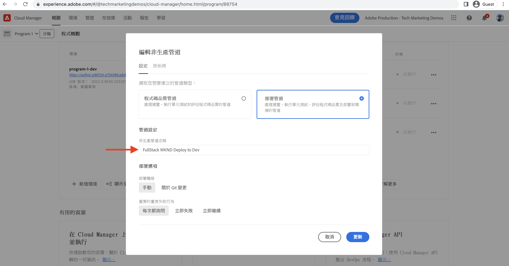
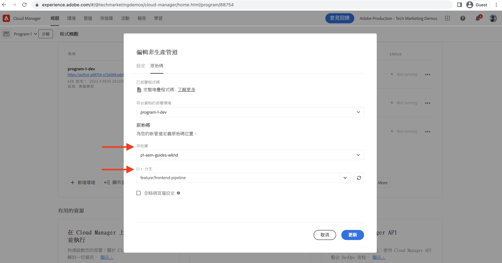
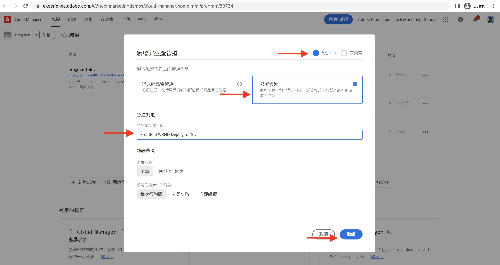
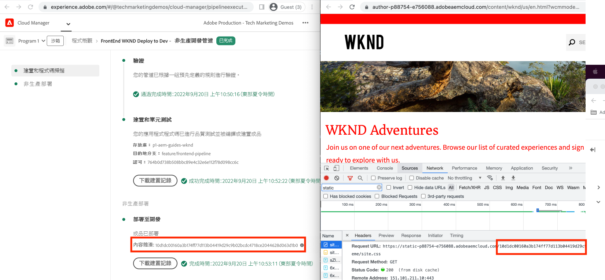

# 使用前端管道部署

在本章中，我們在AdobeCloud Manager中建立並運行前端管道。 它只從 `ui.frontend` 模組，並將其部署到as a Cloud Service的內置CDNAEM中。 因此，從  `/etc.clientlibs` 基於前端資源交付。

## 目標 {#objectives}

* 建立並運行前端管線。
* 驗證前端資源是否未從 `/etc.clientlibs` 但是從新主機名開始 `https://static-`

## 使用前端管線

>[!VIDEO](https://video.tv.adobe.com/v/3409420?quality=12&learn=on)

## 必備條件 {#prerequisites}

這是一個多部分教程，並假定在 [更新標準項AEM目](./update-project.md) 已完成。

確保您 [在Cloud Manager中建立和部署管道的權限](https://experienceleague.adobe.com/docs/experience-manager-cloud-manager/content/requirements/users-and-roles.html?lang=en#role-definitions) 和 [訪問AEMas a Cloud Service環境](https://experienceleague.adobe.com/docs/experience-manager-cloud-service/content/implementing/using-cloud-manager/manage-environments.html)。

## 更名現有管線

更名現有管線 __部署到開發__ 至  __FullStack WKND部署到開發__ 去 __配置__ 頁籤 __非生產管道名稱__ 的子菜單。 這就是通過查看管線名稱來明確管道是全棧還是前端。

在 __原始碼__ 頁籤，確保「儲存庫」和「Git分支」欄位值正確，並且分支具有您的前端管道合同更改。

## 建立前端管線

至 __僅__ 從 `ui.frontend` 模組，請執行以下步驟：

1. 在雲管理器UI中， __管線__ ，按一下 __添加__ ，然後選擇 __添加非生產管道__ 或 __添加生產管道__)的AEMas a Cloud Service。

1. 在 __添加非生產管道__ 對話框，作為 __配置__ 步驟，選擇 __部署管道__ 選項，將其命名為 __前端WKND部署到開發__，然後按一下 __繼續__

1. 作為 __原始碼__ 步驟，選擇 __前端代碼__ 選項，並從 __合格的部署環境__。 在 __原始碼__ 部分確保儲存庫和Git分支欄位值正確，並且分支具有您的前端管道合同更改。
和 __最重要__ 為 __代碼位置__ 欄位值為 `/ui.frontend` 最後按一下 __保存__。

## 部署序列

* 首先運行新更名的 __FullStack WKND部署到開發__ 管道，以從儲存庫中刪除WKND客戶端AEM庫檔案。 最重要的是，AEM通過增加 __Sling配置__ 檔案(`SiteConfig`。 `HtmlPageItemsConfig`)。

>[!WARNING]
>
>之後， __FullStack WKND部署到開發__ 管道完成 __未定型__ WKND站點，可能顯示為已損壞。 請計畫停機或在奇數小時內部署，這是您在初始交換機期間必須計畫的一次性中斷，從使用單個完整堆棧管道到前端管道。

* 最後，運行 __前端WKND部署到開發__ 僅生成管道 `ui.frontend` 將前端資源直接部署到CDN中。

>[!IMPORTANT]
>
>你注意到 __未定型__ WKND站點恢復正常，這次 __前端__ 管道執行比全棧管道快得多。

## 驗證樣式更改和新的交付范式

* 開啟WKND網站的任何頁面，您可以看到我們的文本顏色 __Adobe紅__ 前端資源(CSS、JS)檔案從CDN傳送。 資源請求主機名以 `https://static-pXX-eYY.p123-e456.adobeaemcloud.com/$HASH_VALUE$/theme/site.css` 以及您在中引用的site.js或任何其他靜態資源 `HtmlPageItemsConfig` 的子菜單。

>[!TIP]
>
>的 `$HASH_VALUE$` 這和你在 __前端WKND部署到開發__  管道 __內容哈希__ 的子菜單。 通AEM知前端資源的CDN URL，該值儲存在 `/conf/wknd/sling:configs/com.adobe.cq.wcm.core.components.config.HtmlPageItemsConfig/jcr:content` 在 __前置詞路徑__ 屬性。

## 恭喜！ {#congratulations}

祝賀您建立、運行並驗證了只構建和部署WKND站點項目的「ui.frontend」模組的前端管道。 現在，您的前端團隊可以在整個項目生命週期之外快速重述站點的設計AEM和前端行為。

## 後續步驟 {#next-steps}

在下一章， [注意事項](considerations.md)，您將回顧對前端和後端開發流程的影響。
