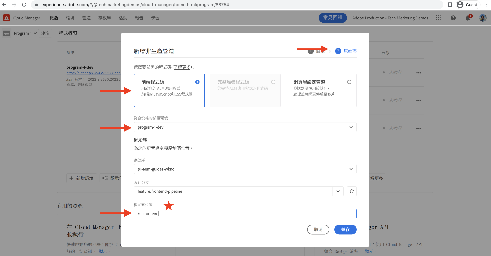

# 使用前端管道進行部署

在本章中，我們在 Adobe Cloud Manager 中建立並執行前端管道。此管道只會建置 `ui.frontend` 模組中的檔案並部署至 AEM as a Cloud Service 中內建的內容傳遞網路。因此，便不再使用以 `/etc.clientlibs` 為基礎的前端資源傳遞。

## 目標 {#objectives}

* 建立並執行前端管道。
* 請驗證前端資源不是從 `/etc.clientlibs` 而是以 `https://static-` 開頭的全新主機名稱傳遞出來

## 使用前端管道

>[!VIDEO](https://video.tv.adobe.com/v/3409420?quality=12&learn=on)

## 先決條件 {#prerequisites}

這是包含多個部分的教學課程，並假設您已經完成「[更新標準 AEM 專案](./update-project.md)」所述的步驟。

請確認您擁有[在 Cloud Manager 中建立和部署管道](https://experienceleague.adobe.com/docs/experience-manager-cloud-manager/content/requirements/users-and-roles.html?lang=zh-hant#role-definitions)以及[存取 AEM as a Cloud Service 環境的權限](https://experienceleague.adobe.com/docs/experience-manager-cloud-service/content/implementing/using-cloud-manager/manage-environments.html)。

## 重新命名現有管道

請至「__設定__」索引標籤的「__非生產管道名稱__」欄位，將現有管道從「__部署至開發__」重新命名為「__全堆疊 WKND 部署至開發__」。這樣只需查看名稱，便可以明確知道是全堆疊或是前端管道。

此外，在「__原始碼__」索引標籤中，確認「存放庫」和「Git 分支」欄位的值皆正確，而且分支已套用您的前端管道合約變更。

## 建立前端管道

若要&#x200B;__只是__&#x200B;建置和部署 `ui.frontend` 模組中的前端資源，請執行以下步驟：

1. 在 Cloud Manager UI 中，在「__管道__」區段按一下「__新增__」按鈕，然後根據您要部署的 AEM as a Cloud Service 環境，選取「__新增非生產管道__」（或「__新增生產管道__」）。

1. 在「__新增非生產管道__」對話框中，作為「__設定__」步驟的一部分，請選取「__部署管道__」選項，將其命名為「__前端 WKND 部署至開發__」，然後按一下「__繼續__」

1. 作為「__原始碼__」步驟的一部分，選取「__前端程式碼__」選項，並從「__合格的部署環境__」中選擇環境。在「__原始碼__」區段，請確認「存放庫」和「Git 分支」欄位的值皆正確，而且分支已套用您的前端管道合約變更。
而__最重要的是__，「__程式碼位置__」欄位的值是「`/ui.frontend`」，然後最後按一下「__儲存__」。

## 部署順序

* 首先執行重新命名的「__全堆疊 WKND 部署至開發__」管道，把 AEM 存放庫中的 WKND clientlib 檔案移除。最重要的是，新增 __Sling 設定__&#x200B;檔 (`SiteConfig`、`HtmlPageItemsConfig`)，為前端管道合約準備 AEM。

>[!WARNING]
>
>之後，「__全堆疊 WKND 部署至開發__」管道完成後，您將擁有一個&#x200B;__無樣式的__ WKND 網站，而該網站可能看起來已損壞。請做好故障停機應變計劃，或是在非工作時間進行部署。當您從使用全堆疊管道初次變更為使用前端管道時，必須做好規劃因應這種一次性的服務中斷情形。

* 最後，執行「__前端 WKND 部署至開發__」管道，以便僅建置 `ui.frontend` 模組並將前端資源直接部署到內容傳遞網路。

>[!IMPORTANT]
>
>您注意到&#x200B;__無樣式__ WKND 網站已恢復正常，而且這次&#x200B;__前端__&#x200B;管道執行的速度比全堆疊管道快上許多。

## 驗證樣式變更和新的傳遞典範

* 開啟 WKND 網站的任一頁面，都可以看到文字顏色是 __Adobe 紅色__，而且前端資源 (CSS、JS) 檔案皆從內容傳遞網路傳遞過來。資源請求主機名稱，以及 site.js 或是您在 `HtmlPageItemsConfig` 檔案中參考的任何其他靜態資源，都是一樣以 `https://static-pXX-eYY.p123-e456.adobeaemcloud.com/$HASH_VALUE$/theme/site.css` 開頭。

>[!TIP]
>
>這裡顯示的 `$HASH_VALUE$` 與您在「__前端 WKND 部署至開發__」管道的「__CONTENT HASH__」欄位所看到的相同。AEM 收到前端資源內容傳遞網路 URL 的通知，該值儲存在 `/conf/wknd/sling:configs/com.adobe.cq.wcm.core.components.config.HtmlPageItemsConfig/jcr:content`，位於「__prefixPath__」屬性之下。

## 恭喜！ {#congratulations}

恭喜，您已經建立、執行並確認只會建置和部署 WKND 網站專案的「ui.frontend」模組的前端管道。現在，您的前端團隊可以在完整的 AEM 專案生命週期以外，快速地進行網站設計和前端行為的疊代。

## 後續步驟 {#next-steps}

在下一章「[考量事項](considerations.md)」中，您將檢閱對於前端和後端開發流程的影響。
