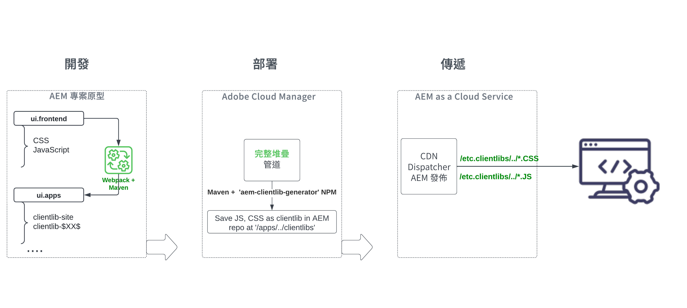

# 查看整個堆棧AEM項目的「ui.frontend」模組 {#aem-full-stack-ui-frontent}

在中，我們將重點介紹整個堆棧項目的「ui.frontend」模組，以回顧開發、部署和交AEM付前端對象的過程 __WKND站點項目__。


## 目標 {#objective}

* 瞭解整個堆棧項目中前端對象的生成AEM和部署流
* 查看AEM整個堆棧項目 `ui.frontend` 模組 [網路包](https://webpack.js.org/) 配置
* 客戶AEM端庫（也稱為客戶端庫）生成過程

## 用於完整堆棧和快速站AEM點建立項目的前端部署流

>[!IMPORTANT]
>
>此視頻解釋並演示了兩者的前端流 **完整堆棧和快速站點建立** 項目，以概述前端資源構建、部署和交付模式中的細微差異。

>[!VIDEO](https://video.tv.adobe.com/v/3409344?quality=12&learn=on)

## 必備條件 {#prerequisites}


* 克隆 [WKNDAEM站點項目](https://github.com/adobe/aem-guides-wknd)
* 已構建並部署克隆AEM的WKND站點項AEM目到as a Cloud Service。

請參閱AEMWKND站點項目 [README.md](https://github.com/adobe/aem-guides-wknd/blob/main/README.md) 的子菜單。

## AEM全堆棧項目前端偽像流 {#flow-of-frontend-artifacts}

以下是 __開發、部署和交付__ 整個堆棧項目中前端對象的流AEM量。




在開發階段，前端更改（如樣式和重新標注）通過更新CSS、JS檔案 `ui.frontend/src/main/webpack` 的子菜單。 然後，在構建期間， [網路包](https://webpack.js.org/) 模組綁定器和maven插件將這些檔案轉換為優化AEM的客戶端 `ui.apps` 中。

在運行以下命令時，前AEM端更改將部署到as a Cloud Service環境 [__完整堆棧__ Cloud Manager中的管道](https://experienceleague.adobe.com/docs/experience-manager-cloud-service/content/implementing/using-cloud-manager/cicd-pipelines/introduction-ci-cd-pipelines.html)。

前端資源通過URI路徑(從 `/etc.clientlibs/`，並且通常快取在AEMDispatcher和CDN上。


>[!NOTE]
>
> 同樣，在 __快速AEM建立站點__，也請參見Wiki頁。 [前端更改](https://experienceleague.adobe.com/docs/experience-manager-cloud-service/content/sites/administering/site-creation/quick-site/customize-theme.html) 通過運AEM行部署到as a Cloud Service環境 __前端__ 管道，請參閱 [設定管道](https://experienceleague.adobe.com/docs/experience-manager-cloud-service/content/sites/administering/site-creation/quick-site/pipeline-setup.html)

### 查看WKND站點項目中的Webpack配置 {#development-frontend-webpack-clientlib}

* 有三個 __網路包__ 用於捆綁WKND站點前端資源的配置檔案。

   1. `webpack.common`  — 此內容包含 __共__ 配置以指示WKND資源捆綁和優化。 的 __輸出__ 屬性指明在何處發出它建立的統一檔案(也稱為JavaScript捆綁包，但不要與AEMOSGi捆綁包混淆)。 預設名稱設定為 `clientlib-site/js/[name].bundle.js`。

   ```javascript
       ...
       output: {
               filename: 'clientlib-site/js/[name].bundle.js',
               path: path.resolve(__dirname, 'dist')
           }
       ...    
   ```

   1. `webpack.dev.js` 包含 __發展__ webpack-dev-serve的配置，並指向要使用的HTML模板。 它還包含運行於上的實例AEM的代理配置 `localhost:4502`。

   ```javascript
       ...
       devServer: {
           proxy: [{
               context: ['/content', '/etc.clientlibs', '/libs'],
               target: 'http://localhost:4502',
           }],
       ...    
   ```

   1. `webpack.prod.js` 包含 __生產__ 配置並使用插件將開發檔案轉換為優化的捆綁包。

   ```javascript
       ...
       module.exports = merge(common, {
           mode: 'production',
           optimization: {
               minimize: true,
               minimizer: [
                   new TerserPlugin(),
                   new CssMinimizerPlugin({ ...})
           }
       ...    
   ```


* 捆綁的資源將移到 `ui.apps` 模組使用 [aem-clientlib生成器](https://www.npmjs.com/package/aem-clientlib-generator) 插件，使用在 `clientlib.config.js` 的子菜單。

```javascript
    ...
    const BUILD_DIR = path.join(__dirname, 'dist');
    const CLIENTLIB_DIR = path.join(
    __dirname,
    '..',
    'ui.apps',
    'src',
    'main',
    'content',
    'jcr_root',
    'apps',
    'wknd',
    'clientlibs'
    );
    ...
```

* 的 __前面的插件__ 從 `ui.frontend/pom.xml` 在項目生成過程中協調webpack捆綁和AEM客戶端庫生成。

`$ mvn clean install -PautoInstallSinglePackage`

### 部署到AEMas a Cloud Service {#deployment-frontend-aemaacs}

的 [__完整堆棧__ 管道](https://experienceleague.adobe.com/docs/experience-manager-cloud-service/content/implementing/using-cloud-manager/cicd-pipelines/introduction-ci-cd-pipelines.html?#full-stack-pipeline) 將這些更改部署到AEMas a Cloud Service環境。


### 從AEMas a Cloud Service {#delivery-frontend-aemaacs}

通過完整堆棧管道部署的前端資源將從站點傳送AEM到Web瀏覽器， `/etc.clientlibs` 的子菜單。 您可以通過訪問 [公共托管的WKND站點](https://wknd.site/content/wknd/us/en.html) 查看網頁的來源。

```html
    ....
    <link rel="stylesheet" href="/etc.clientlibs/wknd/clientlibs/clientlib-site.lc-181cd4102f7f49aa30eea548a7715c31-lc.min.css" type="text/css">

    ...

    <script async src="/etc.clientlibs/wknd/clientlibs/clientlib-site.lc-d4e7c03fe5c6a405a23b3ca1cc3dcd3d-lc.min.js"></script>
    ....
```

## 恭喜！ {#congratulations}

恭喜，您已查看了整個堆棧項目的ui.frontend模組

## 後續步驟 {#next-steps}

在下一章， [更新項目以使用前端管線](update-project.md)，您將更新AEMWKND站點項目，以便為前端管道合同啟用它。
