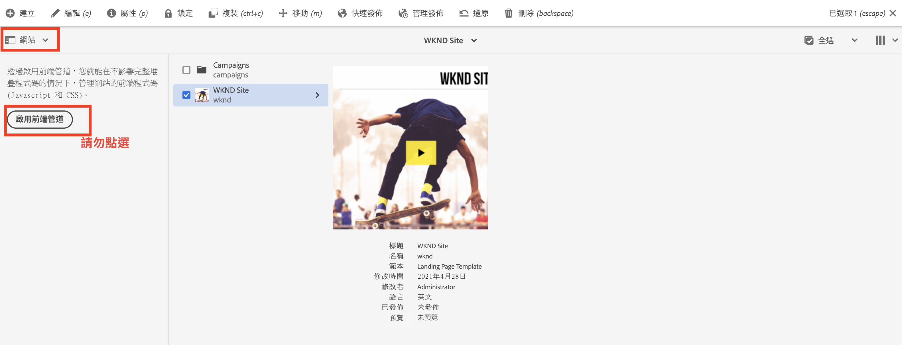

# 更新全堆疊 AEM 專案以便使用前端管道 {#update-project-enable-frontend-pipeline}

在本章中，我們會對 __WKND 網站專案__&#x200B;的設定檔進行變更，以便使用前端管道來部署 JavaScript 和 CSS，而不需要執行完整的全堆疊管道。這種做法可以把前端和後端成品的開發與部署生命週期分離，從整體上實現更快速的疊代式開發過程。

## 目標 {#objectives}

* 更新全堆疊專案以便使用前端管道

## 全堆疊 AEM 專案設定變更概觀

>[!VIDEO](https://video.tv.adobe.com/v/3409419?quality=12&learn=on)

## 先決條件 {#prerequisites}

這是包含多個部分的教學課程，並假設您已經檢閱[「ui.frontend」模組](./review-uifrontend-module.md)。


## 對全堆疊 AEM 專案的變更

為了進行測試，需要部署三個專案相關的設定變更以及一個樣式變更，因此 WKND 專案中總共有四個特定的變更，才能符合前端管道合約的要求。

1. 移除全堆疊建置週期中的 `ui.frontend` 模組

   * 在 WKND 網站專案的根目錄 `pom.xml` 中，對 `<module>ui.frontend</module>` 子模組項目加入註解符號。

   ```xml
       ...
       <modules>
       <module>all</module>
       <module>core</module>
       <!--
       <module>ui.frontend</module>
       -->                
       <module>ui.apps</module>
       ...
   ```

   * 並將 `ui.apps/pom.xml` 中的相依性加入註解符號

   ```xml
       ...
       <!-- ====================================================================== -->
       <!-- D E P E N D E N C I E S                                                -->
       <!-- ====================================================================== -->
           ...
       <!--
           <dependency>
               <groupId>com.adobe.aem.guides</groupId>
               <artifactId>aem-guides-wknd.ui.frontend</artifactId>
               <version>${project.version}</version>
               <type>zip</type>
           </dependency>
       -->    
       ...
   ```

1. 新增兩個新的 webpack 設定檔，為前端管道合約準備 `ui.frontend` 模組。

   * 複製現有的 `webpack.common.js` 並命名為 `webpack.theme.common.js`，然後依下列方式變更 `output` 屬性、`MiniCssExtractPlugin` 和 `CopyWebpackPlugin` 外掛程式的設定參數：

   ```javascript
   ...
   output: {
           filename: 'theme/js/[name].js', 
           path: path.resolve(__dirname, 'dist')
       }
   ...
   
   ...
       new MiniCssExtractPlugin({
               filename: 'theme/[name].css'
           }),
       new CopyWebpackPlugin({
           patterns: [
               { from: path.resolve(__dirname, SOURCE_ROOT + '/resources'), to: './theme' }
           ]
       })
   ...
   ```

   * 複製現有的 `webpack.prod.js` 並命名為 `webpack.theme.prod.js`，並將 `common` 變數的位置變更為上述檔案，如下：

   ```javascript
   ...
       const common = require('./webpack.theme.common.js');
   ...
   ```

   >[!NOTE]
   >
   >上述兩個「webpack」設定變更會產生不同的輸出檔案和資料夾名稱，因此我們可以輕鬆區分 clientlib 產生的 (全堆疊) 和主題產成的 (前端) 管道前端成品。
   >
   >如您所猜測的，可以略過上述變更並使用現有的 webpack 設定，但是必須進行以下變更。
   >
   >您可以自行決定要如何命名或進行整理。


   * 在 `package.json` 檔案中，確保 `name` 屬性值與 `/conf` 節點中的網站名稱相同。而在 `scripts` 屬性之下，`build` 指令碼指示如何使用這個模組建置前端檔案。

   ```javascript
       {
       "name": "wknd",
       "version": "1.0.0",
       ...
   
       "scripts": {
           "build": "webpack --config ./webpack.theme.prod.js"
       }
   
       ...
       }
   ```

1. 新增兩個 Sling 設定，為前端管道準備 `ui.content` 模組。

   * 在 `com.adobe.cq.wcm.core.components.config.HtmlPageItemsConfig` 建立一個檔案 - 其中包括 `ui.frontend` 模組使用 webpack 建置流程所產生並放在 `dist` 資料夾之下的所有前端檔案。

   ```xml
   ...
       <css
       jcr:primaryType="nt:unstructured"
       element="link"
       location="header">
       <attributes
           jcr:primaryType="nt:unstructured">
           <as
               jcr:primaryType="nt:unstructured"
               name="as"
               value="style"/>
           <href
               jcr:primaryType="nt:unstructured"
               name="href"
               value="/theme/site.css"/>
   ...
   ```

   >[!TIP]
   >
   >    參閱 __AEM WKND 網站專案__&#x200B;中完整的 [HtmlPageItemsConfig](https://github.com/adobe/aem-guides-wknd/blob/feature/frontend-pipeline/ui.content/src/main/content/jcr_root/conf/wknd/_sling_configs/com.adobe.cq.wcm.core.components.config.HtmlPageItemsConfig/.content.xml)。


   * 第二，具有 `themePackageName` 值的 `com.adobe.aem.wcm.site.manager.config.SiteConfig`，與 `package.json` 和 `name` 屬性值相同，而 `siteTemplatePath` 指向 `/libs/wcm/core/site-templates/aem-site-template-stub-2.0.0` stub 路徑值。

   ```xml
   ...
       <?xml version="1.0" encoding="UTF-8"?>
       <jcr:root xmlns:sling="http://sling.apache.org/jcr/sling/1.0" xmlns:jcr="http://www.jcp.org/jcr/1.0" xmlns:nt="http://www.jcp.org/jcr/nt/1.0"
               jcr:primaryType="nt:unstructured"
               siteTemplatePath="/libs/wcm/core/site-templates/aem-site-template-stub-2.0.0"
               themePackageName="wknd">
       </jcr:root>
   ...
   ```

   >[!TIP]
   >
   >    參閱 __AEM WKND 網站專案__&#x200B;中完整的 [SiteConfig](https://github.com/adobe/aem-guides-wknd/blob/feature/frontend-pipeline/ui.content/src/main/content/jcr_root/conf/wknd/_sling_configs/com.adobe.aem.wcm.site.manager.config.SiteConfig/.content.xml)。

1. 為了執行測試而透過前端管道部署的主題或樣式變更，我們更新 `ui.frontend/src/main/webpack/base/sass/_variables.scss`，以便把 `text-color` 變更為 Adobe 紅色 (您也可以自行選擇顏色)。

   ```css
       $black:     #a40606;
       ...
   ```

最後，將這些變更推送到程式的 Adobe Git 存放庫。


>[!AVAILABILITY]
>
> 您可以在 GitHub 上 __AEM WKND 網站專案__&#x200B;的&#x200B;[__前端管道__](https://github.com/adobe/aem-guides-wknd/tree/feature/frontend-pipeline)分支中取得這些變更。


## 注意–「_啟用前端管道_」按鈕

[邊欄選擇器](https://experienceleague.adobe.com/docs/experience-manager-cloud-service/content/sites/authoring/getting-started/basic-handling.html?lang=zh-Hant)的「[網站](https://experienceleague.adobe.com/docs/experience-manager-cloud-service/content/sites/authoring/getting-started/basic-handling.html?lang=zh-Hant)」選項，在選取您的網站根目錄或網站頁面時，顯示「**啟用前端管道**」按鈕。點按「**啟用前端管道**」按鈕將會覆寫上述 **Sling 設定**，請確保您透過 Cloud Manager 管道執行部署上述變更之後，**不會點按**&#x200B;到此按鈕。



如果不慎點按，您必須重新執行管道，以確保恢復前端管道合約和變更。

## 恭喜！ {#congratulations}

恭喜，您已更新 WKND 網站專案，便其符合前端管道合約的要求。

## 後續步驟 {#next-steps}

在下一章「[使用前端管道進行部署](create-frontend-pipeline.md)」中，您將建立並執行前端管道，然後確認我們如何&#x200B;__不再使用__&#x200B;基於「/etc.clientlibs」的前端資源傳遞。
