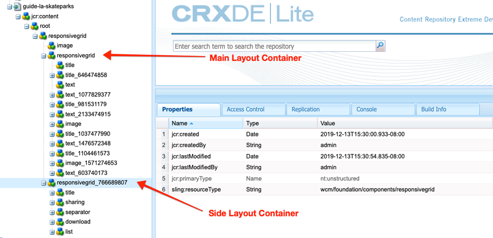

# 頁面和範本{#pages-and-template}

在本章中，我們將探討基本頁面元件與可編輯模板之間的關係。 我們將根據[AdobeXD](https://www.adobe.com/products/xd.html)中的部分模型，建立未設定樣式的文章範本。 在建立範本的過程中，會涵蓋「可編輯範本」的核心元件和進階原則組態。

## 必備條件 {#prerequisites}

檢閱設定[本機開發環境](overview.md#local-dev-environment)所需的工具和指示。

### Starter Project

>[!NOTE]
>
> 如果您成功完成上一章，可以重新使用項目，並跳過簽出起始項目的步驟。

查看教學課程所建立的基線程式碼：

1. 查看[GitHub](https://github.com/adobe/aem-guides-wknd)的`tutorial/pages-templates-start`分支

   ```shell
   $ cd ~/code/aem-guides-wknd
   $ git checkout tutorial/pages-templates-start
   ```

1. 使用您的Maven技巧，將程式碼庫部署至本機AEM實例：

   ```shell
   $ mvn clean install -PautoInstallSinglePackage
   ```

   >[!NOTE]
   >
   > 如果使用AEM 6.5或6.4，請將`classic`描述檔附加至任何Maven命令。

   ```shell
   $ mvn clean install -PautoInstallSinglePackage -Pclassic
   ```

您隨時都可以在[GitHub](https://github.com/adobe/aem-guides-wknd/tree/pages-templates/solution)上檢視完成的程式碼，或切換至分支`tutorial/pages-templates-solution`，在本機檢出程式碼。

## 目標

1. 檢查在Adobe XD中建立的頁面設計，並將它對應至核心元件。
1. 瞭解可編輯範本的詳細資訊，以及如何使用原則來強制精細控制頁面內容。
1. 瞭解範本和頁面的連結方式

## 您將建立的{#what-you-will-build}

在本教學課程中，您將建立新的「文章頁面範本」，可用來建立新文章頁面，並與一般結構對齊。 「文章頁面範本」將以AdobeXD中的設計和UI套件為基礎。 本章僅針對構建模板的結構或骨架進行介紹。 不會實作任何樣式，但範本和頁面都能運作。


## 使用Adobe XD {#adobexd}進行UI規劃

在大多數情況下，規劃新網站都從模型和靜態設計開始。 [Adobe ](https://www.adobe.com/products/xd.html) XD是建立使用者體驗的設計工具。接下來，我們將檢查UI套件和模型，以協助規劃「文章頁面範本」的結構。

>[!VIDEO](https://video.tv.adobe.com/v/30214/?quality=12&learn=on)

**下載 [WKND文章設計檔案](https://github.com/adobe/aem-guides-wknd/releases/download/aem-guides-wknd-0.0.2/AEM_UI-kit-WKND-article-design.xd)**。

## 建立文章頁面範本

建立頁面時，您必須選取範本，此範本將用作建立新頁面的基礎。 範本會定義產生頁面的結構、初始內容和允許的元件。

[可編輯範本](https://experienceleague.adobe.com/docs/experience-manager-65/developing/platform/templates/page-templates-editable.html)有3個主要區域：

1. **結構** -定義屬於模板一部分的元件。內容作者將無法編輯這些內容。
1. **初始內容** -定義範本將開頭的元件，內容作者可編輯和／或刪除這些元件
1. **Policys**  —— 定義元件的行為方式以及作者將提供哪些選項的配置。

接著，在AEM中建立符合模型結構的新範本。 這將發生在AEM的本機例項中。 請依照下列視訊中的步驟進行：

>[!VIDEO](https://video.tv.adobe.com/v/330991/?quality=12&learn=on)

## 使用體驗片段{#experience-fragments}更新頁首和頁尾

建立全域內容（例如頁首或頁尾）時的常見做法是使用「體驗片段」[。 ](https://docs.adobe.com/content/help/en/experience-manager-learn/sites/experience-fragments/experience-fragments-feature-video-use.html)體驗片段，可讓使用者結合多個元件，以建立單一、可參考的元件。 體驗片段的優點是支援多網站管理和[本地化](https://experienceleague.adobe.com/docs/experience-manager-core-components/using/components/experience-fragment.html?lang=en#localized-site-structure)。

AEM Project Archetype會產生頁首和頁尾。 接著，更新「體驗片段」以符合模型。 請依照下列視訊中的步驟進行：

>[!VIDEO](https://video.tv.adobe.com/v/330992/?quality=12&learn=on)

下載並安裝範例內容套件&#x200B;**[WKND-PagesTemplates-Content-Assets.zip](assets/pages-templates/WKND-PagesTemplates-Content-Assets.zip)**。

## 建立文章頁面

接著，使用「文章頁面」範本建立新頁面。 製作頁面內容以符合網站模型。 請依照下列視訊中的步驟進行：

>[!VIDEO](https://video.tv.adobe.com/v/330993/?quality=12&learn=on)

## 檢查節點結構{#node-structure}

此時，文章頁面顯然沒有樣式。 但是，基本結構已經到位。 接著，檢查文章頁面的節點結構，以更好地瞭解範本、頁面和元件的角色。

在本機AEM例項上使用CRXDE-Lite工具來檢視基礎節點結構。

1. 開啟[CRXDE-Lite](http://localhost:4502/crx/de/index.jsp#/content/wknd/us/en/magazine/guide-la-skateparks/jcr%3Acontent)，然後使用樹狀導覽導覽至`/content/wknd/us/en/magazine/guide-la-skateparks`。

1. 按一下`la-skateparks`頁面下的`jcr:content`節點並查看屬性：

   

   請注意`cq:template`的值，此值指向我們先前建立的「文章頁面範本」(`/conf/wknd/settings/wcm/templates/article-page`)。

   另請注意`sling:resourceType`的值，它指向`wknd/components/page`。 這是由AEM專案原型建立的頁面元件，負責根據範本呈現頁面。

1. 展開`/content/wknd/us/en/magazine/guide-la-skateparks/jcr:content`下的`jcr:content`節點，並查看節點層次結構：

   

   您應該能夠將每個節點鬆散地映射到已編寫的元件。 查看您是否可以透過檢查前置有`container`的節點來識別使用的不同配置容器。

1. 接下來檢查位於`/apps/wknd/components/page`的頁面元件。 在CRXDE Lite中檢視元件屬性：

   

   請注意，頁面元件下方只有2個HTL指令碼，`customfooterlibs.html`和`customheaderlibs.html`。 *那麼，這個元件如何呈現頁面？*

   `sling:resourceSuperType`屬性指向`core/wcm/components/page/v2/page`。 此屬性允許WKND的頁元件繼承核心元件頁元件的&#x200B;**all**&#x200B;功能。 這是[Proxy元件模式](https://docs.adobe.com/content/help/en/experience-manager-core-components/using/developing/guidelines.html#ProxyComponentPattern)的第一個範例。 如需詳細資訊，請參閱[這裡。](https://docs.adobe.com/content/help/en/experience-manager-core-components/using/developing/guidelines.html)。

1. 檢查WKND元件中的另一個元件，`Breadcrumb`元件位於：`/apps/wknd/components/breadcrumb`。 請注意，您可以找到相同的`sling:resourceSuperType`屬性，但此時它指向`core/wcm/components/breadcrumb/v2/breadcrumb`。 這是使用Proxy元件模式來包含核心元件的另一個範例。 事實上，WKND程式碼庫中的所有元件都是AEM Core Components的proxy（我們著名的HelloWorld元件除外）。 在&#x200B;*編寫自訂程式碼之前，請盡可能*&#x200B;重複使用核心元件的功能，這是最佳實務。

1. 接下來，使用CRXDE Lite檢查`/libs/core/wcm/components/page/v2/page`的核心元件頁面：

   >[!NOTE]
   >
   > 在AEM 6.5/6.4中，核心元件位於`/apps/core/wcm/components`下。 在AEM中，「核心元件」位於`/libs`下方，並會自動更新。

   

   請注意，本頁下方還包含許多指令碼。 「核心元件」頁面包含許多功能。 此功能可分割為多個指令碼，以方便維護和閱讀。 您可以開啟`page.html`並尋找`data-sly-include`，以追蹤HTL指令碼的包含：

   ```html
   <!--/* /libs/core/wcm/components/page/v2/page/page.html */-->
   <!DOCTYPE HTML>
   <html data-sly-use.page="com.adobe.cq.wcm.core.components.models.Page" lang="${page.language}"
       data-sly-use.head="head.html"
       data-sly-use.footer="footer.html"
       data-sly-use.redirect="redirect.html">
       <head data-sly-call="${head.head @ page = page}"></head>
       <body class="${page.cssClassNames}"
           id="${page.id}"
           data-cmp-data-layer-enabled="${page.data ? true : false}">
           <script data-sly-test.dataLayerEnabled="${page.data}">
           window.adobeDataLayer = window.adobeDataLayer || [];
           adobeDataLayer.push({
               page: JSON.parse("${page.data.json @ context='scriptString'}"),
               event:'cmp:show',
               eventInfo: {
                   path: 'page.${page.id @ context="scriptString"}'
               }
           });
           </script>
           <sly data-sly-test.isRedirectPage="${page.redirectTarget && (wcmmode.edit || wcmmode.preview)}"
               data-sly-call="${redirect.redirect @ redirectTarget = page.redirectTarget}"></sly>
           <sly data-sly-test="${!isRedirectPage}">
               <sly data-sly-include="body.skiptomaincontent.html"></sly>
               <sly data-sly-include="body.socialmedia_begin.html"></sly>
               <sly data-sly-include="body.html"></sly>
               <sly data-sly-call="${footer.footer @ page = page}"></sly>
               <sly data-sly-include="body.socialmedia_end.html"></sly>
           </sly>
       </body>
   </html>
   ```

   將HTL分割為多個指令碼的另一個原因是，允許代理元件覆寫個別指令碼，以實作自訂商業邏輯。 HTL指令碼`customfooterlibs.html`和`customheaderlibs.html`的建立目的是為了透過實施專案來覆寫。

   您可以閱讀本文章](https://experienceleague.adobe.com/docs/experience-manager-65/developing/platform/templates/page-templates-editable.html)，進一步瞭解可編輯範本如何影響到呈現[內容頁面。

1. 檢查另一個核心元件，如`/libs/core/wcm/components/breadcrumb/v2/breadcrumb`的Breadcrumb。 檢視`breadcrumb.html`指令碼，瞭解如何最終產生Breadcrumb元件的標籤。

## 將配置保存到原始碼控制{#configuration-persistence}

在許多情況下，尤其是在AEM專案開始時，將設定（例如範本和相關內容原則）保留至來源控制非常有用。 這可確保所有開發人員針對相同的內容和組態進行工作，並可確保環境之間的額外一致性。 一旦項目達到一定的成熟度，管理模板的做法就可以交給一組特殊的超級用戶。

目前，我們將像對待其他程式碼一樣對待範本，並將&#x200B;**文章頁面範本**&#x200B;向下同步化為專案的一部分。 到目前為止，我們已將&#x200B;**推送**&#x200B;程式碼從AEM專案傳送至AEM的本機例項。 **文章頁面範本**&#x200B;是直接在AEM的本機例項上建立，因此我們需要將範本匯入AEM專案中。 ******ui.content**&#x200B;模組已包含在AEM專案中，以利做此特定用途。

接下來的幾個步驟將使用使用[VSCode AEM Sync](https://marketplace.visualstudio.com/items?itemName=yamato-ltd.vscode-aem-sync&amp;ssr=false#overview)外掛程式的VSCode IDE進行，但可能是使用您已設定為&#x200B;**import**&#x200B;或從本機AEM例項匯入內容的任何IDE進行。

1. 在VSCode中，開啟`aem-guides-wknd`項目。

1. 展開「項目瀏覽器」中的&#x200B;**ui.content**&#x200B;模組。 展開`src`資料夾並導航到`/conf/wknd/settings/wcm/templates`。

1. [!UICONTROL Right+] 按一下 `templates` 資料夾，然 **後選取「從AEM Server匯入」**:

   

   `article-page`應匯入，`page-content`、`xf-web-variation`範本也應更新。

   

1. 重複這些步驟以導入內容，但選擇位於`/conf/wknd/settings/wcm/policies`的&#x200B;**policys**&#x200B;資料夾。

   

1. 檢查位於`ui.content/src/main/content/META-INF/vault/filter.xml`的`filter.xml`檔案。

   ```xml
   <!--ui.content filter.xml-->
   <?xml version="1.0" encoding="UTF-8"?>
   <workspaceFilter version="1.0">
       <filter root="/conf/wknd" mode="merge"/>
       <filter root="/content/wknd" mode="merge"/>
       <filter root="/content/dam/wknd" mode="merge"/>
       <filter root="/content/experience-fragments/wknd" mode="merge"/>
   </workspaceFilter>
   ```

   `filter.xml`檔案負責標識將隨軟體包一起安裝的節點的路徑。 請注意，每個篩選器上的`mode="merge"`都表示不會修改現有內容，只會新增新內容。 由於內容作者可能正在更新這些路徑，因此代碼部署&#x200B;**not**&#x200B;覆寫內容非常重要。 有關使用篩選器元素的詳細資訊，請參閱[FileVault文檔](https://jackrabbit.apache.org/filevault/filter.html)。

   比較`ui.content/src/main/content/META-INF/vault/filter.xml`和`ui.apps/src/main/content/META-INF/vault/filter.xml`以瞭解每個模組管理的不同節點。

   >[!WARNING]
   >
   > 為確保WKND參考站點的部署一致，已設定項目的某些分支，使`ui.content`將覆蓋JCR中的任何更改。 這是根據設計（即解決方案分支），因為將針對特定策略編寫代碼／樣式。

## 恭喜！{#congratulations}

恭喜您，您剛使用Adobe Experience Manager Sites建立了新的範本和頁面。

### 後續步驟{#next-steps}

此時，文章頁面顯然沒有樣式。 請依照[用戶端程式庫和前端工作流程](client-side-libraries.md)教學課程，瞭解包含CSS和Javascript的最佳實務，以便將全域樣式套用至網站並整合專用的前端建置。

在[GitHub](https://github.com/adobe/aem-guides-wknd)上檢視完成的程式碼，或在`tutorial/pages-templates-solution`的Git位置上檢視並部署程式碼。

1. 克隆[github.com/adobe/aem-wknd-guides](https://github.com/adobe/aem-guides-wknd)儲存庫。
1. 查看`tutorial/pages-templates-solution`分支。
