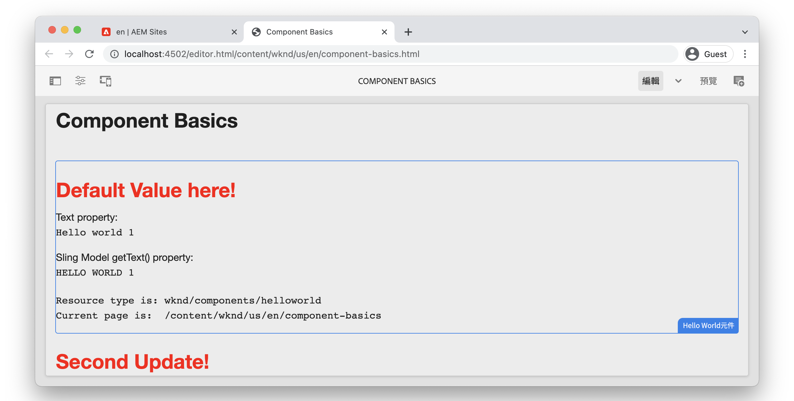

# 元件基本知識 {#component-basics}

在本章中，我們將透過簡單的 `HelloWorld` 範例。 對現有元件進行微幅修改，涵蓋製作、HTL、Sling模型、用戶端程式庫等主題。

## 必備條件 {#prerequisites}

檢閱設定 [本地開發環境](./overview.md#local-dev-environment).

影片中使用的IDE為 [Visual Studio代碼](https://code.visualstudio.com/) 和 [VSCode AEM同步](https://marketplace.visualstudio.com/items?itemName=yamato-ltd.vscode-aem-sync) 外掛程式。

## 目標 {#objective}

1. 了解HTL範本和Sling模型的角色，以動態呈現HTML。
1. 了解如何使用對話方塊來協助編寫內容。
1. 了解用戶端程式庫的基本知識，以包含CSS和JavaScript以支援元件。

## 您將建置的 {#what-you-will-build}

在本章中，您將對非常簡單的 `HelloWorld` 元件。 在更新 `HelloWorld` 元件將會說明AEM元件開發的重要方面。

## 章節入門項目 {#starter-project}

本章以由 [AEM專案原型](https://github.com/adobe/aem-project-archetype). 觀看以下影片並檢閱 [必要條件](#prerequisites) 開始！

>[!NOTE]
>
> 如果成功完成上一章，則可以重新使用項目，並跳過簽出入門項目的步驟。

>[!VIDEO](https://video.tv.adobe.com/v/330985/?quality=12&learn=on)

開啟新的命令行終端機，並執行以下操作。

1. 在空目錄中，複製 [aem-guides-wknd](https://github.com/adobe/aem-guides-wknd) 存放庫：

   ```shell
   $ git clone git@github.com:adobe/aem-guides-wknd.git --branch tutorial/component-basics-start --single-branch
   ```

   >[!NOTE]
   >
   > 您可以視需要選擇繼續使用上一章中產生的專案， [專案設定](./project-setup.md).

1. 導覽至  `aem-guides-wknd` 檔案夾。

   ```shell
   $ cd aem-guides-wknd
   ```

1. 使用下列命令建立專案並部署至AEM的本機執行個體：

   ```shell
   $ mvn clean install -PautoInstallSinglePackage
   ```

   >[!NOTE]
   >
   > 如果使用AEM 6.5或6.4，請附加 `classic` 配置檔案。

   ```shell
   $ mvn clean install -PautoInstallSinglePackage -Pclassic
   ```

1. 按照設定 [本地開發環境](overview.md#local-dev-environment).

## 元件編寫 {#component-authoring}

元件可視為網頁的小型模組化建置模組。 要重新使用元件，元件必須是可配置的。 這可透過製作對話方塊完成。 接下來，我們將製作簡單元件，並檢查對話方塊中的值如何保存在AEM中。

>[!VIDEO](https://video.tv.adobe.com/v/330986/?quality=12&learn=on)

以下是上述影片中執行的高階步驟。

1. 建立名為 **元件基本知識** 在 **WKND站點** `>` **US** `>` **en**.
1. 新增 **Hello World元件** 新建立的頁面。
1. 開啟元件的對話方塊，然後輸入一些文字。 儲存變更以查看頁面上顯示的訊息。
1. 切換至開發人員模式，在CRXDE-Lite中檢視內容路徑，並檢查元件例項的屬性。
1. 使用CRXDE-Lite檢視 `cq:dialog` 和 `helloworld.html` 位於 `/apps/wknd/components/content/helloworld`.

## HTL(HTML範本語言)和對話方塊 {#htl-dialogs}

HTML範本語言或 **[HTL](https://experienceleague.adobe.com/docs/experience-manager-htl/using/getting-started/getting-started.html)** 是輕量型的伺服器端範本語言，AEM元件用來轉譯內容。

**對話方塊** 定義可為元件建立的可用配置。

接下來，我們將更新 `HelloWorld` HTL指令碼可在文字訊息之前顯示其他問候語。

>[!VIDEO](https://video.tv.adobe.com/v/330987/?quality=12&learn=on)

以下是上述影片中執行的高階步驟。

1. 切換到IDE並開啟項目到 `ui.apps` 模組。
1. 開啟 `helloworld.html` 檔案，並對HTML標籤進行更改。
1. 使用IDE工具，如 [VSCode AEM同步](https://marketplace.visualstudio.com/items?itemName=yamato-ltd.vscode-aem-sync) 將檔案變更同步至本機AEM例項。
1. 返回瀏覽器，並觀察元件呈現已變更。
1. 開啟 `.content.xml` 定義 `HelloWorld` 元件位置：

   ```plain
   <code>/aem-guides-wknd/ui.apps/src/main/content/jcr_root/apps/wknd/components/helloworld/_cq_dialog/.content.xml
   ```

1. 更新對話方塊以新增其他文字欄位，名為 **標題** 名稱為 `./title`:

   ```xml
   <?xml version="1.0" encoding="UTF-8"?>
   <jcr:root xmlns:sling="http://sling.apache.org/jcr/sling/1.0" xmlns:cq="http://www.day.com/jcr/cq/1.0" xmlns:jcr="http://www.jcp.org/jcr/1.0" xmlns:nt="http://www.jcp.org/jcr/nt/1.0"
       jcr:primaryType="nt:unstructured"
       jcr:title="Properties"
       sling:resourceType="cq/gui/components/authoring/dialog">
       <content
           jcr:primaryType="nt:unstructured"
           sling:resourceType="granite/ui/components/coral/foundation/fixedcolumns">
           <items jcr:primaryType="nt:unstructured">
               <column
                   jcr:primaryType="nt:unstructured"
                   sling:resourceType="granite/ui/components/coral/foundation/container">
                   <items jcr:primaryType="nt:unstructured">
                       <title
                           jcr:primaryType="nt:unstructured"
                           sling:resourceType="granite/ui/components/coral/foundation/form/textfield"
                           fieldLabel="Title"
                           name="./title"/>
                       <text
                           jcr:primaryType="nt:unstructured"
                           sling:resourceType="granite/ui/components/coral/foundation/form/textfield"
                           fieldLabel="Text"
                           name="./text"/>
                   </items>
               </column>
           </items>
       </content>
   </jcr:root>
   ```

1. 重新開啟檔案 `helloworld.html`，代表負責轉譯的主要HTL指令碼 `HelloWorld` 元件，位於：

   ```plain
       <code>/aem-guides-wknd.ui.apps/src/main/content/jcr_root/apps/wknd/components/helloworld/helloworld.html
   ```

1. 更新 `helloworld.html` 呈現 **問候語** textfield作為的一部分 `H1` 標籤：

   ```html
   <div class="cmp-helloworld" data-cmp-is="helloworld">
       <h1 class="cmp-helloworld__title">${properties.title}</h1>
       ...
   </div>
   ```

1. 使用開發人員外掛程式或使用您的Maven技能，將變更部署至AEM的本機例項。

## Sling 模型 {#sling-models}

Sling模型是註解導向的Java &quot;POJO&#39;s&quot;（純舊Java物件），可方便將資料從JCR對應至Java變數，並在以AEM進行開發時提供許多其他細節。

接下來，我們會對 `HelloWorldModel` Sling Model ，以便在將某些商業邏輯輸出至頁面之前，先對JCR中儲存的值套用這些邏輯。

>[!VIDEO](https://video.tv.adobe.com/v/330988/?quality=12&learn=on)

1. 開啟檔案 `HelloWorldModel.java`，此模型與 `HelloWorld` 元件。

   ```plain
   <code>/aem-guides-wknd.core/src/main/java/com/adobe/aem/guides/wknd/core/models/HelloWorldModel.java
   ```

1. 新增下列匯入陳述式：

   ```java
   import org.apache.commons.lang3.StringUtils;
   import org.apache.sling.models.annotations.DefaultInjectionStrategy;
   ```

1. 更新 `@Model` 使用注釋 `DefaultInjectionStrategy`:

   ```java
   @Model(adaptables = Resource.class,
      defaultInjectionStrategy = DefaultInjectionStrategy.OPTIONAL)
      public class HelloWorldModel {
      ...
   ```

1. 將下列行新增至 `HelloWorldModel` 類以映射元件的JCR屬性的值 `title` 和 `text` 至Java變數：

   ```java
   ...
   @Model(adaptables = Resource.class,
   defaultInjectionStrategy = DefaultInjectionStrategy.OPTIONAL)
   public class HelloWorldModel {
   
       ...
   
       @ValueMapValue
       private String title;
   
       @ValueMapValue
       private String text;
   
       @PostConstruct
       protected void init() {
           ...
   ```

1. 新增下列方法 `getTitle()` 到 `HelloWorldModel` 類，它返回名為的屬性的值 `title`. 此方法新增其他邏輯，以傳回「此處的預設值！」字串值 如果屬性 `title` 為null或空白：

   ```java
   /***
   *
   * @return the value of title, if null or blank returns "Default Value here!"
   */
   public String getTitle() {
       return StringUtils.isNotBlank(title) ? title : "Default Value here!";
   }
   ```

1. 新增下列方法 `getText()` 到 `HelloWorldModel` 類，它返回名為的屬性的值 `text`. 此方法會將字串轉換為所有大寫字元。

   ```java
       /***
       *
       * @return All caps variation of the text value
       */
   public String getText() {
       return StringUtils.isNotBlank(this.text) ? this.text.toUpperCase() : null;
   }
   ```

1. 從 `core` 模組：

   ```shell
   $ cd core
   $ mvn clean install -PautoInstallBundle
   ```

   >[!NOTE]
   >
   > 若使用AEM 6.4/6.5，請使用 `mvn clean install -PautoInstallBundle -Pclassic`

1. 更新檔案 `helloworld.html` at `aem-guides-wknd.ui.apps/src/main/content/jcr_root/apps/wknd/components/content/helloworld/helloworld.html` 若要使用 `HelloWorld` 模型：

   ```html
   <div class="cmp-helloworld" data-cmp-is="helloworld"
   data-sly-use.model="com.adobe.aem.guides.wknd.core.models.HelloWorldModel">
       <h1 class="cmp-helloworld__title">${model.title}</h1>
       <div class="cmp-helloworld__item" data-sly-test="${properties.text}">
           <p class="cmp-helloworld__item-label">Text property:</p>
           <pre class="cmp-helloworld__item-output" data-cmp-hook-helloworld="property">${properties.text}</pre>
       </div>
       <div class="cmp-helloworld__item" data-sly-test="${model.text}">
           <p class="cmp-helloworld__item-label">Sling Model getText() property:</p>
           <pre class="cmp-helloworld__item-output" data-cmp-hook-helloworld="property">${model.text}</pre>
       </div>
       <div class="cmp-helloworld__item"  data-sly-test="${model.message}">
           <p class="cmp-helloworld__item-label">Model message:</p>
           <pre class="cmp-helloworld__item-output"data-cmp-hook-helloworld="model">${model.message}</pre>
       </div>
   </div>
   ```

1. 使用Eclipse開發人員外掛程式或使用您的Maven技能，將變更部署至AEM的本機例項。

## 用戶端資源庫 {#client-side-libraries}

用戶端資料庫（簡稱clientlibs）提供一種機制，可組織及管理AEM Sites實作所需的CSS和JavaScript檔案。 用戶端程式庫是在AEM的頁面上包含CSS和JavaScript的標準方式。

此 [ui.frontend](https://experienceleague.adobe.com/docs/experience-manager-core-components/using/developing/archetype/uifrontend.html) 模組是去耦 [webpack](https://webpack.js.org/) 整合至建置程式的專案。 這可讓使用熱門前端程式庫，例如Sass、LESS和TypeScript。 此 `ui.frontend` 模組將更深入地探索 [用戶端程式庫章節](/help/getting-started-wknd-tutorial-develop/project-archetype/client-side-libraries.md).

接下來，更新 `HelloWorld` 元件。

>[!VIDEO](https://video.tv.adobe.com/v/340750/?quality=12&learn=on)

以下是上述影片中執行的高階步驟。

1. 開啟終端機視窗並導覽至 `ui.frontend` 目錄和

1. 在 `ui.frontend` 目錄運行 `npm run watch` 命令：

   ```shell
   $ npm run watch
   ```
1. 切換到IDE並開啟項目到 `ui.frontend` 模組。
1. 開啟檔案 `ui.frontend/src/main/webpack/components/_helloworld.scss`.
1. 更新檔案以顯示紅色標題：

   ```scss
   .cmp-helloworld {}
   .cmp-helloworld__title {
       color: red;
   }
   ```

1. 在終端機中，您應會看到指出 `ui.frontend` 模組正在編譯變更，並將其與AEM的本機執行個體同步。

   ```shell
   Entrypoint site 214 KiB = clientlib-site/site.css 8.45 KiB clientlib-site/site.js 206 KiB
   2022-02-22 17:28:51: webpack 5.69.1 compiled successfully in 119 ms
   change:dist/index.html
   + jcr_root/apps/wknd/clientlibs/clientlib-site/css/site.css
   + jcr_root/apps/wknd/clientlibs/clientlib-site/css
   + jcr_root/apps/wknd/clientlibs/clientlib-site/js/site.js
   + jcr_root/apps/wknd/clientlibs/clientlib-site/js
   + jcr_root/apps/wknd/clientlibs/clientlib-site
   + jcr_root/apps/wknd/clientlibs/clientlib-dependencies/css.txt
   + jcr_root/apps/wknd/clientlibs/clientlib-dependencies/js.txt
   + jcr_root/apps/wknd/clientlibs/clientlib-dependencies
   ```

1. 返回瀏覽器，並觀察標題顏色已變更。

   

## 恭喜！ {#congratulations}

恭喜，您剛剛在Adobe Experience Manager中了解元件開發的基本知識！

### 後續步驟 {#next-steps}

在下一章中熟悉Adobe Experience Manager頁面和範本 [頁面和範本](pages-templates.md). 了解如何將核心元件代理至專案，並了解可編輯範本的進階政策設定，以建立結構良好的文章頁面範本。

在上檢視完成的程式碼 [GitHub](https://github.com/adobe/aem-guides-wknd) 或在本機的Git分支檢閱並部署程式碼 `tutorial/component-basics-solution`.
