# 自訂元件 {#custom-component}

本教學課程涵蓋以端對端方式建立自訂AEM Byline元件，以顯示在對話方塊中撰寫的內容，並探討開發Sling模型，以封裝填入元件HTL的商業邏輯。

## 必備條件 {#prerequisites}

查看設定[本地開發環境](overview.md#local-dev-environment)所需的工具和說明。

### 入門專案

>[!NOTE]
>
> 如果成功完成上一章，則可以重新使用項目，並跳過簽出入門項目的步驟。

查看本教學課程所建置的底線程式碼：

1. 查看[GitHub](https://github.com/adobe/aem-guides-wknd)的`tutorial/custom-component-start`分支

   ```shell
   $ cd aem-guides-wknd
   $ git checkout tutorial/custom-component-start
   ```

1. 使用您的Maven技能，將程式碼基底部署至本機AEM執行個體：

   ```shell
   $ mvn clean install -PautoInstallSinglePackage
   ```

   >[!NOTE]
   >
   > 如果使用AEM 6.5或6.4，請將`classic`描述檔附加至任何Maven命令。

   ```shell
   $ mvn clean install -PautoInstallSinglePackage -Pclassic
   ```

您一律可以在[GitHub](https://github.com/adobe/aem-guides-wknd/tree/tutorial/custom-component-solution)上檢視完成的程式碼，或切換至分支`tutorial/custom-component-solution`在本機檢出程式碼。

## 目標

1. 了解如何建立自訂AEM元件
1. 了解如何使用Sling模型封裝商業邏輯
1. 了解如何從HTL指令碼使用Sling模型

## 您將建置的 {#byline-component}

在WKND教學課程的這一部分中，系統會建立署名元件，以用於顯示有關文章貢獻者的撰寫資訊。

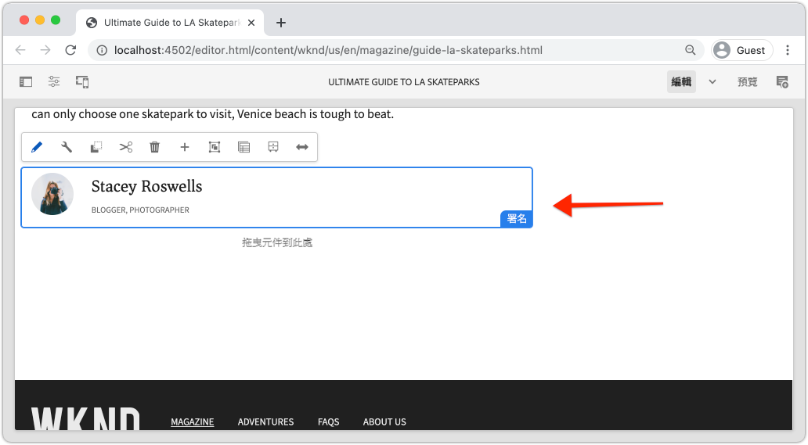

*署名元件*

Byline元件的實作包含收集署名內容的對話方塊，以及擷取署名的自訂Sling模型：

* 名稱
* 影像
* 職業

## 建立署名元件 {#create-byline-component}

首先，建立「署名元件」節點結構並定義對話框。 這表示AEM中的元件，並依元件在JCR中的位置以隱含方式定義元件的資源類型。

對話方塊會公開內容作者可提供的介面。 為此實作，系統將運用AEM WCM核心元件的&#x200B;**Image**&#x200B;元件來處理署名影像的製作和轉譯，因此會設為元件的`sling:resourceSuperType`。

### 建立元件定義 {#create-component-definition}

1. 在&#x200B;**ui.apps**&#x200B;模組中，導覽至`/apps/wknd/components`並建立名為`byline`的新資料夾。
1. 在`byline`資料夾下方新增名為`.content.xml`的新檔案

   

1. 將以下內容填入`.content.xml`檔案：

   ```xml
   <?xml version="1.0" encoding="UTF-8"?>
       <jcr:root xmlns:sling="http://sling.apache.org/jcr/sling/1.0" xmlns:cq="http://www.day.com/jcr/cq/1.0" xmlns:jcr="http://www.jcp.org/jcr/1.0"
       jcr:primaryType="cq:Component"
       jcr:title="Byline"
       jcr:description="Displays a contributor's byline."
       componentGroup="WKND Sites Project - Content"
       sling:resourceSuperType="core/wcm/components/image/v2/image"/>
   ```

   上述XML檔案提供元件的定義，包括標題、說明和群組。 `sling:resourceSuperType`指向`core/wcm/components/image/v2/image`，即[核心影像元件](https://experienceleague.adobe.com/docs/experience-manager-core-components/using/components/image.html)。

### 建立HTL指令碼 {#create-the-htl-script}

1. 在`byline`資料夾下方新增檔案`byline.html`，負責元件的HTML呈現。 將檔案命名為與資料夾相同的檔案很重要，因為它會成為Sling用來呈現此資源類型的預設指令碼。

1. 將下列程式碼新增至`byline.html`。

   ```html
   <!--/* byline.html */-->
   <div data-sly-use.placeholderTemplate="core/wcm/components/commons/v1/templates.html">
   </div>
   <sly data-sly-call="${placeholderTemplate.placeholder @ isEmpty=true}"></sly>
   ```

`byline.html` 稍後 [會重新審視](#byline-htl)，一旦建立Sling模型。HTL檔案的目前狀態可讓元件拖放至頁面時，顯示在AEM Sites的「頁面編輯器」中，處於空白狀態。

### 建立對話框定義 {#create-the-dialog-definition}

接下來，使用以下欄位為Byline元件定義一個對話框：

* **名稱**:貢獻者名稱的文字欄位。
* **影像**:參考貢獻者的簡歷。
* **職業**:貢獻者的職業清單。職業應按字母順序遞增（a至z）。

1. 在`byline`資料夾下，建立名為`_cq_dialog`的新資料夾。
1. 在`byline/_cq_dialog`下方新增名為`.content.xml`的新檔案。 這是對話框的XML定義。 添加以下XML:

   ```xml
   <?xml version="1.0" encoding="UTF-8"?>
   <jcr:root xmlns:sling="http://sling.apache.org/jcr/sling/1.0" xmlns:cq="http://www.day.com/jcr/cq/1.0" xmlns:jcr="http://www.jcp.org/jcr/1.0" xmlns:nt="http://www.jcp.org/jcr/nt/1.0"
           jcr:primaryType="nt:unstructured"
           jcr:title="Byline"
           sling:resourceType="cq/gui/components/authoring/dialog">
       <content
               jcr:primaryType="nt:unstructured"
               sling:resourceType="granite/ui/components/coral/foundation/container">
           <items jcr:primaryType="nt:unstructured">
               <tabs
                       jcr:primaryType="nt:unstructured"
                       sling:resourceType="granite/ui/components/coral/foundation/tabs"
                       maximized="{Boolean}false">
                   <items jcr:primaryType="nt:unstructured">
                       <asset
                               jcr:primaryType="nt:unstructured"
                               sling:hideResource="{Boolean}false"/>
                       <metadata
                               jcr:primaryType="nt:unstructured"
                               sling:hideResource="{Boolean}true"/>
                       <properties
                               jcr:primaryType="nt:unstructured"
                               jcr:title="Properties"
                               sling:resourceType="granite/ui/components/coral/foundation/container"
                               margin="{Boolean}true">
                           <items jcr:primaryType="nt:unstructured">
                               <columns
                                       jcr:primaryType="nt:unstructured"
                                       sling:resourceType="granite/ui/components/coral/foundation/fixedcolumns"
                                       margin="{Boolean}true">
                                   <items jcr:primaryType="nt:unstructured">
                                       <column
                                               jcr:primaryType="nt:unstructured"
                                               sling:resourceType="granite/ui/components/coral/foundation/container">
                                           <items jcr:primaryType="nt:unstructured">
                                               <name
                                                       jcr:primaryType="nt:unstructured"
                                                       sling:resourceType="granite/ui/components/coral/foundation/form/textfield"
                                                       emptyText="Enter the contributor's name to display."
                                                       fieldDescription="The contributor's name to display."
                                                       fieldLabel="Name"
                                                       name="./name"
                                                       required="{Boolean}true"/>
                                               <occupations
                                                       jcr:primaryType="nt:unstructured"
                                                       sling:resourceType="granite/ui/components/coral/foundation/form/multifield"
                                                       fieldDescription="A list of the contributor's occupations."
                                                       fieldLabel="Occupations"
                                                       required="{Boolean}false">
                                                   <field
                                                           jcr:primaryType="nt:unstructured"
                                                           sling:resourceType="granite/ui/components/coral/foundation/form/textfield"
                                                           emptyText="Enter an occupation"
                                                           name="./occupations"/>
                                               </occupations>
                                           </items>
                                       </column>
                                   </items>
                               </columns>
                           </items>
                       </properties>
                   </items>
               </tabs>
           </items>
       </content>
   </jcr:root>
   ```

   這些對話節點定義使用[Sling Resource Merger](https://sling.apache.org/documentation/bundles/resource-merger.html)來控制從`sling:resourceSuperType`元件繼承的對話框頁簽，在此例中是&#x200B;**核心元件的影像元件**。

   

### 建立策略對話框 {#create-the-policy-dialog}

按照與建立對話框相同的方法，建立「策略」對話框（以前稱為「設計」對話框），以隱藏從核心元件的映像元件繼承的策略配置中不需要的欄位。

1. 在`byline`資料夾下，建立名為`_cq_design_dialog`的新資料夾。
1. 在`byline/_cq_design_dialog`下方建立名為`.content.xml`的新檔案。 使用下列項目更新檔案：的XML。 最簡單的方式是開啟`.content.xml`，然後將XML複製/貼到下面。

   ```xml
   <?xml version="1.0" encoding="UTF-8"?>
   <jcr:root xmlns:sling="http://sling.apache.org/jcr/sling/1.0" xmlns:granite="http://www.adobe.com/jcr/granite/1.0" xmlns:cq="http://www.day.com/jcr/cq/1.0" xmlns:jcr="http://www.jcp.org/jcr/1.0" xmlns:nt="http://www.jcp.org/jcr/nt/1.0"
       jcr:primaryType="nt:unstructured"
       jcr:title="Byline"
       sling:resourceType="cq/gui/components/authoring/dialog">
       <content
               jcr:primaryType="nt:unstructured">
           <items jcr:primaryType="nt:unstructured">
               <tabs
                       jcr:primaryType="nt:unstructured">
                   <items jcr:primaryType="nt:unstructured">
                       <properties
                               jcr:primaryType="nt:unstructured">
                           <items jcr:primaryType="nt:unstructured">
                               <content
                                       jcr:primaryType="nt:unstructured">
                                   <items jcr:primaryType="nt:unstructured">
                                       <decorative
                                               jcr:primaryType="nt:unstructured"
                                               sling:hideResource="{Boolean}true"/>
                                       <altValueFromDAM
                                               jcr:primaryType="nt:unstructured"
                                               sling:hideResource="{Boolean}true"/>
                                       <titleValueFromDAM
                                               jcr:primaryType="nt:unstructured"
                                               sling:hideResource="{Boolean}true"/>
                                       <displayCaptionPopup
                                               jcr:primaryType="nt:unstructured"
                                               sling:hideResource="{Boolean}true"/>
                                       <disableUuidTracking
                                               jcr:primaryType="nt:unstructured"
                                               sling:hideResource="{Boolean}true"/>
                                   </items>
                               </content>
                           </items>
                       </properties>
                       <features
                               jcr:primaryType="nt:unstructured">
                           <items jcr:primaryType="nt:unstructured">
                               <content
                                       jcr:primaryType="nt:unstructured">
                                   <items jcr:primaryType="nt:unstructured">
                                       <accordion
                                               jcr:primaryType="nt:unstructured">
                                           <items jcr:primaryType="nt:unstructured">
                                               <orientation
                                                       jcr:primaryType="nt:unstructured"
                                                       sling:hideResource="{Boolean}true"/>
                                               <crop
                                                       jcr:primaryType="nt:unstructured"
                                                       sling:hideResource="{Boolean}true"/>
                                           </items>
                                       </accordion>
                                   </items>
                               </content>
                           </items>
                       </features>
                   </items>
               </tabs>
           </items>
       </content>
   </jcr:root>
   ```

   從[核心元件映像元件](https://github.com/adobe/aem-core-wcm-components/blob/master/content/src/content/jcr_root/apps/core/wcm/components/image/v2/image/_cq_design_dialog/.content.xml)獲取了前面&#x200B;**策略對話框** XML的基礎。

   如同在Dialog設定中，[Sling Resource Merger](https://sling.apache.org/documentation/bundles/resource-merger.html)也用於隱藏從`sling:resourceSuperType`繼承的無關欄位，如具有`sling:hideResource="{Boolean}true"`屬性的節點定義所示。

### 部署程式碼 {#deploy-the-code}

1. 使用您的Maven技能，將更新的程式碼基底部署至本機AEM執行個體：

   ```shell
   $ cd aem-guides-wknd
   $ mvn clean install -PautoInstallSinglePackage
   ```

## 將元件新增至頁面 {#add-the-component-to-a-page}

為了讓程式簡單明瞭，並著重於AEM元件開發，我們會將目前狀態的Byline元件新增至文章頁面，以驗證`cq:Component`節點定義已部署且正確，AEM會辨識新元件定義，而元件的對話方塊可用於編寫。

### 新增影像至AEM Assets

首先，將頭像範例上傳至AEM Assets，以用來填入署名元件中的影像。

1. 導覽至AEM Assets的LA Skateparks資料夾：[http://localhost:4502/assets.html/content/dam/wknd/en/magazine/la-skateparks](http://localhost:4502/assets.html/content/dam/wknd/en/magazine/la-skateparks)。

1. 將&#x200B;**[stacey-roswells.jpg](assets/custom-component/stacey-roswells.jpg)**&#x200B;的頭照上傳至資料夾。

   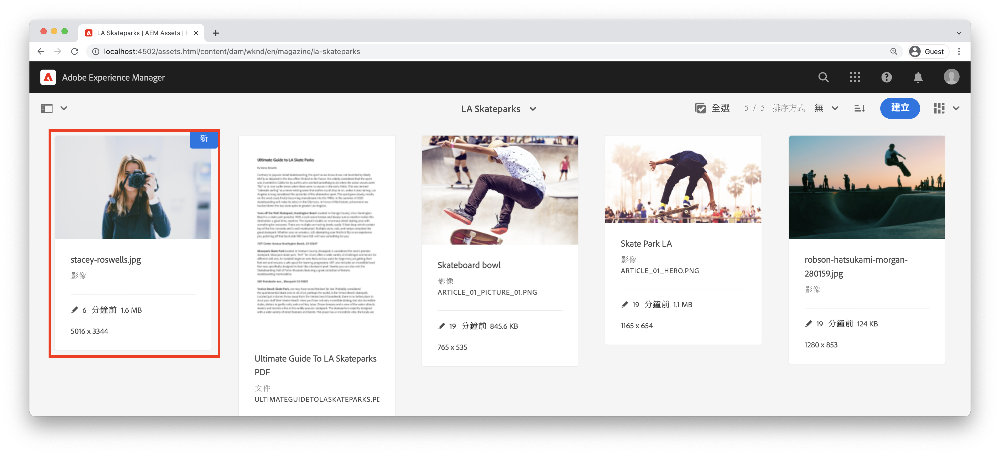

### 撰寫元件 {#author-the-component}

接下來，將署名元件新增至AEM中的頁面。 因為我們已將署名元件添加到&#x200B;**WKND Sites項目 — 內容**&#x200B;元件組中，通過`ui.apps/src/main/content/jcr_root/apps/wknd/components/byline/.content.xml`定義，它可自動供&#x200B;**Policy**&#x200B;允許&#x200B;**WKND Sites項目 — 內容**&#x200B;元件組的任何&#x200B;**容器**&#x200B;使用，文章頁面的佈局容器是該元件組。

1. 導覽至LA Skatepark文章，網址為：[http://localhost:4502/editor.html/content/wknd/us/en/magazine/guide-la-skateparks.html](http://localhost:4502/editor.html/content/wknd/us/en/magazine/guide-la-skateparks.html)

1. 從左側邊欄，將&#x200B;**署名元件**&#x200B;拖放至已開啟文章頁面之「版面容器」的&#x200B;**底部**。

   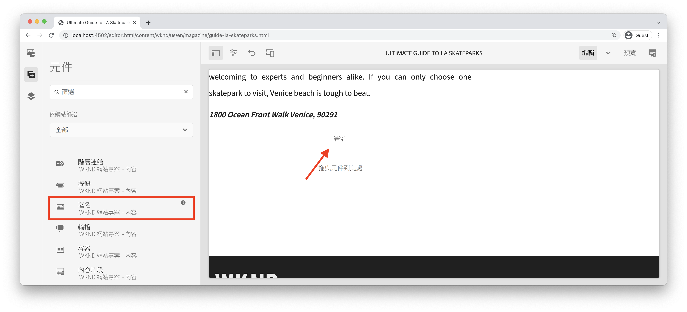

1. 確保左側邊欄&#x200B;**已開啟**&#x200B;且可見，且已選取&#x200B;**資產尋找器**。

   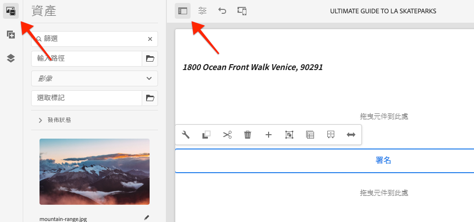

1. 選擇&#x200B;**Byline元件佔位符**，該佔位符依次顯示操作欄並點選&#x200B;**扳手**&#x200B;表徵圖以開啟對話框。

   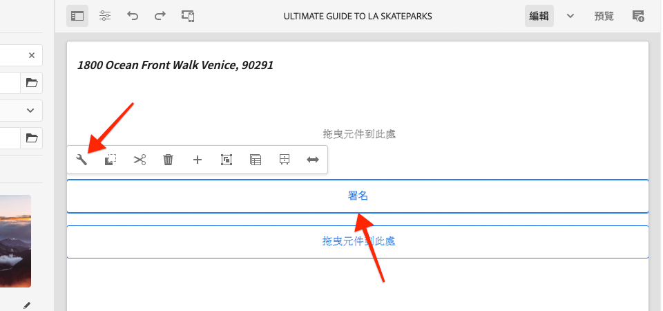

1. 在對話方塊開啟，且第一個索引標籤（資產）處於作用中狀態時，開啟左側邊欄，然後從資產尋找器將影像拖曳至「影像」放置區。 搜索「stacey」以查找WKND ui.content包中提供的Stacey Roswells簡歷圖片。

   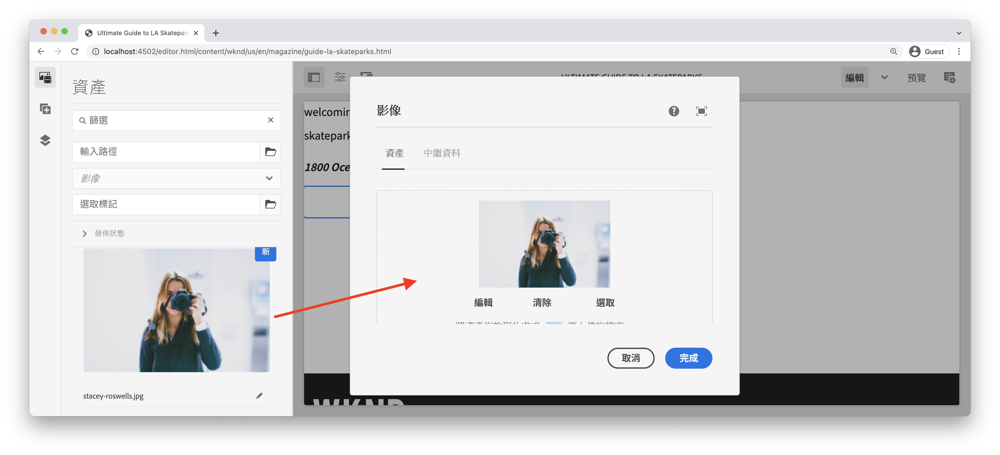

1. 新增影像後，按一下&#x200B;**屬性**&#x200B;標籤以輸入&#x200B;**名稱**&#x200B;和&#x200B;**職業**。

   進入職業時，請按&#x200B;**反字母**&#x200B;順序輸入，這樣我們將在Sling模型中實施的按字母順序排列的業務邏輯就顯而易見了。

   點選右下方的&#x200B;**Done**&#x200B;按鈕，儲存變更。

   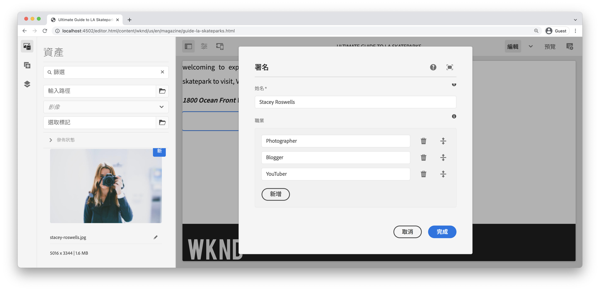

   AEM作者透過對話方塊來設定和製作元件。 此時，在開發署名元件時，會包含用於收集資料的對話方塊，但轉譯製作內容的邏輯尚未新增。 因此，只會顯示預留位置。

1. 儲存對話方塊後，導覽至[CRXDE Lite](http://localhost:4502/crx/de/index.jsp#/content/wknd/us/en/magazine/guide-la-skateparks/jcr%3Acontent/root/container/container/byline)並檢閱元件內容節點上AEM頁面下的署名元件內容節點如何儲存元件內容。

   在「LA Skate Parks」(LA Skate Parks)頁面下查找Byline元件內容節點，即`/content/wknd/us/en/magazine/guide-la-skateparks/jcr:content/root/container/container/byline`。

   請注意，屬性名稱`name`、`occupations`和`fileReference`儲存在&#x200B;**位元組節點**&#x200B;上。

   另外，請注意，節點的`sling:resourceType`設定為`wknd/components/content/byline`，這是將此內容節點綁定到Byline元件實施的原因。

   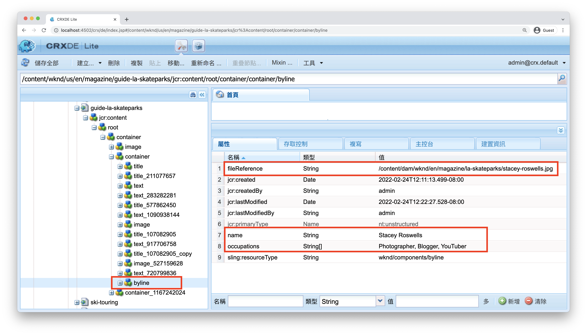

## 建立署名Sling模型 {#create-sling-model}

接下來，我們將建立Sling模型作為資料模型，並存放Byline元件的業務邏輯。

Sling模型是註解導向的Java &quot;POJO&#39;s&quot;（純舊Java物件），可方便將資料從JCR對應至Java變數，並在以AEM進行開發時提供許多其他細節。

### 檢閱Maven相依性 {#maven-dependency}

Byline Sling模型將仰賴AEM提供的數個Java API。 這些API可透過`core`模組的POM檔案中列出的`dependencies`使用。 本教學課程使用的專案已針對AEM as aCloud Service建置。 但它的獨特之處在於它向後相容於AEM 6.5/6.4。因此，它同時包含了Cloud Service和AEM 6.x的依賴項。

1. 開啟`<src>/aem-guides-wknd/core/pom.xml`下方的`pom.xml`檔案。
1. 查找`aem-sdk-api` - **AEM as a Only**&#x200B;的相依性

   ```xml
   <dependency>
       <groupId>com.adobe.aem</groupId>
       <artifactId>aem-sdk-api</artifactId>
   </dependency>
   ```

   [aem-sdk-api](https://experienceleague.adobe.com/docs/experience-manager-cloud-service/implementing/developing/aem-as-a-cloud-service-sdk.html?lang=en#building-for-the-sdk)包含AEM公開的所有公用Java API。 建置此專案時，預設會使用`aem-sdk-api`。 版本會維護在位於專案根目錄`aem-guides-wknd/pom.xml`的Parent reactor pom中。

1. 找到`uber-jar` - **AEM 6.5/6.4的相依性，僅**

   ```xml
   ...
       <dependency>
           <groupId>com.adobe.aem</groupId>
           <artifactId>uber-jar</artifactId>
           <classifier>apis</classifier>
       </dependency>
   ...
   ```

   只有叫用`classic`設定檔（即`mvn clean install -PautoInstallSinglePackage -Pclassic`）時，才會包含`uber-jar`。 同樣地，這是此專案專屬的。 在真實專案中，如果指定的AEM版本是6.5或6.4，則從AEM專案原型產生的`uber-jar`將是預設值。

   [uber-jar](https://docs.adobe.com/content/help/en/experience-manager-65/developing/devtools/ht-projects-maven.html#experience-manager-api-dependencies)包含AEM 6.x公開的所有公用Java API。版本會維護在位於專案`aem-guides-wknd/pom.xml`根目錄的Parent reactor pom中。

1. 查找`core.wcm.components.core`的依賴項：

   ```xml
    <!-- Core Component Dependency -->
       <dependency>
           <groupId>com.adobe.cq</groupId>
           <artifactId>core.wcm.components.core</artifactId>
       </dependency>
   ```

   這是AEM核心元件公開的所有公用Java API。 AEM核心元件是在AEM外部維護的專案，因此有個別的發行週期。 因此，它是需要單獨包含的相依性，且&#x200B;**不**&#x200B;包含於`uber-jar`或`aem-sdk-api`中。

   與uber-jar一樣，此相依性的版本會維護在位於`aem-guides-wknd/pom.xml`的Parent reactor pom檔案中。

   在本教學課程的稍後部分，我們將使用核心元件影像類別，在署名元件中顯示影像。 您必須具有核心元件相依性，才能建置和編譯我們的Sling模型。

### 署名介面 {#byline-interface}

為署名建立公用Java介面。 `Byline.java` 定義驅動HTL指令碼所需的公 `byline.html` 用方法。

1. 在`core/src/main/java/com/adobe/aem/guides/wknd/core/models`下方的`aem-guides-wknd.core`模組中，建立名為`Byline.java`的新檔案

   

1. 使用下列方法更新`Byline.java`:

   ```java
   package com.adobe.aem.guides.wknd.core.models;
   
   import java.util.List;
   
   /**
   * Represents the Byline AEM Component for the WKND Site project.
   **/
   public interface Byline {
       /***
       * @return a string to display as the name.
       */
       String getName();
   
       /***
       * Occupations are to be sorted alphabetically in a descending order.
       *
       * @return a list of occupations.
       */
       List<String> getOccupations();
   
       /***
       * @return a boolean if the component has enough content to display.
       */
       boolean isEmpty();
   }
   ```

   前兩種方法公開署名元件的&#x200B;**name**&#x200B;和&#x200B;**職業**&#x200B;的值。

   `isEmpty()`方法用於確定元件是否具有要呈現的任何內容或元件是否等待配置。

   請注意，沒有影像的方法；[我們將查看為什麼是稍後](#tackling-the-image-problem)。

1. 包含公用Java類的Java包（在此例中是Sling模型）必須使用包的`package-info.java`檔案進行版本控制。

由於WKND源的Java包`com.adobe.aem.guides.wknd.core.models`聲明為`2.0.0`的版本，並且我們添加了非中斷的公共介面和方法，因此必須將該版本增加到`2.1.0`。 在`core/src/main/java/com/adobe/aem/guides/wknd/core/models/package-info.java`開啟檔案，並將`@Version("2.0.0")`更新為`@Version("2.1.0")`。

    &quot;&#39;
    @Version(&quot;2.1.0&quot;)
    套件com.adobe.aem.guides.wknd.core.models;
    
    匯入org.osgi.annotation.versioning.Version;
    &#39;

每當對此包中的檔案進行更改時，[包版本必須在語義上](https://semver.org/)進行調整。 如果沒有，Maven項目的[bnd-baseline-maven-plugin](https://github.com/bndtools/bnd/tree/master/maven/bnd-baseline-maven-plugin)將檢測到無效的包版本，並中斷構建。 幸運的是，失敗時，Maven外掛程式會報告無效的Java套件版本，以及應該的版本。 剛將違反Java套件`package-info.java`中的`@Version("...")`宣告更新為外掛程式建議的要修正的版本。

### 署名實作 {#byline-implementation}

`BylineImpl.java` 是實作先前定義之介面的Sling `Byline.java` 模型實作。`BylineImpl.java`的完整代碼可在此部分底部找到。

1. 在`core/src/main/java/com/adobe/aem/guides/core/models`下方建立名為`impl`的新資料夾。
1. 在`impl`資料夾中建立新檔案`BylineImpl.java`。

   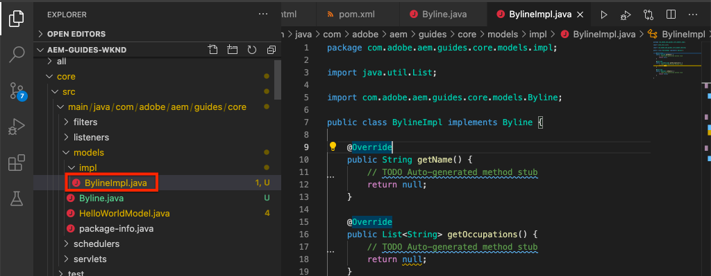

1. 開啟 `BylineImpl.java`. 指定它實作`Byline`介面。 使用IDE的自動完成功能，或手動更新檔案以包括實現`Byline`介面所需的方法：

   ```java
   package com.adobe.aem.guides.wknd.core.models.impl;
   import java.util.List;
   import com.adobe.aem.guides.wknd.core.models.Byline;
   
   public class BylineImpl implements Byline {
   
       @Override
       public String getName() {
           // TODO Auto-generated method stub
           return null;
       }
   
       @Override
       public List<String> getOccupations() {
           // TODO Auto-generated method stub
           return null;
       }
   
       @Override
       public boolean isEmpty() {
           // TODO Auto-generated method stub
           return false;
       }
   }
   ```

1. 使用下列類別層級註解更新`BylineImpl.java`以新增Sling模型註解。 這個`@Model(..)`註解將類別轉變為Sling模型。

   ```java
   import org.apache.sling.api.SlingHttpServletRequest;
   import org.apache.sling.models.annotations.Model;
   import org.apache.sling.models.annotations.DefaultInjectionStrategy;
   ...
   @Model(
           adaptables = {SlingHttpServletRequest.class},
           adapters = {Byline.class},
           resourceType = {BylineImpl.RESOURCE_TYPE},
           defaultInjectionStrategy = DefaultInjectionStrategy.OPTIONAL
   )
   public class BylineImpl implements Byline {
       protected static final String RESOURCE_TYPE = "wknd/components/content/byline";
       ...
   }
   ```

   讓我們檢閱此註解及其參數：

   * `@Model`注釋將BylineImpl部署至AEM時註冊為Sling模型。
   * `adaptables`參數指定此模型可由請求調整。
   * `adapters`參數允許在署名介面下註冊實作類。 這可讓HTL指令碼透過介面呼叫Sling模型（而非直接匯入）。 [有關適配器的更多詳細資訊，請參閱此處](https://sling.apache.org/documentation/bundles/models.html#specifying-an-alternate-adapter-class-since-110)。
   * `resourceType`指向Byline元件資源類型（先前建立），如果有多個實施，則有助於解析正確的模型。 [有關將模型類與資源類型關聯的更多詳細資訊，請參閱此處](https://sling.apache.org/documentation/bundles/models.html#associating-a-model-class-with-a-resource-type-since-130)。

### 實作Sling模型方法 {#implementing-the-sling-model-methods}

#### getName() {#implementing-get-name}

我們要處理的第一個方法是`getName()` ，它只會傳回儲存在屬性`name`下署名的JCR內容節點的值。

對此，`@ValueMapValue` Sling模型註解可用來使用請求的資源的ValueMap，將值插入Java欄位。


```java
import org.apache.sling.models.annotations.injectorspecific.ValueMapValue;

public class BylineImpl implements Byline {
    ...
    @ValueMapValue
    private String name;

    ...
    @Override
    public String getName() {
        return name;
    }
    ...
}
```

由於JCR屬性與Java欄位同名（兩者均為&quot;name&quot;）,`@ValueMapValue`會自動解析此關聯，並將屬性的值插入Java欄位中。

#### getSchropies() {#implementing-get-occupations}

下一個實作方法是`getOccupations()`。 此方法會收集JCR屬性`occupations`中儲存的所有職業，並傳回這些職業的排序（字母順序）集合。

使用`getName()`中探索的相同技術，屬性值可插入Sling模型的欄位中。

一旦JCR屬性值可透過插入的Java欄位`occupations`在Sling模型中使用，排序業務邏輯便可套用至`getOccupations()`方法。


```java
import java.util.ArrayList;
import java.util.Collections;
  ...

public class BylineImpl implements Byline {
    ...
    @ValueMapValue
    private List<String> occupations;
    ...
    @Override
    public List<String> getOccupations() {
        if (occupations != null) {
            Collections.sort(occupations);
            return new ArrayList<String>(occupations);
        } else {
            return Collections.emptyList();
        }
    }
    ...
}
  ...
```


#### isEmpty() {#implementing-is-empty}

最後一個公用方法為`isEmpty()`，可決定元件何時應將自身視為「已編寫完畢」而可呈現。

對於此元件，我們有業務要求，說明必須在&#x200B;*之前填寫*&#x200B;所有三個欄位、名稱、影像和職業。


```java
import org.apache.commons.lang3.StringUtils;
  ...
public class BylineImpl implements Byline {
    ...
    @Override
    public boolean isEmpty() {
        if (StringUtils.isBlank(name)) {
            // Name is missing, but required
            return true;
        } else if (occupations == null || occupations.isEmpty()) {
            // At least one occupation is required
            return true;
        } else if (/* image is not null, logic to be determined */) {
            // A valid image is required
            return true;
        } else {
            // Everything is populated, so this component is not considered empty
            return false;
        }
    }
    ...
}
```


#### 解決&quot;形象問題&quot; {#tackling-the-image-problem}

檢查名稱和佔用條件很瑣碎（Apache Commons Lang3提供了始終方便的[StringUtils](https://commons.apache.org/proper/commons-lang/apidocs/org/apache/commons/lang3/StringUtils.html)類），但是，由於使用核心元件影像元件來顯示影像，因此不清楚如何驗證影像&#x200B;**是否存在**。

有兩種方法可以解決這個問題：

檢查`fileReference` JCR屬性是否解析為資產。 ** ORC將此資源轉換為核心元件影像Sling模型，並確 `getSrc()` 保方法不為空。

我們將選擇&#x200B;**second**&#x200B;方法。 第一種方法可能已足夠，但在本教學課程中，後一種方法將用於探索Sling模型的其他功能。

1. 建立取得影像的私人方法。 此方法保留為私密狀態，因為我們不需要在HTL本身公開影像物件，且該物件僅用於驅動`isEmpty().`

   `getImage()`的以下專用方法：

   ```java
   import com.adobe.cq.wcm.core.components.models.Image;
   ...
   private Image getImage() {
       Image image = null;
       // Figure out how to populate the image variable!
       return image;
   }
   ```

   如上所述，還有兩種方法可取得&#x200B;**影像Sling模型**:

   第一個會使用`@Self`附註，以自動調整目前要求與核心元件的`Image.class`

   ```java
   @Self
   private Image image;
   ```

   第二個服務使用[Apache Sling ModelFactory](https://sling.apache.org/apidocs/sling10/org/apache/sling/models/factory/ModelFactory.html) OSGi服務，這項服務非常實用，可協助我們以Java程式碼建立其他類型的Sling模型。

   我們將選擇第二種方法。

   >[!NOTE]
   >
   >在實際實作中，建議使用`@Self`方法「One」，因為這是更簡單、更優雅的解決方案。 在本教學課程中，我們將使用第二種方法，因為這需要我們探索Sling模型的更多方面，這些方面對於更複雜的元件非常有用！

   由於Sling模型是Java POJO的，而非OSGi Services，因此通常的OSGi插入註解`@Reference` **不能**，而Sling模型會提供特殊的&#x200B;**[@OSGiService](https://sling.apache.org/documentation/bundles/models.html#injector-specific-annotations)**&#x200B;註解，以提供類似的功能。

1. 更新`BylineImpl.java`以包含`OSGiService`注釋以插入`ModelFactory`:

   ```java
   import org.apache.sling.models.factory.ModelFactory;
   import org.apache.sling.models.annotations.injectorspecific.OSGiService;
   ...
   public class BylineImpl implements Byline {
       ...
       @OSGiService
       private ModelFactory modelFactory;
   }
   ```

   有了`ModelFactory`，您就可以使用以下項目來建立核心元件影像Sling模型：

   ```java
   modelFactory.getModelFromWrappedRequest(SlingHttpServletRequest request, Resource resource, java.lang.Class<T> targetClass)
   ```

   不過，此方法同時需要要求和資源，但Sling模型中均不提供。 若要取得這些資訊，需使用更多Sling模型註解！

   若要取得目前的要求，可使用&#x200B;**[@Self](https://sling.apache.org/documentation/bundles/models.html#injector-specific-annotations)**&#x200B;附註將`adaptable`（在`@Model(..)`中定義為`SlingHttpServletRequest.class`）插入Java類欄位。

1. 新增&#x200B;**@Self**&#x200B;附註以取得&#x200B;**SlingHttpServletRequest**:

   ```java
   import org.apache.sling.models.annotations.injectorspecific.Self;
   ...
   @Self
   private SlingHttpServletRequest request;
   ```

   請記住，使用`@Self Image image`插入核心元件影像Sling模型是上述選項 — `@Self`註解會嘗試插入可調整的物件（在我們的例子中是SlingHttpServletRequest），並適應註解欄位類型。 由於核心元件影像Sling模型可從SlingHttpServletRequest物件調整，因此此方法原本可行，且程式碼比較少，比較探索性的方法。

   現在，我們已插入必要的變數，透過ModelFactory API將影像模型實例化。 我們會在Sling模型具現化後，使用Sling模型的&#x200B;**[@PostConstruct](https://sling.apache.org/documentation/bundles/models.html#postconstruct-methods)**&#x200B;註解來取得此物件。

   `@PostConstruct` 非常有用，而且作用能力與建構子類似，不過，在類實例化並插入所有附加註釋的Java欄位後，會叫用它。其他Sling模型註解會註解Java類別欄位（變數），而`@PostConstruct`會註解void, zero參數方法，通常名為`init()`（但可以命名任何項目）。

1. 新增&#x200B;**@PostConstruct**&#x200B;方法：

   ```java
   import javax.annotation.PostConstruct;
   ...
   public class BylineImpl implements Byline {
       ...
       private Image image;
   
       @PostConstruct
       private void init() {
           image = modelFactory.getModelFromWrappedRequest(request,
                                                           request.getResource(),
                                                           Image.class);
       }
       ...
   }
   ```

   請記住，Sling模型是&#x200B;**NOT** OSGi服務，因此維護類別狀態是安全的。 通常`@PostConstruct`衍生並設定Sling Model類狀狀態以供日後使用，類似於純建構子的作用。

   請注意，如果`@PostConstruct`方法擲回例外狀況，Sling模型將不會具現化（將為null）。

1. **getImage()** 現在可以更新，只要傳回影像物件即可。

   ```java
   /**
       * @return the Image Sling Model of this resource, or null if the resource cannot create a valid Image Sling Model.
   */
   private Image getImage() {
       return image;
   }
   ```

1. 讓我們回到`isEmpty()`並完成實作：

   ```java
   @Override
   public boolean isEmpty() {
      final Image componentImage = getImage();
   
       if (StringUtils.isBlank(name)) {
           // Name is missing, but required
           return true;
       } else if (occupations == null || occupations.isEmpty()) {
           // At least one occupation is required
           return true;
       } else if (componentImage == null || StringUtils.isBlank(componentImage.getSrc())) {
           // A valid image is required
           return true;
       } else {
           // Everything is populated, so this component is not considered empty
           return false;
       }
   }
   ```

   請注意，對`getImage()`進行多次呼叫並不會造成問題，因為會傳回初始化的`image`類別變數，且不會叫用`modelFactory.getModelFromWrappedRequest(...)`，這不會花費太多成本，但值得避免不必要地呼叫。

1. 最終`BylineImpl.java`看起來應該如下：


   ```java
   package com.adobe.aem.guides.wknd.core.models.impl;
   
   import java.util.ArrayList;
   import java.util.Collections;
   import java.util.List;
   import javax.annotation.PostConstruct;
   import org.apache.commons.lang3.StringUtils;
   import org.apache.sling.api.SlingHttpServletRequest;
   import org.apache.sling.models.annotations.DefaultInjectionStrategy;
   import org.apache.sling.models.annotations.Model;
   import org.apache.sling.models.annotations.injectorspecific.OSGiService;
   import org.apache.sling.models.annotations.injectorspecific.Self;
   import org.apache.sling.models.annotations.injectorspecific.ValueMapValue;
   import org.apache.sling.models.factory.ModelFactory;
   import com.adobe.aem.guides.wknd.core.models.Byline;
   import com.adobe.cq.wcm.core.components.models.Image;
   
   @Model(
           adaptables = {SlingHttpServletRequest.class},
           adapters = {Byline.class},
           resourceType = {BylineImpl.RESOURCE_TYPE},
           defaultInjectionStrategy = DefaultInjectionStrategy.OPTIONAL
   )
   public class BylineImpl implements Byline {
       protected static final String RESOURCE_TYPE = "wknd/components/content/byline";
   
       @Self
       private SlingHttpServletRequest request;
   
       @OSGiService
       private ModelFactory modelFactory;
   
       @ValueMapValue
       private String name;
   
       @ValueMapValue
       private List<String> occupations;
   
       private Image image;
   
       @PostConstruct
       private void init() {
           image = modelFactory.getModelFromWrappedRequest(request, request.getResource(), Image.class);
       }
   
       @Override
       public String getName() {
           return name;
       }
   
       @Override
       public List<String> getOccupations() {
           if (occupations != null) {
               Collections.sort(occupations);
               return new ArrayList<String>(occupations);
           } else {
               return Collections.emptyList();
           }
       }
   
       @Override
       public boolean isEmpty() {
           final Image componentImage = getImage();
   
           if (StringUtils.isBlank(name)) {
               // Name is missing, but required
               return true;
           } else if (occupations == null || occupations.isEmpty()) {
               // At least one occupation is required
               return true;
           } else if (componentImage == null || StringUtils.isBlank(componentImage.getSrc())) {
               // A valid image is required
               return true;
           } else {
               // Everything is populated, so this component is not considered empty
               return false;
           }
       }
   
       /**
       * @return the Image Sling Model of this resource, or null if the resource cannot create a valid Image Sling Model.
       */
       private Image getImage() {
           return image;
       }
   }
   ```


## 署名HTL {#byline-htl}

在`ui.apps`模組中，開啟我們在AEM元件先前設定中建立的`/apps/wknd/components/byline/byline.html`。

```html
<div data-sly-use.placeholderTemplate="core/wcm/components/commons/v1/templates.html">
</div>
<sly data-sly-call="${placeholderTemplate.placeholder @ isEmpty=false}"></sly>
```

讓我們來檢視此HTL指令碼目前的功能：

* `placeholderTemplate`指向「核心元件」預留位置，該預留位置在元件未完全配置時顯示。 如上文`cq:Component`的`jcr:title`屬性中所定義，AEM Sites頁面編輯器會呈現為具有元件標題的方塊。

* `data-sly-call="${placeholderTemplate.placeholder @ isEmpty=false}`會載入上述定義的`placeholderTemplate`，並將布林值（目前硬式編碼為`false`）傳入預留位置範本。 當`isEmpty`為true時，佔位符模板將呈現灰色框，否則不呈現任何內容。

### 更新署名HTL

1. 使用下列骨架式HTML結構更新&#x200B;**byline.html**:

   ```html
   <div data-sly-use.placeholderTemplate="core/wcm/components/commons/v1/templates.html"
       class="cmp-byline">
           <div class="cmp-byline__image">
               <!--/* Include the Core Components Image Component */-->
           </div>
           <h2 class="cmp-byline__name"><!--/* Include the name */--></h2>
           <p class="cmp-byline__occupations"><!--/* Include the occupations */--></p>
   </div>
   <sly data-sly-call="${placeholderTemplate.placeholder @ isEmpty=true}"></sly>
   ```

   請注意，CSS類遵循[BEM命名慣例](https://getbem.com/naming/)。 雖然使用BEM慣例並非強制性，但建議使用BEM，因為BEM用於核心元件CSS類別，且通常會產生乾淨、可讀的CSS規則。

### 在HTL中實例化Sling模型物件 {#instantiating-sling-model-objects-in-htl}

[Use block陳述式](https://github.com/adobe/htl-spec/blob/master/SPECIFICATION.md#221-use)可用來實例化HTL指令碼中的Sling模型物件，並將其指派給HTL變數。

`data-sly-use.byline="com.adobe.aem.guides.wknd.models.Byline"` 使用由BylineImpl實作的署名介面(com.adobe.aem.guides.wknd.models.Byline)並調整目前的SlingHttpServletRequest，而結果會儲存在HTL變數名稱的署名( `data-sly-use.<variable-name>`)中。

1. 更新外部`div`以透過其公用介面參考&#x200B;**Byline** Sling模型：

   ```xml
   <div data-sly-use.byline="com.adobe.aem.guides.wknd.core.models.Byline"
       data-sly-use.placeholderTemplate="core/wcm/components/commons/v1/templates.html"
       class="cmp-byline">
       ...
   </div>
   ```

### 存取Sling模型方法 {#accessing-sling-model-methods}

HTL從JSTL借用，並使用與縮短Java getter方法名稱相同的名稱。

例如，叫用Byline Sling Model的`getName()`方法可縮短為`byline.name`，同樣地，這可縮短為`byline.isEmpty`。 `byline.empty`使用完整方法名稱`byline.getName`或`byline.isEmpty`也行。 請注意，`()`絕不用於叫用HTL中的方法（類似JSTL）。

需要參數&#x200B;**的Java方法無法**&#x200B;用於HTL。 這是為了讓HTL的邏輯保持簡單而設計。

1. 您可以叫用Byline Sling模型上的`getName()`方法，或在HTL中，將署名新增至元件：`${byline.name}`。

   更新`h2`標籤：

   ```xml
   <h2 class="cmp-byline__name">${byline.name}</h2>
   ```

### 使用HTL運算式選項 {#using-htl-expression-options}

[HTL運算式](https://github.com/adobe/htl-spec/blob/master/SPECIFICATION.md#12-available-expression-options) 選項可作為HTL中內容的修飾元，且範圍從日期格式到i18n翻譯。運算式也可用來加入清單或值陣列，這是以逗號分隔格式顯示職業所需的項目。

運算式會透過HTL運算式中的`@`運算子新增。

1. 若要加入具有「 」、「 」的職業清單，請使用下列程式碼：

   ```html
   <p class="cmp-byline__occupations">${byline.occupations @ join=', '}</p>
   ```

### 有條件地顯示佔位符 {#conditionally-displaying-the-placeholder}

AEM元件的大部分HTL指令碼會運用&#x200B;**預留位置範例**，為作者&#x200B;**提供視覺提示，指出元件的編寫不正確，且不會顯示在AEM Publish**&#x200B;上。 推動此決策的慣例是，在元件的支援Sling模型上實作方法，在本例中為：`Byline.isEmpty()`。

`isEmpty()` 會在署名Sling模型上叫用，結果(或是負值，透過運 `!` 算子)會儲存至名為 `hasContent`的HTL變數：

1. 更新外部`div`以儲存名為`hasContent`的HTL變數：

   ```html
    <div data-sly-use.byline="com.adobe.aem.guides.wknd.core.models.Byline"
         data-sly-use.placeholderTemplate="core/wcm/components/commons/v1/templates.html"
         data-sly-test.hasContent="${!byline.empty}"
         class="cmp-byline">
         ...
   </div>
   ```

   請注意，使用`data-sly-test`,HTL `test`區塊很有趣，因為它會同時設定HTL變數，且會根據HTL運算式的結果是否為真，呈現/不轉譯其所在的HTML元素。 如果為「truthy」，則HTML元素會轉譯，否則不會轉譯。

   此HTL變數`hasContent`現在可重新用來有條件地顯示/隱藏預留位置。

1. 使用下列內容，更新檔案底部`placeholderTemplate`的條件式呼叫：

   ```html
   <sly data-sly-call="${placeholderTemplate.placeholder @ isEmpty=!hasContent}"></sly>
   ```

### 使用核心元件顯示影像 {#using-the-core-components-image}

`byline.html`的HTL指令碼現在幾乎已完成，且僅缺少影像。

由於我們使用`sling:resourceSuperType`核心元件影像元件來提供影像的製作，因此我們也可以使用核心元件影像元件來呈現影像！

為此，我們需要包含目前的署名資源，但使用資源類型`core/wcm/components/image/v2/image`來強制執行核心元件影像元件的資源類型。 這是元件重複使用的強大模式。 為此，會使用HTL的`data-sly-resource`區塊。

1. 將`div`替換為`cmp-byline__image`類，如下所示：

   ```html
   <div class="cmp-byline__image"
       data-sly-resource="${ '.' @ resourceType = 'core/wcm/components/image/v2/image' }"></div>
   ```

   此`data-sly-resource`通過相對路徑`'.'`包含當前資源，並強制將當前資源（或行內容資源）包含為`core/wcm/components/image/v2/image`的資源類型。

   核心元件資源類型是直接使用，而非透過Proxy，因為這是指令碼內的使用，且永遠不會持續保存在我們的內容中。

2. 已完成`byline.html`，如下所示：

   ```html
   <!--/* byline.html */-->
   <div data-sly-use.byline="com.adobe.aem.guides.wknd.core.models.Byline" 
       data-sly-use.placeholderTemplate="core/wcm/components/commons/v1/templates.html"
       data-sly-test.hasContent="${!byline.empty}"
       class="cmp-byline">
       <div class="cmp-byline__image"
           data-sly-resource="${ '.' @ resourceType = 'core/wcm/components/image/v2/image' }">
       </div>
       <h2 class="cmp-byline__name">${byline.name}</h2>
       <p class="cmp-byline__occupations">${byline.occupations @ join=', '}</p>
   </div>
   <sly data-sly-call="${placeholderTemplate.placeholder @ isEmpty=!hasContent}"></sly>
   ```

3. 將程式碼基底部署至本機AEM執行個體。 由於POM檔案已進行重大變更，請從專案的根目錄執行完整的Maven組建。

   ```shell
   $ cd aem-guides-wknd/
   $ mvn clean install -PautoInstallSinglePackage
   ```

   若部署至AEM 6.5/6.4會叫用`classic`設定檔：

   ```shell
   $ mvn clean install -PautoInstallSinglePackage -Pclassic
   ```

### 檢閱未設定樣式的署名元件 {#reviewing-the-unstyled-byline-component}

1. 部署更新後，導覽至[ Ultimate Guide to LA Skateparks ](http://localhost:4502/editor.html/content/wknd/us/en/magazine/guide-la-skateparks.html)頁面，或您在章節前面新增Byline元件的位置。

1. 現在會出現&#x200B;**image**、**name**&#x200B;和&#x200B;**職業**，並且我們有未設定樣式但正在工作的Byline元件。

   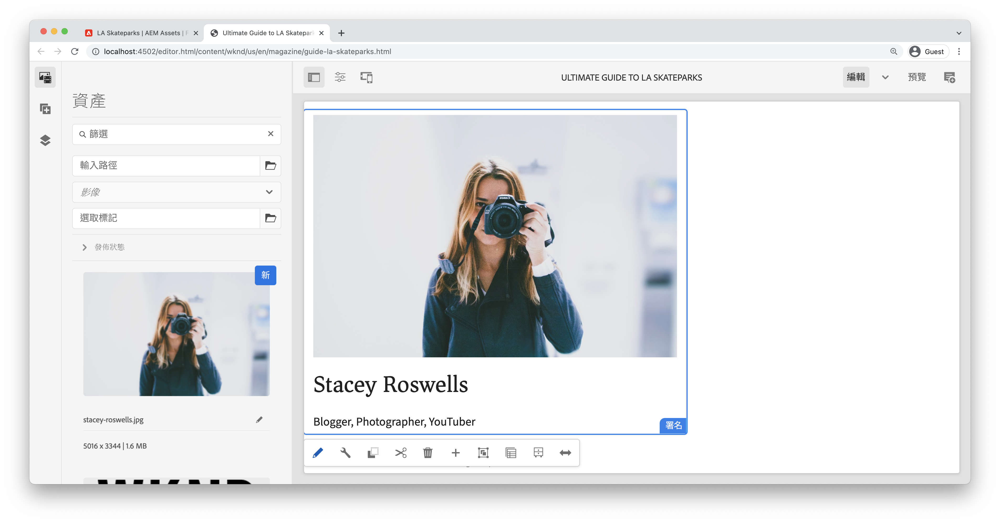

### 檢閱Sling模型註冊 {#reviewing-the-sling-model-registration}

[AEM Web Console的Sling模型狀態檢視](http://localhost:4502/system/console/status-slingmodels)會顯示AEM中所有已註冊的Sling模型。 您可以檢閱此清單，驗證是否已安裝並辨識Byline Sling模型。

如果此清單中未顯示&#x200B;**BylineImpl**，則Sling模型的註解或Sling模型未新增至核心專案中已註冊的Sling模型套件(com.adobe.aem.guides.wknd.core.models)時可能會發生問題。


*http://localhost:4502/system/console/status-slingmodels*

## 署名樣式 {#byline-styles}

署名元件需要設定樣式，以與署名元件的創意設計一致。 這將透過使用SCSS來達成，AEM會透過&#x200B;**ui.frontend** Maven子專案提供支援。

### 添加預設樣式

為署名元件新增預設樣式。 在&#x200B;**ui.frontend**&#x200B;專案中`/src/main/webpack/components`底下：

1. 建立名為`_byline.scss`的新檔案。

   

1. 將署名實作CSS（寫入為SCSS）新增至`default.scss`:

   ```scss
   .cmp-byline {
       $imageSize: 60px;
   
       .cmp-byline__image {
           float: left;
   
       /* This class targets a Core Component Image CSS class */
       .cmp-image__image {
           width: $imageSize;
           height: $imageSize;
           border-radius: $imageSize / 2;
           object-fit: cover;
           }
       }
   
       .cmp-byline__name {
           font-size: $font-size-medium;
           font-family: $font-family-serif;
           padding-top: 0.5rem;
           margin-left: $imageSize + 25px;
           margin-bottom: .25rem;
           margin-top:0rem;
       }
   
       .cmp-byline__occupations {
           margin-left: $imageSize + 25px;
           color: $gray;
           font-size: $font-size-xsmall;
           text-transform: uppercase;
       }
   }
   ```

1. 在`ui.frontend/src/main/webpack/site/main.scss`查看`main.scss`:

   ```scss
   @import 'variables';
   @import 'wkndicons';
   @import 'base';
   @import '../components/**/*.scss';
   @import './styles/*.scss';
   ```

   `main.scss` 是模組所包含樣式的主要進 `ui.frontend` 入點。規則運算式`'../components/**/*.scss'`將包含`components/`資料夾下的所有檔案。

1. 建立完整專案並部署至AEM:

   ```shell
   $ cd aem-guides-wknd/
   $ mvn clean install -PautoInstallSinglePackage
   ```

   如果使用AEM 6.4/6.5 ，請新增`-Pclassic`設定檔。

   >[!TIP]
   >
   >您可能需要清除瀏覽器快取，以確保不會提供過時的CSS，並使用Byline元件重新整理頁面，以取得完整樣式。

## 拼湊 {#putting-it-together}

以下是完整製作且已設定樣式的署名元件在AEM頁面上看起來的樣子。

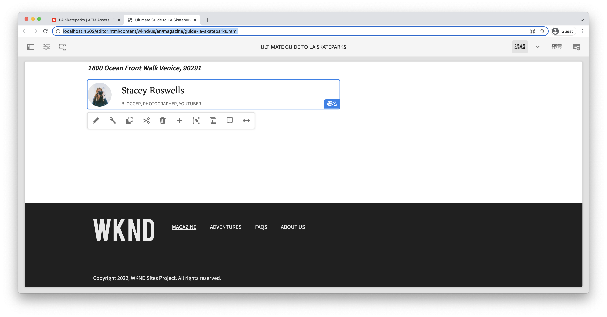

## 恭喜！ {#congratulations}

恭喜，您剛使用Adobe Experience Manager從頭建立自訂元件！

### 後續步驟 {#next-steps}

繼續了解AEM元件開發，探索如何針對Byline Java程式碼編寫JUnit測試，以確保所有項目都能正確開發，且實作的業務邏輯正確且完整。

* [編寫單元測試或AEM元件](unit-testing.md)

在[GitHub](https://github.com/adobe/aem-guides-wknd)上檢視完成的程式碼，或在Git列`tutorial/custom-component-solution`上檢閱並將程式碼部署於本機。

1. 克隆[github.com/adobe/aem-guides-wknd](https://github.com/adobe/aem-guides-wknd)儲存庫。
1. 查看`tutorial/custom-component-solution`分支
