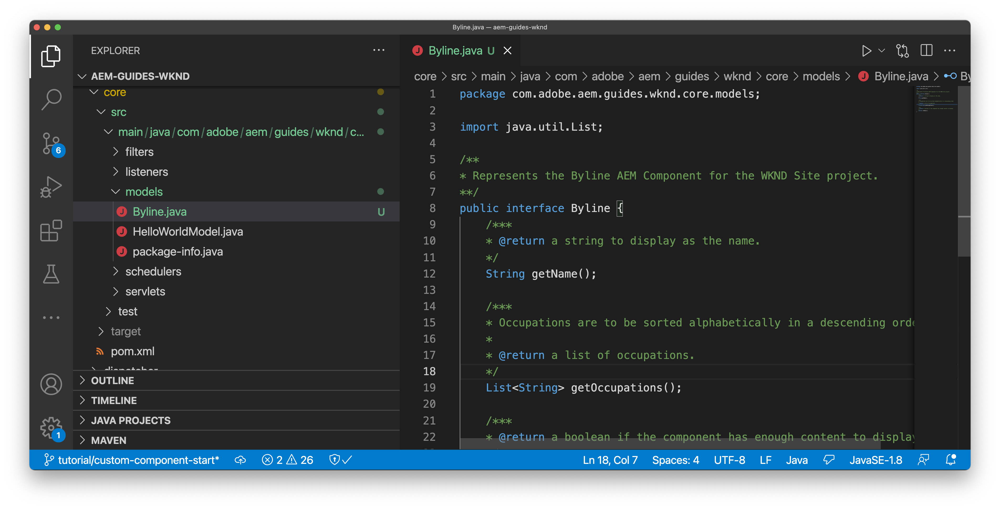

# 自訂元件 {#custom-component}

本教學課程涵蓋端對端建立自訂`Byline` AEM元件（顯示對話方塊中編寫的內容），並探索開發Sling模型以封裝填入元件HTL的業務邏輯。

## 先決條件 {#prerequisites}

檢閱設定[本機開發環境](overview.md#local-dev-environment)所需的工具和指示。

### 入門專案

>[!NOTE]
>
> 如果您成功完成上一章，您可以重複使用專案，並略過出庫入門專案的步驟。

檢視教學課程建置的基底程式碼：

1. 從[GitHub](https://github.com/adobe/aem-guides-wknd)檢視`tutorial/custom-component-start`分支

   ```shell
   $ cd aem-guides-wknd
   $ git checkout tutorial/custom-component-start
   ```

1. 使用您的Maven技能將程式碼庫部署到本機AEM執行個體：

   ```shell
   $ mvn clean install -PautoInstallSinglePackage
   ```

   >[!NOTE]
   >
   > 如果使用AEM 6.5或6.4，請將`classic`設定檔附加至任何Maven命令。

   ```shell
   $ mvn clean install -PautoInstallSinglePackage -Pclassic
   ```

您一律可以在[GitHub](https://github.com/adobe/aem-guides-wknd/tree/tutorial/custom-component-solution)上檢視完成的程式碼，或切換至分支`tutorial/custom-component-solution`在本機簽出程式碼。

## 目標

1. 瞭解如何建置自訂AEM元件
1. 瞭解如何使用Sling模型封裝商業邏輯
1. 瞭解如何從HTL指令碼使用Sling模型

## 您即將建置的內容 {#what-build}

在WKND教學課程的這個部分中，會建立署名元件，用於顯示有關文章投稿人的撰寫資訊。


*署名元件*

「署名」元件的實作包含一個收集署名內容的對話方塊，以及一個自訂Sling模型，可擷取詳細資訊，例如：

* 名稱
* 影像
* 職業

## 建立署名元件 {#create-byline-component}

首先，建立「署名元件」節點結構並定義對話方塊。 這表示AEM中的元件，並依據元件在JCR中的位置以隱含方式定義元件的資源型別。

此對話方塊會顯示內容作者可提供的介面。 對於此實作，AEM WCM核心元件的&#x200B;**Image**&#x200B;元件是用來處理Byline影像的製作和演算，因此必須將其設定為此元件的`sling:resourceSuperType`。

### 建立元件定義 {#create-component-definition}

1. 在&#x200B;**ui.apps**&#x200B;模組中，瀏覽至`/apps/wknd/components`並建立名為`byline`的資料夾。
1. 在`byline`資料夾內，新增名為`.content.xml`的檔案

   

1. 以下列專案填入`.content.xml`檔案：

   ```xml
   <?xml version="1.0" encoding="UTF-8"?>
       <jcr:root xmlns:sling="http://sling.apache.org/jcr/sling/1.0" xmlns:cq="http://www.day.com/jcr/cq/1.0" xmlns:jcr="http://www.jcp.org/jcr/1.0"
       jcr:primaryType="cq:Component"
       jcr:title="Byline"
       jcr:description="Displays a contributor's byline."
       componentGroup="WKND Sites Project - Content"
       sling:resourceSuperType="core/wcm/components/image/v2/image"/>
   ```

   上述XML檔案提供元件的定義，包括標題、說明和群組。 `sling:resourceSuperType`指向`core/wcm/components/image/v2/image`，它是[核心影像元件](https://experienceleague.adobe.com/docs/experience-manager-core-components/using/wcm-components/image.html)。

### 建立HTL指令碼 {#create-the-htl-script}

1. 在`byline`資料夾中，新增負責元件之HTML簡報的檔案`byline.html`。 將檔案命名為與資料夾相同的名稱很重要，因為這會成為Sling用來呈現此資源型別的預設指令碼。

1. 將下列程式碼新增至`byline.html`。

   ```html
   <!--/* byline.html */-->
   <div data-sly-use.placeholderTemplate="core/wcm/components/commons/v1/templates.html">
   </div>
   <sly data-sly-call="${placeholderTemplate.placeholder @ isEmpty=true}"></sly>
   ```

建立Sling模型後，`byline.html`將於稍後[重新造訪](#byline-htl)。 HTL檔案的目前狀態可讓元件在AEM Sites的頁面編輯器中拖放至頁面時以空白狀態顯示。

### 建立對話方塊定義 {#create-the-dialog-definition}

接著，使用下列欄位為Byline元件定義對話方塊：

* **名稱**：投稿人名稱的文字欄位。
* **影像**：參考貢獻者的個人簡歷。
* **職業**：歸因給貢獻者的職業清單。 職務應依字母遞增順序排序（a至z）。

1. 在`byline`資料夾內，建立名為`_cq_dialog`的資料夾。
1. 在`byline/_cq_dialog`內，新增名為`.content.xml`的檔案。 這是對話方塊的XML定義。 新增下列XML：

   ```xml
   <?xml version="1.0" encoding="UTF-8"?>
   <jcr:root xmlns:sling="http://sling.apache.org/jcr/sling/1.0" xmlns:cq="http://www.day.com/jcr/cq/1.0" xmlns:jcr="http://www.jcp.org/jcr/1.0" xmlns:nt="http://www.jcp.org/jcr/nt/1.0"
           jcr:primaryType="nt:unstructured"
           jcr:title="Byline"
           sling:resourceType="cq/gui/components/authoring/dialog">
       <content
               jcr:primaryType="nt:unstructured"
               sling:resourceType="granite/ui/components/coral/foundation/container">
           <items jcr:primaryType="nt:unstructured">
               <tabs
                       jcr:primaryType="nt:unstructured"
                       sling:resourceType="granite/ui/components/coral/foundation/tabs"
                       maximized="{Boolean}false">
                   <items jcr:primaryType="nt:unstructured">
                       <asset
                               jcr:primaryType="nt:unstructured"
                               sling:hideResource="{Boolean}false"/>
                       <metadata
                               jcr:primaryType="nt:unstructured"
                               sling:hideResource="{Boolean}true"/>
                       <properties
                               jcr:primaryType="nt:unstructured"
                               jcr:title="Properties"
                               sling:resourceType="granite/ui/components/coral/foundation/container"
                               margin="{Boolean}true">
                           <items jcr:primaryType="nt:unstructured">
                               <columns
                                       jcr:primaryType="nt:unstructured"
                                       sling:resourceType="granite/ui/components/coral/foundation/fixedcolumns"
                                       margin="{Boolean}true">
                                   <items jcr:primaryType="nt:unstructured">
                                       <column
                                               jcr:primaryType="nt:unstructured"
                                               sling:resourceType="granite/ui/components/coral/foundation/container">
                                           <items jcr:primaryType="nt:unstructured">
                                               <name
                                                       jcr:primaryType="nt:unstructured"
                                                       sling:resourceType="granite/ui/components/coral/foundation/form/textfield"
                                                       emptyText="Enter the contributor's name to display."
                                                       fieldDescription="The contributor's name to display."
                                                       fieldLabel="Name"
                                                       name="./name"
                                                       required="{Boolean}true"/>
                                               <occupations
                                                       jcr:primaryType="nt:unstructured"
                                                       sling:resourceType="granite/ui/components/coral/foundation/form/multifield"
                                                       fieldDescription="A list of the contributor's occupations."
                                                       fieldLabel="Occupations"
                                                       required="{Boolean}false">
                                                   <field
                                                           jcr:primaryType="nt:unstructured"
                                                           sling:resourceType="granite/ui/components/coral/foundation/form/textfield"
                                                           emptyText="Enter an occupation"
                                                           name="./occupations"/>
                                               </occupations>
                                           </items>
                                       </column>
                                   </items>
                               </columns>
                           </items>
                       </properties>
                   </items>
               </tabs>
           </items>
       </content>
   </jcr:root>
   ```

   這些對話方塊節點定義使用[Sling Resource Merger](https://sling.apache.org/documentation/bundles/resource-merger.html)來控制從`sling:resourceSuperType`元件繼承哪些對話方塊索引標籤，在此例中是&#x200B;**核心元件的影像元件**。

   的對話方塊

### 建立[原則]對話方塊 {#create-the-policy-dialog}

遵循與建立對話方塊相同的方法，建立原則對話方塊（以前稱為設計對話方塊）以在從核心元件的影像元件繼承的原則設定中隱藏不需要的欄位。

1. 在`byline`資料夾內，建立名為`_cq_design_dialog`的資料夾。
1. 在`byline/_cq_design_dialog`內，建立名為`.content.xml`的檔案。 使用下列XML更新檔案：。 最簡單的做法是開啟`.content.xml`並將下面的XML複製/貼到其中。

   ```xml
   <?xml version="1.0" encoding="UTF-8"?>
   <jcr:root xmlns:sling="http://sling.apache.org/jcr/sling/1.0" xmlns:granite="http://www.adobe.com/jcr/granite/1.0" xmlns:cq="http://www.day.com/jcr/cq/1.0" xmlns:jcr="http://www.jcp.org/jcr/1.0" xmlns:nt="http://www.jcp.org/jcr/nt/1.0"
       jcr:primaryType="nt:unstructured"
       jcr:title="Byline"
       sling:resourceType="cq/gui/components/authoring/dialog">
       <content
               jcr:primaryType="nt:unstructured">
           <items jcr:primaryType="nt:unstructured">
               <tabs
                       jcr:primaryType="nt:unstructured">
                   <items jcr:primaryType="nt:unstructured">
                       <properties
                               jcr:primaryType="nt:unstructured">
                           <items jcr:primaryType="nt:unstructured">
                               <content
                                       jcr:primaryType="nt:unstructured">
                                   <items jcr:primaryType="nt:unstructured">
                                       <decorative
                                               jcr:primaryType="nt:unstructured"
                                               sling:hideResource="{Boolean}true"/>
                                       <altValueFromDAM
                                               jcr:primaryType="nt:unstructured"
                                               sling:hideResource="{Boolean}true"/>
                                       <titleValueFromDAM
                                               jcr:primaryType="nt:unstructured"
                                               sling:hideResource="{Boolean}true"/>
                                       <displayCaptionPopup
                                               jcr:primaryType="nt:unstructured"
                                               sling:hideResource="{Boolean}true"/>
                                       <disableUuidTracking
                                               jcr:primaryType="nt:unstructured"
                                               sling:hideResource="{Boolean}true"/>
                                   </items>
                               </content>
                           </items>
                       </properties>
                       <features
                               jcr:primaryType="nt:unstructured">
                           <items jcr:primaryType="nt:unstructured">
                               <content
                                       jcr:primaryType="nt:unstructured">
                                   <items jcr:primaryType="nt:unstructured">
                                       <accordion
                                               jcr:primaryType="nt:unstructured">
                                           <items jcr:primaryType="nt:unstructured">
                                               <orientation
                                                       jcr:primaryType="nt:unstructured"
                                                       sling:hideResource="{Boolean}true"/>
                                               <crop
                                                       jcr:primaryType="nt:unstructured"
                                                       sling:hideResource="{Boolean}true"/>
                                           </items>
                                       </accordion>
                                   </items>
                               </content>
                           </items>
                       </features>
                   </items>
               </tabs>
           </items>
       </content>
   </jcr:root>
   ```

   從[核心元件影像元件](https://github.com/adobe/aem-core-wcm-components/blob/main/content/src/content/jcr_root/apps/core/wcm/components/image/v2/image/_cq_design_dialog/.content.xml)取得前&#x200B;**原則對話方塊** XML的基礎。

   就像在對話方塊設定中一樣，[Sling Resource Merger](https://sling.apache.org/documentation/bundles/resource-merger.html)用於隱藏原本繼承自`sling:resourceSuperType`的不相關欄位，如具有`sling:hideResource="{Boolean}true"`屬性的節點定義所示。

### 部署程式碼 {#deploy-the-code}

1. 使用您的IDE或使用Maven技能同步`ui.apps`中的變更。

   

## 將元件新增至頁面 {#add-the-component-to-a-page}

為了保持簡單並專注於AEM元件開發，讓我們將Byline元件以其目前狀態新增至Article頁面，以驗證`cq:Component`節點定義是否正確。 也可用於確認AEM可辨識新元件定義，且元件的對話方塊可用於編寫。

### 將影像新增至AEM Assets

首先，將擷取的範例頭部上傳至AEM Assets，以便用來填入Byline元件中的影像。

1. 導覽至AEM Assets中的LA Skateparks資料夾： [http://localhost:4502/assets.html/content/dam/wknd/en/magazine/la-skateparks](http://localhost:4502/assets.html/content/dam/wknd/en/magazine/la-skateparks)。

1. 將&#x200B;**[stacey-roswells.jpg](assets/custom-component/stacey-roswells.jpg)**&#x200B;的頭像快照上傳至資料夾。

   

### 編寫元件 {#author-the-component}

接下來，將「署名」元件新增至AEM中的頁面。 因為Byline元件已透過`ui.apps/src/main/content/jcr_root/apps/wknd/components/byline/.content.xml`定義新增至&#x200B;**WKND Sites專案 — Content**&#x200B;元件群組，所以任何其&#x200B;**原則**&#x200B;允許&#x200B;**WKND Sites專案 — Content**&#x200B;元件群組的&#x200B;**容器**&#x200B;都可以自動使用此元件。 因此，文章頁面的版面容器中可使用此功能。

1. 瀏覽至LA Skatepark文章： [http://localhost:4502/editor.html/content/wknd/us/en/magazine/guide-la-skateparks.html](http://localhost:4502/editor.html/content/wknd/us/en/magazine/guide-la-skateparks.html)

1. 從左側邊欄，將&#x200B;**Byline元件**&#x200B;拖放到已開啟文章頁面之配置容器的&#x200B;**bottom**。

   

1. 確定左側邊欄是開啟的&#x200B;**且可見，且已選取** Asset Finder**。

1. 選取&#x200B;**Byline元件預留位置**，這會顯示動作列，然後點選&#x200B;**扳手**&#x200B;圖示以開啟對話方塊。

1. 在開啟對話方塊且第一個索引標籤（資產）處於作用中狀態時，請開啟左側邊欄，然後從資產尋找器將影像拖放至「影像」放置區。 搜尋「stacey」以尋找WKND ui.content套件中提供的Stacey Roswells生物圖片。

   

1. 新增影像後，按一下&#x200B;**屬性**&#x200B;索引標籤以輸入&#x200B;**名稱**&#x200B;和&#x200B;**職業**。

   輸入職務時，請以&#x200B;**反向**&#x200B;順序輸入，以驗證Sling模型中實作的字母化商業邏輯。

   點選右下方的&#x200B;**完成**&#x200B;按鈕以儲存變更。

   的屬性

   AEM作者透過對話方塊設定及編寫元件。 此時，在開發Byline元件時，會納入用來收集資料的對話方塊，但尚未新增呈現所編寫內容的邏輯。 因此，只會顯示預留位置。

1. 儲存對話方塊後，導覽至[CRXDE Lite](http://localhost:4502/crx/de/index.jsp#/content/wknd/us/en/magazine/guide-la-skateparks/jcr%3Acontent/root/container/container/byline)，並檢閱元件內容如何儲存在AEM頁面下的署名元件內容節點上。

   尋找LA Skate Parks頁面下方的Byline元件內容節點，即`/content/wknd/us/en/magazine/guide-la-skateparks/jcr:content/root/container/container/byline`。

   請注意，屬性名稱`name`、`occupations`和`fileReference`儲存在&#x200B;**署名節點**&#x200B;上。

   此外，請注意節點的`sling:resourceType`設定為`wknd/components/content/byline`，這會將此內容節點繫結至Byline元件實作。

   CRXDE中的署名屬性

## 建立署名Sling模型 {#create-sling-model}

接下來，建立Sling模型，以作為資料模型並存放Byline元件的商業邏輯。

Sling模型是註解導向的Java™ POJO (Plain Old Java™物件)，有助於將資料從JCR對應至Java™變數，並在AEM環境中開發時提供效率。

### 檢閱Maven相依性 {#maven-dependency}

署名Sling模型需依賴AEM提供的多個Java™ API。 這些API可透過`core`模組的POM檔案中所列的`dependencies`使用。 本教學課程使用的專案已針對AEM as a Cloud Service建置。 但它很獨特，因為可向下相容於AEM 6.5/6.4。因此，其中同時包含Cloud Service和AEM 6.x的相依性。

1. 開啟`<src>/aem-guides-wknd/core/pom.xml`下方的`pom.xml`檔案。
1. 尋找`aem-sdk-api`的相依性 — 僅&#x200B;**AEM as a Cloud Service**

   ```xml
   <dependency>
       <groupId>com.adobe.aem</groupId>
       <artifactId>aem-sdk-api</artifactId>
   </dependency>
   ```

   [aem-sdk-api](https://experienceleague.adobe.com/docs/experience-manager-cloud-service/content/implementing/developing/aem-as-a-cloud-service-sdk.html?lang=en)包含AEM公開的所有公用Java™ API。 建置此專案時，預設會使用`aem-sdk-api`。 此版本會從位於`aem-guides-wknd/pom.xml`的專案根目錄保留在「父項」反應器pom中。

1. 尋找`uber-jar`的相依性 — 僅&#x200B;**AEM 6.5/6.4**

   ```xml
   ...
       <dependency>
           <groupId>com.adobe.aem</groupId>
           <artifactId>uber-jar</artifactId>
           <classifier>apis</classifier>
       </dependency>
   ...
   ```

   只有在叫用`classic`設定檔時，才會包含`uber-jar`，亦即`mvn clean install -PautoInstallSinglePackage -Pclassic`。 同樣地，此為專案所特有。 在從AEM專案原型產生的真實專案中，如果指定的AEM版本是6.5或6.4，則會預設為`uber-jar`。

   [uber-jar](https://experienceleague.adobe.com/docs/experience-manager-65/developing/devtools/ht-projects-maven.html#experience-manager-api-dependencies)包含AEM 6.x公開的所有公用Java™ API。從專案`aem-guides-wknd/pom.xml`的根目錄在Parent reactor pom中維護版本。

1. 尋找`core.wcm.components.core`的相依性：

   ```xml
    <!-- Core Component Dependency -->
       <dependency>
           <groupId>com.adobe.cq</groupId>
           <artifactId>core.wcm.components.core</artifactId>
       </dependency>
   ```

   這是由AEM核心元件公開的完整公用Java™ API。 AEM核心元件是在AEM外部維護的專案，因此有單獨的發行週期。 因此，相依性需要單獨包含，而且&#x200B;**不是**&#x200B;包含在`uber-jar`或`aem-sdk-api`中。

   與uber-jar一樣，此相依性的版本會從`aem-guides-wknd/pom.xml`保留在Parent reactor pom檔案中。

   在本教學課程的稍後部分，核心元件影像類別是用來顯示Byline元件中的影像。 您必須具有核心元件相依性，才能建置和編譯Sling模型。

### 署名介面 {#byline-interface}

為署名建立公用Java™介面。 `Byline.java`定義了驅動`byline.html` HTL指令碼所需的公用方法。

1. 在內部，`core/src/main/java/com/adobe/aem/guides/wknd/core/models`資料夾內的`core`模組會建立名為`Byline.java`的檔案

   

1. 使用下列方法更新`Byline.java`：

   ```java
   package com.adobe.aem.guides.wknd.core.models;
   
   import java.util.List;
   
   /**
   * Represents the Byline AEM Component for the WKND Site project.
   **/
   public interface Byline {
       /***
       * @return a string to display as the name.
       */
       String getName();
   
       /***
       * Occupations are to be sorted alphabetically in a descending order.
       *
       * @return a list of occupations.
       */
       List<String> getOccupations();
   
       /***
       * @return a boolean if the component has enough content to display.
       */
       boolean isEmpty();
   }
   ```

   前兩種方法會公開Byline元件的&#x200B;**name**&#x200B;和&#x200B;**occupations**&#x200B;的值。

   `isEmpty()`方法用於判斷元件是否有任何要呈現的內容或元件是否等待設定。

   請注意，影像沒有方法；[稍後會檢閱](#tackling-the-image-problem)。

1. 包含公用Java™類別的Java™套件（在此案例中為Sling模型）必須使用套件的`package-info.java`檔案建立版本。

   由於WKND來源的Java™套件`com.adobe.aem.guides.wknd.core.models`宣告了`1.0.0`的版本，而且正在新增不中斷的公用介面和方法，因此版本必須增加到`1.1.0`。 在`core/src/main/java/com/adobe/aem/guides/wknd/core/models/package-info.java`開啟檔案並將`@Version("1.0.0")`更新為`@Version("2.1.0")`。

   ```
   @Version("2.1.0")
   package com.adobe.aem.guides.wknd.core.models;
   
   import org.osgi.annotation.versioning.Version;
   ```

每當對此封裝中的檔案進行變更時，都必須以語義方式調整[封裝版本](https://semver.org/)。 如果沒有，則Maven專案的[bnd-baseline-maven-plugin](https://github.com/bndtools/bnd)會偵測到無效的封裝版本，並破壞建置。 所幸的是，如果失敗，Maven外掛程式會報告無效的Java™套件版本以及應有的版本。 將違反Java™套件的`package-info.java`中的`@Version("...")`宣告更新為外掛程式建議修正的版本。

### 署名實施 {#byline-implementation}

`BylineImpl.java`是實作先前定義的`Byline.java`介面的Sling模型實作。 `BylineImpl.java`的完整程式碼可在此區段底部找到。

1. 在`core/src/main/java/com/adobe/aem/guides/core/models`下建立名為`impl`的資料夾。
1. 在`impl`資料夾中建立檔案`BylineImpl.java`。

   

1. 開啟`BylineImpl.java`。 指定它實作`Byline`介面。 使用IDE的自動完成功能或手動更新檔案，以包含實作`Byline`介面所需的方法：

   ```java
   package com.adobe.aem.guides.wknd.core.models.impl;
   import java.util.List;
   import com.adobe.aem.guides.wknd.core.models.Byline;
   
   public class BylineImpl implements Byline {
   
       @Override
       public String getName() {
           // TODO Auto-generated method stub
           return null;
       }
   
       @Override
       public List<String> getOccupations() {
           // TODO Auto-generated method stub
           return null;
       }
   
       @Override
       public boolean isEmpty() {
           // TODO Auto-generated method stub
           return false;
       }
   }
   ```

1. 透過以下類別層級的註解更新`BylineImpl.java`來新增Sling模型註解。 此`@Model(..)`註解會將類別轉換為Sling模型。

   ```java
   import org.apache.sling.api.SlingHttpServletRequest;
   import org.apache.sling.models.annotations.Model;
   import org.apache.sling.models.annotations.DefaultInjectionStrategy;
   ...
   @Model(
           adaptables = {SlingHttpServletRequest.class},
           adapters = {Byline.class},
           resourceType = {BylineImpl.RESOURCE_TYPE},
           defaultInjectionStrategy = DefaultInjectionStrategy.OPTIONAL
   )
   public class BylineImpl implements Byline {
       protected static final String RESOURCE_TYPE = "wknd/components/byline";
       ...
   }
   ```

   讓我們檢閱此註解及其引數：

   * `@Model`註解在部署至AEM時將BylineImpl註冊為Sling模型。
   * `adaptables`引數指定此模型可依要求調整。
   * `adapters`引數允許實作類別在Byline介面下註冊。 這可讓HTL指令碼透過介面呼叫Sling模型（而不是直接實作）。 [如需有關介面卡的詳細資訊，請參閱此處](https://sling.apache.org/documentation/bundles/models.html#specifying-an-alternate-adapter-class-since-110)。
   * `resourceType`指向Byline元件資源型別（先前建立），並有助於解決有多個實作時的正確模型。 [如需將模型類別與資源型別建立關聯的詳細資訊，請參閱此處](https://sling.apache.org/documentation/bundles/models.html#associating-a-model-class-with-a-resource-type-since-130)。

### 實施Sling模型方法 {#implementing-the-sling-model-methods}

#### getName() {#implementing-get-name}

第一個實作的方法是`getName()`，它只會傳回儲存在屬性`name`下署名JCR內容節點中的值。

為此，`@ValueMapValue` Sling模型註解是用來使用請求的資源ValueMap將值插入Java™欄位。


```java
import org.apache.sling.models.annotations.injectorspecific.ValueMapValue;

public class BylineImpl implements Byline {
    ...
    @ValueMapValue
    private String name;

    ...
    @Override
    public String getName() {
        return name;
    }
    ...
}
```

由於JCR屬性將名稱共用為Java™欄位（兩者都是「name」），`@ValueMapValue`會自動解析此關聯並將屬性的值插入Java™欄位。

#### getOccupations() {#implementing-get-occupations}

下一個要實作的方法是`getOccupations()`。 此方法會載入儲存在JCR屬性`occupations`中的職業，並傳回這些職業的排序（依字母順序）集合。

使用`getName()`中探索的相同技術，屬性值可以插入Sling模型的欄位中。

一旦JCR屬性值透過插入的Java™欄位`occupations`在Sling模型中可用，排序商業邏輯就可以套用在`getOccupations()`方法中。


```java
import java.util.ArrayList;
import java.util.Collections;
  ...

public class BylineImpl implements Byline {
    ...
    @ValueMapValue
    private List<String> occupations;
    ...
    @Override
    public List<String> getOccupations() {
        if (occupations != null) {
            Collections.sort(occupations);
            return new ArrayList<String>(occupations);
        } else {
            return Collections.emptyList();
        }
    }
    ...
}
  ...
```


#### isEmpty() {#implementing-is-empty}

最後一個公用方法是`isEmpty()`，它決定元件何時應將其本身視為「編寫的足夠多」以呈現。

對於此元件，業務需求是所有三個欄位，`name, image and occupations`必須在&#x200B;*之前*&#x200B;填寫，才能轉譯元件。


```java
import org.apache.commons.lang3.StringUtils;
  ...
public class BylineImpl implements Byline {
    ...
    @Override
    public boolean isEmpty() {
        if (StringUtils.isBlank(name)) {
            // Name is missing, but required
            return true;
        } else if (occupations == null || occupations.isEmpty()) {
            // At least one occupation is required
            return true;
        } else if (/* image is not null, logic to be determined */) {
            // A valid image is required
            return true;
        } else {
            // Everything is populated, so this component is not considered empty
            return false;
        }
    }
    ...
}
```


#### 處理「影像問題」 {#tackling-the-image-problem}

檢查名稱和佔用條件並不重要，Apache Commons Lang3會提供方便使用的[StringUtils](https://commons.apache.org/proper/commons-lang/apidocs/org/apache/commons/lang3/StringUtils.html)類別。 不過，由於使用核心元件影像元件來顯示影像，因此不清楚如何驗證影像&#x200B;**的**&#x200B;存在。

有兩種方法可以解決這個問題：

檢查`fileReference` JCR屬性是否解析為資產。 *OR*&#x200B;將此資源轉換為核心元件影像Sling模型，並確定`getSrc()`方法不是空的。

讓我們使用&#x200B;**秒**&#x200B;方法。 第一種方法可能就足夠了，但在本教學課程中，後者是用來允許我們探索Sling模型的其他功能。

1. 建立取得影像的私人方法。 這個方法會保留為私用，因為不需要在HTL本身中公開影像物件，而且只用來驅動`isEmpty().`

   為`getImage()`新增下列私人方法：

   ```java
   import com.adobe.cq.wcm.core.components.models.Image;
   ...
   private Image getImage() {
       Image image = null;
       // Figure out how to populate the image variable!
       return image;
   }
   ```

   如上所述，還有另外兩種方法可取得&#x200B;**影像Sling模型**：

   第一個使用`@Self`註解，以自動將目前的請求調整至核心元件的`Image.class`

   第二個使用[Apache Sling ModelFactory](https://sling.apache.org/apidocs/sling10/org/apache/sling/models/factory/ModelFactory.html) OSGi服務，這是一項方便的服務，可協助我們以Java™程式碼建立其他型別的Sling模型。

   讓我們使用第二種方法。

   >[!NOTE]
   >
   >在真實世界的實作中，最好使用「One」方法，使用`@Self`，因為這是更簡單、更優雅的解決方案。 在本教學課程中，我們使用第二個方法，因為它需要探索更多實用的Sling模型多面性，而這些多面性是較複雜的元件！

   由於Sling模型是Java™ POJO的，而不是OSGi Services，因此無法使用通常的OSGi插入註解`@Reference` **&#x200B;**，而Sling模型會提供具有類似功能的特殊&#x200B;**[@OSGiService](https://sling.apache.org/documentation/bundles/models.html#injector-specific-annotations)**&#x200B;註解。

1. 更新`BylineImpl.java`以包含`OSGiService`註解以插入`ModelFactory`：

   ```java
   import org.apache.sling.models.factory.ModelFactory;
   import org.apache.sling.models.annotations.injectorspecific.OSGiService;
   ...
   public class BylineImpl implements Byline {
       ...
       @OSGiService
       private ModelFactory modelFactory;
   }
   ```

   在可以使用`ModelFactory`的情況下，可以使用以下方式建立核心元件影像Sling模型：

   ```java
   modelFactory.getModelFromWrappedRequest(SlingHttpServletRequest request, Resource resource, java.lang.Class<T> targetClass)
   ```

   然而，此方法需要請求和資源，但Sling模型中尚未提供這兩個資源。 若要取得這些內容，請使用更多Sling模型註解！

   若要取得目前要求，**[@Self](https://sling.apache.org/documentation/bundles/models.html#injector-specific-annotations)**&#x200B;註解可用來將`adaptable` （在`@Model(..)`中定義為`SlingHttpServletRequest.class`）插入Java™類別欄位中。

1. 新增&#x200B;**@Self**&#x200B;註解以取得&#x200B;**SlingHttpServletRequest要求**：

   ```java
   import org.apache.sling.models.annotations.injectorspecific.Self;
   ...
   @Self
   private SlingHttpServletRequest request;
   ```

   請記住，使用`@Self Image image`插入核心元件影像Sling模型是上方的選項 — `@Self`註解會嘗試插入可調整物件（在此案例中為SlingHttpServletRequest），並調整成註解欄位型別。 由於核心元件影像Sling模型可從SlingHttpServletRequest物件改寫，因此這原本可以運作，而且程式碼比探索性`modelFactory`方法少。

   現在會插入透過ModelFactory API例項化影像模型所需的變數。 讓我們在Sling模型例項化之後，使用Sling模型的&#x200B;**[@PostConstruct](https://sling.apache.org/documentation/bundles/models.html#postconstruct-methods)**&#x200B;註解來取得此物件。

   `@PostConstruct`非常有用，其作用與建構函式類似，不過，它會在類別例項化並插入所有已註解的Java™欄位之後叫用。 其他Sling模型註解會註解Java™類別欄位（變數），`@PostConstruct`會註解void、零引數方法，通常名為`init()` （但可命名任何專案）。

1. 新增&#x200B;**@PostConstruct**&#x200B;方法：

   ```java
   import javax.annotation.PostConstruct;
   ...
   public class BylineImpl implements Byline {
       ...
       private Image image;
   
       @PostConstruct
       private void init() {
           image = modelFactory.getModelFromWrappedRequest(request,
                                                           request.getResource(),
                                                           Image.class);
       }
       ...
   }
   ```

   請記住，Sling模型是&#x200B;**NOT** OSGi服務，因此維護類別狀態是安全的。 通常`@PostConstruct`會衍生並設定Sling模型類別狀態以供稍後使用，類似於純建構函式的做法。

   如果`@PostConstruct`方法擲回例外狀況，Sling模型不會具現化且為Null。

1. **getImage()**&#x200B;現在可以更新為只傳回影像物件。

   ```java
   /**
       * @return the Image Sling Model of this resource, or null if the resource cannot create a valid Image Sling Model.
   */
   private Image getImage() {
       return image;
   }
   ```

1. 讓我們回到`isEmpty()`完成實作：

   ```java
   @Override
   public boolean isEmpty() {
      final Image componentImage = getImage();
   
       if (StringUtils.isBlank(name)) {
           // Name is missing, but required
           return true;
       } else if (occupations == null || occupations.isEmpty()) {
           // At least one occupation is required
           return true;
       } else if (componentImage == null || StringUtils.isBlank(componentImage.getSrc())) {
           // A valid image is required
           return true;
       } else {
           // Everything is populated, so this component is not considered empty
           return false;
       }
   }
   ```

   請注意，對`getImage()`的多次呼叫不會造成問題，因為會傳回初始化的`image`類別變數，而且不會叫用`modelFactory.getModelFromWrappedRequest(...)`，這不會過於昂貴，但值得避免不必要地呼叫。

1. 最終`BylineImpl.java`應該如下所示：


   ```java
   package com.adobe.aem.guides.wknd.core.models.impl;
   
   import java.util.ArrayList;
   import java.util.Collections;
   import java.util.List;
   import javax.annotation.PostConstruct;
   import org.apache.commons.lang3.StringUtils;
   import org.apache.sling.api.SlingHttpServletRequest;
   import org.apache.sling.models.annotations.DefaultInjectionStrategy;
   import org.apache.sling.models.annotations.Model;
   import org.apache.sling.models.annotations.injectorspecific.OSGiService;
   import org.apache.sling.models.annotations.injectorspecific.Self;
   import org.apache.sling.models.annotations.injectorspecific.ValueMapValue;
   import org.apache.sling.models.factory.ModelFactory;
   import com.adobe.aem.guides.wknd.core.models.Byline;
   import com.adobe.cq.wcm.core.components.models.Image;
   
   @Model(
           adaptables = {SlingHttpServletRequest.class},
           adapters = {Byline.class},
           resourceType = {BylineImpl.RESOURCE_TYPE},
           defaultInjectionStrategy = DefaultInjectionStrategy.OPTIONAL
   )
   public class BylineImpl implements Byline {
       protected static final String RESOURCE_TYPE = "wknd/components/byline";
   
       @Self
       private SlingHttpServletRequest request;
   
       @OSGiService
       private ModelFactory modelFactory;
   
       @ValueMapValue
       private String name;
   
       @ValueMapValue
       private List<String> occupations;
   
       private Image image;
   
       /**
       * @PostConstruct is immediately called after the class has been initialized
       * but BEFORE any of the other public methods. 
       * It is a good method to initialize variables that is used by methods in the rest of the model
       *
       */
       @PostConstruct
       private void init() {
           // set the image object
           image = modelFactory.getModelFromWrappedRequest(request, request.getResource(), Image.class);
       }
   
       @Override
       public String getName() {
           return name;
       }
   
       @Override
       public List<String> getOccupations() {
           if (occupations != null) {
               Collections.sort(occupations);
               return new ArrayList<String>(occupations);
           } else {
               return Collections.emptyList();
           }
       }
   
       @Override
       public boolean isEmpty() {
           final Image componentImage = getImage();
   
           if (StringUtils.isBlank(name)) {
               // Name is missing, but required
               return true;
           } else if (occupations == null || occupations.isEmpty()) {
               // At least one occupation is required
               return true;
           } else if (componentImage == null || StringUtils.isBlank(componentImage.getSrc())) {
               // A valid image is required
               return true;
           } else {
               // Everything is populated, so this component is not considered empty
               return false;
           }
       }
   
       /**
       * @return the Image Sling Model of this resource, or null if the resource cannot create a valid Image Sling Model.
       */
       private Image getImage() {
           return image;
       }
   }
   ```


## 署名HTL {#byline-htl}

在`ui.apps`模組中，開啟先前在AEM元件設定中建立的`/apps/wknd/components/byline/byline.html`。

```html
<div data-sly-use.placeholderTemplate="core/wcm/components/commons/v1/templates.html">
</div>
<sly data-sly-call="${placeholderTemplate.placeholder @ isEmpty=false}"></sly>
```

讓我們回顧一下此HTL指令碼目前為止的作用：

* `placeholderTemplate`指向核心元件的預留位置，此預留位置會在元件未完全設定時顯示。 這會在AEM Sites頁面編輯器中呈現為具有元件標題的方塊，如上方`cq:Component`的`jcr:title`屬性中所定義。

* `data-sly-call="${placeholderTemplate.placeholder @ isEmpty=false}`載入以上定義的`placeholderTemplate`，並傳入布林值（目前以硬式編碼為`false`）至預留位置範本。 當`isEmpty`為true時，預留位置範本會呈現灰色方塊，否則不會呈現任何內容。

### 更新署名HTL

1. 使用下列骨架HTML結構更新&#x200B;**byline.html**：

   ```html
   <div data-sly-use.placeholderTemplate="core/wcm/components/commons/v1/templates.html"
       class="cmp-byline">
           <div class="cmp-byline__image">
               <!--/* Include the Core Components Image Component */-->
           </div>
           <h2 class="cmp-byline__name"><!--/* Include the name */--></h2>
           <p class="cmp-byline__occupations"><!--/* Include the occupations */--></p>
   </div>
   <sly data-sly-call="${placeholderTemplate.placeholder @ isEmpty=true}"></sly>
   ```

   請注意，CSS類別會遵循[BEM命名慣例](https://getbem.com/naming/)。 雖然不強制使用BEM慣例，但建議使用BEM，因為核心元件CSS類別會使用它，且通常會產生乾淨且可讀取的CSS規則。

### 在HTL中例項化Sling模型物件 {#instantiating-sling-model-objects-in-htl}

[Use區塊陳述式](https://github.com/adobe/htl-spec/blob/master/SPECIFICATION.md#221-use)用來在HTL指令碼中具現化Sling模型物件，並將其指派給HTL變數。

`data-sly-use.byline="com.adobe.aem.guides.wknd.models.Byline"`使用BylineImpl實作的Byline介面(com.adobe.aem.guides.wknd.models.Byline)，並將目前的SlingHttpServletRequest調整至該介面，結果會儲存在HTL變數名稱的署名( `data-sly-use.<variable-name>`)中。

1. 更新外部`div`以透過其公用介面參考&#x200B;**Byline** Sling模型：

   ```xml
   <div data-sly-use.byline="com.adobe.aem.guides.wknd.core.models.Byline"
       data-sly-use.placeholderTemplate="core/wcm/components/commons/v1/templates.html"
       class="cmp-byline">
       ...
   </div>
   ```

### 存取Sling模型方法 {#accessing-sling-model-methods}

HTL會從JSTL借用，並使用相同的Java™ getter方法名稱縮短格式。

例如，叫用Byline Sling模型的`getName()`方法可縮短為`byline.name`，類似地而非`byline.isEmpty`，這可以縮短為`byline.empty`。 使用完整方法名稱`byline.getName`或`byline.isEmpty`也可運作。 請注意，`()`絕對不會用來叫用HTL中的方法（類似JSTL）。

需要引數&#x200B;**的Java™方法無法在HTL中使用**。 這是為了讓HTL的邏輯維持簡單。

1. 您可以在Byline Sling模型上或在HTL中叫用`getName()`方法，將署名名稱新增至元件： `${byline.name}`。

   更新`h2`標籤：

   ```xml
   <h2 class="cmp-byline__name">${byline.name}</h2>
   ```

### 使用HTL運算式選項 {#using-htl-expression-options}

[HTL運算式選項](https://github.com/adobe/htl-spec/blob/master/SPECIFICATION.md#12-available-expression-options)可作為HTL中內容的修飾元，範圍從日期格式設定到i18n翻譯。 運算式也可用來聯結值清單或陣列，以逗號分隔格式顯示職業時需使用這些清單或陣列。

運算式是透過HTL運算式中的`@`運運算元新增。

1. 若要使用「， 」加入職業清單，請使用下列程式碼：

   ```html
   <p class="cmp-byline__occupations">${byline.occupations @ join=', '}</p>
   ```

### 有條件地顯示預留位置 {#conditionally-displaying-the-placeholder}

AEM元件的大部分HTL指令碼都使用&#x200B;**預留位置範例**&#x200B;為作者&#x200B;**提供視覺提示，指出元件的編寫不正確，並且不會顯示在AEM Publish**&#x200B;上。 推動此決定的慣例是在元件的支援Sling模型上實作方法，在此案例中為： `Byline.isEmpty()`。

在Byline Sling模型上叫用`isEmpty()`方法，並將結果（或更確切地說，透過`!`運運算元是負值）儲存到名為`hasContent`的HTL變數：

1. 更新外部`div`以儲存名為`hasContent`的HTL變數：

   ```html
    <div data-sly-use.byline="com.adobe.aem.guides.wknd.core.models.Byline"
         data-sly-use.placeholderTemplate="core/wcm/components/commons/v1/templates.html"
         data-sly-test.hasContent="${!byline.empty}"
         class="cmp-byline">
         ...
   </div>
   ```

   請注意，使用`data-sly-test`時，HTL `test`區塊是機碼，其會設定HTL變數並轉譯/不轉譯其所在的HTML元素。 這是根據HTL運算式評估的結果。 若設為「true」，HTML元素會呈現，否則不會呈現。

   此HTL變數`hasContent`現在可重複使用，以有條件地顯示/隱藏預留位置。

1. 使用以下專案更新檔案底部對`placeholderTemplate`的條件呼叫：

   ```html
   <sly data-sly-call="${placeholderTemplate.placeholder @ isEmpty=!hasContent}"></sly>
   ```

### 使用核心元件顯示影像 {#using-the-core-components-image}

`byline.html`的HTL指令碼現在幾乎完成，只遺漏了影像。

由於`sling:resourceSuperType`指向核心元件的影像元件以製作影像，因此可以使用核心元件的影像元件來轉譯影像。

為此，讓我們包含目前的署名資源，但使用資源型別`core/wcm/components/image/v2/image`強制使用核心元件之影像元件的資源型別。 這是元件重複使用的強大模式。 為此，會使用HTL的`data-sly-resource`區塊。

1. 將`div`取代為`cmp-byline__image`的類別，如下所示：

   ```html
   <div class="cmp-byline__image"
       data-sly-resource="${ '.' @ resourceType = 'core/wcm/components/image/v2/image' }"></div>
   ```

   此`data-sly-resource`包含透過相對路徑`'.'`的目前資源，並強制包含資源型別為`core/wcm/components/image/v2/image`的目前資源（或署名內容資源）。

   核心元件資源型別是直接使用，而非透過Proxy使用，因為這是指令碼內使用，且永遠不會保留在內容中。

2. 已完成`byline.html`，如下所示：

   ```html
   <!--/* byline.html */-->
   <div data-sly-use.byline="com.adobe.aem.guides.wknd.core.models.Byline" 
       data-sly-use.placeholderTemplate="core/wcm/components/commons/v1/templates.html"
       data-sly-test.hasContent="${!byline.empty}"
       class="cmp-byline">
       <div class="cmp-byline__image"
           data-sly-resource="${ '.' @ resourceType = 'core/wcm/components/image/v2/image' }">
       </div>
       <h2 class="cmp-byline__name">${byline.name}</h2>
       <p class="cmp-byline__occupations">${byline.occupations @ join=', '}</p>
   </div>
   <sly data-sly-call="${placeholderTemplate.placeholder @ isEmpty=!hasContent}"></sly>
   ```

3. 將程式碼基底部署至本機AEM執行個體。 由於對`core`和`ui.apps`所做的變更需要部署這兩個模組。

   ```shell
   $ cd aem-guides-wknd/ui.apps
   $ mvn clean install -PautoInstallPackage
   ```

   ```shell
   $ cd ../core
   $ mvn clean install -PautoInstallBundle
   ```

   若要部署至AEM 6.5/6.4，請叫用`classic`設定檔：

   ```shell
   $ cd ../core
   $ mvn clean install -PautoInstallBundle -Pclassic
   ```

   >[!CAUTION]
   >
   > 您也可以使用Maven設定檔`autoInstallSinglePackage`從根建立整個專案，但這可能會覆寫頁面上的內容變更。 這是因為已針對教學課程入門程式碼修改`ui.content/src/main/content/META-INF/vault/filter.xml`，以完全覆寫現有的AEM內容。 在真實世界的情境中，這並不是問題。

### 檢閱未設定樣式的署名元件 {#reviewing-the-unstyled-byline-component}

1. 部署更新後，請導覽至[Ultimate指南](http://localhost:4502/editor.html/content/wknd/us/en/magazine/guide-la-skateparks.html)頁面，或是在章節前面新增Byline元件的任何位置。

1. **影像**、**名稱**&#x200B;和&#x200B;**職業**&#x200B;現在出現，且未設定樣式，但存在正在運作的Byline元件。

   

### 檢視Sling模型註冊 {#reviewing-the-sling-model-registration}

[AEM Web主控台的Sling模型狀態檢視](http://localhost:4502/system/console/status-slingmodels)會顯示AEM中所有已註冊的Sling模型。 您可檢閱此清單，以驗證署名Sling模型是否已安裝且已認可。

如果未在此清單中顯示&#x200B;**BylineImpl**，則可能是Sling模型的註解有問題，或是模型未新增到核心專案的正確封裝(`com.adobe.aem.guides.wknd.core.models`)。


*<http://localhost:4502/system/console/status-slingmodels>*

## 署名樣式 {#byline-styles}

若要將「署名」元件與提供的創意設計對齊，請設定其樣式。 這是透過使用SCSS檔案並更新&#x200B;**ui.frontend**&#x200B;模組中的檔案來達成。

### 新增預設樣式

為Byline元件新增預設樣式。

1. 返回IDE和`/src/main/webpack/components`下的&#x200B;**ui.frontend**&#x200B;專案：
1. 建立名為`_byline.scss`的檔案。

   

1. 將Byline實作CSS （寫入為SCSS）新增至`_byline.scss`：

   ```scss
   .cmp-byline {
       $imageSize: 60px;
   
       .cmp-byline__image {
           float: left;
   
       /* This class targets a Core Component Image CSS class */
       .cmp-image__image {
           width: $imageSize;
           height: $imageSize;
           border-radius: $imageSize / 2;
           object-fit: cover;
           }
       }
   
       .cmp-byline__name {
           font-size: $font-size-medium;
           font-family: $font-family-serif;
           padding-top: 0.5rem;
           margin-left: $imageSize + 25px;
           margin-bottom: .25rem;
           margin-top:0rem;
       }
   
       .cmp-byline__occupations {
           margin-left: $imageSize + 25px;
           color: $gray;
           font-size: $font-size-xsmall;
           text-transform: uppercase;
       }
   }
   ```

1. 開啟終端機並導覽至`ui.frontend`模組。
1. 使用下列npm命令啟動`watch`程式：

   ```shell
   $ cd ui.frontend/
   $ npm run watch
   ```

1. 返回瀏覽器，瀏覽至[LA SkateParks文章](http://localhost:4502/editor.html/content/wknd/us/en/magazine/guide-la-skateparks.html)。 您應該會看到元件的更新樣式。

   

   >[!TIP]
   >
   > 您可能需要清除瀏覽器快取以確保沒有提供過時的CSS，然後重新整理頁面以署名元件來取得完整樣式。

## 恭喜！ {#congratulations}

恭喜，您已使用Adobe Experience Manager從頭開始建立自訂元件！

### 後續步驟 {#next-steps}

探索如何為Byline Java™程式碼撰寫JUnit測試，以繼續瞭解AEM元件開發，確保所有專案皆已正確開發，且實作的商業邏輯正確且完整。

* [寫入單元測試或AEM元件](unit-testing.md)

在[GitHub](https://github.com/adobe/aem-guides-wknd)上檢視完成的程式碼，或在Git分支`tutorial/custom-component-solution`上檢閱並部署本機的程式碼。

1. 複製[github.com/adobe/aem-guides-wknd](https://github.com/adobe/aem-guides-wknd)存放庫。
1. 檢視`tutorial/custom-component-solution`分支
