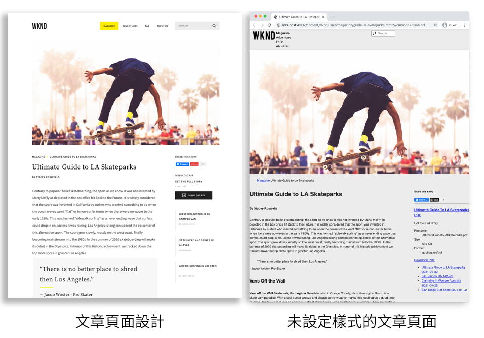
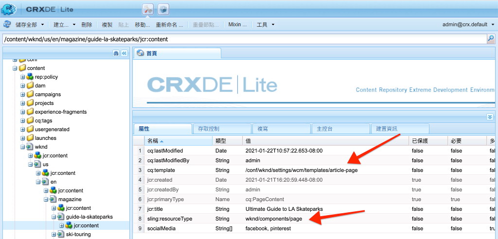
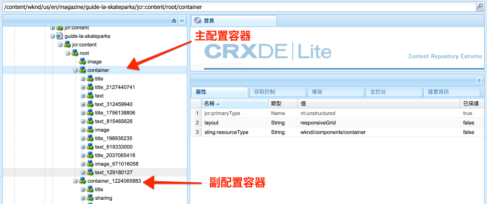
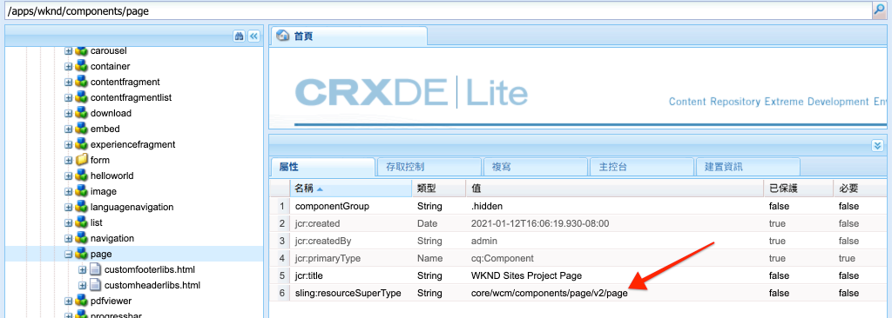
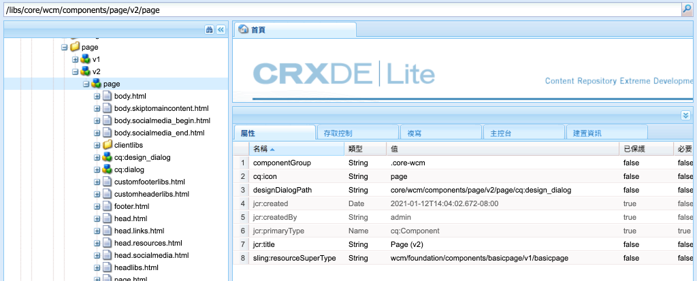

# 頁面和範本 {#pages-and-template}

{{edge-delivery-services-and-page-editor}}

在本章中，讓我們探索基礎頁面元件與可編輯範本之間的關係。 瞭解如何根據中的某些模型建置無樣式的文章範本 [Adobe XD](https://helpx.adobe.com/support/xd.html). 在建置範本的過程中，將涵蓋「可編輯範本」的核心元件和進階原則設定。

## 先決條件 {#prerequisites}

檢閱設定所需的工具和指示 [本機開發環境](overview.md#local-dev-environment).

### 入門專案

>[!NOTE]
>
> 如果您成功完成上一章，您可以重複使用專案，並略過出庫入門專案的步驟。

檢視教學課程建置的基底程式碼：

1. 檢視 `tutorial/pages-templates-start` 分支來源 [GitHub](https://github.com/adobe/aem-guides-wknd)

   ```shell
   $ cd ~/code/aem-guides-wknd
   $ git checkout tutorial/pages-templates-start
   ```

1. 使用您的Maven技能將程式碼庫部署到本機AEM執行個體：

   ```shell
   $ mvn clean install -PautoInstallSinglePackage
   ```

   >[!NOTE]
   >
   > 如果使用AEM 6.5或6.4，請附加 `classic` 設定檔至任何Maven指令。

   ```shell
   $ mvn clean install -PautoInstallSinglePackage -Pclassic
   ```

您一律可以於檢視完成的程式碼 [GitHub](https://github.com/adobe/aem-guides-wknd/tree/tutorial/pages-templates-solution) 或切換至分支以在本機簽出程式碼 `tutorial/pages-templates-solution`.

## 目標

1. Inspect是在Adobe XD中建立的頁面設計，並對應至核心元件。
1. 瞭解可編輯範本的詳細資料，以及如何使用原則來強制實施頁面內容的精細控制。
1. 瞭解範本和頁面的連結方式

## 您即將建置的內容 {#what-build}

在本教學課程的這個部分，您將建立新的文章頁面範本，此範本可用來建立文章頁面，並與通用結構保持一致。 文章頁面範本以Adobe XD中的設計和產生的UI套件為基礎。 本章只著重於建置範本的結構或骨架。 未實作任何樣式，但範本和頁面運作正常。



## 使用Adobe XD進行UI規劃 {#adobexd}

通常，規劃新網站會從模型和靜態設計開始。 [Adobe XD](https://helpx.adobe.com/support/xd.html) 是建立使用者體驗的設計工具。 接下來，讓我們檢查UI套件和模型，協助規劃文章頁面範本的結構。

>[!VIDEO](https://video.tv.adobe.com/v/30214?quality=12&learn=on)

**下載 [WKND文章設計檔案](https://github.com/adobe/aem-guides-wknd/releases/download/aem-guides-wknd-0.0.2/AEM_UI-kit-WKND-article-design.xd)**.

>[!NOTE]
>
> 通用 [也提供AEM核心元件UI套件](https://experienceleague.adobe.com/docs/experience-manager-learn/assets/AEM-CoreComponents-UI-Kit.xd) 作為自訂專案的起點。

## 建立文章頁面範本

建立頁面時，您必須選取範本，作為建立頁面的基礎。 範本會定義結果頁面的結構、初始內容和允許的元件。

有三個主要區域 [可編輯的範本](https://experienceleague.adobe.com/docs/experience-manager-65/developing/platform/templates/page-templates-editable.html)：

1. **結構**  — 定義屬於範本一部分的元件。 內容作者無法編輯這些內容。
1. **初始內容**  — 定義範本開始使用的元件，內容作者可以編輯和/或刪除這些元件
1. **原則**  — 定義元件行為方式及作者選項的相關設定。

接下來，在AEM中建立符合模型結構的範本。 這會在AEM的本機執行個體中發生。 請依照下列影片中的步驟操作：

>[!VIDEO](https://video.tv.adobe.com/v/330991?quality=12&learn=on)

上述影片的高層級步驟：

### 結構設定

1. 使用建立範本 **頁面範本型別**，已命名 **文章頁面**.
1. 切換至 **結構** 模式。
1. 新增 **體驗片段** 要做為的元件 **頁首** 範本頂端。
   * 設定元件以指向 `/content/experience-fragments/wknd/us/en/site/header/master`.
   * 將原則設為 **頁首** 並確保 **預設元素** 設為 `header`. 此 `header`元素在下一個章節中會以CSS做為目標。
1. 新增 **體驗片段** 要做為的元件 **頁尾** 在範本底部。
   * 設定元件以指向 `/content/experience-fragments/wknd/us/en/site/footer/master`.
   * 將原則設為 **頁尾** 並確保 **預設元素** 設為 `footer`. 此 `footer` 元素在下一個章節中會以CSS做為目標。
1. 鎖定 **主要** 最初建立範本時包含的容器。
   * 將原則設為 **頁面主要** 並確保 **預設元素** 設為 `main`. 此 `main` 元素在下一個章節中會以CSS做為目標。
1. 新增 **影像** 元件至 **主要** 容器。
   * 解鎖 **影像** 元件。
1. 新增 **階層連結** 元件於 **影像** 元件時。
   * 建立以下專案的原則： **階層連結** 元件已命名 **文章頁面 — 階層連結**. 設定 **導覽開始層級** 至 **4**.
1. 新增 **容器** 元件於 **階層連結** 元件和內部 **主要** 容器。 其作用如下 **內容容器** 範本的。
   * 解鎖 **內容** 容器。
   * 將原則設為 **頁面內容**.
1. 新增另一個 **容器** 元件於 **內容容器**. 其作用如下 **側邊欄** 範本的容器。
   * 解鎖 **側邊欄** 容器。
   * 建立名為的原則 **文章頁面 — 側欄**.
   * 設定 **允許的元件** 在 **WKND Sites專案 — 內容** 若要包含： **按鈕**， **下載**， **影像**， **清單**， **分隔符號**， **社群媒體分享**， **文字**、和 **標題**.
1. 更新頁面根容器的原則。 這是範本最外側的容器。 將原則設為 **頁面根目錄**.
   * 在 **容器設定**，設定 **版面** 至 **回應式格線**.
1. 參與以下專案的版面模式： **內容容器**. 從右到左拖曳控點，並將容器縮小為八欄寬。
1. 參與以下專案的版面模式： **側邊欄容器**. 從右到左拖曳控點，並將容器縮小為四欄寬。 然後，從左到右拖曳左側控點一欄，讓容器3欄變寬，並在 **內容容器**.
1. 開啟行動模擬器並切換至行動中斷點。 再次參與佈局模式並做出 **內容容器** 和 **側邊欄容器** 頁面的完整寬度。 這會將容器垂直棧疊在行動中斷點中。
1. 更新的原則 **文字** 中的元件 **內容容器**.
   * 將原則設為 **內容文字**.
   * 在 **外掛程式** > **段落樣式**，檢查 **啟用段落樣式** 並確保 **報價區塊** 已啟用。

### 初始內容設定

1. 切換至 **初始內容** 模式。
1. 新增 **標題** 元件至 **內容容器**. 這會當作文章標題。 當它留空時，它會自動顯示目前頁面的標題。
1. 新增秒 **標題** 第一個標題元件下的元件。
   * 使用文字設定元件：「By Author」。 這是文字預留位置。
   * 將型別設定為 `H4`.
1. 新增 **文字** 元件於 **依作者** 標題元件。
1. 新增 **標題** 元件至 **側邊欄容器**.
   * 使用文字設定元件：「共用本文」。
   * 將型別設定為 `H5`.
1. 新增 **社群媒體分享** 元件於 **分享此劇本** 標題元件。
1. 新增 **分隔符號** 元件於 **社群媒體分享** 元件。
1. 新增 **下載** 元件於 **分隔符號** 元件。
1. 新增 **清單** 元件於 **下載** 元件。
1. 更新 **初始頁面屬性** 範本的。
   * 在 **社群媒體** > **社群媒體分享**，檢查 **facebook** 和 **pinterest**

### 啟用範本並新增縮圖

1. 導覽至「 」，在「範本」控制檯中檢視範本 [http://localhost:4502/libs/wcm/core/content/sites/templates.html/conf/wknd](http://localhost:4502/libs/wcm/core/content/sites/templates.html/conf/wknd)
1. **啟用** 文章頁面範本。
1. 編輯「文章頁面」範本的屬性，並上傳下列縮圖，以快速識別使用「文章頁面」範本建立的頁面：

   

## 使用體驗片段更新頁首和頁尾 {#experience-fragments}

建立全域內容（例如頁首或頁尾）的常見作法是使用 [體驗片段](https://experienceleague.adobe.com/docs/experience-manager-learn/sites/experience-fragments/experience-fragments-feature-video-use.html). 體驗片段，可讓使用者結合多個元件，以建立單一可參考的元件。 體驗片段的優點在於支援多網站管理和 [本地化](https://experienceleague.adobe.com/docs/experience-manager-core-components/using/wcm-components/experience-fragment.html?lang=en).

AEM專案原型產生了頁首和頁尾。 接下來，更新體驗片段以符合模型。 請依照下列影片中的步驟操作：

>[!VIDEO](https://video.tv.adobe.com/v/330992?quality=12&learn=on)

上述影片的高層級步驟：

1. 下載範例內容套件 **[WKND-PagesTemplates-Content-Assets.zip](assets/pages-templates/WKND-PagesTemplates-Content-Assets-1.1.zip)**.
1. 使用封裝管理員上傳及安裝內容封裝，網址為 [http://localhost:4502/crx/packmgr/index.jsp](http://localhost:4502/crx/packmgr/index.jsp)
1. 更新Web變數範本，此範本為用於體驗片段的範本，位於 [http://localhost:4502/editor.html/conf/wknd/settings/wcm/templates/xf-web-variation/structure.html](http://localhost:4502/editor.html/conf/wknd/settings/wcm/templates/xf-web-variation/structure.html)
   * 更新原則 **容器** 元件時。
   * 將原則設為 **XF根**.
   * 在底下， **允許的元件** 選取元件群組 **WKND Sites專案 — 結構** 要包含 **語言導覽**， **導覽**、和 **快速搜尋** 元件。

### 更新標題體驗片段

1. 開啟在呈現標題的體驗片段 [http://localhost:4502/editor.html/content/experience-fragments/wknd/us/en/site/header/master.html](http://localhost:4502/editor.html/content/experience-fragments/wknd/us/en/site/header/master.html)
1. 設定根 **容器** 片段。 這是最外層 **容器**.
   * 設定 **版面** 至 **回應式格線**
1. 新增 **WKND深色標誌** 作為影像移至頂端 **容器**. 標誌包含在先前步驟中安裝的套件中。
   * 修改版面 **WKND深色標誌** 成為 **兩個** 欄寬。 從右到左拖曳控點。
   * 設定標誌使用 **替代文字** 「WKND標誌」的。
   * 設定標誌至 **連結** 至 `/content/wknd/us/en` 首頁。
1. 設定 **導覽** 已放置在頁面上的元件。
   * 設定 **排除根層級** 至 **1**.
   * 設定 **導覽結構深度** 至 **1**.
   * 修改版面 **導覽** 元件為 **八** 欄寬。 從右到左拖曳控點。
1. 移除 **語言導覽** 元件。
1. 修改版面 **搜尋** 元件為 **兩個** 欄寬。 從右到左拖曳控點。 現在，所有元件應該水準對齊一列。

### 更新頁尾體驗片段

1. 開啟呈現頁尾的體驗片段，位於 [http://localhost:4502/editor.html/content/experience-fragments/wknd/us/en/site/footer/master.html](http://localhost:4502/editor.html/content/experience-fragments/wknd/us/en/site/footer/master.html)
1. 設定根 **容器** 片段。 這是最外層 **容器**.
   * 設定 **版面** 至 **回應式格線**
1. 新增 **WKND淺色標誌** 作為影像移至頂端 **容器**. 標誌包含在先前步驟中安裝的套件中。
   * 修改版面 **WKND淺色標誌** 成為 **兩個** 欄寬。 從右到左拖曳控點。
   * 設定標誌使用 **替代文字** 「WKND標誌燈」的圖示。
   * 設定標誌至 **連結** 至 `/content/wknd/us/en` 首頁。
1. 新增 **導覽** 元件於標誌下方。 設定 **導覽** 元件：
   * 設定 **排除根層級** 至 **1**.
   * 取消核取 **收集所有子頁面**.
   * 設定 **導覽結構深度** 至 **1**.
   * 修改版面 **導覽** 元件為 **八** 欄寬。 從右到左拖曳控點。

## 建立文章頁面

接下來，使用「文章頁面」範本建立頁面。 編寫頁面內容以符合網站模型。 請依照下列影片中的步驟操作：

>[!VIDEO](https://video.tv.adobe.com/v/330993?quality=12&learn=on)

上述影片的高層級步驟：

1. 導覽至Sites主控台，網址為 [http://localhost:4502/sites.html/content/wknd/us/en/magazine](http://localhost:4502/sites.html/content/wknd/us/en/magazine).
1. 在下方建立頁面 **WKND** > **US** > **EN** > **雜誌**.
   * 選擇 **文章頁面** 範本。
   * 在 **屬性** 設定 **標題** 前往「洛杉磯滑板公園終極指南」
   * 設定 **名稱** 前往「滑板公園指南」
1. 取代 **依作者** 標題中包含「By Stacey Roswells」文字。
1. 更新 **文字** 元件以包含填入文章的段落。 您可以使用下列文字檔作為副本： [la-skate-parks-copy.txt](assets/pages-templates/la-skateparks-copy.txt).
1. 新增另一個 **文字** 元件。
   * 更新元件以包含引述：「沒有比洛杉磯更適合清除的地方了。」
   * 以全熒幕模式編輯RTF編輯器，並修改上述引號以使用 **報價區塊** 元素。
1. 繼續填入文章內文以符合模型。
1. 設定 **下載** 元件以使用文章的PDF版本。
   * 在 **下載** > **屬性**，按一下核取方塊以 **從DAM資產取得標題**.
   * 設定 **說明** 收件者：「取得完整劇本」。
   * 設定 **動作文字** 收件者：「下載PDF」。
1. 設定 **清單** 元件。
   * 在 **清單設定** > **使用以下專案產生清單**，選取 **子頁面**.
   * 設定 **父頁面** 至 `/content/wknd/us/en/magazine`.
   * 在底下， **專案設定** check **連結專案** 並勾選 **顯示日期**.

## Inspect節點結構 {#node-structure}

此時，文章頁面顯然未設定樣式。 不過，基本結構已準備就緒。 接下來，檢查文章頁面的節點結構，以更加瞭解範本、頁面和元件的角色。

在本機AEM例項上使用CRXDE-Lite工具來檢視基礎節點結構。

1. 開啟 [CRXDE-Lite](http://localhost:4502/crx/de/index.jsp#/content/wknd/us/en/magazine/guide-la-skateparks/jcr%3Acontent) 並使用樹狀導覽來導覽至 `/content/wknd/us/en/magazine/guide-la-skateparks`.

1. 按一下 `jcr:content` 節點在下 `la-skateparks` 頁面並檢視屬性：

   

   注意的值 `cq:template`，指向 `/conf/wknd/settings/wcm/templates/article-page`，即先前建立的文章頁面範本。

   也請注意的值 `sling:resourceType`，指向 `wknd/components/page`. 這是由AEM專案原型建立的頁面元件，負責根據範本轉譯頁面。

1. 展開 `jcr:content` 節點在下 `/content/wknd/us/en/magazine/guide-la-skateparks/jcr:content` 並檢視節點階層：

   

   您應該能夠鬆散地將每個節點對應至已編寫的元件。 檢視您是否能透過檢查前置詞為的節點來識別所使用的不同版面配置容器 `container`.

1. 接下來，在檢查頁面元件 `/apps/wknd/components/page`. 以CRXDE Lite檢視元件屬性：

   

   只有兩個HTL指令碼， `customfooterlibs.html` 和 `customheaderlibs.html` 在頁面元件下方。 *那麼，此元件如何呈現頁面？*

   此 `sling:resourceSuperType` 屬性指向 `core/wcm/components/page/v2/page`. 此屬性允許WKND的頁面元件繼承 **全部** 核心元件頁面元件的功能。 這是第一個稱為 [Proxy元件模式](https://experienceleague.adobe.com/docs/experience-manager-core-components/using/developing/guidelines.html#ProxyComponentPattern). 可以找到更多資訊 [此處](https://experienceleague.adobe.com/docs/experience-manager-core-components/using/developing/guidelines.html).

1. Inspect是WKND元件內的另一個元件， `Breadcrumb` 元件來源： `/apps/wknd/components/breadcrumb`. 請注意，相同的 `sling:resourceSuperType` 可以找到屬性，但這次會指向 `core/wcm/components/breadcrumb/v2/breadcrumb`. 這是使用Proxy元件模式來包含核心元件的另一個範例。 事實上，WKND程式碼基底中的所有元件都是AEM核心元件的代理程式（自訂示範HelloWorld元件除外）。 最佳實務是儘可能重複使用核心元件的大部分功能 *早於* 撰寫自訂程式碼。

1. 接著在下方檢查核心元件頁面： `/libs/core/wcm/components/page/v2/page` 使用CRXDE Lite：

   >[!NOTE]
   >
   > 在AEM 6.5/6.4中，核心元件位於 `/apps/core/wcm/components`. 在AEMas a Cloud Service中，核心元件位於 `/libs` 和會自動更新。

   

   請注意，許多指令碼檔案包含在此頁面下方。 核心元件頁面包含多項功能。 此功能被分成多個指令碼，以方便維護和閱讀。 您可以透過開啟 `page.html` 並尋找 `data-sly-include`：

   ```html
   <!--/* /libs/core/wcm/components/page/v2/page/page.html */-->
   <!DOCTYPE HTML>
   <html data-sly-use.page="com.adobe.cq.wcm.core.components.models.Page" lang="${page.language}"
       data-sly-use.head="head.html"
       data-sly-use.footer="footer.html"
       data-sly-use.redirect="redirect.html">
       <head data-sly-call="${head.head @ page = page}"></head>
       <body class="${page.cssClassNames}"
           id="${page.id}"
           data-cmp-data-layer-enabled="${page.data ? true : false}">
           <script data-sly-test.dataLayerEnabled="${page.data}">
           window.adobeDataLayer = window.adobeDataLayer || [];
           adobeDataLayer.push({
               page: JSON.parse("${page.data.json @ context='scriptString'}"),
               event:'cmp:show',
               eventInfo: {
                   path: 'page.${page.id @ context="scriptString"}'
               }
           });
           </script>
           <sly data-sly-test.isRedirectPage="${page.redirectTarget && (wcmmode.edit || wcmmode.preview)}"
               data-sly-call="${redirect.redirect @ redirectTarget = page.redirectTarget}"></sly>
           <sly data-sly-test="${!isRedirectPage}">
               <sly data-sly-include="body.skiptomaincontent.html"></sly>
               <sly data-sly-include="body.socialmedia_begin.html"></sly>
               <sly data-sly-include="body.html"></sly>
               <sly data-sly-call="${footer.footer @ page = page}"></sly>
               <sly data-sly-include="body.socialmedia_end.html"></sly>
           </sly>
       </body>
   </html>
   ```

   將HTL分成多個指令碼的另一個原因是為了允許Proxy元件覆寫個別指令碼，以實作自訂商業邏輯。 HTL指令碼 `customfooterlibs.html`、和 `customheaderlibs.html`的建立目的明確，可透過實作專案加以覆寫。

   您可以深入瞭解可編輯範本如何影響圖的呈現 [內容頁面，請閱讀本文](https://experienceleague.adobe.com/docs/experience-manager-65/developing/platform/templates/page-templates-editable.html).

1. Inspect是另一個核心元件，如上的階層連結 `/libs/core/wcm/components/breadcrumb/v2/breadcrumb`. 檢視 `breadcrumb.html` 此指令碼可瞭解最終產生階層連結元件標籤的方式。

## 將組態儲存至原始檔控制 {#configuration-persistence}

通常，尤其是在開始AEM專案時，將設定（例如範本和相關內容原則）保留到原始檔控制中很有價值。 這可確保所有開發人員都針對相同的內容和設定集，且可確保環境之間有額外的一致性。 一旦專案達到一定的成熟度，管理範本的實務就可以交給特殊的超級使用者群組。


目前，範本會被視為其他程式碼片段並同步 **文章頁面範本** 作為專案的一部分向下移動。
直到現在，程式碼才會從AEM專案推送到AEM的本機執行個體。 此 **文章頁面範本** 是直接在AEM的本機執行個體上建立的，因此需要 **匯入** 將範本放入AEM專案中。 此 **ui.content** AEM專案中包含模組以作特定用途。

在VSCode IDE中，使用下列幾個步驟來完成 [VSCode AEM Sync](https://marketplace.visualstudio.com/items?itemName=yamato-ltd.vscode-aem-sync&amp;ssr=false#overview) 外掛程式。 但他們可以使用您設定的任何IDE來執行 **匯入** 或從AEM的本機執行個體匯入內容。

1. 在中，VSCode開啟 `aem-guides-wknd` 專案。

1. 展開 **ui.content** 專案總管中的模組。 展開 `src` 資料夾並導覽至 `/conf/wknd/settings/wcm/templates`.

1. [!UICONTROL 按一下右鍵] 此 `templates` 資料夾並選取 **從AEM伺服器匯入**：

   

   此 `article-page` 應匯入，且 `page-content`， `xf-web-variation` 範本也應更新。

   

1. 重複步驟以匯入內容，但選取 **原則** 資料夾來源 `/conf/wknd/settings/wcm/policies`.

   

1. Inspect `filter.xml` 檔案來源 `ui.content/src/main/content/META-INF/vault/filter.xml`.

   ```xml
   <!--ui.content filter.xml-->
   <?xml version="1.0" encoding="UTF-8"?>
   <workspaceFilter version="1.0">
       <filter root="/conf/wknd" mode="merge"/>
       <filter root="/content/wknd" mode="merge"/>
       <filter root="/content/dam/wknd" mode="merge"/>
       <filter root="/content/experience-fragments/wknd" mode="merge"/>
   </workspaceFilter>
   ```

   此 `filter.xml` 檔案負責識別隨套件安裝的節點路徑。 請注意 `mode="merge"` 在表示現有內容不可修改的每一個篩選器上，僅新增新內容。 由於內容作者可能正在更新這些路徑，因此程式碼部署必須更新 **非** 覆寫內容。 請參閱 [FileVault檔案](https://jackrabbit.apache.org/filevault/filter.html) 以取得有關使用篩選元素的詳細資訊。

   比較 `ui.content/src/main/content/META-INF/vault/filter.xml` 和 `ui.apps/src/main/content/META-INF/vault/filter.xml` 以瞭解每個模組所管理的不同節點。

   >[!WARNING]
   >
   > 為了確保為WKND參考網站一致的部署，專案的一些分支設定如下 `ui.content` 會覆寫JCR中的任何變更。 這是依設計（即針對解決方案分支）進行的，因為程式碼/樣式是為特定原則所撰寫。

## 恭喜！ {#congratulations}

恭喜，您已使用Adobe Experience Manager Sites建立範本和頁面。

### 後續步驟 {#next-steps}

此時，文章頁面顯然未設定樣式。 請遵循 [使用者端程式庫與前端工作流程](client-side-libraries.md) 此教學課程將學習包含CSS和JavaScript的最佳作法，以將全域樣式套用至網站並整合專屬的前端組建。

檢視完成的程式碼： [GitHub](https://github.com/adobe/aem-guides-wknd) 或在Git分支上檢閱並部署程式碼至本機 `tutorial/pages-templates-solution`.

1. 原地複製 [github.com/adobe/aem-wknd-guides](https://github.com/adobe/aem-guides-wknd) 存放庫。
1. 檢視 `tutorial/pages-templates-solution` 分支。
